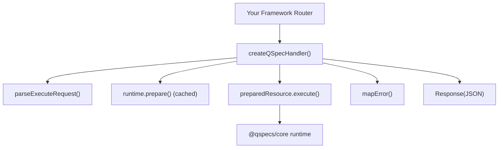
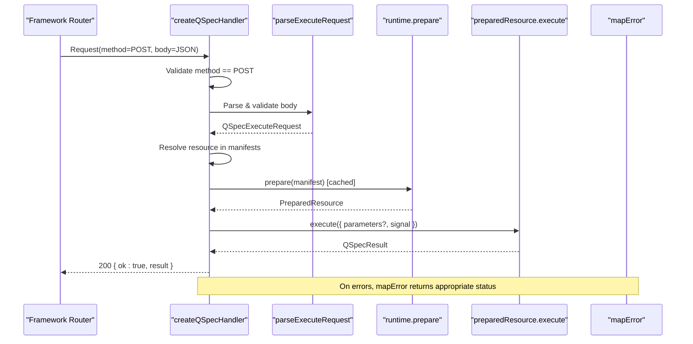
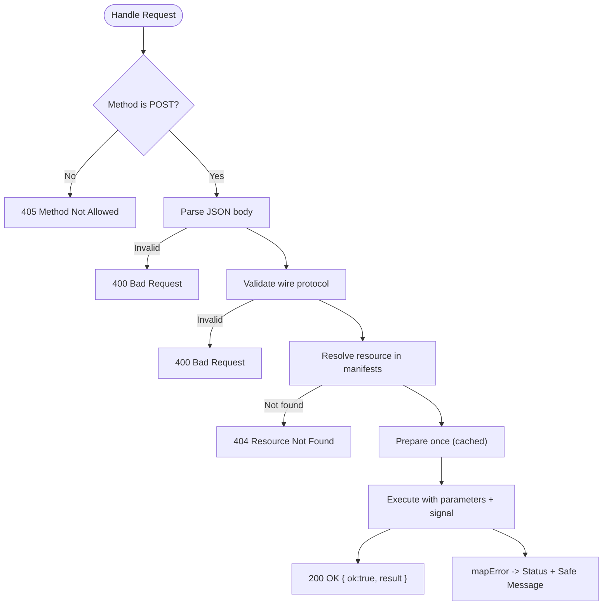
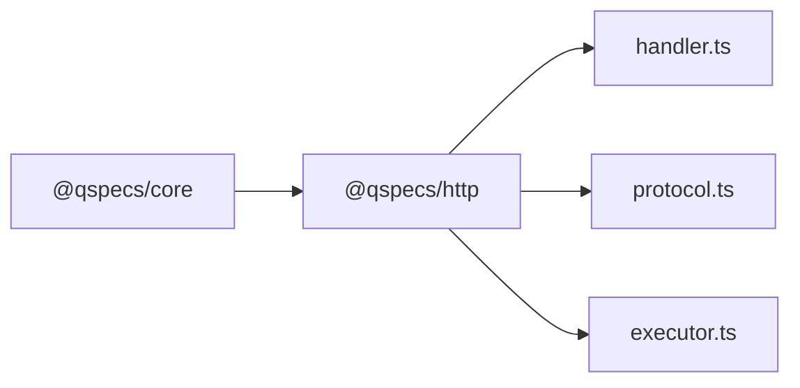

# Handler Setup and Configuration

<cite>
**Referenced Files in This Document**
- [README.md](file://README.md)
- [packages/http/src/index.ts](file://packages/http/src/index.ts)
- [packages/http/src/internal/handler.ts](file://packages/http/src/internal/handler.ts)
- [packages/http/src/internal/protocol.ts](file://packages/http/src/internal/protocol.ts)
- [packages/http/src/internal/executor.ts](file://packages/http/src/internal/executor.ts)
- [docs/security.md](file://docs/security.md)
- [test/react-pipeline.test.tsx](file://test/react-pipeline.test.tsx)
</cite>

## Table of Contents

1. Introduction
2. Project Structure
3. Core Components
4. Architecture Overview
5. Detailed Component Analysis
6. Dependency Analysis
7. Performance Considerations
8. Troubleshooting Guide
9. Conclusion
10. Appendices

## Introduction

This document explains how to set up the QSpec HTTP handler, focusing on createQSpecHandler, its configuration options, request/response protocol, error handling, and integration patterns with web frameworks. It also covers security posture, environment-driven configuration, and performance tuning via caching and limits.

The handler is intentionally unauthenticated by design: it executes manifests from a host-provided registry using the host’s runtime and credentials. Mount it behind your own authentication and authorization layer.

**Section sources**

- [README.md:35-42](file://README.md#L35-L42)
- [docs/security.md:182-198](file://docs/security.md#L182-L198)

## Project Structure

The HTTP package exposes a minimal surface for server and client sides of the wire protocol:

- Server-side handler factory that returns a Request => Response function
- Wire protocol parser and types
- Client executor that POSTs to the server endpoint

**Diagram sources**

- [packages/http/src/internal/handler.ts:131-239](file://packages/http/src/internal/handler.ts#L131-L239)
- [packages/http/src/internal/protocol.ts:272-317](file://packages/http/src/internal/protocol.ts#L272-L317)

**Section sources**

- [packages/http/src/index.ts:1-37](file://packages/http/src/index.ts#L1-L37)

## Core Components

- createQSpecHandler(options): Builds a Request => Response handler. Options include:
  - runtime: The QSpec runtime instance configured with plugins and data sources
  - manifests: A map of resource names to manifest objects or JSON strings
- parseExecuteRequest(value): Validates and normalizes the incoming execute request body
- createHttpExecutor(options): Client-side executor that POSTs { resource, parameters } to a URL and maps responses/errors back to core types

Key behaviors:

- Only POST is accepted; other methods return 405
- Body must be valid JSON and conform to the wire protocol
- Resource names are resolved against the provided manifests map using safe lookup
- Prepared resources are cached per resource name for performance
- Errors are mapped to specific HTTP status codes and safe messages

**Section sources**

- [packages/http/src/internal/handler.ts:28-33](file://packages/http/src/internal/handler.ts#L28-L33)
- [packages/http/src/internal/handler.ts:131-239](file://packages/http/src/internal/handler.ts#L131-L239)
- [packages/http/src/internal/protocol.ts:20-42](file://packages/http/src/internal/protocol.ts#L20-L42)
- [packages/http/src/internal/executor.ts:20-38](file://packages/http/src/internal/executor.ts#L20-L38)

## Architecture Overview

End-to-end flow from framework route to response:

**Diagram sources**

- [packages/http/src/internal/handler.ts:131-239](file://packages/http/src/internal/handler.ts#L131-L239)
- [packages/http/src/internal/protocol.ts:272-317](file://packages/http/src/internal/protocol.ts#L272-L317)

## Detailed Component Analysis

### createQSpecHandler

Responsibilities:

- Enforce POST-only access
- Parse and validate request body through the hardened wire-protocol parser
- Resolve resource name safely against the host-supplied manifests map
- Prepare and cache prepared resources per resource name
- Execute with request parameters and propagate request cancellation via AbortSignal
- Map outcomes to standardized JSON responses with safe error messages

Configuration options:

- runtime: QSpec runtime instance with plugins and data sources
- manifests: Readonly map of resource name to manifest object or string

Security notes:

- No auth hook, session check, or rate limiter — mount behind your own middleware
- Uses Object.hasOwn for safe resource resolution to prevent prototype pollution
- Error messages avoid leaking sensitive details; only safe codes/messages are forwarded

Performance notes:

- Prepared resources are cached across requests for the same resource
- Failed preparations are also cached to avoid repeated validation costs

**Diagram sources**

- [packages/http/src/internal/handler.ts:131-239](file://packages/http/src/internal/handler.ts#L131-L239)

**Section sources**

- [packages/http/src/internal/handler.ts:131-239](file://packages/http/src/internal/handler.ts#L131-L239)
- [docs/security.md:182-198](file://docs/security.md#L182-L198)

### Wire Protocol Parser (parseExecuteRequest)

Validates:

- Top-level object shape
- resource: required non-empty string, bounded length, no unsafe keys
- parameters: optional plain object with strict value checks
  - Rejects unsafe keys at any depth
  - Enforces maximum nesting depth
  - Detects circular references
  - Ensures values are valid JSON primitives, arrays, or plain objects

Output:

- QSpecExecuteRequest with resource and optional parameters

Safety:

- Sanitizes path segments in error messages
- Bounds message lengths to prevent abuse

**Section sources**

- [packages/http/src/internal/protocol.ts:44-80](file://packages/http/src/internal/protocol.ts#L44-L80)
- [packages/http/src/internal/protocol.ts:176-233](file://packages/http/src/internal/protocol.ts#L176-L233)
- [packages/http/src/internal/protocol.ts:272-317](file://packages/http/src/internal/protocol.ts#L272-L317)

### Client Executor (createHttpExecutor)

Behavior:

- POSTs { resource, parameters } to the configured URL
- Sets content-type header and merges custom headers
- Forwards AbortSignal for cancellation
- Parses response text into JSON and validates protocol shape
- Maps server errors to core error classes for consistent handling

Options:

- url: Endpoint mounted from createQSpecHandler
- fetch: Optional custom fetch implementation
- headers: Additional headers merged over defaults

**Section sources**

- [packages/http/src/internal/executor.ts:20-38](file://packages/http/src/internal/executor.ts#L20-L38)
- [packages/http/src/internal/executor.ts:64-89](file://packages/http/src/internal/executor.ts#L64-L89)
- [packages/http/src/internal/executor.ts:225-265](file://packages/http/src/internal/executor.ts#L225-L265)

### Integration Patterns with Web Frameworks

Because createQSpecHandler returns a standard Request => Promise<Response>, you can mount it in most modern frameworks:

- Express.js (with fetch-compatible adapter or middleware)
  - Wrap your Express request/response to the Fetch API contract or use an adapter that converts Express req/res to Request/Response
  - Mount the returned handler at a route like /api/qspec
  - Place authentication and authorization middleware before this route

- Fastify
  - Use fastify-plugin or a fetch-compatible wrapper to adapt Fastify’s request/response to the Fetch API
  - Register the handler at a single route
  - Apply global or route-scoped hooks for auth, rate limiting, and logging

- Node native fetch servers (e.g., Bun, Deno, or Node 22+ with adapters)
  - Directly mount the handler as-is

Important:

- The handler does not perform authentication or authorization; always place it behind your framework’s guards
- Keep manifests server-side; never expose queries or credentials to clients

**Section sources**

- [README.md:116-136](file://README.md#L116-L136)
- [docs/security.md:182-198](file://docs/security.md#L182-L198)

### Middleware Setup, Request Parsing, Response Formatting, Error Handling

Middleware setup:

- Add authentication/authorization before mounting the handler
- Optionally add rate limiting, CORS, and request size limits at the framework level

Request parsing:

- The handler expects JSON bodies and enforces a strict wire protocol
- Malformed JSON or invalid shapes return 400 with a safe message

Response formatting:

- Successful responses: 200 with { ok: true, result }
- Errors: structured { ok: false, error: { code, message, issues? } }

Error handling:

- Validation errors: 400 with issues attached
- Aborted requests: 499 with a clear message
- Internal/server errors: 500 with a generic message and safe code
- Unknown resources: 404 without revealing registered names
- Non-POST methods: 405 with Allow header

**Section sources**

- [packages/http/src/internal/handler.ts:97-109](file://packages/http/src/internal/handler.ts#L97-L109)
- [packages/http/src/internal/handler.ts:169-239](file://packages/http/src/internal/handler.ts#L169-L239)

### Environment Variables and Security Headers

Environment variables:

- Data source credentials (e.g., DATABASE_URL) are passed to data source plugins when building the runtime, not exposed in manifests or over HTTP
- The handler itself has no opinion on where connection strings come from

Security headers:

- The handler sets content-type: application/json
- Host applications should configure additional security headers (CORS, CSP, HSTS, etc.) at the framework or reverse proxy level

**Section sources**

- [README.md:35-42](file://README.md#L35-L42)
- [packages/http/src/internal/handler.ts:35-52](file://packages/http/src/internal/handler.ts#L35-L52)
- [docs/security.md:17-32](file://docs/security.md#L17-L32)

### Performance Tuning Settings

- Prepared resource caching: prepare() results are cached per resource name for the lifetime of the handler, including failures, to avoid repeated validation overhead
- Limits: Configure QSpecLimits on the runtime to bound rows, query duration, transform count, manifest size, and expression depth
- Request cancellation: Pass request.signal to propagate client disconnects and abort long-running queries efficiently

**Section sources**

- [packages/http/src/internal/handler.ts:136-167](file://packages/http/src/internal/handler.ts#L136-L167)
- [docs/security.md:110-122](file://docs/security.md#L110-L122)

## Dependency Analysis

High-level dependencies:

- @qspecs/http depends on @qspecs/core for runtime types and error classes
- The handler uses core’s prepare/execute pipeline and error types
- The client executor reconstructs core error classes from wire errors

**Diagram sources**

- [packages/http/package.json:33-35](file://packages/http/package.json#L33-L35)
- [packages/http/src/internal/handler.ts:1-11](file://packages/http/src/internal/handler.ts#L1-L11)
- [packages/http/src/internal/executor.ts:1-11](file://packages/http/src/internal/executor.ts#L1-L11)

**Section sources**

- [packages/http/package.json:1-44](file://packages/http/package.json#L1-L44)

## Performance Considerations

- Prefer preparing manifests once and executing many times per resource
- Use request signals to cancel long-running queries promptly
- Tune QSpecLimits to protect resources under load
- Avoid exposing large datasets unnecessarily; consider transforms and presentation constraints in manifests

[No sources needed since this section provides general guidance]

## Troubleshooting Guide

Common issues and resolutions:

- 405 Method Not Allowed: Ensure the route accepts POST
- 400 Bad Request: Check that the body is valid JSON and conforms to the wire protocol; verify resource and parameters shapes
- 404 Resource Not Found: Confirm the resource name exists in the manifests map
- 499 Execution Aborted: Indicates client disconnect or explicit abort; handle gracefully on the client side
- 500 Internal Error: Generic server error; inspect logs and ensure runtime configuration is correct

Debugging tips:

- Log request payloads and responses carefully, avoiding sensitive data
- Verify that authentication/authorization is applied before the handler
- Ensure the runtime is fully built and ready before serving requests

**Section sources**

- [packages/http/src/internal/handler.ts:97-109](file://packages/http/src/internal/handler.ts#L97-L109)
- [packages/http/src/internal/handler.ts:169-239](file://packages/http/src/internal/handler.ts#L169-L239)

## Conclusion

createQSpecHandler provides a secure, minimal HTTP boundary for executing QSpec manifests. It delegates authentication, authorization, and security headers to the host, while enforcing strict input validation, safe error mapping, and efficient preparation caching. Integrate it behind your framework’s middleware, configure the runtime and manifests server-side, and rely on the wire protocol for predictable client-server interaction.

[No sources needed since this section summarizes without analyzing specific files]

## Appendices

### Basic Setup Example (Conceptual)

- Build a QSpec runtime with plugins and data sources
- Provide a manifests map keyed by resource names
- Create the handler with createQSpecHandler and mount it at a single route
- Protect the route with your framework’s auth middleware

**Section sources**

- [README.md:116-136](file://README.md#L116-L136)

### Advanced Configuration Options

- Supply a custom fetch implementation in createHttpExecutor for retries, caching, or telemetry
- Merge custom headers for tracing or correlation IDs
- Configure QSpecLimits on the runtime to enforce resource bounds

**Section sources**

- [packages/http/src/internal/executor.ts:20-38](file://packages/http/src/internal/executor.ts#L20-L38)
- [docs/security.md:110-122](file://docs/security.md#L110-L122)

### Framework-Specific Notes

- Express.js: Convert Express req/res to Request/Response or use an adapter; mount the handler at a route; apply auth middleware first
- Fastify: Use a fetch-compatible wrapper; register the handler; apply hooks for auth/rate limiting/logging

**Section sources**

- [README.md:116-136](file://README.md#L116-L136)

### Security and Privacy Guarantees

- No credentials cross the wire; only resource names and parameters are sent
- Responses do not leak SQL, table names, or secrets
- Tests assert that sensitive information never appears in request, response, or rendered DOM

**Section sources**

- [test/react-pipeline.test.tsx:565-597](file://test/react-pipeline.test.tsx#L565-L597)
- [docs/security.md:148-180](file://docs/security.md#L148-L180)
