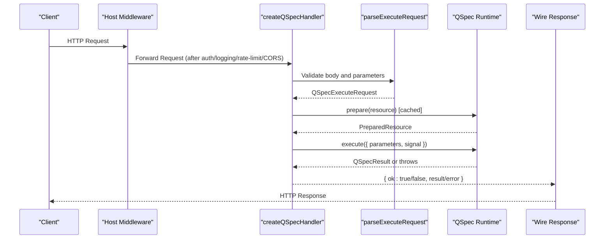
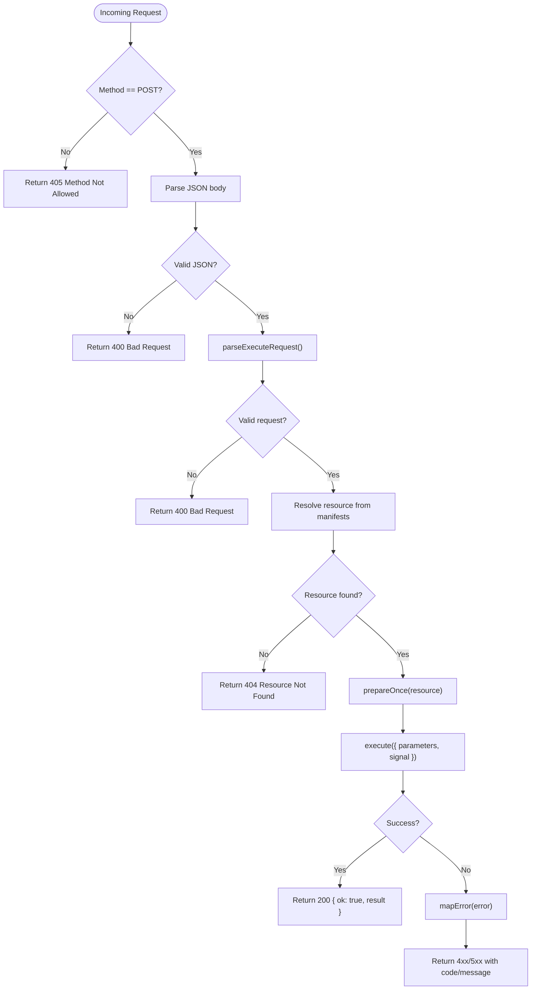
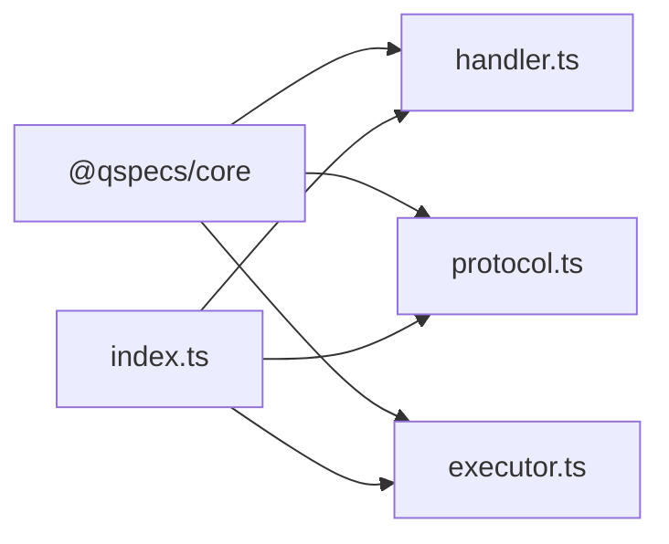

# Middleware System

<cite>
**Referenced Files in This Document**
- [handler.ts](file://packages/http/src/internal/handler.ts)
- [protocol.ts](file://packages/http/src/internal/protocol.ts)
- [executor.ts](file://packages/http/src/internal/executor.ts)
- [index.ts](file://packages/http/src/index.ts)
- [security.md](file://docs/security.md)
- [known-gaps.md](file://docs/known-gaps.md)
- [architecture.md](file://docs/architecture.md)
</cite>

## Table of Contents

1. Introduction
2. Project Structure
3. Core Components
4. Architecture Overview
5. Detailed Component Analysis
6. Dependency Analysis
7. Performance Considerations
8. Troubleshooting Guide
9. Conclusion

## Introduction

This document explains the QSpec HTTP middleware system and how to implement custom middleware for authentication, logging, rate limiting, and request transformation. It covers the middleware lifecycle, context objects, error propagation, and composition patterns. It also provides guidance for common middleware implementations such as JWT authentication, CORS handling, request logging, and API key validation.

Important design principle: the QSpec HTTP handler is intentionally unauthenticated by design. Authentication, authorization, rate limiting, and other cross-cutting concerns are expected to be implemented by the host application around the handler, not inside it.

**Section sources**

- [security.md:182-198](file://docs/security.md#L182-L198)
- [known-gaps.md:197-209](file://docs/known-gaps.md#L197-L209)

## Project Structure

The HTTP package exposes a thin wire protocol, a server handler, and a browser executor. The handler is a single function that processes an HTTP Request into a Response. It does not include built-in middleware; instead, hosts wrap it with their own middleware stack.

```mermaid
graph TB
Client["Client / Browser"] --> MW["Host Middleware Stack<br/>Auth, Logging, Rate Limiting, CORS"]
MW --> Handler["createQSpecHandler()<br/>packages/http/src/internal/handler.ts"]
Handler --> Protocol["parseExecuteRequest()<br/>packages/http/src/internal/protocol.ts"]
Handler --> Runtime["QSpec runtime.prepare()/execute()"]
Runtime --> Result["QSpecResult"]
Handler --> Response["Response JSON"]
Client <-- Response
```

**Diagram sources**

- [handler.ts:131-239](file://packages/http/src/internal/handler.ts#L131-L239)
- [protocol.ts:272-317](file://packages/http/src/internal/protocol.ts#L272-L317)

**Section sources**

- [index.ts:1-37](file://packages/http/src/index.ts#L1-L37)
- [handler.ts:131-239](file://packages/http/src/internal/handler.ts#L131-L239)

## Core Components

- Server handler: createQSpecHandler builds a (Request) => Promise<Response> function. It accepts only a runtime and a manifests map. There is no auth hook, session check, or rate limiter.
- Wire protocol: parseExecuteRequest validates the incoming request body, enforcing strict shape, length limits, unsafe-key checks, and parameter depth/cycle detection.
- Client executor: createHttpExecutor sends requests over HTTP and reconstructs errors to match core’s error types.

Key responsibilities:

- Enforce method restrictions (POST only).
- Parse and validate request bodies before touching manifests or runtime.
- Resolve resource names safely against the host-provided registry.
- Prepare once per resource and cache prepared plans.
- Execute with request cancellation via AbortSignal.
- Map outcomes to standardized responses and errors.

**Section sources**

- [handler.ts:13-33](file://packages/http/src/internal/handler.ts#L13-L33)
- [handler.ts:111-134](file://packages/http/src/internal/handler.ts#L111-L134)
- [protocol.ts:11-24](file://packages/http/src/internal/protocol.ts#L11-L24)
- [protocol.ts:235-317](file://packages/http/src/internal/protocol.ts#L235-L317)
- [executor.ts:13-38](file://packages/http/src/internal/executor.ts#L13-L38)

## Architecture Overview

The middleware architecture is layered around the handler. Because the handler has no internal middleware hooks, hosts compose middleware at the framework level (e.g., Express/Koa/Fastify) or by wrapping the returned function.



**Diagram sources**

- [handler.ts:169-237](file://packages/http/src/internal/handler.ts#L169-L237)
- [protocol.ts:272-317](file://packages/http/src/internal/protocol.ts#L272-L317)

**Section sources**

- [architecture.md:397-429](file://docs/architecture.md#L397-L429)

## Detailed Component Analysis

### Server Handler Lifecycle

The handler performs six steps per request:

1. Method check: only POST is accepted; otherwise return 405.
2. Body parsing and validation: JSON parse then parseExecuteRequest; failures return 400.
3. Resource resolution: safe lookup using Object.hasOwn against the provided manifests map.
4. Preparation caching: prepareOnce caches PreparedResource per resource, including cached rejections.
5. Execution: run PreparedResource.execute with parameters and request.signal for cancellation.
6. Outcome mapping: success returns 200 with result; errors mapped to appropriate codes and messages.



**Diagram sources**

- [handler.ts:169-237](file://packages/http/src/internal/handler.ts#L169-L237)

**Section sources**

- [handler.ts:111-134](file://packages/http/src/internal/handler.ts#L111-L134)
- [handler.ts:169-237](file://packages/http/src/internal/handler.ts#L169-L237)

### Wire Protocol Parser

parseExecuteRequest enforces:

- resource must be a non-empty string within a maximum length.
- parameters must be a plain object if present.
- Unsafe keys are rejected at every depth.
- Parameter values must be valid JSON values, bounded in depth, and free of cycles.
- Unknown top-level keys are ignored for forward compatibility.

It returns a validated QSpecExecuteRequest used by the handler.

**Section sources**

- [protocol.ts:44-68](file://packages/http/src/internal/protocol.ts#L44-L68)
- [protocol.ts:131-233](file://packages/http/src/internal/protocol.ts#L131-L233)
- [protocol.ts:272-317](file://packages/http/src/internal/protocol.ts#L272-L317)

### Error Propagation

Errors are normalized at the boundary:

- Validation errors (manifest or parameter) map to 400 with issues attached.
- Aborts map to 499 with a specific code.
- All other errors map to 500 with a generic message and a safe code; driver messages are never forwarded directly.

On the client side, createHttpExecutor reconstructs core error types from the wire response so callers can use instanceof consistently across local and remote execution.

**Section sources**

- [handler.ts:74-109](file://packages/http/src/internal/handler.ts#L74-L109)
- [executor.ts:153-197](file://packages/http/src/internal/executor.ts#L153-L197)

### Context Objects and Cancellation

- The handler forwards request.signal to PreparedResource.execute, enabling cancellation when clients disconnect or abort.
- The client executor forwards context.signal to fetch, ensuring end-to-end cancellation semantics.
- Other context fields (locale, timezone, metadata) are not part of the wire protocol and are not sent.

**Section sources**

- [handler.ts:220-230](file://packages/http/src/internal/handler.ts#L220-L230)
- [executor.ts:225-265](file://packages/http/src/internal/executor.ts#L225-L265)

## Dependency Analysis

The HTTP package depends on @qspecs/core for types and error classes. It exports the wire protocol, handler, and executor. Internal modules are not exposed through the package entry point.



**Diagram sources**

- [index.ts:25-36](file://packages/http/src/index.ts#L25-L36)
- [handler.ts:1-11](file://packages/http/src/internal/handler.ts#L1-L11)
- [protocol.ts:1-9](file://packages/http/src/internal/protocol.ts#L1-L9)
- [executor.ts:1-11](file://packages/http/src/internal/executor.ts#L1-L11)

**Section sources**

- [index.ts:1-37](file://packages/http/src/index.ts#L1-L37)

## Performance Considerations

- Prepare/execute split: prepare() is expensive static work and is cached per resource across requests. Rejected preparations are also cached to avoid repeated validation of broken configuration.
- Request cancellation: passing request.signal ensures long-running queries can be aborted promptly when clients disconnect.
- Minimal overhead: the handler performs strict input validation early to fail fast without touching manifests or runtime.

[No sources needed since this section provides general guidance]

## Troubleshooting Guide

Common issues and where they surface:

- Invalid JSON or malformed request body: caught during JSON parse or parseExecuteRequest; returns 400 with a clear code.
- Unknown resource name: returns 404 without enumerating available resources to prevent enumeration attacks.
- Non-POST methods: returns 405 with Allow header indicating POST.
- Aborted requests: returns 499 with a specific code; client-side aborts propagate through fetch and executor.
- Internal/server errors: returns 500 with a generic message; sensitive details are not leaked.

When debugging:

- Inspect the response code and error.code first.
- For 400s, review issues array for precise validation failures.
- For 500s, do not rely on error.message; inspect logs on the server side.

**Section sources**

- [handler.ts:169-237](file://packages/http/src/internal/handler.ts#L169-L237)
- [executor.ts:225-265](file://packages/http/src/internal/executor.ts#L225-L265)

## Conclusion

The QSpec HTTP middleware system is intentionally minimal: the handler focuses on secure, efficient execution of registered resources, while all cross-cutting concerns (authentication, authorization, rate limiting, logging, CORS, request transformation) are implemented by the host around the handler. This separation keeps the boundary predictable, auditable, and secure. Hosts should:

- Wrap createQSpecHandler with framework-level middleware for auth, logging, rate limiting, and CORS.
- Use request/response interceptors in createHttpExecutor for client-side logging and retries.
- Respect cancellation via AbortSignal for both server and client paths.
- Treat the endpoint as unauthenticated by default and enforce access control at the host layer.

[No sources needed since this section summarizes without analyzing specific files]
