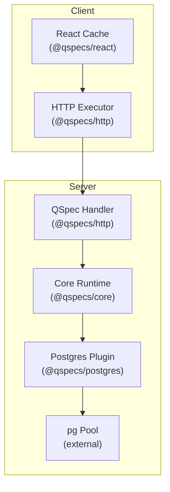
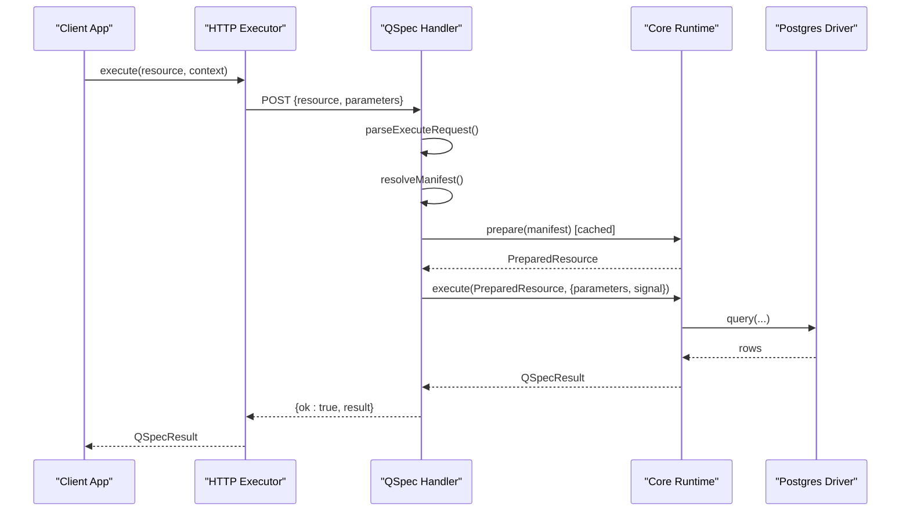
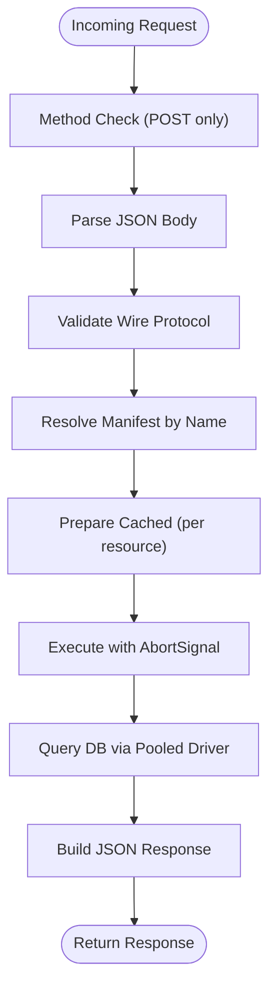

# Performance and Scaling

<cite>
**Referenced Files in This Document**
- [README.md](file://README.md)
- [package.json](file://package.json)
- [packages/http/src/index.ts](file://packages/http/src/index.ts)
- [packages/http/src/internal/handler.ts](file://packages/http/src/internal/handler.ts)
- [packages/http/src/internal/executor.ts](file://packages/http/src/internal/executor.ts)
- [packages/core/src/index.ts](file://packages/core/src/index.ts)
- [packages/postgres/src/index.ts](file://packages/postgres/src/index.ts)
- [packages/postgres/src/internal/driver.ts](file://packages/postgres/src/internal/driver.ts)
- [packages/react/src/internal/cache.ts](file://packages/react/src/internal/cache.ts)
- [docs/architecture.md](file://docs/architecture.md)
- [docs/known-gaps.md](file://docs/known-gaps.md)
</cite>

## Table of Contents

1. Introduction
2. Project Structure
3. Core Components
4. Architecture Overview
5. Detailed Component Analysis
6. Dependency Analysis
7. Performance Considerations
8. Troubleshooting Guide
9. Conclusion
10. Appendices

## Introduction

This document provides performance optimization and scaling guidance for QSpec HTTP services. It focuses on caching strategies, connection pooling, memory management, horizontal scaling, load balancing, database connection optimization, monitoring and metrics, bottleneck identification, high-throughput configurations, response compression, async processing patterns, production deployment strategies, and capacity planning. The guidance is grounded in the repository’s HTTP handler, client executor, core runtime, PostgreSQL plugin, and React cache implementation.

## Project Structure

QSpec is a monorepo with modular packages:

- @qspecs/http: wire protocol, server handler, and browser/client executor
- @qspecs/core: manifest model, execution runtime, types, and validation
- @qspecs/postgres: data source plugin backed by pg-pool
- @qspecs/react: client-side cache over executors (including HTTP)
- Other packages provide SQL compilation, transforms, charts, CLI, and testing utilities

**Diagram sources**

- [packages/http/src/internal/handler.ts:131-239](file://packages/http/src/internal/handler.ts#L131-L239)
- [packages/http/src/internal/executor.ts:225-265](file://packages/http/src/internal/executor.ts#L225-L265)
- [packages/core/src/index.ts:80-90](file://packages/core/src/index.ts#L80-L90)
- [packages/postgres/src/index.ts:25-39](file://packages/postgres/src/index.ts#L25-L39)
- [packages/postgres/src/internal/driver.ts:151-192](file://packages/postgres/src/internal/driver.ts#L151-L192)

**Section sources**

- [README.md:1-43](file://README.md#L1-L43)
- [package.json:1-45](file://package.json#L1-L45)

## Core Components

- HTTP handler: parses requests, resolves manifests, caches prepared resources, executes with cancellation, maps errors to HTTP responses
- HTTP executor: builds POST requests, validates responses, reconstructs QSpec errors, forwards abort signals
- Core runtime: prepares and executes manifests, exposes limits and events
- Postgres plugin: creates pooled connections, enforces row mode, handles error propagation
- React cache: deduplicates in-flight requests, supports invalidation, stores promises to avoid duplicate work

Key performance-relevant behaviors:

- Prepared resource caching per resource name across requests
- Request cancellation via AbortSignal propagated into execution
- Promise-based request deduplication in the React cache
- Connection pooling via pg-pool with error handling at pool level

**Section sources**

- [packages/http/src/internal/handler.ts:131-239](file://packages/http/src/internal/handler.ts#L131-L239)
- [packages/http/src/internal/executor.ts:225-265](file://packages/http/src/internal/executor.ts#L225-L265)
- [packages/core/src/index.ts:80-90](file://packages/core/src/index.ts#L80-L90)
- [packages/postgres/src/internal/driver.ts:151-192](file://packages/postgres/src/internal/driver.ts#L151-L192)
- [packages/react/src/internal/cache.ts:146-229](file://packages/react/src/internal/cache.ts#L146-L229)

## Architecture Overview

The QSpec HTTP service separates transport from execution:

- Client executor posts a minimal payload (resource name + parameters)
- Server handler validates input, resolves a pre-prepared manifest, executes with cancellation, and returns JSON
- Data access goes through the Postgres plugin using a pooled driver

**Diagram sources**

- [packages/http/src/internal/executor.ts:225-265](file://packages/http/src/internal/executor.ts#L225-L265)
- [packages/http/src/internal/handler.ts:131-239](file://packages/http/src/internal/handler.ts#L131-L239)
- [packages/postgres/src/internal/driver.ts:151-192](file://packages/postgres/src/internal/driver.ts#L151-L192)

## Detailed Component Analysis

### HTTP Handler: Request Processing and Prepared Resource Caching

- Accepts only POST; rejects other methods
- Parses JSON body and validates against the wire protocol
- Resolves resource name safely against a host-provided registry
- Caches prepared resources (and their failures) keyed by resource name to avoid repeated expensive preparation
- Executes with request.signal to support cancellation
- Maps errors to appropriate HTTP status codes without leaking sensitive messages

Performance implications:

- Prepared resource caching reduces per-request overhead significantly
- Early validation prevents unnecessary runtime work
- Cancellation avoids wasted I/O when clients disconnect

**Section sources**

- [packages/http/src/internal/handler.ts:131-239](file://packages/http/src/internal/handler.ts#L131-L239)

### HTTP Executor: Transport, Validation, and Error Reconstruction

- Builds POST requests with content-type application/json
- Forwards AbortSignal to enable cancellation
- Reads response text once, parses JSON, validates shape
- Reconstructs QSpecError subclasses based on status and code for consistent client-side error handling

Performance implications:

- Minimal payload and strict parsing reduce overhead
- Single read of response body avoids double buffering
- Consistent error mapping simplifies retry/cancel logic in callers

**Section sources**

- [packages/http/src/internal/executor.ts:225-265](file://packages/http/src/internal/executor.ts#L225-L265)

### Core Runtime: Limits, Events, and Execution Surface

- Exposes createQSpec, DEFAULT_LIMITS, and event hooks for observability
- Provides ExecutionContext and QSpecResult types used across layers

Performance implications:

- Use DEFAULT_LIMITS and custom limits to bound expression depth and other operations
- Leverage events for metrics collection and tracing

**Section sources**

- [packages/core/src/index.ts:80-90](file://packages/core/src/index.ts#L80-L90)

### Postgres Plugin and Driver: Pooling, Row Mode, and Error Handling

- Creates pools and clients via pg, enforcing rowMode "array" for predictable normalization
- Attaches error listeners to pools and clients to prevent unhandled exceptions that could crash the process
- Supports statement_timeout and max pool size through options

Performance implications:

- Connection pooling reduces connect overhead under load
- Statement timeouts protect against long-running queries
- Proper error handling improves stability under transient network issues

**Section sources**

- [packages/postgres/src/index.ts:25-39](file://packages/postgres/src/index.ts#L25-L39)
- [packages/postgres/src/internal/driver.ts:151-192](file://packages/postgres/src/internal/driver.ts#L151-L192)
- [docs/known-gaps.md:237-281](file://docs/known-gaps.md#L237-L281)

### React Cache: Deduplication and Invalidation

- Stores in-flight or settled promises to deduplicate concurrent requests for the same resource and parameters
- Supports invalidate(resource), invalidate(resource, parameters), and full invalidation
- Does not cancel in-flight requests; overlap is allowed between invalidation boundaries

Performance implications:

- Reduces redundant network calls and downstream I/O
- Predictable invalidation semantics help keep UI fresh without excessive re-fetching

**Section sources**

- [packages/react/src/internal/cache.ts:146-229](file://packages/react/src/internal/cache.ts#L146-L229)
- [docs/architecture.md:431-435](file://docs/architecture.md#L431-L435)

## Dependency Analysis

High-level dependencies relevant to performance:

- HTTP layer depends on core runtime for prepare/execute
- Postgres plugin depends on pg-pool for connection reuse
- React cache depends on executors (local or HTTP) to deduplicate requests

**Diagram sources**

- [packages/http/src/internal/handler.ts:131-239](file://packages/http/src/internal/handler.ts#L131-L239)
- [packages/http/src/internal/executor.ts:225-265](file://packages/http/src/internal/executor.ts#L225-L265)
- [packages/core/src/index.ts:80-90](file://packages/core/src/index.ts#L80-L90)
- [packages/postgres/src/index.ts:25-39](file://packages/postgres/src/index.ts#L25-L39)
- [packages/postgres/src/internal/driver.ts:151-192](file://packages/postgres/src/internal/driver.ts#L151-L192)

**Section sources**

- [packages/http/src/index.ts:1-37](file://packages/http/src/index.ts#L1-L37)
- [packages/core/src/index.ts:1-106](file://packages/core/src/index.ts#L1-L106)
- [packages/postgres/src/index.ts:1-40](file://packages/postgres/src/index.ts#L1-L40)

## Performance Considerations

### Caching Strategies

- Prepared resource caching: The handler caches PreparedResource instances per resource name, including cached failures, to avoid repeated preparation overhead. This is critical because preparation performs static validation and registry resolution.
- Request deduplication: The React cache stores promises keyed by resource and parameters, preventing duplicate in-flight requests and reducing network and backend load.
- Application-level caching: Hosts can wrap the HTTP executor with their own cache (e.g., per-user or global TTL-based caches) to further reduce load.

Recommendations:

- Keep the set of registered manifests stable and small to minimize preparation cost.
- Use React cache invalidation judiciously to balance freshness and throughput.
- Add an application-level cache for idempotent reads where appropriate.

**Section sources**

- [packages/http/src/internal/handler.ts:131-239](file://packages/http/src/internal/handler.ts#L131-L239)
- [packages/react/src/internal/cache.ts:146-229](file://packages/react/src/internal/cache.ts#L146-L229)

### Connection Pooling

- The Postgres plugin uses pg-pool to manage connections. Configure pool.max to match expected concurrency and database capacity.
- Use statement_timeout to guard against runaway queries.
- Ensure proper error handling at the pool level to avoid crashes on idle socket failures.

Recommendations:

- Size pool.max based on observed peak concurrent queries and database CPU/memory.
- Monitor pool utilization and adjust sizing accordingly.
- Use separate pools per tenant or dataset if isolation is required.

**Section sources**

- [packages/postgres/src/internal/driver.ts:151-192](file://packages/postgres/src/internal/driver.ts#L151-L192)
- [docs/known-gaps.md:237-281](file://docs/known-gaps.md#L237-L281)

### Memory Management

- Avoid large datasets in memory: limit results at the query or transform stage to reduce heap pressure.
- Be mindful of object graphs returned over HTTP; large nested structures increase serialization cost and memory usage.
- Use cancellation to free resources promptly when clients disconnect.

Recommendations:

- Apply LIMIT and selective field projection in queries.
- Stream or paginate large results at the application layer if needed.
- Monitor heap usage and GC pauses under load.

[No sources needed since this section provides general guidance]

### Horizontal Scaling and Load Balancing

- Stateless handlers: The HTTP handler is stateless except for in-process prepared resource caches. Scale horizontally by running multiple instances behind a load balancer.
- Shared caches: If using application-level caches, use a shared store (e.g., Redis) to maintain consistency across instances.
- Database scaling: Use read replicas for read-heavy workloads; ensure connection pools are sized per instance.

Recommendations:

- Deploy multiple handler instances behind a reverse proxy or API gateway.
- Use health checks and graceful shutdown to support rolling updates.
- Separate compute and storage tiers; scale each independently.

[No sources needed since this section provides general guidance]

### Database Connection Optimization

- Tune pg-pool settings: max, idle timeout, and statement_timeout.
- Prefer prepared statements where applicable; QSpec’s SQL plugin compiles statements with bindings, which aligns with parameterized execution.
- Monitor slow queries and optimize indexes.

Recommendations:

- Profile queries with EXPLAIN ANALYZE.
- Use connection multiplexing carefully; ensure each instance has adequate pool sizing.
- Enforce timeouts at both client and server levels.

**Section sources**

- [packages/postgres/src/internal/driver.ts:151-192](file://packages/postgres/src/internal/driver.ts#L151-L192)

### Monitoring, Metrics, and Bottleneck Identification

- Use core events to instrument execution stages (prepare, execute) and collect latency, error rates, and resource usage.
- Track HTTP metrics: request rate, latency percentiles, error codes, and payload sizes.
- Monitor database metrics: active connections, queue time, query duration, and lock waits.

Recommendations:

- Emit structured logs with correlation IDs for requests.
- Integrate with APM tools to trace end-to-end flows.
- Set alerts for latency spikes, error rate increases, and pool exhaustion.

**Section sources**

- [packages/core/src/index.ts:80-90](file://packages/core/src/index.ts#L80-L90)

### High-Throughput Configurations

- Enable response compression at the reverse proxy or framework layer to reduce bandwidth.
- Minimize payload size by selecting only necessary fields and limiting result sets.
- Use connection pooling and prepared resource caching to reduce overhead.

Recommendations:

- Configure gzip/br compression at the edge.
- Tune worker processes and threads according to CPU cores.
- Batch related requests on the client side where feasible.

[No sources needed since this section provides general guidance]

### Response Compression

- Compress responses at the HTTP layer (reverse proxy or framework) to reduce transfer times.
- Ensure compression does not overwhelm CPU; consider thresholding for small payloads.

[No sources needed since this section provides general guidance]

### Async Processing Patterns

- Use AbortSignal to cancel long-running queries when clients disconnect.
- Offload heavy transformations to background jobs if they block request paths.
- Implement idempotent retries for transient failures at the client layer.

Recommendations:

- Propagate cancellation signals throughout the pipeline.
- Use queues for non-real-time workloads.
- Design APIs to be resilient to partial failures.

**Section sources**

- [packages/http/src/internal/handler.ts:218-230](file://packages/http/src/internal/handler.ts#L218-L230)
- [packages/http/src/internal/executor.ts:225-265](file://packages/http/src/internal/executor.ts#L225-L265)

### Production Deployment Strategies

- Mount the handler behind authentication and authorization provided by your host framework.
- Run behind a reverse proxy for TLS termination, rate limiting, and compression.
- Use containerization and orchestration for scalable deployments.

Recommendations:

- Externalize configuration (connection strings, limits) via environment variables.
- Implement graceful shutdown to drain in-flight requests.
- Regularly rotate credentials and secrets.

**Section sources**

- [README.md:35-43](file://README.md#L35-L43)

### Capacity Planning Guidelines

- Estimate peak concurrent requests and average query latency to size instances and pools.
- Plan for bursty traffic with auto-scaling policies.
- Reserve headroom for database connections and CPU usage.

[No sources needed since this section provides general guidance]

## Troubleshooting Guide

Common issues and mitigations:

- Unhandled connection errors: Ensure pool and client error listeners are attached to prevent process crashes.
- Slow queries: Use statement_timeout and monitor query plans; add indexes or rewrite queries.
- Memory pressure: Limit result sets and avoid large nested objects; monitor heap usage.
- Aborted requests: Verify that AbortSignal is propagated and handled; check for leaks.

Actions:

- Inspect error codes and messages mapped by the handler and executor.
- Use core events to log execution phases and durations.
- Validate manifests and parameters early to fail fast.

**Section sources**

- [packages/postgres/src/internal/driver.ts:151-192](file://packages/postgres/src/internal/driver.ts#L151-L192)
- [packages/http/src/internal/handler.ts:97-109](file://packages/http/src/internal/handler.ts#L97-L109)
- [packages/http/src/internal/executor.ts:225-265](file://packages/http/src/internal/executor.ts#L225-L265)

## Conclusion

QSpec’s HTTP service is designed for efficient, secure, and scalable execution of declarative data pipelines. By leveraging prepared resource caching, connection pooling, request deduplication, and robust error handling, you can achieve high throughput and resilience. Combine these with careful capacity planning, monitoring, and production best practices to deliver performant analytics services.

[No sources needed since this section summarizes without analyzing specific files]

## Appendices

### End-to-End Flow Diagram

**Diagram sources**

- [packages/http/src/internal/handler.ts:131-239](file://packages/http/src/internal/handler.ts#L131-L239)
- [packages/postgres/src/internal/driver.ts:151-192](file://packages/postgres/src/internal/driver.ts#L151-L192)
