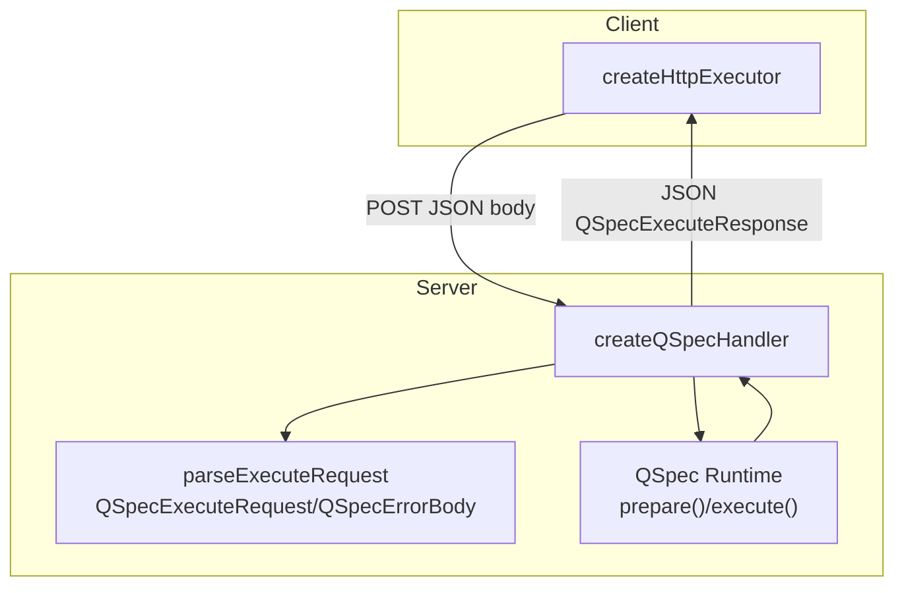
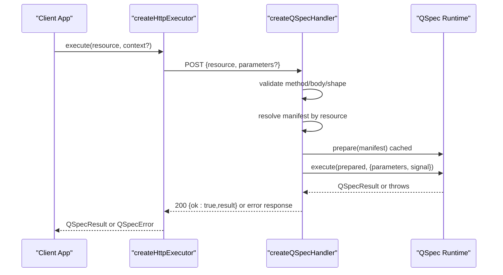
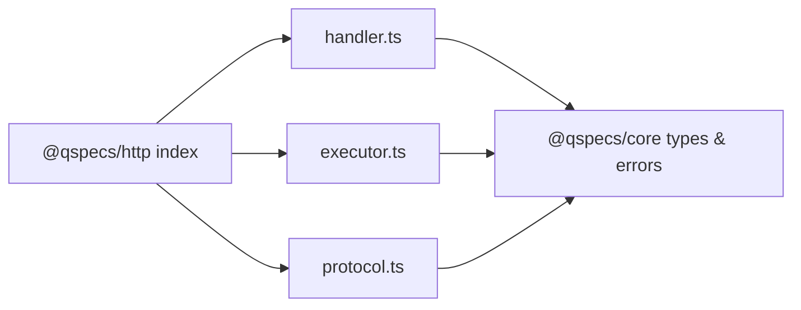

# Request and Response Processing

<cite>
**Referenced Files in This Document**
- [protocol.ts](file://packages/http/src/internal/protocol.ts)
- [handler.ts](file://packages/http/src/internal/handler.ts)
- [executor.ts](file://packages/http/src/internal/executor.ts)
- [index.ts](file://packages/http/src/index.ts)
- [architecture.md](file://docs/architecture.md)
- [security.md](file://docs/security.md)
- [execute.ts](file://packages/core/src/internal/execute.ts)
- [errors.ts](file://packages/core/src/errors.ts)
- [handler.test.ts](file://packages/http/src/internal/handler.test.ts)
- [executor.test.ts](file://packages/http/src/internal/executor.test.ts)
</cite>

## Table of Contents

1. [Introduction](#introduction)
2. [Project Structure](#project-structure)
3. [Core Components](#core-components)
4. [Architecture Overview](#architecture-overview)
5. [Detailed Component Analysis](#detailed-component-analysis)
6. [Dependency Analysis](#dependency-analysis)
7. [Performance Considerations](#performance-considerations)
8. [Troubleshooting Guide](#troubleshooting-guide)
9. [Conclusion](#conclusion)

## Introduction

This document explains how QSpec processes HTTP requests and responses across the server/browser boundary. It covers the wire protocol, request validation, parameter binding, response serialization, error formats, status codes, and operational characteristics such as size limits, timeouts, and streaming behavior for large datasets.

The HTTP layer is intentionally minimal: clients send a resource name plus parameters; servers resolve those names to pre-registered manifests and execute them on the host’s runtime with its own credentials. No executable code or connection strings cross the network.

## Project Structure

The HTTP package exposes three primary concerns:

- Wire types and parsing: `@qspecs/http` defines the request/response shapes and validates incoming bodies.
- Server handler: `createQSpecHandler` turns an HTTP `Request` into a `Response`, routing through manifest resolution, preparation caching, execution, and error mapping.
- Client executor: `createHttpExecutor` sends requests and reconstructs results or errors in a way that mirrors local execution.

**Diagram sources**

- [executor.ts:225-265](file://packages/http/src/internal/executor.ts#L225-L265)
- [handler.ts:131-239](file://packages/http/src/internal/handler.ts#L131-L239)
- [protocol.ts:20-42](file://packages/http/src/internal/protocol.ts#L20-L42)

**Section sources**

- [index.ts:22-36](file://packages/http/src/index.ts#L22-L36)
- [architecture.md:397-430](file://docs/architecture.md#L397-L430)

## Core Components

- QSpecExecuteRequest: The only fields are resource (a server-resolved name) and optional parameters (plain JSON values). There is no query, source, or connection string.
- QSpecExecuteResponse: A discriminated union with ok:true carrying a result, or ok:false carrying an error body.
- QSpecErrorBody: Contains a stable code, a message, and optional issues describing per-field problems.

Key responsibilities:

- parseExecuteRequest enforces shape, length, safety, depth, cycles, and type constraints for parameters.
- createQSpecHandler orchestrates method checks, JSON parsing, wire validation, manifest resolution, prepared resource caching, execution with cancellation, and error mapping.
- createHttpExecutor builds requests, handles fetch and response reading failures, validates response shape, and maps server errors back to core error classes.

**Section sources**

- [protocol.ts:20-42](file://packages/http/src/internal/protocol.ts#L20-L42)
- [protocol.ts:272-317](file://packages/http/src/internal/protocol.ts#L272-L317)
- [handler.ts:131-239](file://packages/http/src/internal/handler.ts#L131-L239)
- [executor.ts:225-265](file://packages/http/src/internal/executor.ts#L225-L265)

## Architecture Overview

The HTTP boundary enforces a strict trust model:

- Clients can only name resources already registered by the host.
- Parameters are validated against declared types at runtime.
- Errors are normalized to stable codes and safe messages.
- Timeouts and abort signals propagate from client to runtime.

**Diagram sources**

- [executor.ts:225-265](file://packages/http/src/internal/executor.ts#L225-L265)
- [handler.ts:131-239](file://packages/http/src/internal/handler.ts#L131-L239)
- [protocol.ts:272-317](file://packages/http/src/internal/protocol.ts#L272-L317)

## Detailed Component Analysis

### Wire Protocol: QSpecExecuteRequest and QSpecExecuteResponse

- QSpecExecuteRequest
  - resource: non-empty string, bounded length, unsafe-key protected.
  - parameters?: plain object of JsonValue; validated recursively for depth, cycles, and unsafe keys.
- QSpecExecuteResponse
  - ok:true + result: successful execution result.
  - ok:false + error: QSpecErrorBody with code, message, and optional issues.

Validation highlights:

- Resource length limit enforced before any processing.
- Parameter recursion depth limit prevents stack overflow.
- Circular references rejected.
- Unsafe keys like prototype-related names rejected at all depths.
- Unknown top-level keys ignored for forward compatibility.

**Section sources**

- [protocol.ts:44-68](file://packages/http/src/internal/protocol.ts#L44-L68)
- [protocol.ts:176-233](file://packages/http/src/internal/protocol.ts#L176-L233)
- [protocol.ts:272-317](file://packages/http/src/internal/protocol.ts#L272-L317)

### Server Handler: createQSpecHandler

Request lifecycle:

1. Method check: only POST accepted; otherwise 405 with Allow header.
2. Body parsing: malformed JSON returns 400 with QSPEC_BAD_REQUEST.
3. Wire validation: parseExecuteRequest rejects invalid shapes/values with 400.
4. Manifest resolution: unknown resources return 404 without disclosing registry contents.
5. Prepare cache: prepared resources are cached per resource name; even failures are cached because configuration is static.
6. Execute: runs with parameters and request.signal for cancellation.
7. Success: 200 with {ok:true,result}.
8. Failure: mapped to appropriate status and error body.

Error mapping:

- Validation errors (manifest or parameter): 400 with issues.
- Abort: 499 with QSPEC_EXECUTION_ABORTED.
- Other QSpecError: 500 with safe generic message and trusted code.
- Non-QSpecError: 500 with internal error code.

Security notes:

- Uses Object.hasOwn to avoid resolving inherited properties like toString.
- Never logs or echoes driver messages or credentials in 500 responses.

**Section sources**

- [handler.ts:28-72](file://packages/http/src/internal/handler.ts#L28-L72)
- [handler.ts:97-109](file://packages/http/src/internal/handler.ts#L97-L109)
- [handler.ts:131-239](file://packages/http/src/internal/handler.ts#L131-L239)
- [security.md:139-146](file://docs/security.md#L139-L146)

### Client Executor: createHttpExecutor

Behavior:

- Builds POST requests with content-type application/json.
- Sends resource and parameters; context.signal forwarded to fetch.
- Reads full response text; parses JSON and validates shape.
- On ok:true, returns result.
- On ok:false, reconstructs a core error class based on code and status.
- Normalizes transport failures:
  - Abort during fetch or body read becomes QSpecAbortError.
  - Other failures become QueryExecutionError.

Streaming considerations:

- The executor reads the entire response body into memory via response.text(). For very large datasets, this can be memory-intensive. Hosts should consider pagination or chunked strategies at higher layers if needed.

**Section sources**

- [executor.ts:20-38](file://packages/http/src/internal/executor.ts#L20-L38)
- [executor.ts:64-89](file://packages/http/src/internal/executor.ts#L64-L89)
- [executor.ts:102-151](file://packages/http/src/internal/executor.ts#L102-L151)
- [executor.ts:183-197](file://packages/http/src/internal/executor.ts#L183-L197)
- [executor.ts:225-265](file://packages/http/src/internal/executor.ts#L225-L265)
- [executor.test.ts:517-551](file://packages/http/src/internal/executor.test.ts#L517-L551)

### Request Validation and Parameter Binding

Validation pipeline:

- parseExecuteRequest ensures the request is a plain object with a valid resource and optional parameters.
- Parameters must be a plain object; each value is validated recursively:
  - Depth limit enforced.
  - Only JSON-compatible values allowed.
  - Cycles detected and rejected.
  - Unsafe keys blocked at every level.
- After validation, parameters are passed directly to PreparedResource.execute.

Binding behavior:

- If parameters are absent, execute receives an empty parameter set.
- If present, they are forwarded as-is after validation.

**Section sources**

- [protocol.ts:272-317](file://packages/http/src/internal/protocol.ts#L272-L317)
- [handler.ts:218-230](file://packages/http/src/internal/handler.ts#L218-L230)

### Response Serialization and Error Formats

Success:

- Status 200 with body {ok:true,result}.

Errors:

- 400: QSPEC_BAD_REQUEST (malformed body), QSPEC_MANIFEST_INVALID, QSPEC_PARAMETER_INVALID (with issues).
- 404: QSPEC_RESOURCE_NOT_FOUND (no registry disclosure).
- 405: QSPEC_METHOD_NOT_ALLOWED (Allow: POST).
- 499: QSPEC_EXECUTION_ABORTED (client aborted or server observed abort).
- 500: QSPEC_QUERY_FAILED or QSPEC_INTERNAL_ERROR (generic message; never leaks driver details).

Issues:

- For validation errors, issues include path arrays pinpointing problematic fields.

**Section sources**

- [handler.ts:97-109](file://packages/http/src/internal/handler.ts#L97-L109)
- [handler.test.ts:181-289](file://packages/http/src/internal/handler.test.ts#L181-L289)
- [errors.ts:498-512](file://packages/core/src/errors.ts#L498-L512)

### Status Codes Summary

- 200: Successful execution with result.
- 400: Bad request, manifest invalid, or parameter invalid (includes issues).
- 404: Resource not found.
- 405: Method not allowed (only POST).
- 499: Execution aborted.
- 500: Internal or query execution failure (safe message).

**Section sources**

- [handler.ts:169-236](file://packages/http/src/internal/handler.ts#L169-L236)
- [handler.test.ts:193-289](file://packages/http/src/internal/handler.test.ts#L193-L289)

### Examples of Request Patterns

- Minimal request:
  - POST with {resource:"orders"} and no parameters.
- Parameterized request:
  - POST with {resource:"orders-by-id", parameters:{id:1}} where id is required and typed.
- Invalid parameter type:
  - POST with {resource:"orders-by-id", parameters:{id:"not-a-number"}} returns 400 with issues pointing to parameters.id.
- Unknown resource:
  - POST with {resource:"unknown"} returns 404 without revealing other registered names.
- Aborted request:
  - Client aborts mid-flight; server returns 499 with QSPEC_EXECUTION_ABORTED.

These patterns are verified in tests and demonstrate expected behaviors for success, validation, discovery protection, and cancellation.

**Section sources**

- [handler.test.ts:181-289](file://packages/http/src/internal/handler.test.ts#L181-L289)
- [handler.test.ts:364-388](file://packages/http/src/internal/handler.test.ts#L364-L388)

## Dependency Analysis

The HTTP package depends on core for:

- Types and utilities: JsonValue, PathSegment, QSpecIssue, QSpecResult, formatPath, isPlainObject, isUnsafeKey.
- Runtime interfaces: QSpec, PreparedResource, and error classes.
- Limits and timeout integration via core’s execution path.

**Diagram sources**

- [index.ts:22-36](file://packages/http/src/index.ts#L22-L36)
- [protocol.ts:1-9](file://packages/http/src/internal/protocol.ts#L1-L9)
- [handler.ts:1-11](file://packages/http/src/internal/handler.ts#L1-L11)
- [executor.ts:1-11](file://packages/http/src/internal/executor.ts#L1-L11)

**Section sources**

- [index.ts:22-36](file://packages/http/src/index.ts#L22-L36)
- [protocol.ts:1-9](file://packages/http/src/internal/protocol.ts#L1-L9)
- [handler.ts:1-11](file://packages/http/src/internal/handler.ts#L1-L11)
- [executor.ts:1-11](file://packages/http/src/internal/executor.ts#L1-L11)

## Performance Considerations

- Prepare caching: PreparedResource is cached per resource name to avoid repeated expensive preparation work across requests. Even preparation failures are cached because configuration is static.
- Message bounding: Error messages are truncated to prevent unbounded growth in logs or responses.
- Parameter depth limit: Prevents deep recursion that could cause stack overflows.
- Streaming behavior: The executor reads the full response body into memory. For very large datasets, hosts may need to implement pagination or chunking at higher layers to manage memory usage.

Timeout handling:

- Core combines caller-provided AbortSignal with configured queryTimeoutMs to ensure both client-side cancellation and server-side timeouts are respected.

**Section sources**

- [handler.ts:136-167](file://packages/http/src/internal/handler.ts#L136-L167)
- [protocol.ts:44-68](file://packages/http/src/internal/protocol.ts#L44-L68)
- [execute.ts:30-58](file://packages/core/src/internal/execute.ts#L30-L58)
- [executor.ts:225-265](file://packages/http/src/internal/executor.ts#L225-L265)

## Troubleshooting Guide

Common issues and resolutions:

- Malformed JSON body:
  - Symptom: 400 with QSPEC_BAD_REQUEST.
  - Cause: Invalid JSON text or missing body.
  - Fix: Ensure the request body is valid JSON and contains a resource field.
- Invalid parameters:
  - Symptom: 400 with QSPEC_PARAMETER_INVALID and issues array.
  - Cause: Type mismatch or unsafe key in parameters.
  - Fix: Correct parameter types and remove unsafe keys.
- Unknown resource:
  - Symptom: 404 with QSPEC_RESOURCE_NOT_FOUND.
  - Cause: Resource name not registered on the server.
  - Fix: Use a resource name present in the server’s manifest registry.
- Wrong HTTP method:
  - Symptom: 405 with Allow: POST.
  - Cause: Non-POST request.
  - Fix: Send POST requests only.
- Aborted execution:
  - Symptom: 499 with QSPEC_EXECUTION_ABORTED.
  - Cause: Client aborted or server observed abort.
  - Fix: Handle abort gracefully on the client; ensure long-running operations respect signals.
- Internal/server errors:
  - Symptom: 500 with a safe generic message.
  - Cause: Unexpected runtime or query execution failure.
  - Fix: Inspect server logs; do not rely on response message for sensitive details.

**Section sources**

- [handler.test.ts:202-289](file://packages/http/src/internal/handler.test.ts#L202-L289)
- [handler.test.ts:312-342](file://packages/http/src/internal/handler.test.ts#L312-L342)
- [handler.test.ts:364-388](file://packages/http/src/internal/handler.test.ts#L364-L388)

## Conclusion

QSpec’s HTTP layer provides a secure, predictable boundary between clients and server-managed resources. Requests carry only resource names and validated parameters; responses carry either results or structured errors with stable codes. The handler caches preparation, propagates cancellation, and normalizes errors to protect against information leakage. For large datasets, consider pagination or chunking strategies at higher layers due to in-memory response reading. Configure core limits (rows, transforms, expression depth, manifest bytes, query timeout) to enforce resource bounds consistently across the pipeline.
