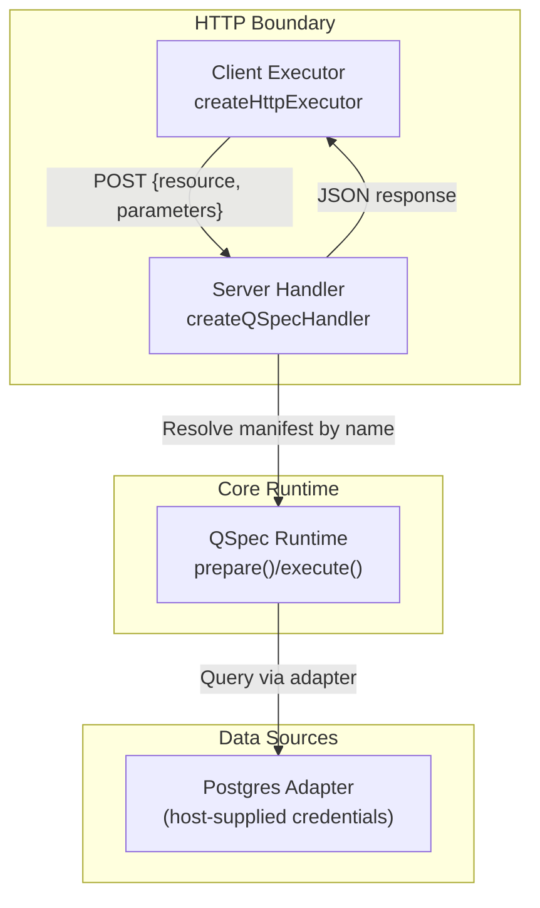
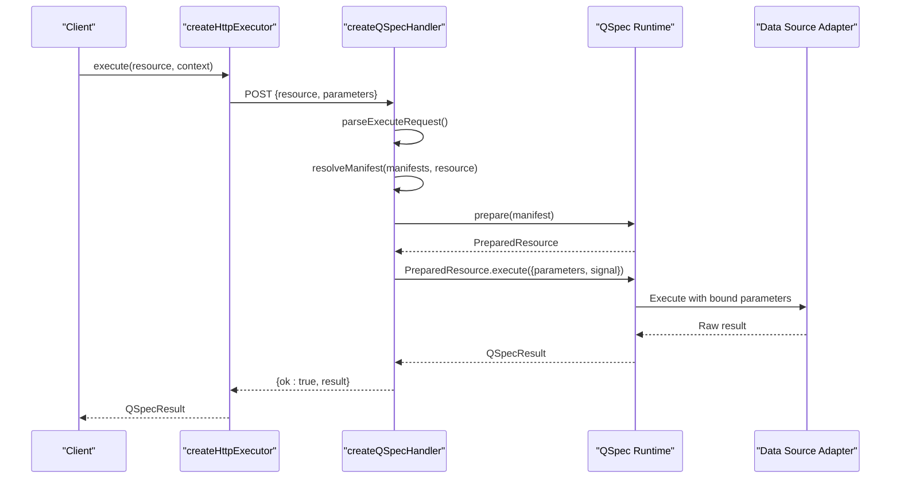
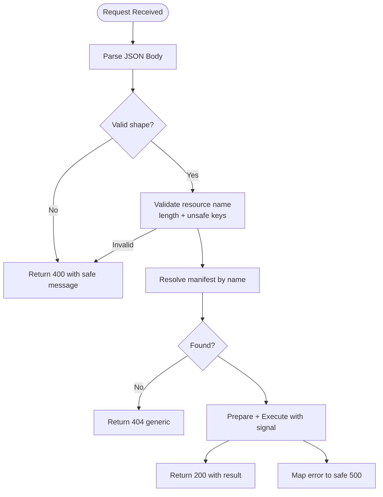
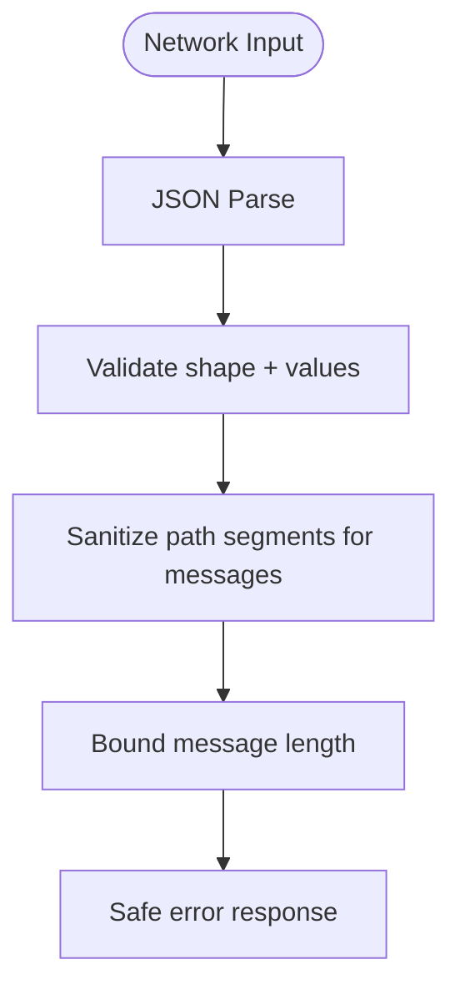
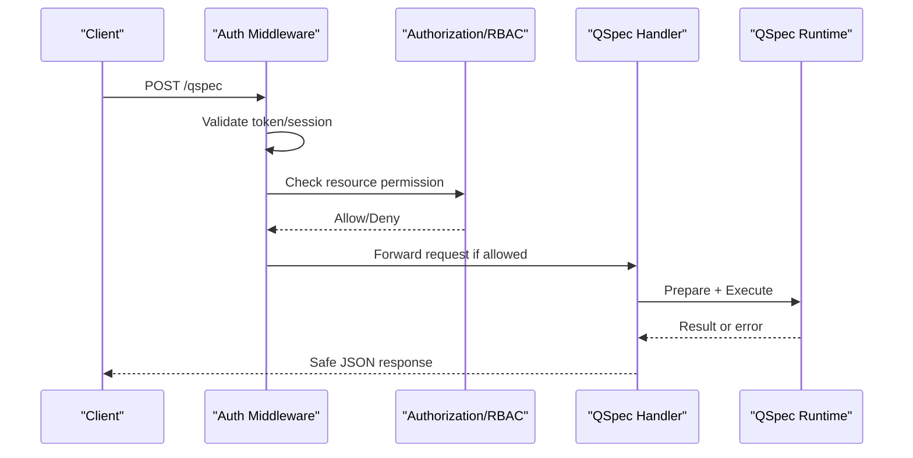
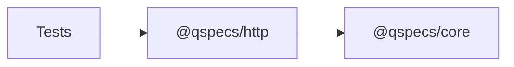

# Security and Authentication

<cite>
**Referenced Files in This Document**
- [security.md](file://docs/security.md)
- [architecture.md](file://docs/architecture.md)
- [known-gaps.md](file://docs/known-gaps.md)
- [SPEC.md](file://SPEC.md)
- [handler.ts](file://packages/http/src/internal/handler.ts)
- [protocol.ts](file://packages/http/src/internal/protocol.ts)
- [executor.ts](file://packages/http/src/internal/executor.ts)
- [index.ts](file://packages/http/src/index.ts)
- [react-pipeline.test.tsx](file://test/react-pipeline.test.tsx)
</cite>

## Table of Contents

1. Introduction
2. Project Structure
3. Core Components
4. Architecture Overview
5. Detailed Component Analysis
6. Dependency Analysis
7. Performance Considerations
8. Troubleshooting Guide
9. Conclusion
10. Appendices

## Introduction

This document provides comprehensive security guidance for QSpec HTTP endpoints, focusing on authentication strategies, authorization patterns, parameter validation, query restrictions, CORS and CSRF considerations, input sanitization, secure endpoint implementation, role-based access control (RBAC), audit logging, best practices, vulnerability mitigation, and compliance considerations. It is grounded in the repository’s design: the HTTP handler is intentionally unauthenticated by design, and the host must provide authentication, authorization, rate limiting, and other network boundary protections around it.

Key takeaways:

- The HTTP boundary carries only a resource name and parameters; no queries, sources, or credentials cross the wire.
- Parameter validation is strict: unsafe keys are rejected at every depth, values are validated as JSON values, cycles are detected, and message lengths are bounded.
- Error responses never leak driver messages or connection strings; only safe codes and generic messages are returned for internal errors.
- Hosts must implement authentication (e.g., JWT, API keys, OAuth), authorization (RBAC), CORS, CSRF protection, rate limiting, and audit logging around the QSpec handler.

**Section sources**

- [security.md:9-15](file://docs/security.md#L9-L15)
- [SECURITY.md:72.1-72.6:2030-2046](file://SPEC.md#L2030-L2046)

## Project Structure

The QSpec HTTP package exposes a minimal, security-focused surface:

- Wire protocol definition and validation: `protocol.ts`
- Server handler that enforces method, body parsing, resource resolution, execution, and error mapping: `handler.ts`
- Client executor that builds requests, validates responses, and reconstructs errors: `executor.ts`
- Public exports aggregating protocol types, handler factory, and executor factory: `index.ts`

**Diagram sources**

- [handler.ts:131-239](file://packages/http/src/internal/handler.ts#L131-L239)
- [protocol.ts:20-42](file://packages/http/src/internal/protocol.ts#L20-L42)
- [executor.ts:225-265](file://packages/http/src/internal/executor.ts#L225-L265)

**Section sources**

- [index.ts:1-37](file://packages/http/src/index.ts#L1-L37)
- [handler.ts:13-33](file://packages/http/src/internal/handler.ts#L13-L33)
- [protocol.ts:11-42](file://packages/http/src/internal/protocol.ts#L11-L42)
- [executor.ts:13-38](file://packages/http/src/internal/executor.ts#L13-L38)

## Core Components

- Wire protocol parser: Validates request shape, enforces length limits, rejects unsafe keys, checks parameter value validity, detects cycles, and bounds error messages.
- Server handler: Accepts only POST, parses JSON, validates via protocol parser, resolves manifests by name using safe lookup, caches prepared resources, executes with abort signal propagation, and maps errors to safe responses.
- Client executor: Builds requests, sets headers, forwards signals, validates server responses against expected protocol shape, and reconstructs core error classes from wire errors.

Security highlights:

- No credentials or executable code cross the wire.
- Resource names are resolved against a host-provided registry; unknown resources return a generic 404 without enumeration.
- Errors map to stable codes; internal errors do not echo driver messages.

**Section sources**

- [protocol.ts:44-80](file://packages/http/src/internal/protocol.ts#L44-L80)
- [protocol.ts:131-233](file://packages/http/src/internal/protocol.ts#L131-L233)
- [protocol.ts:272-317](file://packages/http/src/internal/protocol.ts#L272-L317)
- [handler.ts:54-109](file://packages/http/src/internal/handler.ts#L54-L109)
- [handler.ts:169-239](file://packages/http/src/internal/handler.ts#L169-L239)
- [executor.ts:102-197](file://packages/http/src/internal/executor.ts#L102-L197)
- [executor.ts:225-265](file://packages/http/src/internal/executor.ts#L225-L265)

## Architecture Overview

The QSpec HTTP architecture separates trust boundaries clearly:

- Client sends only a resource name and parameters.
- Server resolves the resource against a fixed registry and executes a pre-registered manifest using host-supplied runtime and credentials.
- Data source adapters receive only bound parameters; SQL uses native parameterization.

**Diagram sources**

- [executor.ts:225-265](file://packages/http/src/internal/executor.ts#L225-L265)
- [handler.ts:169-239](file://packages/http/src/internal/handler.ts#L169-L239)
- [protocol.ts:272-317](file://packages/http/src/internal/protocol.ts#L272-L317)

**Section sources**

- [architecture.md:405-429](file://docs/architecture.md#L405-L429)
- [security.md:148-180](file://docs/security.md#L148-L180)

## Detailed Component Analysis

### Authentication Strategy Integration

- The handler has no auth hook, session check, or rate limiter. Mount it behind your own authentication layer (JWT, API keys, OAuth).
- Recommended integration points:
  - Middleware before invoking the handler to validate tokens, sign-in state, or API keys.
  - Per-request context passed into QSpec execution if needed for auditing or policy decisions.
- Ensure that any user identity or roles are captured in audit logs and used by an authorization layer to restrict which resources can be executed.

Best practices:

- Validate token signatures and expiration server-side before calling the handler.
- Reject invalid or expired tokens early with appropriate status codes.
- Use short-lived tokens and refresh flows to minimize exposure.

**Section sources**

- [security.md:9-15](file://docs/security.md#L9-L15)
- [known-gaps.md:197-209](file://docs/known-gaps.md#L197-L209)
- [handler.ts:13-33](file://packages/http/src/internal/handler.ts#L13-L33)

### Authorization Patterns and RBAC

- Enforce authorization after authentication and before executing the resource.
- Map roles/permissions to allowed resource names; reject unauthorized attempts with a generic 404 or 403 to avoid enumeration.
- Consider a policy plugin or interceptor to approve/reject execution based on user roles and resource policies.

Implementation tips:

- Maintain an allowlist of permitted resources per role.
- Log authorization decisions for auditability.
- Centralize policy evaluation to ensure consistent enforcement across endpoints.

**Section sources**

- [SPEC.md:3215-3230](file://SPEC.md#L3215-L3230)
- [handler.ts:205-216](file://packages/http/src/internal/handler.ts#L205-L216)

### Parameter Validation and Query Restrictions

- All parameters are validated as JSON values with cycle detection, unsafe key rejection, and depth limits.
- Resource names are bounded in length and cannot be unsafe keys.
- Unknown resources return a non-descriptive 404 to prevent registry enumeration.

**Diagram sources**

- [protocol.ts:272-317](file://packages/http/src/internal/protocol.ts#L272-L317)
- [handler.ts:169-239](file://packages/http/src/internal/handler.ts#L169-L239)

**Section sources**

- [protocol.ts:44-80](file://packages/http/src/internal/protocol.ts#L44-L80)
- [protocol.ts:131-233](file://packages/http/src/internal/protocol.ts#L131-L233)
- [protocol.ts:272-317](file://packages/http/src/internal/protocol.ts#L272-L317)
- [handler.ts:205-216](file://packages/http/src/internal/handler.ts#L205-L216)

### CORS Configuration

- The handler returns standard JSON responses; CORS must be configured by the host framework or middleware.
- Recommendations:
  - Restrict allowed origins to known frontends.
  - Allow only necessary methods (typically POST for this endpoint).
  - Avoid wildcard credentials unless absolutely required.
  - Use preflight handling for browsers when custom headers are needed.

**Section sources**

- [handler.ts:35-52](file://packages/http/src/internal/handler.ts#L35-L52)

### CSRF Protection

- Since the endpoint accepts JSON POST, consider:
  - SameSite cookie settings on sessions.
  - Origin/Referer validation in middleware.
  - Double-submit cookies or CSRF tokens if integrating with browser forms.
- Ensure that only trusted origins can call the endpoint.

[No sources needed since this section provides general guidance]

### Input Sanitization and Safe Logging

- Request bodies are parsed and validated strictly; unsafe keys are rejected at all depths.
- Error messages are sanitized and bounded to prevent log injection and information leakage.
- Driver messages and connection strings are never echoed in responses.

**Diagram sources**

- [protocol.ts:70-129](file://packages/http/src/internal/protocol.ts#L70-L129)
- [handler.ts:74-109](file://packages/http/src/internal/handler.ts#L74-L109)

**Section sources**

- [protocol.ts:70-129](file://packages/http/src/internal/protocol.ts#L70-L129)
- [handler.ts:74-109](file://packages/http/src/internal/handler.ts#L74-L109)

### Secure Endpoint Implementation Example

- Wrap the handler with your auth middleware to validate JWT/API keys/OAuth tokens.
- Apply RBAC to determine whether the authenticated user may execute the requested resource.
- Return generic errors for unauthorized or forbidden cases to avoid leaking registry details.
- Propagate client abort signals to cancel long-running queries promptly.

**Diagram sources**

- [handler.ts:169-239](file://packages/http/src/internal/handler.ts#L169-L239)
- [executor.ts:225-265](file://packages/http/src/internal/executor.ts#L225-L265)

**Section sources**

- [handler.ts:169-239](file://packages/http/src/internal/handler.ts#L169-L239)
- [executor.ts:225-265](file://packages/http/src/internal/executor.ts#L225-L265)

### Audit Logging

- Capture:
  - Timestamp, user identity, resource name, parameters (sanitized), duration, success/failure, and error codes.
- Do not log:
  - Credentials, connection strings, or sensitive parameter values.
- Integrate with centralized logging and monitoring systems.

**Section sources**

- [SPEC.md:2369-2388](file://SPEC.md#L2369-L2388)
- [handler.ts:74-109](file://packages/http/src/internal/handler.ts#L74-L109)

### Compliance Considerations

- Adhere to data minimization: only expose necessary fields in responses.
- Ensure encryption in transit (TLS) and secure storage of secrets.
- Follow least privilege: grant minimum permissions to data sources and resources.
- Maintain audit trails for regulatory requirements.

[No sources needed since this section provides general guidance]

## Dependency Analysis

The HTTP package depends on core for error types, utilities, and runtime interfaces, while remaining free of database drivers or transport-specific concerns beyond fetch.

**Diagram sources**

- [index.ts:25-36](file://packages/http/src/index.ts#L25-L36)
- [handler.ts:1-11](file://packages/http/src/internal/handler.ts#L1-L11)
- [executor.ts:1-11](file://packages/http/src/internal/executor.ts#L1-L11)

**Section sources**

- [index.ts:25-36](file://packages/http/src/index.ts#L25-L36)
- [handler.ts:1-11](file://packages/http/src/internal/handler.ts#L1-L11)
- [executor.ts:1-11](file://packages/http/src/internal/executor.ts#L1-L11)

## Performance Considerations

- Prepare caching: The handler caches prepared resources to avoid repeated static validation overhead.
- Abort propagation: Client disconnects propagate to cancel queries promptly.
- Message bounding: Error messages are truncated to prevent excessive payload sizes.

**Section sources**

- [handler.ts:136-167](file://packages/http/src/internal/handler.ts#L136-L167)
- [handler.ts:218-230](file://packages/http/src/internal/handler.ts#L218-L230)
- [protocol.ts:44-80](file://packages/http/src/internal/protocol.ts#L44-L80)

## Troubleshooting Guide

Common issues and resolutions:

- Invalid JSON body: Ensure content-type is application/json and body is valid JSON.
- Unknown resource: Verify the resource name exists in the host’s manifest registry; errors are intentionally generic to prevent enumeration.
- Aborted requests: Handle abort signals to cancel queries; clients should manage timeouts and retries appropriately.
- Malformed server response: The client executor validates response shape; if violated, it throws a structured error for diagnosis.

**Section sources**

- [handler.ts:169-203](file://packages/http/src/internal/handler.ts#L169-L203)
- [handler.ts:205-216](file://packages/http/src/internal/handler.ts#L205-L216)
- [executor.ts:102-197](file://packages/http/src/internal/executor.ts#L102-L197)

## Conclusion

QSpec’s HTTP boundary is designed to be secure by default: no credentials or executable code cross the wire, parameters are rigorously validated, and errors are safely mapped. Authentication, authorization, CORS, CSRF, rate limiting, and audit logging must be implemented by the host around the handler. Following these guidelines ensures robust security posture, mitigates common vulnerabilities, and supports compliance requirements.

[No sources needed since this section summarizes without analyzing specific files]

## Appendices

### Appendix A: Security Requirements Mapping

- No credentials in manifests: Enforced by design; connection details are host configuration.
- Parameterized queries: SQL adapters use native parameterization; no string interpolation.
- No eval/new Function: Core and plugins avoid dynamic execution; enforced by tests.
- Prototype pollution resistance: Unsafe keys rejected at wire and core layers.
- Resource limits: Configurable limits enforced in core.
- No credential logging: Driver messages and connection strings are never logged or echoed.

**Section sources**

- [security.md:17-147](file://docs/security.md#L17-L147)
- [SPEC.md:2030-2046](file://SPEC.md#L2030-L2046)

### Appendix B: End-to-End Secret Leakage Prevention

- Tests assert that SQL statements, table names, and credentials do not appear in request bodies, response bodies, or rendered DOM.

**Section sources**

- [react-pipeline.test.tsx:565-597](file://test/react-pipeline.test.tsx#L565-L597)
