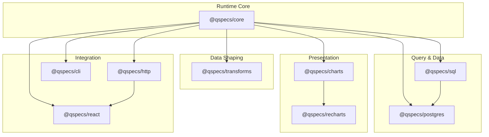
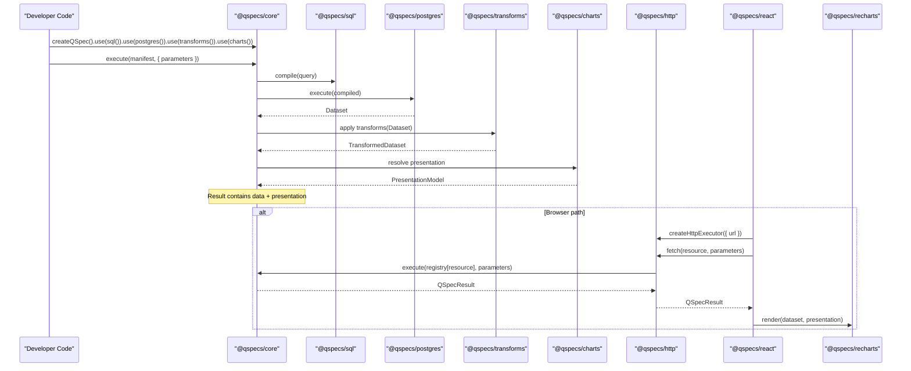
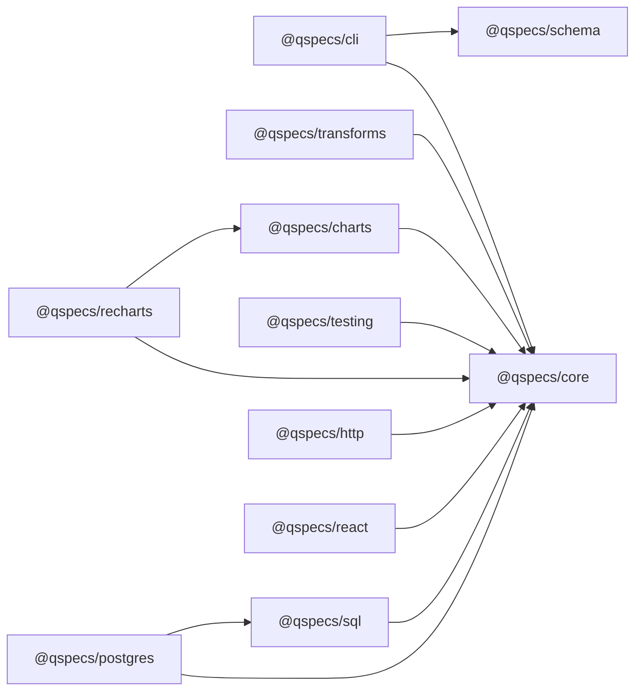

# Package Reference

<cite>
**Referenced Files in This Document**
- [README.md](file://README.md)
- [package.json](file://package.json)
- [core/index.ts](file://packages/core/src/index.ts)
- [core/define.ts](file://packages/core/src/define.ts)
- [core/errors.ts](file://packages/core/src/errors.ts)
- [core/json.ts](file://packages/core/src/json.ts)
- [core/expressions.ts](file://packages/core/src/expressions.ts)
- [sql/index.ts](file://packages/sql/src/index.ts)
- [postgres/index.ts](file://packages/postgres/src/index.ts)
- [transforms/index.ts](file://packages/transforms/src/index.ts)
- [charts/index.ts](file://packages/charts/src/index.ts)
- [charts/types.ts](file://packages/charts/src/types.ts)
- [http/index.ts](file://packages/http/src/index.ts)
- [react/index.ts](file://packages/react/src/index.ts)
- [recharts/index.ts](file://packages/recharts/src/index.ts)
- [cli/bin.ts](file://packages/cli/src/bin.ts)
- [cli/index.ts](file://packages/cli/src/index.ts)
</cite>

## Table of Contents

1. [Introduction](#introduction)
2. [Project Structure](#project-structure)
3. [Core Components](#core-components)
4. [Architecture Overview](#architecture-overview)
5. [Detailed Component Analysis](#detailed-component-analysis)
6. [Dependency Analysis](#dependency-analysis)
7. [Performance Considerations](#performance-considerations)
8. [Troubleshooting Guide](#troubleshooting-guide)
9. [Conclusion](#conclusion)
10. [Appendices](#appendices)

## Introduction

QSpec is a declarative specification and runtime for defining parameterized queries, validating inputs and outputs, transforming datasets, and describing presentation models. The ecosystem is split into focused packages:

- @qspecs/core: zero-dependency runtime, manifest model, plugin system, execution pipeline, and error types.
- @qspecs/sql: SQL query language plugin that compiles statements with named bindings into a safe compiled form.
- @qspecs/postgres: PostgreSQL data source plugin that executes compiled SQL against a pooled connection.
- @qspecs/transforms: declarative dataset transformation library (filter, select, rename, derive, sort, limit, etc.).
- @qspecs/charts: chart presentation models and utilities to resolve plottable series from datasets.
- @qspecs/http: server-side HTTP handler and client-side executor to run QSpec manifests over HTTP.
- @qspecs/react: React integration providing Suspense-first resource loading and rendering hooks.
- @qspecs/recharts: Recharts renderer that draws QSpec chart presentations as SVG charts.
- @qspecs/cli: command-line tools to validate and inspect manifests, optionally using a config module to enable plugin-aware checks.

Environment requirements and peer dependencies are summarized below and per package in the Dependency Analysis section.

**Section sources**

- [README.md:1-42](file://README.md#L1-L42)
- [README.md:242-257](file://README.md#L242-L257)
- [package.json:10-12](file://package.json#L10-L12)

## Project Structure

The repository is a monorepo with each package under packages/. Each package exposes a public API via its src/index.ts and may include internal modules under src/internal/. Tests live alongside sources or in dedicated test directories.

**Diagram sources**

- [README.md:242-257](file://README.md#L242-L257)

**Section sources**

- [README.md:242-257](file://README.md#L242-L257)

## Core Components

This section summarizes the public APIs exposed by each package based on their index files and usage patterns documented in the repository.

- @qspecs/core
  - Exposes the runtime entry point used to create an executable pipeline and register plugins.
  - Provides error types and JSON helpers used across the ecosystem.
  - Supports expression evaluation and versioning utilities.
  - Zero runtime dependencies; runs in both browser and server environments.

- @qspecs/sql
  - Adds a SQL query language plugin to the core runtime.
  - Compiles statements with named bindings into a compiled query object without exposing raw text to downstream layers.

- @qspecs/postgres
  - Registers a data source plugin backed by pg for executing compiled SQL queries against PostgreSQL.
  - Requires server-side environment due to pg dependency.

- @qspecs/transforms
  - Registers transform plugins (filter, select, rename, derive, sort, limit, etc.) that operate on normalized datasets.
  - Runs after query execution and before presentation resolution.

- @qspecs/charts
  - Defines chart presentation models and utilities to resolve plottable series from datasets.
  - Works in both browser and server contexts; no runtime dependencies beyond core.

- @qspecs/http
  - Server-side: creates an HTTP handler that resolves a resource name against a registry and executes it with the provided runtime.
  - Client-side: provides an executor to call the server endpoint with a resource name and parameters.
  - Unauthenticated by design; hosts must add authentication and authorization around the handler.

- @qspecs/react
  - Provides a provider and resource component that suspend while fetching results and rethrow errors to boundaries.
  - Integrates with the HTTP executor to fetch QSpec resources in the browser.

- @qspecs/recharts
  - Renders QSpec chart presentations using Recharts components.
  - Consumes datasets and presentation models produced by the runtime.

- @qspecs/cli
  - Command-line tool with commands such as validate and inspect.
  - Supports optional plugin-aware validation via a config module path.

**Section sources**

- [core/index.ts:1-200](file://packages/core/src/index.ts)
- [core/define.ts:1-200](file://packages/core/src/define.ts)
- [core/errors.ts:1-200](file://packages/core/src/errors.ts)
- [core/json.ts:1-200](file://packages/core/src/json.ts)
- [core/expressions.ts:1-200](file://packages/core/src/expressions.ts)
- [sql/index.ts:1-200](file://packages/sql/src/index.ts)
- [postgres/index.ts:1-200](file://packages/postgres/src/index.ts)
- [transforms/index.ts:1-200](file://packages/transforms/src/index.ts)
- [charts/index.ts:1-200](file://packages/charts/src/index.ts)
- [charts/types.ts:1-200](file://packages/charts/src/types.ts)
- [http/index.ts:1-200](file://packages/http/src/index.ts)
- [react/index.ts:1-200](file://packages/react/src/index.ts)
- [recharts/index.ts:1-200](file://packages/recharts/src/index.ts)
- [cli/bin.ts:1-200](file://packages/cli/src/bin.ts)
- [cli/index.ts:1-200](file://packages/cli/src/index.ts)

## Architecture Overview

The typical execution flow spans multiple packages:

- A host constructs a runtime using core and registers plugins (sql, postgres, transforms, charts).
- Manifests define parameters, queries, dataset schema, transforms, and presentation.
- Execution validates parameters, compiles queries, executes data sources, applies transforms, and resolves presentation models.
- For web apps, the server exposes an HTTP handler; the browser uses React components to fetch and render results.

**Diagram sources**

- [README.md:49-96](file://README.md#L49-L96)
- [README.md:115-180](file://README.md#L115-L180)
- [core/index.ts:1-200](file://packages/core/src/index.ts)
- [sql/index.ts:1-200](file://packages/sql/src/index.ts)
- [postgres/index.ts:1-200](file://packages/postgres/src/index.ts)
- [transforms/index.ts:1-200](file://packages/transforms/src/index.ts)
- [charts/index.ts:1-200](file://packages/charts/src/index.ts)
- [http/index.ts:1-200](file://packages/http/src/index.ts)
- [react/index.ts:1-200](file://packages/react/src/index.ts)
- [recharts/index.ts:1-200](file://packages/recharts/src/index.ts)

## Detailed Component Analysis

### @qspecs/core

Role:

- Provides the zero-dependency runtime, manifest model, plugin registration, execution pipeline, and error types.
- Supports expressions and JSON utilities used throughout the ecosystem.

Key exports and responsibilities:

- Runtime creation and plugin registration methods.
- Execute function that orchestrates validation, compilation, execution, transforms, and presentation resolution.
- Error classes and structured error reporting.
- JSON serialization helpers and expression evaluation utilities.

Usage pattern:

- Create a runtime, register plugins, then execute manifests with typed parameters.

Error handling:

- Throws structured errors during parameter validation, query compilation, execution, and transform application.

Performance considerations:

- Designed to be lightweight and dependency-free; avoid heavy operations in plugin implementations.

**Section sources**

- [core/index.ts:1-200](file://packages/core/src/index.ts)
- [core/define.ts:1-200](file://packages/core/src/define.ts)
- [core/errors.ts:1-200](file://packages/core/src/errors.ts)
- [core/json.ts:1-200](file://packages/core/src/json.ts)
- [core/expressions.ts:1-200](file://packages/core/src/expressions.ts)

### @qspecs/sql

Role:

- Implements the SQL query language plugin for the core runtime.
- Compiles statements with named bindings into a compiled query object without exposing raw SQL text to downstream layers.

Public interface highlights:

- Plugin factory to register SQL support with the runtime.
- Compilation step that produces a compiled query suitable for data source plugins.

Security:

- Named bindings are not interpolated; they are turned into driver parameters at execution time by data source plugins.

**Section sources**

- [sql/index.ts:1-200](file://packages/sql/src/index.ts)

### @qspecs/postgres

Role:

- Registers a PostgreSQL data source plugin that executes compiled SQL queries against a pg pool.
- Requires server-side environment due to pg dependency.

Configuration options:

- Sources configuration with connection strings or connection objects.
- Pool settings as supported by the underlying driver.

Execution behavior:

- Receives compiled queries from the SQL plugin and executes them safely using bound parameters.

Error handling:

- Propagates database errors through the core error pipeline.

**Section sources**

- [postgres/index.ts:1-200](file://packages/postgres/src/index.ts)

### @qspecs/transforms

Role:

- Provides declarative transformations to reshape datasets returned by data sources.
- Common transforms include filter, select, rename, derive, sort, and limit.

Public interface highlights:

- Plugin factory to register transform steps with the runtime.
- Transform definitions applied sequentially to datasets.

Data flow:

- Runs after query execution and before presentation resolution.

Error handling:

- Validates transform configurations and field references; throws descriptive errors when fields are missing or invalid.

**Section sources**

- [transforms/index.ts:1-200](file://packages/transforms/src/index.ts)

### @qspecs/charts

Role:

- Defines chart presentation models and utilities to resolve plottable series from datasets.
- Works in both browser and server contexts; no runtime dependencies beyond core.

Public interface highlights:

- Plugin factory to register chart presentation support.
- Utilities to resolve series from datasets given a presentation model.
- Types for Cartesian and other chart presentations.

Usage pattern:

- After execution, use the resolved presentation to compute series for rendering in any charting library.

**Section sources**

- [charts/index.ts:1-200](file://packages/charts/src/index.ts)
- [charts/types.ts:1-200](file://packages/charts/src/types.ts)

### @qspecs/http

Role:

- Server-side: creates an HTTP handler that resolves a resource name against a registry and executes it with the provided runtime.
- Client-side: provides an executor to call the server endpoint with a resource name and parameters.

Server configuration:

- Provide a runtime instance and a registry mapping resource names to manifests.
- Mount behind your own authentication and authorization layer.

Client usage:

- Create an executor with the server URL and fetch results for a resource and parameters.

Error handling:

- Errors thrown by the runtime surface through HTTP responses; clients should handle network and runtime errors.

**Section sources**

- [http/index.ts:1-200](file://packages/http/src/index.ts)

### @qspecs/react

Role:

- Provides a provider and resource component that suspend while fetching results and rethrow errors to boundaries.
- Integrates with the HTTP executor to fetch QSpec resources in the browser.

Public interface highlights:

- Provider to supply an executor context.
- Resource component to declare which resource to load and pass parameters.
- Render prop or hook-based access to the result, including data and presentation.

Behavior:

- Suspends during data fetch; does not return a loading/error object but throws failures to error boundaries.

**Section sources**

- [react/index.ts:1-200](file://packages/react/src/index.ts)

### @qspecs/recharts

Role:

- Renders QSpec chart presentations using Recharts components.
- Consumes datasets and presentation models produced by the runtime.

Public interface highlights:

- Chart component that accepts dataset and presentation props.
- Maps presentation models to Recharts series and axes.

Usage pattern:

- Wrap with React provider and resource; render the chart component with the result’s data and presentation.

**Section sources**

- [recharts/index.ts:1-200](file://packages/recharts/src/index.ts)

### @qspecs/cli

Role:

- Command-line tool with commands such as validate and inspect.
- Supports optional plugin-aware validation via a config module path.

Commands:

- validate: checks manifest structure and, with --config, runs plugin-aware static checks without executing queries.
- inspect: prints information about a manifest.

Configuration:

- Pass a config module path to load plugins and perform deeper validation.

Environment:

- Server-only tooling; requires Node.js.

**Section sources**

- [cli/bin.ts:1-200](file://packages/cli/src/bin.ts)
- [cli/index.ts:1-200](file://packages/cli/src/index.ts)

## Dependency Analysis

Package-level dependencies and peer requirements:

- @qspecs/core
  - Runtime dependencies: none
  - Peer dependencies: none
  - Environment: browser + server

- @qspecs/schema
  - Runtime dependencies: ajv
  - Peer dependencies: none
  - Environment: browser + server

- @qspecs/cli
  - Runtime dependencies: @qspecs/core, @qspecs/schema
  - Peer dependencies: none
  - Environment: server only

- @qspecs/transforms
  - Runtime dependencies: none
  - Peer dependencies: @qspecs/core
  - Environment: browser + server

- @qspecs/charts
  - Runtime dependencies: none
  - Peer dependencies: @qspecs/core
  - Environment: browser + server

- @qspecs/testing
  - Private package; never published
  - Peer dependencies: @qspecs/core, vitest

- @qspecs/sql
  - Runtime dependencies: none
  - Peer dependencies: @qspecs/core
  - Environment: browser + server

- @qspecs/postgres
  - Runtime dependencies: pg
  - Peer dependencies: @qspecs/core, @qspecs/sql
  - Environment: server only

- @qspecs/http
  - Runtime dependencies: none
  - Peer dependencies: @qspecs/core
  - Environment: browser + server

- @qspecs/react
  - Runtime dependencies: none
  - Peer dependencies: @qspecs/core, react
  - Environment: browser

- @qspecs/recharts
  - Runtime dependencies: none
  - Peer dependencies: @qspecs/core, @qspecs/charts, react, recharts
  - Environment: browser

**Diagram sources**

- [README.md:242-257](file://README.md#L242-L257)

**Section sources**

- [README.md:242-257](file://README.md#L242-L257)

## Performance Considerations

- Keep transforms minimal and efficient; prefer filtering early to reduce dataset size.
- Use appropriate pagination or limits in SQL where possible to avoid large payloads.
- Avoid heavy computations in transforms; offload complex logic to data sources when feasible.
- Reuse runtime instances and pools (e.g., PostgreSQL pool) to minimize overhead.
- In the browser, prefer streaming or incremental updates if integrating with custom UI frameworks.

[No sources needed since this section provides general guidance]

## Troubleshooting Guide

Common issues and resolutions:

- Parameter validation errors: ensure all required parameters are provided and match declared types.
- Unknown dataset field errors: verify field names in transforms and presentations match the dataset schema.
- Query compilation errors: check binding names match declared parameters and statement syntax.
- Database execution errors: review connection configuration and permissions; ensure credentials are supplied securely.
- HTTP boundary errors: confirm the server handler is mounted behind authentication and that the client executor URL is correct.
- React suspense errors: wrap components with error boundaries to catch thrown errors from resource loading.

Error handling strategies:

- Use structured errors from core to diagnose issues quickly.
- Log contextual information (resource name, parameter values) without exposing secrets.
- Validate manifests offline using the CLI with plugin-aware checks to catch issues early.

**Section sources**

- [core/errors.ts:1-200](file://packages/core/src/errors.ts)
- [cli/bin.ts:1-200](file://packages/cli/src/bin.ts)

## Conclusion

QSpec provides a modular, secure, and extensible framework for defining and executing analytical resources. The core runtime is zero-dependency and designed for safety and clarity, while specialized packages extend capabilities for SQL, PostgreSQL, transformations, charting, HTTP transport, React integration, and CLI tooling. By composing these packages, teams can build robust data pipelines and presentations with strong validation and clear separation of concerns.

[No sources needed since this section summarizes without analyzing specific files]

## Appendices

### Quick Start Examples

- Server-side pipeline with SQL, PostgreSQL, transforms, and charts.
- Browser path using HTTP handler, React provider/resource, and Recharts renderer.

For concrete examples, see the repository’s README and tests.

**Section sources**

- [README.md:49-96](file://README.md#L49-L96)
- [README.md:115-180](file://README.md#L115-L180)

### Environment Requirements

- Node.js engine requirement for the monorepo.
- Per-package peer dependencies and environments as listed in the Dependency Analysis section.

**Section sources**

- [package.json:10-12](file://package.json#L10-L12)
- [README.md:242-257](file://README.md#L242-L257)
