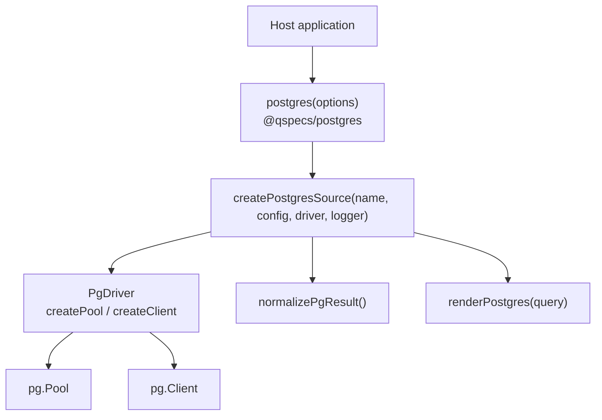
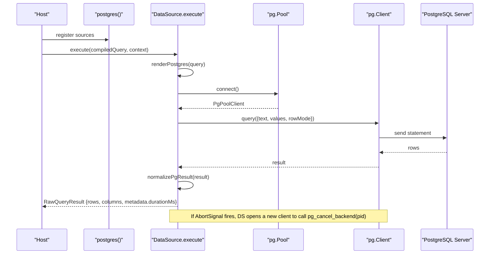
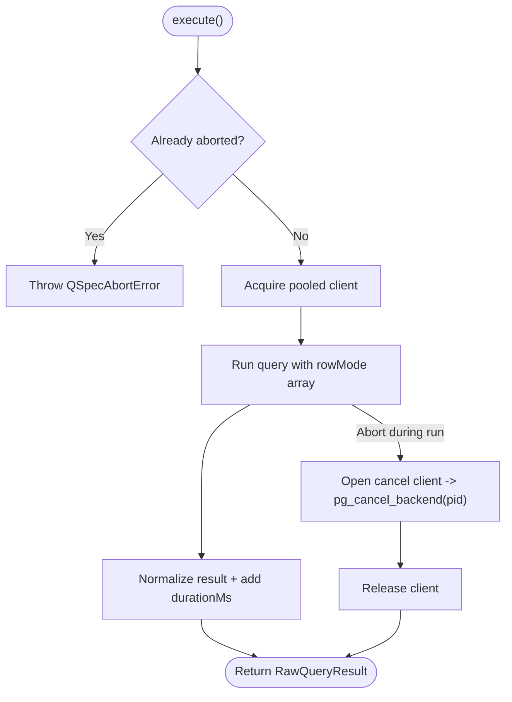
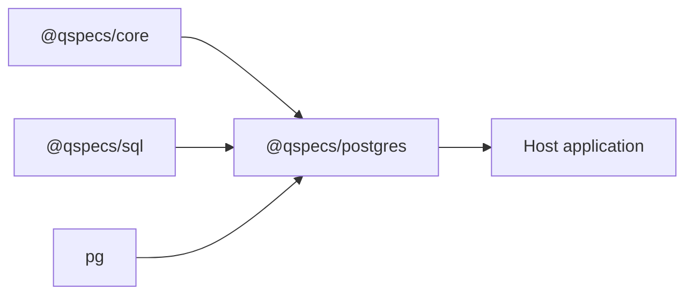

# Connection Configuration

<cite>
**Referenced Files in This Document**
- [index.ts](file://packages/postgres/src/index.ts)
- [source.ts](file://packages/postgres/src/internal/source.ts)
- [driver.ts](file://packages/postgres/src/internal/driver.ts)
- [data-sources.md](file://docs/data-sources.md)
- [integration.test.ts](file://packages/postgres/test/integration.test.ts)
- [execute.ts](file://packages/core/src/internal/execute.ts)
</cite>

## Table of Contents

1. Introduction
2. Project Structure
3. Core Components
4. Architecture Overview
5. Detailed Component Analysis
6. Dependency Analysis
7. Performance Considerations
8. Troubleshooting Guide
9. Conclusion

## Introduction

This document explains how to configure PostgreSQL connections in QSpec using the @qspecs/postgres plugin. It covers the PostgresOptions interface, connection strings, pool settings, authentication via connection strings (including SSL/TLS), multiple named sources, timeouts, cancellation, and monitoring. It also provides guidance for secure configuration with environment variables and common troubleshooting steps for connectivity issues.

## Project Structure

The PostgreSQL integration is implemented as a QSpec plugin that registers one data source per configured name. The public entry point exports a factory function that builds a plugin from PostgresOptions. Internally:

- A driver abstraction adapts pg.Pool and pg.Client so the rest of the code can be tested without a live database.
- A source implementation creates a lazily-initialized pool per logical source, executes SQL, normalizes results, and handles cancellation and disposal.

**Diagram sources**

- [index.ts:1-39](file://packages/postgres/src/index.ts#L1-L39)
- [source.ts:78-309](file://packages/postgres/src/internal/source.ts#L78-L309)
- [driver.ts:13-22](file://packages/postgres/src/internal/driver.ts#L13-L22)
- [driver.ts:151-191](file://packages/postgres/src/internal/driver.ts#L151-L191)

**Section sources**

- [index.ts:1-39](file://packages/postgres/src/index.ts#L1-L39)
- [source.ts:78-309](file://packages/postgres/src/internal/source.ts#L78-L309)
- [driver.ts:13-22](file://packages/postgres/src/internal/driver.ts#L13-L22)
- [driver.ts:151-191](file://packages/postgres/src/internal/driver.ts#L151-L191)

## Core Components

- PostgresOptions: Defines the plugin configuration. It contains a map of source names to PostgresSourceConfig objects. Each source has its own connection string and optional pool settings.
- PostgresSourceConfig: Per-source configuration including connectionString, max pool size, and statementTimeoutMs.
- DataSource lifecycle: Each source implements execute(query, context) and an optional dispose(). Pools are created lazily on first use and closed when dispose() is called.

Key behaviors:

- Multiple named sources: Register multiple entries under options.sources; each becomes a distinct data source by name.
- Cancellation: On AbortSignal abort, a separate client connects to call pg_cancel_backend with the running query’s PID.
- Error safety: Driver errors are wrapped into QueryExecutionError with cause attached; messages do not repeat connection strings or passwords.
- Monitoring: Execution metadata includes durationMs in the result.

**Section sources**

- [source.ts:23-33](file://packages/postgres/src/internal/source.ts#L23-L33)
- [source.ts:56-64](file://packages/postgres/src/internal/source.ts#L56-L64)
- [source.ts:174-181](file://packages/postgres/src/internal/source.ts#L174-L181)
- [source.ts:233-289](file://packages/postgres/src/internal/source.ts#L233-L289)

## Architecture Overview

The plugin wires host-provided PostgresOptions into one DataSource per source name. Connections are pooled and acquired per query. Cancellation uses a dedicated cancel connection. Errors are sanitized and propagated safely.

**Diagram sources**

- [index.ts:31-39](file://packages/postgres/src/index.ts#L31-L39)
- [source.ts:183-231](file://packages/postgres/src/internal/source.ts#L183-L231)
- [source.ts:236-274](file://packages/postgres/src/internal/source.ts#L236-L274)
- [driver.ts:151-191](file://packages/postgres/src/internal/driver.ts#L151-L191)

## Detailed Component Analysis

### PostgresOptions and PostgresSourceConfig

- PostgresOptions.sources: A record mapping logical source names to PostgresSourceConfig.
- PostgresSourceConfig fields:
  - connectionString: Required. The full PostgreSQL URI used by pg. Supports all pg connection parameters, including SSL/TLS via standard pg options embedded in the URI.
  - max: Optional. Maximum number of clients in the pool.
  - statementTimeoutMs: Optional. Maps to pg’s statement_timeout in milliseconds.

Multiple databases:

- Define multiple keys under options.sources, each with its own connectionString and pool settings. Each key becomes a registered data source name referenced by manifests.

Connection strings and SSL/TLS:

- Use a standard PostgreSQL connection URI with pg-supported parameters. For SSL/TLS, include the appropriate pg parameters in the connection string (for example, sslmode and certificate paths). These are passed through to pg via the connection string.

Timeouts:

- Per-statement timeout: Set statementTimeoutMs to enforce server-side per-statement limits.
- Global query timeout: Combine with core-level query timeout support to abort long-running queries at the host level.

Cancellation:

- When the execution’s AbortSignal fires, the source cancels the backend process by PID using a fresh client connection.

Monitoring:

- Results include metadata.durationMs indicating total execution time.

**Section sources**

- [source.ts:23-33](file://packages/postgres/src/internal/source.ts#L23-L33)
- [source.ts:56-64](file://packages/postgres/src/internal/source.ts#L56-L64)
- [source.ts:145-172](file://packages/postgres/src/internal/source.ts#L145-L172)
- [source.ts:267-270](file://packages/postgres/src/internal/source.ts#L267-L270)
- [execute.ts:34-58](file://packages/core/src/internal/execute.ts#L34-L58)

### Driver Abstraction and Pooling

- PgClientOptions and PgPoolOptions define the minimal pg interface used internally.
- createNodePostgresDriver wraps pg.Pool and pg.Client, attaching error listeners to prevent unhandled exceptions and reporting them to the host logger.
- Pool creation is lazy: pools are created on first execute per source.

Security note:

- Driver errors are wrapped into QueryExecutionError with cause attached; messages avoid repeating sensitive connection details.

**Section sources**

- [driver.ts:13-22](file://packages/postgres/src/internal/driver.ts#L13-L22)
- [driver.ts:151-191](file://packages/postgres/src/internal/driver.ts#L151-L191)
- [source.ts:41-54](file://packages/postgres/src/internal/source.ts#L41-L54)

### Data Source Lifecycle and Cancellation Flow

- execute(): Renders the compiled query, acquires a pooled client, runs the query, normalizes results, and returns metadata including durationMs.
- Cancellation: On abort, a separate client calls pg_cancel_backend with the running query’s PID. Failures to cancel are logged and do not replace the abort signal semantics.
- dispose(): Ends the pool once; idempotent.

**Diagram sources**

- [source.ts:183-231](file://packages/postgres/src/internal/source.ts#L183-L231)
- [source.ts:236-274](file://packages/postgres/src/internal/source.ts#L236-L274)

**Section sources**

- [source.ts:183-231](file://packages/postgres/src/internal/source.ts#L183-L231)
- [source.ts:236-274](file://packages/postgres/src/internal/source.ts#L236-L274)
- [source.ts:276-289](file://packages/postgres/src/internal/source.ts#L276-L289)

### Multiple Named Sources

- Register multiple sources by providing multiple keys under options.sources. Each key becomes a data source name that manifests reference via spec.query.source.
- Tests demonstrate registering two sources with different connection strings and verifying their names and supported languages.

**Section sources**

- [source.ts:296-309](file://packages/postgres/src/internal/source.ts#L296-L309)
- [source.test.ts:647-666](file://packages/postgres/src/internal/source.test.ts#L647-L666)

### Secure Configuration with Environment Variables and SSL

- Connection strings should be provided by the host application, never embedded in manifests. Load them from environment variables at runtime.
- SSL/TLS: Include pg-supported SSL parameters in the connection string (for example, sslmode and certificate paths). These are passed through to pg via the connection string.
- Integration tests show credentials being supplied only via host configuration and assert they do not appear in error messages.

**Section sources**

- [index.ts:31-39](file://packages/postgres/src/index.ts#L31-L39)
- [integration.test.ts:52-66](file://packages/postgres/test/integration.test.ts#L52-L66)
- [source.ts:41-54](file://packages/postgres/src/internal/source.ts#L41-L54)

### Connection Validation, Health Checks, and Monitoring

- Validation: The plugin does not perform explicit health checks at startup. Pools are created lazily on first query, which effectively validates connectivity at first use.
- Health checks: Implement application-level liveness/readiness probes by executing a lightweight query against each named source after plugin setup.
- Monitoring:
  - Use the metadata.durationMs field returned with every result to measure query latency.
  - Observe connection errors via the host logger; the source logs warnings for connection errors outside any query.
  - Integrate with your logging/metrics system around execute() to capture success/failure rates and latencies.

**Section sources**

- [source.ts:296-309](file://packages/postgres/src/internal/source.ts#L296-L309)
- [source.ts:102-112](file://packages/postgres/src/internal/source.ts#L102-L112)
- [source.ts:267-270](file://packages/postgres/src/internal/source.ts#L267-L270)

## Dependency Analysis

The PostgreSQL package depends on:

- @qspecs/core for DataSource, QSpecLogger, and error types.
- @qspecs/sql for CompiledSqlQuery type used by the data source.
- pg for actual PostgreSQL connectivity.

**Diagram sources**

- [index.ts:1-9](file://packages/postgres/src/index.ts#L1-L9)
- [source.ts:1-21](file://packages/postgres/src/internal/source.ts#L1-L21)

**Section sources**

- [index.ts:1-9](file://packages/postgres/src/index.ts#L1-L9)
- [source.ts:1-21](file://packages/postgres/src/internal/source.ts#L1-L21)

## Performance Considerations

- Pool sizing: Tune max to match expected concurrency and database capacity.
- Statement timeouts: Use statementTimeoutMs to protect against runaway queries.
- Cancellation: Leverage AbortSignal to stop long-running queries promptly; the source cancels server-side via pg_cancel_backend.
- Result normalization: Results are normalized to positional arrays for performance and consistency.
- Lazy pooling: Pools are created on first use to avoid unnecessary startup cost.

[No sources needed since this section provides general guidance]

## Troubleshooting Guide

Common issues and resolutions:

- Authentication failures:
  - Verify the connection string and credentials loaded from environment variables.
  - Ensure the user has access to the target database and schema.
  - Integration tests assert that credentials are present in the connection string but never leaked in error messages.
- SSL/TLS problems:
  - Confirm SSL parameters in the connection string are correct for your environment (for example, sslmode and certificate paths).
  - Validate that the server accepts TLS and that certificates are trusted by the runtime.
- Timeouts:
  - Increase statementTimeoutMs if queries legitimately exceed defaults.
  - Use core-level query timeout to cap end-to-end execution time.
- Connection errors:
  - The source logs warnings for connection errors outside any query; check host logs for these messages.
  - Driver errors are wrapped into QueryExecutionError with cause attached; inspect cause for low-level details without exposing secrets in messages.
- Cancellation not taking effect:
  - Ensure the caller sets and honors AbortSignal.
  - The source attempts to cancel via pg_cancel_backend; failures are logged and do not mask the abort semantics.

Operational tips:

- Add application-level health checks by executing a simple query against each named source after plugin setup.
- Monitor durationMs and error rates to detect regressions.
- Keep connection strings out of manifests; load them at runtime from secure configuration stores.

**Section sources**

- [integration.test.ts:52-66](file://packages/postgres/test/integration.test.ts#L52-L66)
- [source.ts:41-54](file://packages/postgres/src/internal/source.ts#L41-L54)
- [source.ts:102-112](file://packages/postgres/src/internal/source.ts#L102-L112)
- [execute.ts:34-58](file://packages/core/src/internal/execute.ts#L34-L58)

## Conclusion

QSpec’s PostgreSQL integration provides a clean, secure way to configure multiple named data sources with connection pooling, timeouts, cancellation, and safe error handling. Configure PostgresOptions with per-source connection strings and pool settings, load credentials securely from environment variables, and use built-in metadata and logging to monitor performance and reliability. For advanced security, embed pg-supported SSL parameters directly in the connection string.

[No sources needed since this section summarizes without analyzing specific files]
