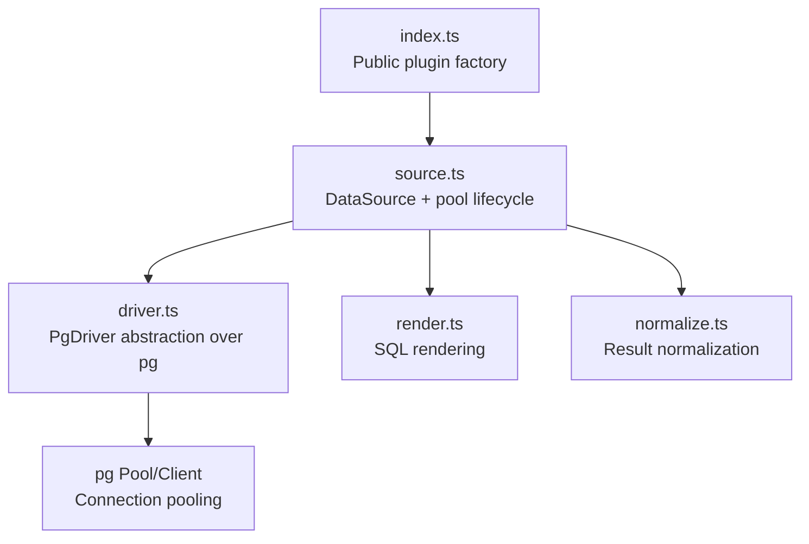
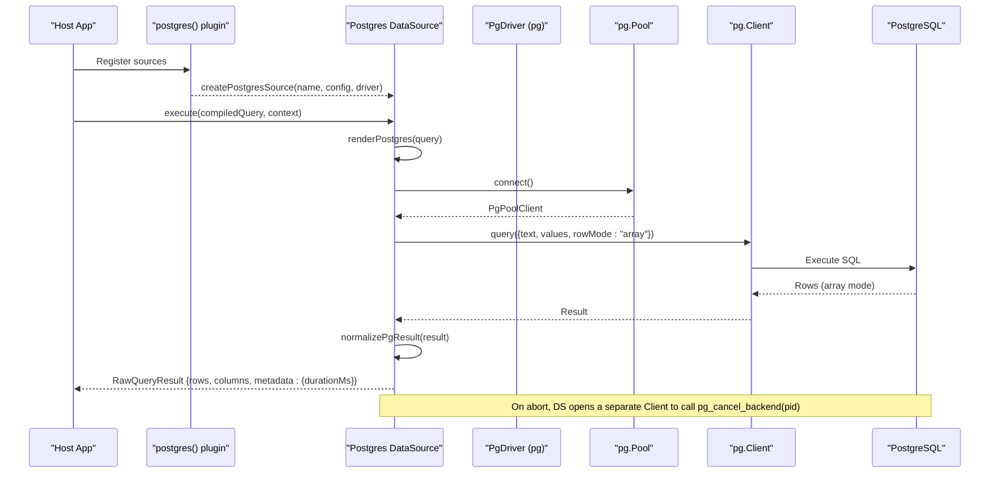
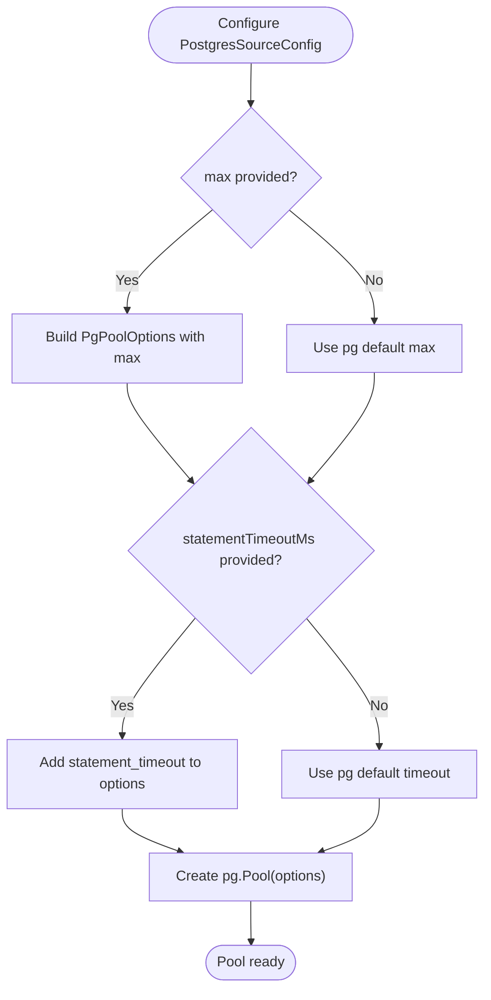
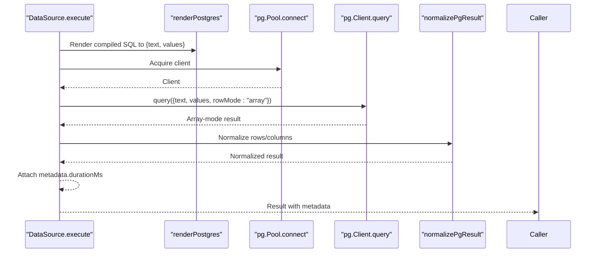
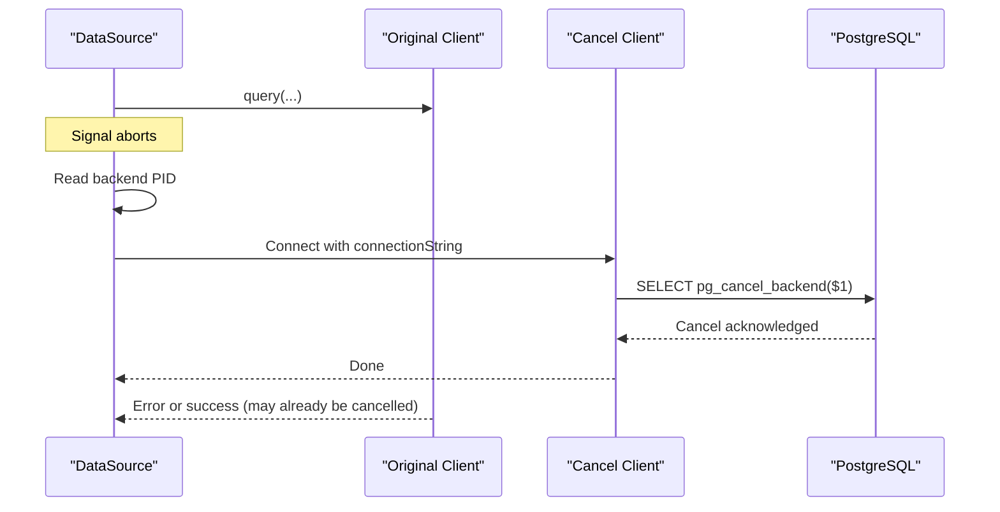
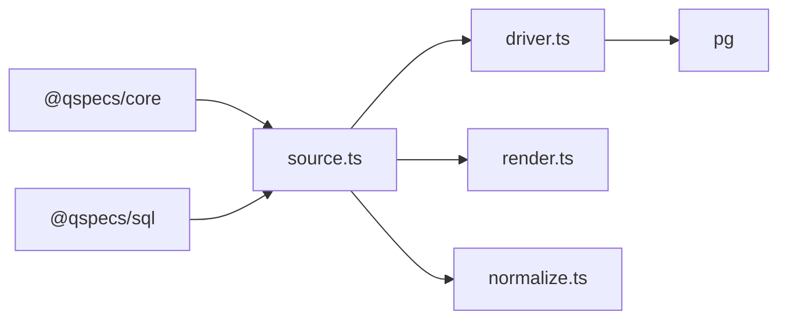

# Performance and Monitoring

<cite>
**Referenced Files in This Document**
- [packages/postgres/src/index.ts](file://packages/postgres/src/index.ts)
- [packages/postgres/src/internal/driver.ts](file://packages/postgres/src/internal/driver.ts)
- [packages/postgres/src/internal/source.ts](file://packages/postgres/src/internal/source.ts)
- [packages/postgres/src/internal/normalize.ts](file://packages/postgres/src/internal/normalize.ts)
- [packages/postgres/src/internal/render.ts](file://packages/postgres/src/internal/render.ts)
- [packages/postgres/package.json](file://packages/postgres/package.json)
- [docs/data-sources.md](file://docs/data-sources.md)
- [docs/queries.md](file://docs/queries.md)
- [examples/03-parameterized-query.qspec.json](file://examples/03-parameterized-query.qspec.json)
</cite>

## Table of Contents

1. Introduction
2. Project Structure
3. Core Components
4. Architecture Overview
5. Detailed Component Analysis
6. Dependency Analysis
7. Performance Considerations
8. Troubleshooting Guide
9. Conclusion
10. Appendices

## Introduction

This document explains how QSpec’s PostgreSQL integration supports performance optimization and monitoring. It covers connection pooling configuration, query execution timing, server-side cancellation, error handling that avoids leaking sensitive details, and where to collect metrics for monitoring. It also provides best practices for writing efficient queries within QSpec manifests, indexing strategies, and scaling considerations for high-throughput workloads.

## Project Structure

The PostgreSQL support is implemented as a plugin package with a clean separation between the public API, driver abstraction, source implementation, and result normalization:

- Public entry exports the plugin factory and types.
- Driver abstraction isolates pg usage so it can be tested without a live database.
- Source implements the DataSource interface, manages pool lifecycle, executes SQL, normalizes results, and records duration metadata.
- Render and normalize handle SQL rendering and result mapping.

**Diagram sources**

- [packages/postgres/src/index.ts:1-39](file://packages/postgres/src/index.ts#L1-L39)
- [packages/postgres/src/internal/source.ts:78-289](file://packages/postgres/src/internal/source.ts#L78-L289)
- [packages/postgres/src/internal/driver.ts:151-191](file://packages/postgres/src/internal/driver.ts#L151-L191)

**Section sources**

- [packages/postgres/src/index.ts:1-39](file://packages/postgres/src/index.ts#L1-L39)
- [packages/postgres/src/internal/source.ts:78-289](file://packages/postgres/src/internal/source.ts#L78-L289)
- [packages/postgres/src/internal/driver.ts:151-191](file://packages/postgres/src/internal/driver.ts#L151-L191)

## Core Components

- Postgres plugin factory: registers one data source per configured name and wires the node-postgres driver.
- DataSource implementation: lazily creates a connection pool, executes parameterized SQL, cancels backend processes on abort, normalizes results, and attaches execution duration metadata.
- Driver abstraction: defines minimal interfaces for pools, clients, and queries; enforces array row mode; captures backend PID for cancellation; wraps errors safely.

Key capabilities relevant to performance and monitoring:

- Connection pool sizing via max.
- Server-side statement timeout via statement_timeout.
- Execution time measurement via metadata.durationMs.
- Safe cancellation using backend PID and a dedicated cancel connection.
- Error messages that do not leak connection strings; underlying cause is attached for deliberate inspection.

**Section sources**

- [packages/postgres/src/index.ts:25-38](file://packages/postgres/src/index.ts#L25-L38)
- [packages/postgres/src/internal/source.ts:23-33](file://packages/postgres/src/internal/source.ts#L23-L33)
- [packages/postgres/src/internal/source.ts:56-64](file://packages/postgres/src/internal/source.ts#L56-L64)
- [packages/postgres/src/internal/source.ts:145-172](file://packages/postgres/src/internal/source.ts#L145-L172)
- [packages/postgres/src/internal/source.ts:236-274](file://packages/postgres/src/internal/source.ts#L236-L274)
- [packages/postgres/src/internal/driver.ts:13-22](file://packages/postgres/src/internal/driver.ts#L13-L22)
- [packages/postgres/src/internal/driver.ts:123-138](file://packages/postgres/src/internal/driver.ts#L123-L138)
- [packages/postgres/src/internal/driver.ts:151-191](file://packages/postgres/src/internal/driver.ts#L151-L191)

## Architecture Overview

QSpec’s PostgreSQL plugin integrates into the core runtime as a DataSource. Each named source owns a lazy pg.Pool. Queries are rendered from compiled SQL, executed with parameter binding, normalized to arrays, and returned with timing metadata. Aborts trigger server-side cancellation through a separate client connection.

**Diagram sources**

- [packages/postgres/src/index.ts:31-38](file://packages/postgres/src/index.ts#L31-L38)
- [packages/postgres/src/internal/source.ts:236-274](file://packages/postgres/src/internal/source.ts#L236-L274)
- [packages/postgres/src/internal/driver.ts:151-191](file://packages/postgres/src/internal/driver.ts#L151-L191)

## Detailed Component Analysis

### Connection Pooling Configuration

- Pool size limit: Configure via the max option in PostgresSourceConfig. The driver passes this to pg.Pool.
- Statement timeout: Configure via statementTimeoutMs in PostgresSourceConfig. The driver maps this to pg.Pool’s statement_timeout.
- Idle timeout and connection recycling: Not exposed by this package. Use pg.Pool defaults or wrap the pool externally if needed.
- Best practice: Set max to match expected concurrency and database capacity; set statementTimeoutMs to protect against runaway queries.

**Diagram sources**

- [packages/postgres/src/internal/source.ts:56-64](file://packages/postgres/src/internal/source.ts#L56-L64)
- [packages/postgres/src/internal/driver.ts:13-22](file://packages/postgres/src/internal/driver.ts#L13-L22)

**Section sources**

- [packages/postgres/src/internal/source.ts:23-33](file://packages/postgres/src/internal/source.ts#L23-L33)
- [packages/postgres/src/internal/source.ts:56-64](file://packages/postgres/src/internal/source.ts#L56-L64)
- [packages/postgres/src/internal/driver.ts:13-22](file://packages/postgres/src/internal/driver.ts#L13-L22)

### Query Execution and Timing

- Every execution measures elapsed time and returns it in metadata.durationMs.
- Queries are parameterized; no string interpolation is used.
- Row mode is enforced as array to ensure stable column alignment during normalization.

**Diagram sources**

- [packages/postgres/src/internal/source.ts:236-274](file://packages/postgres/src/internal/source.ts#L236-L274)
- [packages/postgres/src/internal/render.ts:1-200](file://packages/postgres/src/internal/render.ts#L1-L200)
- [packages/postgres/src/internal/normalize.ts:1-200](file://packages/postgres/src/internal/normalize.ts#L1-L200)

**Section sources**

- [packages/postgres/src/internal/source.ts:236-274](file://packages/postgres/src/internal/source.ts#L236-L274)
- [packages/postgres/src/internal/driver.ts:128-138](file://packages/postgres/src/internal/driver.ts#L128-L138)

### Server-Side Cancellation and Abort Handling

- When an execution signal aborts, the source obtains the backend PID and issues pg_cancel_backend on a separate client connection to avoid blocking on the same socket.
- If the PID is unknown or cancellation fails, warnings are logged without exposing connection details.

**Diagram sources**

- [packages/postgres/src/internal/source.ts:145-172](file://packages/postgres/src/internal/source.ts#L145-L172)
- [packages/postgres/src/internal/source.ts:183-231](file://packages/postgres/src/internal/source.ts#L183-L231)
- [packages/postgres/src/internal/driver.ts:123-126](file://packages/postgres/src/internal/driver.ts#L123-L126)

**Section sources**

- [packages/postgres/src/internal/source.ts:145-172](file://packages/postgres/src/internal/source.ts#L145-L172)
- [packages/postgres/src/internal/source.ts:183-231](file://packages/postgres/src/internal/source.ts#L183-L231)
- [packages/postgres/src/internal/driver.ts:123-126](file://packages/postgres/src/internal/driver.ts#L123-L126)

### Error Handling and Security

- Driver-level connection errors are captured and logged without repeating the message, because pg errors may embed connection strings.
- Query execution errors are wrapped into a typed error with the original cause attached for deliberate access.
- Cancellation failures are logged as warnings without leaking connection details.

**Section sources**

- [packages/postgres/src/internal/driver.ts:140-150](file://packages/postgres/src/internal/driver.ts#L140-L150)
- [packages/postgres/src/internal/source.ts:47-54](file://packages/postgres/src/internal/source.ts#L47-L54)
- [packages/postgres/src/internal/source.ts:102-112](file://packages/postgres/src/internal/source.ts#L102-L112)
- [packages/postgres/src/internal/source.ts:154-158](file://packages/postgres/src/internal/source.ts#L154-L158)

### Result Normalization and Type Mapping

- Results are normalized to arrays with columns derived from the first row’s dataTypeID mapping when available.
- OID-to-type mapping includes common built-in types; unknown OIDs are omitted rather than guessed.

**Section sources**

- [packages/postgres/src/internal/normalize.ts:1-200](file://packages/postgres/src/internal/normalize.ts#L1-L200)
- [packages/postgres/src/internal/types.ts:1-38](file://packages/postgres/src/internal/types.ts#L1-L38)

## Dependency Analysis

- packages/postgres depends on pg for connections and queries.
- The plugin composes with @qspecs/core (DataSource, logging, errors) and @qspecs/sql (compiled query shape).
- Internal modules depend on each other: source uses driver, render, and normalize; driver is isolated from pg except at the adapter boundary.

**Diagram sources**

- [packages/postgres/package.json:33-39](file://packages/postgres/package.json#L33-L39)
- [packages/postgres/src/internal/source.ts:1-21](file://packages/postgres/src/internal/source.ts#L1-L21)
- [packages/postgres/src/internal/driver.ts:1-11](file://packages/postgres/src/internal/driver.ts#L1-L11)

**Section sources**

- [packages/postgres/package.json:33-39](file://packages/postgres/package.json#L33-L39)
- [packages/postgres/src/internal/source.ts:1-21](file://packages/postgres/src/internal/source.ts#L1-L21)

## Performance Considerations

- Pool sizing: Tune max to match concurrent query load and database capacity. Avoid setting it too high to prevent resource exhaustion.
- Statement timeouts: Set statementTimeoutMs to bound long-running queries and free resources promptly.
- Row mode: Enforced as array for predictable normalization and performance; do not change this.
- Cancellation: Leverage abort signals to stop expensive queries quickly; the plugin cancels server-side using backend PID.
- Metrics collection: Use metadata.durationMs to track query latency. Aggregate these values in your host application’s metrics pipeline.
- Memory usage: Keep result sets bounded (e.g., LIMIT, pagination) and avoid selecting unnecessary columns.
- Indexing: Ensure WHERE, JOIN, ORDER BY, and GROUP BY columns are indexed appropriately. Prefer composite indexes matching query predicates.
- Query caching: Cache repeated parameterized queries at the application layer if appropriate; QSpec executes parameterized SQL which benefits from prepared statements where supported by the driver.

[No sources needed since this section provides general guidance]

## Troubleshooting Guide

- Slow queries: Inspect metadata.durationMs per execution. Identify outliers and optimize SQL or add indexes.
- Timeouts: If statementTimeoutMs is hit, consider query optimization, indexing, or increasing the timeout judiciously.
- Connection errors: Connection-level errors are logged without leaking connection strings. Investigate network or database availability.
- Cancellation failures: Warnings indicate the server may still run the query; verify permissions and backend state.
- Disposal issues: Ensure dispose is called to close the pool; otherwise, connections remain open.

**Section sources**

- [packages/postgres/src/internal/source.ts:102-112](file://packages/postgres/src/internal/source.ts#L102-L112)
- [packages/postgres/src/internal/source.ts:154-158](file://packages/postgres/src/internal/source.ts#L154-L158)
- [packages/postgres/src/internal/source.ts:276-288](file://packages/postgres/src/internal/source.ts#L276-L288)

## Conclusion

QSpec’s PostgreSQL integration provides a robust foundation for performance-sensitive applications: configurable pool sizing and statement timeouts, safe server-side cancellation, secure error handling, and execution timing metadata. Combine these features with careful query design, indexing, and application-level caching to achieve reliable, scalable performance under load.

[No sources needed since this section summarizes without analyzing specific files]

## Appendices

### Setting Up Performance Metrics Collection

- Collect metadata.durationMs from each DataSource.execute call and emit to your metrics system (e.g., histograms for latency).
- Tag metrics with source name, query fingerprint, and environment to enable drill-down.

**Section sources**

- [packages/postgres/src/internal/source.ts:236-274](file://packages/postgres/src/internal/source.ts#L236-L274)

### Connection Usage Monitoring

- Track pool acquire/release events at the host level if needed; the plugin releases connections after each query.
- Monitor active connections and wait times to detect saturation.

**Section sources**

- [packages/postgres/src/internal/source.ts:174-181](file://packages/postgres/src/internal/source.ts#L174-L181)
- [packages/postgres/src/internal/source.ts:271-273](file://packages/postgres/src/internal/source.ts#L271-L273)

### Database Health Checks

- Use a lightweight health check query (e.g., SELECT 1) against the configured connection string to validate connectivity.
- Periodically log or alert on failures to detect outages early.

[No sources needed since this section provides general guidance]

### Best Practices for QSpec Manifests

- Parameterize all inputs to avoid injection and improve plan reuse.
- Select only required columns and use LIMIT for paginated views.
- Prefer joins and filters that leverage existing indexes.
- Avoid functions in WHERE clauses that prevent index usage; rewrite to sargable conditions.

**Section sources**

- [docs/queries.md:1-200](file://docs/queries.md#L1-L200)
- [examples/03-parameterized-query.qspec.json:1-200](file://examples/03-parameterized-query.qspec.json#L1-L200)

### Scaling Considerations

- Increase pool max cautiously based on CPU, memory, and database limits.
- Use read replicas for read-heavy workloads; configure separate sources per replica.
- Batch or paginate large result sets to reduce memory pressure.
- Monitor slow queries and adjust indexes or query structure proactively.

[No sources needed since this section provides general guidance]
