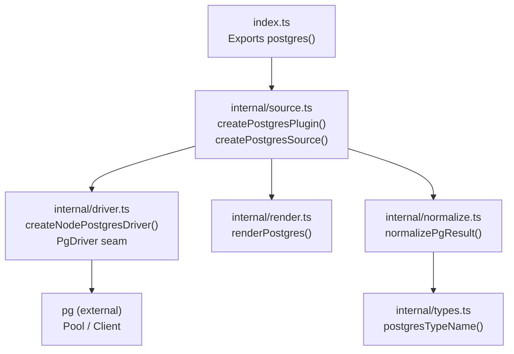
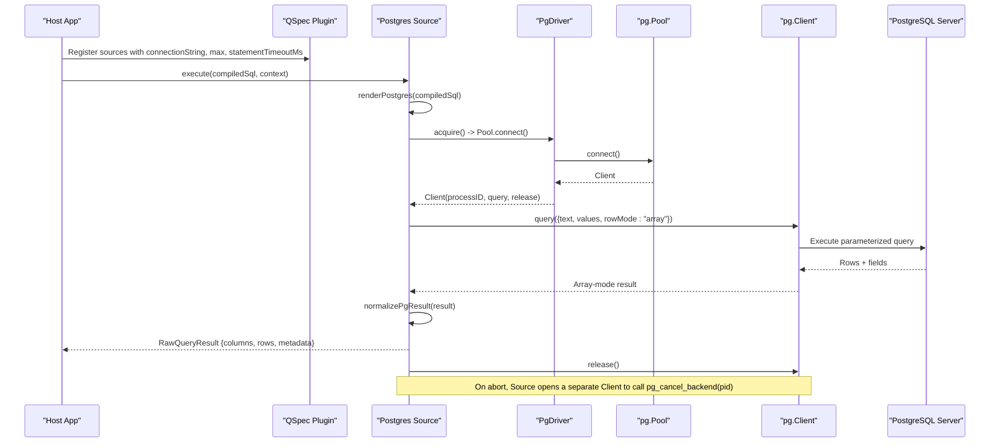
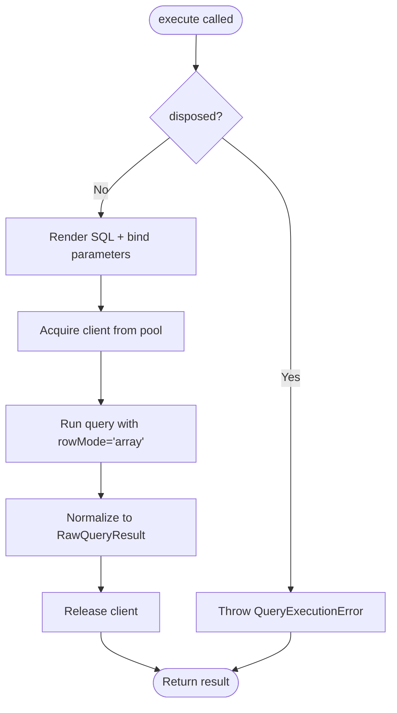
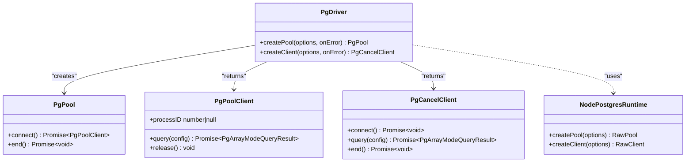
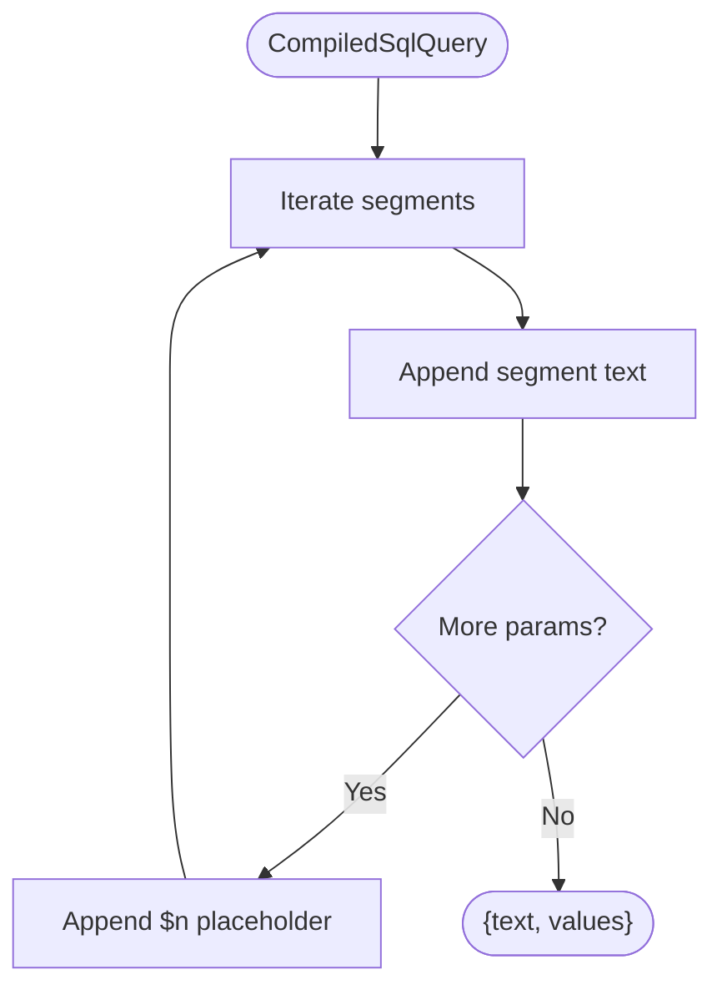
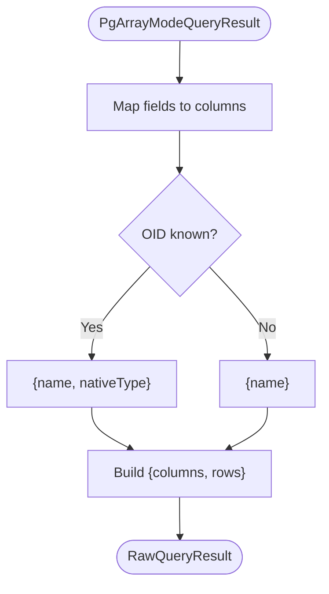
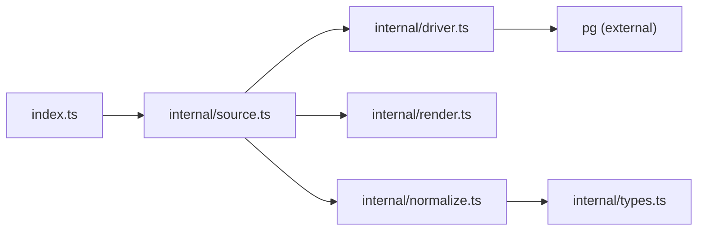

# PostgreSQL Integration (@qspecs/postgres)

<cite>
**Referenced Files in This Document**
- [package.json](file://packages/postgres/package.json)
- [index.ts](file://packages/postgres/src/index.ts)
- [source.ts](file://packages/postgres/src/internal/source.ts)
- [driver.ts](file://packages/postgres/src/internal/driver.ts)
- [normalize.ts](file://packages/postgres/src/internal/normalize.ts)
- [render.ts](file://packages/postgres/src/internal/render.ts)
- [types.ts](file://packages/postgres/src/internal/types.ts)
</cite>

## Table of Contents

1. [Introduction](#introduction)
2. [Project Structure](#project-structure)
3. [Core Components](#core-components)
4. [Architecture Overview](#architecture-overview)
5. [Detailed Component Analysis](#detailed-component-analysis)
6. [Dependency Analysis](#dependency-analysis)
7. [Performance Considerations](#performance-considerations)
8. [Troubleshooting Guide](#troubleshooting-guide)
9. [Conclusion](#conclusion)
10. [Appendices](#appendices)

## Introduction

This document explains how to integrate PostgreSQL with QSpec using the @qspecs/postgres package. It covers connection configuration, query execution with prepared statements, transaction support via the underlying driver, result mapping, error handling, performance optimization, monitoring, and security best practices. The package provides a plugin that registers one or more Postgres-backed data sources, each backed by a connection pool for efficient resource usage.

## Project Structure

The package exposes a single public entry point that wires the Node.js pg driver into an internal abstraction layer. Internally, it separates concerns across:

- Plugin and source lifecycle management
- Driver abstraction over pg.Pool and pg.Client
- SQL rendering from compiled queries to parameterized Postgres text
- Result normalization to QSpec’s generic result shape
- Type name mapping for column metadata

**Diagram sources**

- [index.ts:1-39](file://packages/postgres/src/index.ts#L1-L39)
- [source.ts:78-309](file://packages/postgres/src/internal/source.ts#L78-L309)
- [driver.ts:151-192](file://packages/postgres/src/internal/driver.ts#L151-L192)
- [render.ts:12-22](file://packages/postgres/src/internal/render.ts#L12-L22)
- [normalize.ts:36-43](file://packages/postgres/src/internal/normalize.ts#L36-L43)
- [types.ts:35-37](file://packages/postgres/src/internal/types.ts#L35-L37)

**Section sources**

- [package.json:1-52](file://packages/postgres/package.json#L1-L52)
- [index.ts:1-39](file://packages/postgres/src/index.ts#L1-L39)

## Core Components

- Plugin factory: Exposes a postgres(options) function that returns a QSpec plugin. It creates a Node-specific driver and delegates to createPostgresPlugin to register named data sources.
- Data source: Each configured source lazily creates a pg.Pool on first use and executes parameterized SQL queries with server-side cancellation support.
- Driver abstraction: Encapsulates pg.Pool and pg.Client behind PgDriver, enabling testability and isolating pg usage to a single module.
- SQL renderer: Converts compiled SQL segments into Postgres text with positional placeholders ($1, $2, …) and binds values safely.
- Result normalizer: Translates pg array-mode results into QSpec’s RawQueryResult with columns and rows, preserving duplicate column names.
- Type mapping: Maps PostgreSQL OIDs to readable type names for column metadata when available.

Key configuration options exposed to hosts:

- PostgresOptions.sources: A map of source names to PostgresSourceConfig.
- PostgresSourceConfig.connectionString: Required; used to create pools and clients.
- PostgresSourceConfig.max: Optional; maximum pool size.
- PostgresSourceConfig.statementTimeoutMs: Optional; sets per-statement timeout at the driver level.

Security note: Connection strings are supplied by the host application and never read from manifests, preventing accidental credential leakage through configuration files.

**Section sources**

- [index.ts:11-39](file://packages/postgres/src/index.ts#L11-L39)
- [source.ts:23-33](file://packages/postgres/src/internal/source.ts#L23-L33)
- [source.ts:56-64](file://packages/postgres/src/internal/source.ts#L56-L64)
- [source.ts:78-309](file://packages/postgres/src/internal/source.ts#L78-L309)
- [driver.ts:13-22](file://packages/postgres/src/internal/driver.ts#L13-L22)
- [render.ts:4-22](file://packages/postgres/src/internal/render.ts#L4-L22)
- [normalize.ts:4-43](file://packages/postgres/src/internal/normalize.ts#L4-L43)
- [types.ts:1-37](file://packages/postgres/src/internal/types.ts#L1-L37)

## Architecture Overview

The plugin registers named data sources. When a query is executed:

1. The source renders the compiled SQL into parameterized Postgres text and binds values.
2. A client is acquired from the pool.
3. The query runs with rowMode set to "array" for predictable result shapes.
4. Results are normalized to QSpec’s generic format.
5. The client is released back to the pool.
6. If the execution is aborted, a separate connection is used to cancel the backend process.

**Diagram sources**

- [source.ts:183-274](file://packages/postgres/src/internal/source.ts#L183-L274)
- [driver.ts:151-192](file://packages/postgres/src/internal/driver.ts#L151-L192)
- [render.ts:12-22](file://packages/postgres/src/internal/render.ts#L12-L22)
- [normalize.ts:36-43](file://packages/postgres/src/internal/normalize.ts#L36-L43)

## Detailed Component Analysis

### Plugin and Source Lifecycle

- Registration: The plugin registers one DataSource per configured name during setup.
- Lazy pooling: Pools are created on first execute to avoid unnecessary connections.
- Disposal: dispose() ends the pool if present and prevents further executions after disposal.
- Abortion: Supports AbortSignal to cancel long-running queries by calling pg_cancel_backend on a dedicated connection.

**Diagram sources**

- [source.ts:236-288](file://packages/postgres/src/internal/source.ts#L236-L288)

**Section sources**

- [source.ts:78-309](file://packages/postgres/src/internal/source.ts#L78-L309)

### Driver Abstraction

- Purpose: Isolates pg usage behind PgDriver so tests can inject fakes without a database.
- Error handling: Wraps pool/client errors with safe handlers that do not leak connection details.
- PID extraction: Safely reads backend PID for cancellation.
- Query enforcement: Forces rowMode "array" to ensure consistent result shapes.

**Diagram sources**

- [driver.ts:13-109](file://packages/postgres/src/internal/driver.ts#L13-L109)
- [driver.ts:151-192](file://packages/postgres/src/internal/driver.ts#L151-L192)

**Section sources**

- [driver.ts:13-109](file://packages/postgres/src/internal/driver.ts#L13-L109)
- [driver.ts:123-138](file://packages/postgres/src/internal/driver.ts#L123-L138)
- [driver.ts:151-192](file://packages/postgres/src/internal/driver.ts#L151-L192)

### SQL Rendering and Parameter Binding

- Compiled queries are rendered into Postgres text with positional placeholders ($1, $2, …).
- Values are bound separately to prevent injection and ensure correct typing.
- Repeated parameters receive distinct placeholders to avoid index misbinding.

**Diagram sources**

- [render.ts:4-22](file://packages/postgres/src/internal/render.ts#L4-L22)

**Section sources**

- [render.ts:4-22](file://packages/postgres/src/internal/render.ts#L4-L22)

### Result Normalization and Mapping

- Assumes array-mode results for reliable positional alignment.
- Builds columns from field metadata, attaching nativeType when OID is known.
- Preserves duplicate column names by keeping rows as arrays.

**Diagram sources**

- [normalize.ts:4-43](file://packages/postgres/src/internal/normalize.ts#L4-L43)
- [types.ts:10-37](file://packages/postgres/src/internal/types.ts#L10-L37)

**Section sources**

- [normalize.ts:4-43](file://packages/postgres/src/internal/normalize.ts#L4-L43)
- [types.ts:1-37](file://packages/postgres/src/internal/types.ts#L1-37)

### Connection Management and Transactions

- Connection pooling: Uses pg.Pool with optional max size and statement_timeout.
- Transaction support: While transactions are not explicitly wrapped here, you can run BEGIN/COMMIT/ROLLBACK within a single client session by issuing multi-statement SQL or using a transaction block in your query. Because this package issues parameterized queries, wrap your logic in a transaction string sent as a single query or manage transactions at the application layer by sending explicit transaction commands.
- Cancellation: On abort, a separate client calls pg_cancel_backend to stop the running backend process.

**Section sources**

- [source.ts:56-64](file://packages/postgres/src/internal/source.ts#L56-L64)
- [source.ts:145-172](file://packages/postgres/src/internal/source.ts#L145-L172)
- [source.ts:183-231](file://packages/postgres/src/internal/source.ts#L183-L231)

### Error Handling Strategy

- Driver errors are wrapped into QueryExecutionError with cause attached; messages intentionally omit connection details to avoid leaking credentials.
- Connection-level errors are reported via a logger rather than thrown, preventing unhandled events from crashing the process.
- Abort signals take precedence; cancellation failures are logged but do not replace the abort outcome.

**Section sources**

- [source.ts:41-54](file://packages/postgres/src/internal/source.ts#L41-L54)
- [source.ts:102-112](file://packages/postgres/src/internal/source.ts#L102-L112)
- [source.ts:145-172](file://packages/postgres/src/internal/source.ts#L145-L172)
- [source.ts:214-229](file://packages/postgres/src/internal/source.ts#L214-L229)

## Dependency Analysis

- External dependency: pg is the only runtime dependency for database connectivity.
- Peer dependencies: Requires @qspecs/core and @qspecs/sql for integration and compiled query types.
- Internal modules: source depends on driver, render, normalize, and types; driver depends on normalize only for result types.

**Diagram sources**

- [index.ts:1-39](file://packages/postgres/src/index.ts#L1-L39)
- [source.ts:1-22](file://packages/postgres/src/internal/source.ts#L1-L22)
- [driver.ts:1-2](file://packages/postgres/src/internal/driver.ts#L1-L2)
- [normalize.ts:1-2](file://packages/postgres/src/internal/normalize.ts#L1-L2)
- [package.json:33-39](file://packages/postgres/package.json#L33-L39)

**Section sources**

- [package.json:33-39](file://packages/postgres/package.json#L33-L39)
- [index.ts:1-39](file://packages/postgres/src/index.ts#L1-L39)

## Performance Considerations

- Use connection pooling: Configure max pool size to match expected concurrency and workload characteristics.
- Statement timeouts: Set statementTimeoutMs to guard against runaway queries.
- Row mode: The package enforces array-mode results for efficient processing and predictable alignment.
- Large result sets: Streaming is not implemented in this package; consider limiting results or using server-side cursors via custom SQL if needed.
- Cancellation: Leverage AbortSignal to stop long-running queries promptly.

[No sources needed since this section provides general guidance]

## Troubleshooting Guide

Common issues and resolutions:

- Cannot acquire a connection: Ensure the connection string is valid and the server is reachable. Errors are wrapped with cause attached for deeper inspection.
- Connection errors outside queries: These are logged safely; check logs for network blips or database restarts.
- Query fails: Inspect the wrapped QueryExecutionError and its cause for driver-level details.
- Aborted queries: If cancellation fails, the server may still be running the query; monitor backend processes and adjust timeouts.

Operational tips:

- Monitor pool utilization and statement durations via host metrics around execute calls.
- Keep statementTimeoutMs conservative to fail fast under load.
- Avoid reusing AbortSignal across multiple executions unless you understand listener semantics; the package removes listeners appropriately.

**Section sources**

- [source.ts:174-181](file://packages/postgres/src/internal/source.ts#L174-L181)
- [source.ts:102-112](file://packages/postgres/src/internal/source.ts#L102-L112)
- [source.ts:214-229](file://packages/postgres/src/internal/source.ts#L214-L229)

## Conclusion

The @qspecs/postgres package provides a secure, efficient, and testable PostgreSQL integration for QSpec. It emphasizes parameterized queries, robust error handling, and safe connection management. By configuring connection pools, timeouts, and leveraging cancellation, you can build resilient data pipelines that scale with your workload while protecting sensitive credentials.

[No sources needed since this section summarizes without analyzing specific files]

## Appendices

### Configuration Reference

- PostgresOptions.sources: Record<string, PostgresSourceConfig>
- PostgresSourceConfig:
  - connectionString: string (required)
  - max?: number (optional pool size)
  - statementTimeoutMs?: number (optional per-statement timeout)

**Section sources**

- [source.ts:23-33](file://packages/postgres/src/internal/source.ts#L23-L33)
- [source.ts:56-64](file://packages/postgres/src/internal/source.ts#L56-L64)

### Security Best Practices

- Credential management: Supply connection strings securely at runtime; they are never read from manifests.
- Query sanitization: Always use parameterized queries; this package enforces binding via placeholders.
- Error messages: Do not log raw driver errors that may contain connection strings; rely on wrapped errors with causes.

**Section sources**

- [index.ts:30-39](file://packages/postgres/src/index.ts#L30-L39)
- [render.ts:4-22](file://packages/postgres/src/internal/render.ts#L4-L22)
- [source.ts:41-54](file://packages/postgres/src/internal/source.ts#L41-L54)
