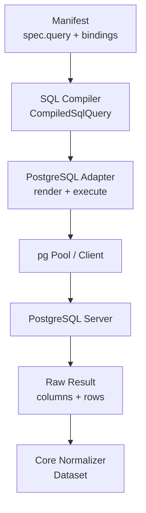
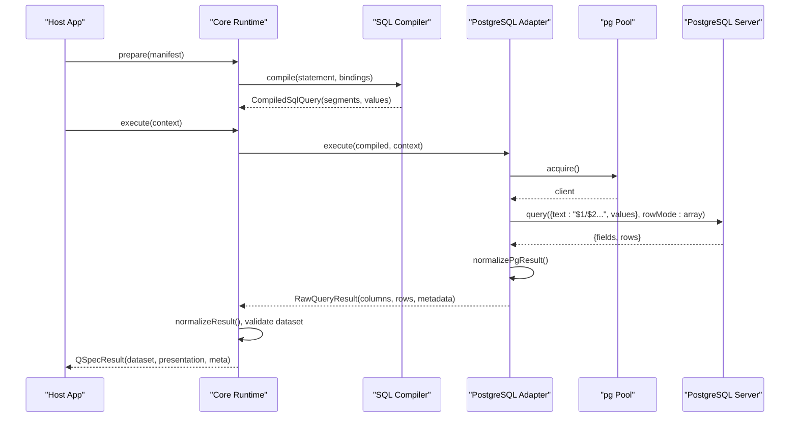
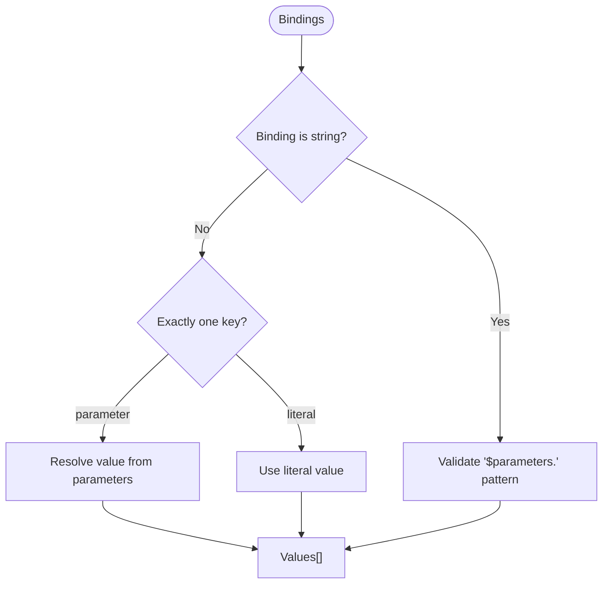
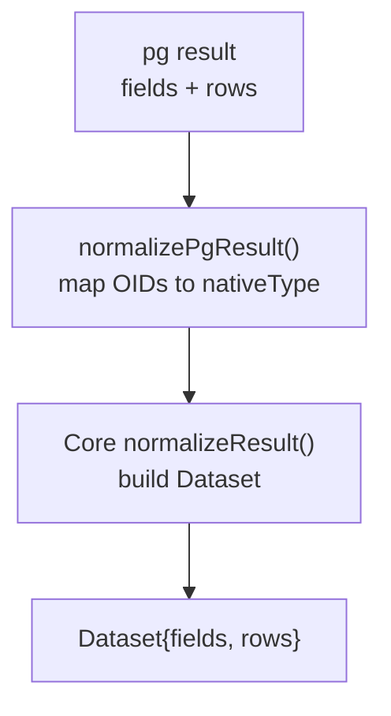
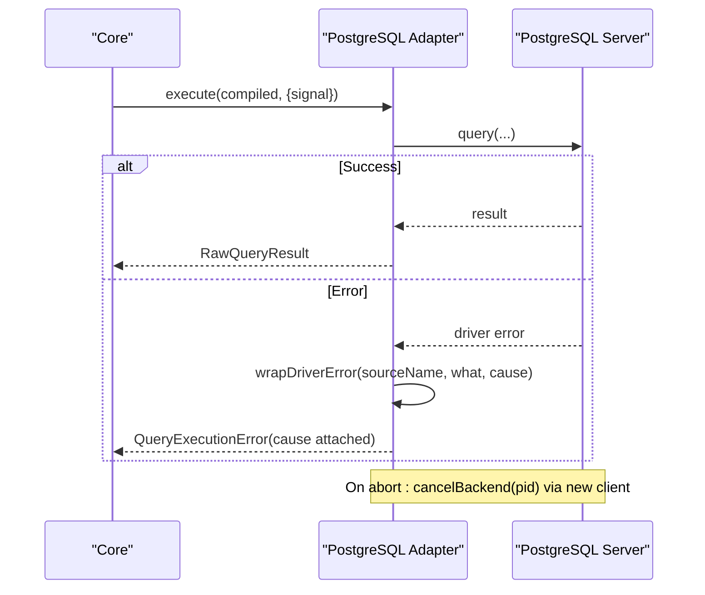
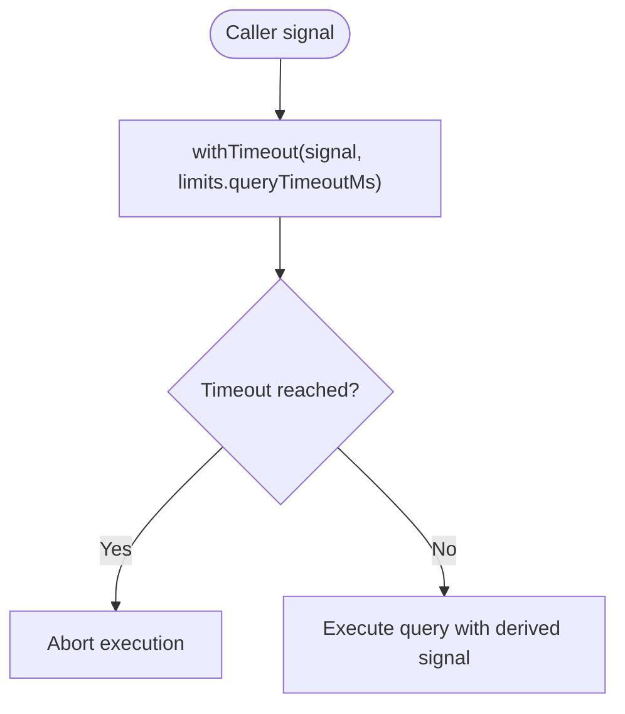
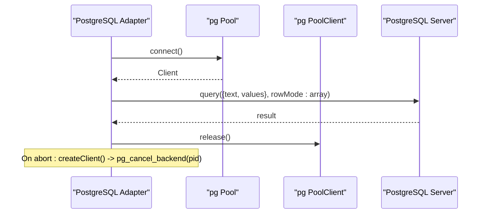
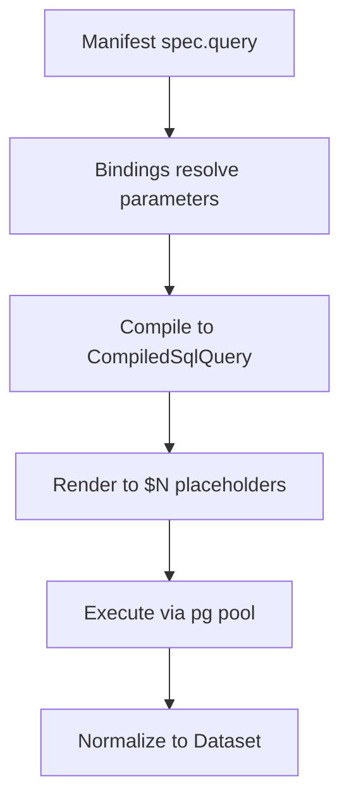
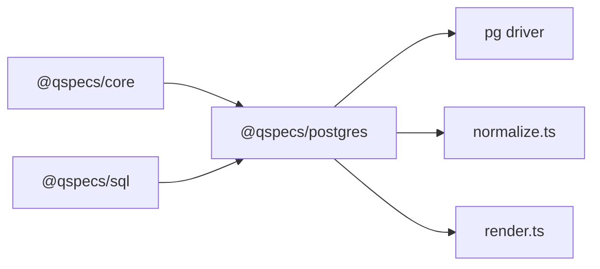

# Query Execution

<cite>
**Referenced Files in This Document**
- [queries.md](file://docs/queries.md)
- [data-sources.md](file://docs/data-sources.md)
- [architecture.md](file://docs/architecture.md)
- [security.md](file://docs/security.md)
- [source.ts](file://packages/postgres/src/internal/source.ts)
- [render.ts](file://packages/postgres/src/internal/render.ts)
- [normalize.ts](file://packages/postgres/src/internal/normalize.ts)
- [types.ts](file://packages/postgres/src/internal/types.ts)
- [execute.ts](file://packages/core/src/internal/execute.ts)
- [03-parameterized-query.qspec.json](file://examples/03-parameterized-query.qspec.json)
- [integration.test.ts](file://packages/postgres/test/integration.test.ts)
</cite>

## Table of Contents

1. Introduction
2. Project Structure
3. Core Components
4. Architecture Overview
5. Detailed Component Analysis
6. Dependency Analysis
7. Performance Considerations
8. Troubleshooting Guide
9. Conclusion
10. Appendices

## Introduction

This document explains how PostgreSQL query execution works in QSpec, focusing on parameterized queries, prepared statements, transaction support, result set handling, data type mapping between PostgreSQL and JavaScript, error handling strategies, batch execution, streaming large results, performance optimization, timeouts, retry logic, connection management, and security considerations such as SQL injection prevention.

QSpec separates the query definition (manifest) from execution by compiling a dialect-neutral query into segments and values, then rendering it to a specific database driver with safe placeholders. The PostgreSQL adapter uses connection pooling, cancellation via backend PID, and strict error wrapping that avoids leaking credentials.

## Project Structure

The relevant pieces for PostgreSQL query execution are:

- Manifest-level query definition and binding model
- SQL compilation to a structured form without concatenated text
- PostgreSQL adapter that renders placeholders, executes via a pooled client, normalizes results, and handles cancellation and errors
- Core runtime that enforces timeouts, validation stages, and result normalization



**Diagram sources**

- [queries.md:43-148](file://docs/queries.md#L43-L148)
- [architecture.md:287-313](file://docs/architecture.md#L287-L313)
- [source.ts:236-274](file://packages/postgres/src/internal/source.ts#L236-L274)
- [normalize.ts:36-43](file://packages/postgres/src/internal/normalize.ts#L36-L43)

**Section sources**

- [queries.md:43-148](file://docs/queries.md#L43-L148)
- [architecture.md:287-313](file://docs/architecture.md#L287-L313)

## Core Components

- CompiledSqlQuery: A structure containing literal SQL segments, parameter names, and values; no concatenated text field to prevent accidental interpolation.
- PostgreSQL adapter: Renders CompiledSqlQuery to $N placeholders, executes via pg-pool, normalizes results, and manages cancellation and errors.
- Core runtime: Validates parameters, compiles queries, enforces timeouts, normalizes results, and runs transforms.

Key responsibilities:

- Parameterized queries: Bindings map manifest parameters to values safely.
- Prepared statements: Rendered as parameterized statements executed through the driver’s parameter mechanism.
- Transactions: Not provided by the adapter; callers must manage transactions at the application level using the underlying driver if needed.
- Result sets: Returned as positional arrays with column metadata; core normalizes to Dataset.
- Data types: Most types map naturally; numeric and bigint remain strings to preserve precision.
- Error handling: Driver errors wrapped without leaking credentials; aborts produce explicit abort errors.
- Timeouts: Configurable per execution via limits; combined with caller-provided signals.
- Security: No string interpolation; only bound parameters reach the server.

**Section sources**

- [architecture.md:287-313](file://docs/architecture.md#L287-L313)
- [source.ts:236-274](file://packages/postgres/src/internal/source.ts#L236-L274)
- [normalize.ts:36-43](file://packages/postgres/src/internal/normalize.ts#L36-L43)
- [types.ts:1-38](file://packages/postgres/src/internal/types.ts#L1-L38)
- [execute.ts:34-58](file://packages/core/src/internal/execute.ts#L34-L58)
- [security.md:34-62](file://docs/security.md#L34-L62)

## Architecture Overview

End-to-end flow from manifest to dataset:



**Diagram sources**

- [execute.ts:34-58](file://packages/core/src/internal/execute.ts#L34-L58)
- [source.ts:236-274](file://packages/postgres/src/internal/source.ts#L236-L274)
- [render.ts:12-22](file://packages/postgres/src/internal/render.ts#L12-L22)
- [normalize.ts:36-43](file://packages/postgres/src/internal/normalize.ts#L36-L43)

## Detailed Component Analysis

### Parameterized Queries and Binding Model

- Bindings map named placeholders in the statement to validated parameters or literals.
- String shorthand references parameters; object forms enforce exactly one key (parameter or literal).
- At runtime, bindings resolve once per execute call against validated parameters.
- For SQL, the compiler produces segments and values; no concatenated text is allowed until rendering.



**Diagram sources**

- [queries.md:43-148](file://docs/queries.md#L43-L148)

**Section sources**

- [queries.md:43-148](file://docs/queries.md#L43-L148)
- [03-parameterized-query.qspec.json:10-43](file://examples/03-parameterized-query.qspec.json#L10-L43)

### Prepared Statements and Rendering

- The SQL compiler outputs a CompiledSqlQuery with segments and values.
- The PostgreSQL adapter renders this to a statement with $1/$2/... placeholders and passes values as bind parameters.
- This design prevents SQL injection because values never become part of the SQL text.

```mermaid
classDiagram
class CompiledSqlQuery {
+segments : string[]
+parameterNames : string[]
+values : JsonValue[]
+source : string
}
class PostgresAdapter {
+renderPostgres(compiled) : {text, values}
+execute(query, context) : Promise~RawQueryResult~
}
CompiledSqlQuery <.. PostgresAdapter : "renders to $N placeholders"
```

**Diagram sources**

- [architecture.md:287-313](file://docs/architecture.md#L287-L313)
- [render.ts:12-22](file://packages/postgres/src/internal/render.ts#L12-L22)

**Section sources**

- [architecture.md:287-313](file://docs/architecture.md#L287-L313)
- [render.ts:12-22](file://packages/postgres/src/internal/render.ts#L12-L22)
- [security.md:34-62](file://docs/security.md#L34-L62)

### Transaction Support

- The PostgreSQL adapter does not provide built-in transaction helpers.
- Applications can manage transactions using the underlying driver if they need multi-statement atomicity.
- Each execute call acquires a pooled client, runs the query, and releases it; there is no implicit transaction scope.

**Section sources**

- [source.ts:236-274](file://packages/postgres/src/internal/source.ts#L236-L274)

### Result Set Handling and Data Type Mapping

- Results are returned as positional arrays with columns including optional nativeType.
- Core normalizes these into a Dataset with fields and rows.
- PostgreSQL numeric and bigint remain strings to avoid precision loss; other common types map naturally.



**Diagram sources**

- [normalize.ts:36-43](file://packages/postgres/src/internal/normalize.ts#L36-L43)
- [types.ts:10-27](file://packages/postgres/src/internal/types.ts#L10-L27)
- [architecture.md:376-395](file://docs/architecture.md#L376-L395)

**Section sources**

- [normalize.ts:36-43](file://packages/postgres/src/internal/normalize.ts#L36-L43)
- [types.ts:10-27](file://packages/postgres/src/internal/types.ts#L10-L27)
- [architecture.md:376-395](file://docs/architecture.md#L376-L395)

### Error Handling Strategies

- Driver errors are wrapped without embedding connection details; cause retains the original error.
- Abort signals propagate as explicit abort errors; cancellation uses a separate connection to cancel the backend process.
- Connection errors outside any execution are logged safely without exposing credentials.



**Diagram sources**

- [source.ts:47-54](file://packages/postgres/src/internal/source.ts#L47-L54)
- [source.ts:145-172](file://packages/postgres/src/internal/source.ts#L145-L172)
- [source.ts:214-220](file://packages/postgres/src/internal/source.ts#L214-L220)

**Section sources**

- [source.ts:47-54](file://packages/postgres/src/internal/source.ts#L47-L54)
- [source.ts:145-172](file://packages/postgres/src/internal/source.ts#L145-L172)
- [source.ts:214-220](file://packages/postgres/src/internal/source.ts#L214-L220)
- [security.md:124-147](file://docs/security.md#L124-L147)

### Query Timeout Configuration and Retry Logic

- Core combines caller signal with configured queryTimeoutMs to derive a timeout signal passed to the data source.
- If the timeout fires, the execution is aborted; adapters should respect the signal.
- Retry logic is not implemented in core or the adapter; hosts should implement retries around execute calls with appropriate backoff and idempotency checks.



**Diagram sources**

- [execute.ts:34-58](file://packages/core/src/internal/execute.ts#L34-L58)

**Section sources**

- [execute.ts:34-58](file://packages/core/src/internal/execute.ts#L34-L58)

### Connection Management During Query Execution

- The adapter lazily creates a pg.Pool and acquires a client per execute.
- It checks for disposal before executing and ensures the client is released after completion.
- Cancellation opens a short-lived client to call pg_cancel_backend with the running query’s PID.



**Diagram sources**

- [source.ts:174-181](file://packages/postgres/src/internal/source.ts#L174-L181)
- [source.ts:236-274](file://packages/postgres/src/internal/source.ts#L236-L274)
- [source.ts:145-172](file://packages/postgres/src/internal/source.ts#L145-L172)

**Section sources**

- [source.ts:174-181](file://packages/postgres/src/internal/source.ts#L174-L181)
- [source.ts:236-274](file://packages/postgres/src/internal/source.ts#L236-L274)
- [source.ts:145-172](file://packages/postgres/src/internal/source.ts#L145-L172)

### Executing SELECT, INSERT, UPDATE, DELETE

- Any SQL statement supported by PostgreSQL can be executed through the same pipeline.
- Bind parameters ensure safety and correct typing.
- Examples include selecting filtered orders with date range and region parameters.



**Diagram sources**

- [03-parameterized-query.qspec.json:34-43](file://examples/03-parameterized-query.qspec.json#L34-L43)
- [render.ts:12-22](file://packages/postgres/src/internal/render.ts#L12-L22)

**Section sources**

- [03-parameterized-query.qspec.json:34-43](file://examples/03-parameterized-query.qspec.json#L34-L43)

### Batch Query Execution

- The adapter executes one statement per call; batch execution across multiple statements is not provided by default.
- For batching, applications can issue multiple execute calls or use the underlying driver directly within an application-managed transaction.

**Section sources**

- [source.ts:236-274](file://packages/postgres/src/internal/source.ts#L236-L274)

### Streaming Large Result Sets

- The adapter returns full result sets as arrays; streaming is not implemented in the adapter.
- For very large datasets, consider limiting results at the database layer and processing in chunks.

**Section sources**

- [normalize.ts:36-43](file://packages/postgres/src/internal/normalize.ts#L36-L43)

### Performance Optimization Techniques

- Use parameterized queries to leverage prepared statements and avoid re-parsing.
- Limit result sets with LIMIT clauses where appropriate.
- Configure pool size and statement_timeout based on workload characteristics.
- Avoid unnecessary transforms that increase row counts or complexity.
- Keep numeric/bigint as strings to prevent precision loss and parsing overhead.

**Section sources**

- [architecture.md:376-395](file://docs/architecture.md#L376-L395)
- [source.ts:56-64](file://packages/postgres/src/internal/source.ts#L56-L64)

### Security Considerations

- SQL injection is prevented structurally by disallowing concatenated text in CompiledSqlQuery and requiring parameterization.
- Credentials are never included in manifests or logged messages; driver errors are attached as cause but not echoed.
- The HTTP boundary carries only resource names and parameters, not queries or credentials.

```mermaid
flowchart TD
Input["User-supplied parameters"] --> Bind["Bind as $N values"]
Bind --> SQL["Statement with placeholders"]
SQL --> DB["PostgreSQL Server"]
Note over Input,DB: Values never interpolated into SQL text
```

**Diagram sources**

- [security.md:34-62](file://docs/security.md#L34-L62)
- [architecture.md:287-313](file://docs/architecture.md#L287-L313)

**Section sources**

- [security.md:34-62](file://docs/security.md#L34-L62)
- [security.md:124-147](file://docs/security.md#L124-L147)
- [integration.test.ts:492-515](file://packages/postgres/test/integration.test.ts#L492-L515)

## Dependency Analysis

The PostgreSQL adapter depends on:

- Core types and utilities (DataSource, RawQueryResult, errors)
- SQL compiler output (CompiledSqlQuery)
- pg driver abstractions (pool, client, query config)
- Internal render and normalize modules



**Diagram sources**

- [source.ts:1-21](file://packages/postgres/src/internal/source.ts#L1-L21)
- [render.ts:1-22](file://packages/postgres/src/internal/render.ts#L1-L22)
- [normalize.ts:1-43](file://packages/postgres/src/internal/normalize.ts#L1-L43)

**Section sources**

- [source.ts:1-21](file://packages/postgres/src/internal/source.ts#L1-L21)
- [render.ts:1-22](file://packages/postgres/src/internal/render.ts#L1-L22)
- [normalize.ts:1-43](file://packages/postgres/src/internal/normalize.ts#L1-L43)

## Performance Considerations

- Prefer parameterized queries to enable prepared statement reuse.
- Tune pool.max and statement_timeout for your workload.
- Use LIMIT and WHERE clauses to reduce result sizes.
- Avoid heavy transforms that duplicate or expand data unnecessarily.
- Keep numeric/bigint as strings to maintain precision and avoid costly conversions.

[No sources needed since this section provides general guidance]

## Troubleshooting Guide

Common issues and resolutions:

- Query timeout: Ensure limits.queryTimeoutMs is set appropriately; check caller-provided signals.
- Cancellation failures: Logs indicate when backend cancellation could not be issued; verify network connectivity and permissions.
- Credential leakage: Errors are wrapped to avoid logging connection strings; inspect cause for diagnostics.
- Injection attempts: Bound parameters ensure values are treated as data; verify bindings are correctly declared.

**Section sources**

- [execute.ts:34-58](file://packages/core/src/internal/execute.ts#L34-L58)
- [source.ts:145-172](file://packages/postgres/src/internal/source.ts#L145-L172)
- [source.ts:47-54](file://packages/postgres/src/internal/source.ts#L47-L54)
- [security.md:124-147](file://docs/security.md#L124-L147)

## Conclusion

QSpec’s PostgreSQL query execution emphasizes safety, clarity, and performance:

- Parameterized queries prevent SQL injection by design.
- Prepared statements are rendered with placeholders and executed via a pooled client.
- Transactions are managed by the host; the adapter focuses on single-statement execution.
- Results are normalized to a consistent Dataset shape with precise type metadata.
- Timeouts and cancellation integrate cleanly with core and adapter layers.
- Security is enforced structurally and operationally, avoiding credential exposure.

[No sources needed since this section summarizes without analyzing specific files]

## Appendices

### Example: Parameterized SELECT

- Manifest defines parameters and binds them to placeholders in the statement.
- Execution resolves bindings, compiles, renders, and returns a Dataset.

**Section sources**

- [03-parameterized-query.qspec.json:10-43](file://examples/03-parameterized-query.qspec.json#L10-L43)

### Example: Injection Prevention Test

- Demonstrates that malicious input is bound as data and does not alter schema.

**Section sources**

- [integration.test.ts:492-515](file://packages/postgres/test/integration.test.ts#L492-L515)
