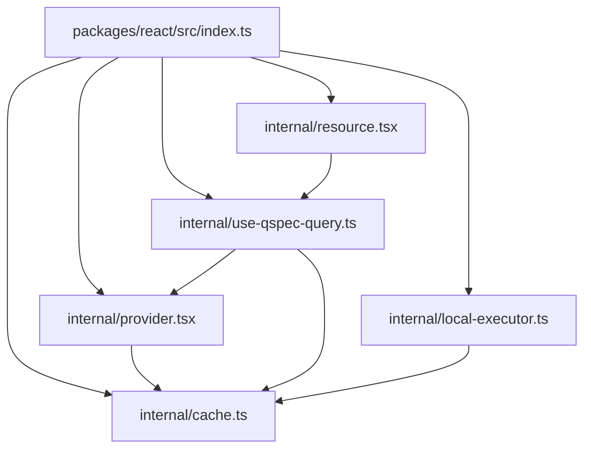
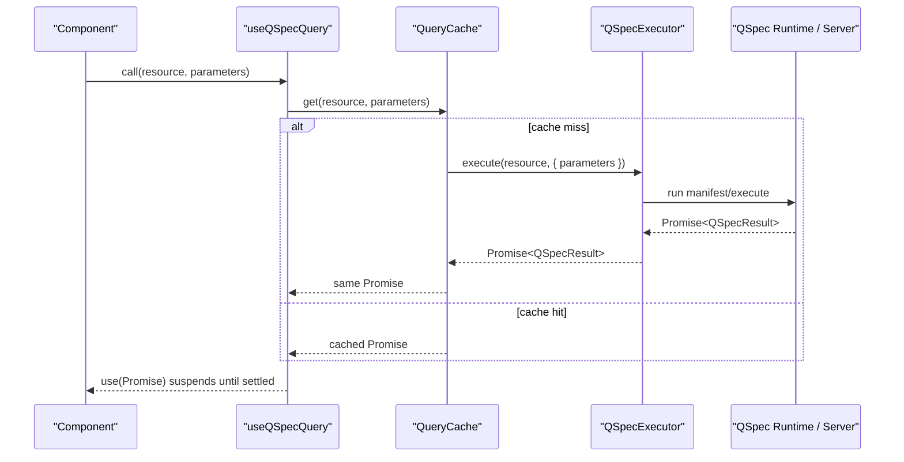
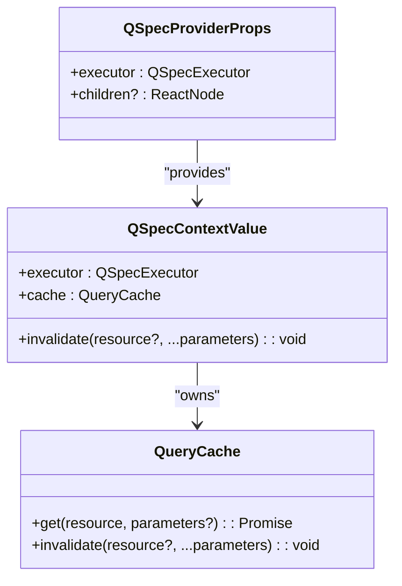
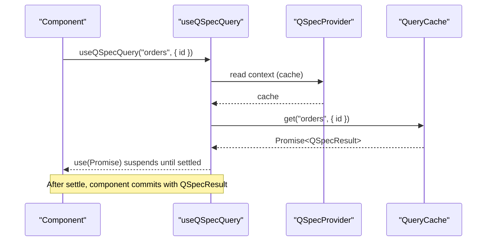
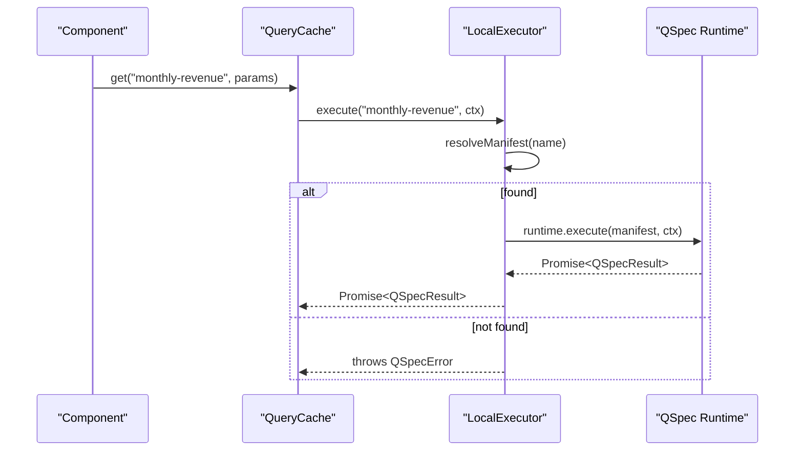
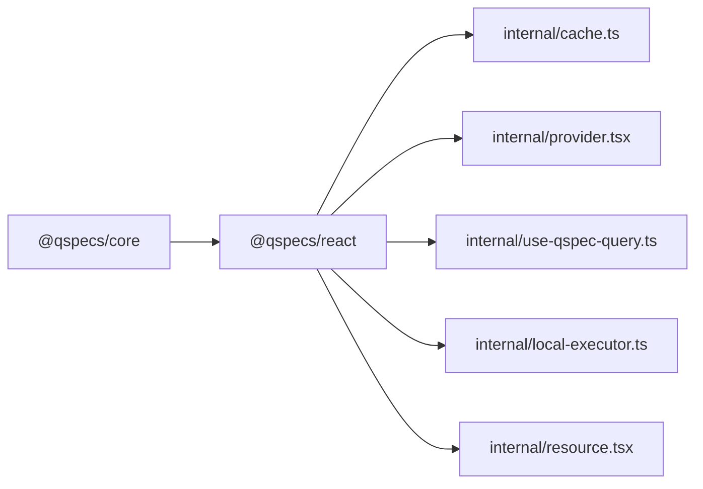

# Cache and Executor Integration

<cite>
**Referenced Files in This Document**
- [index.ts](file://packages/react/src/index.ts)
- [cache.ts](file://packages/react/src/internal/cache.ts)
- [provider.tsx](file://packages/react/src/internal/provider.tsx)
- [use-qspec-query.ts](file://packages/react/src/internal/use-qspec-query.ts)
- [local-executor.ts](file://packages/react/src/internal/local-executor.ts)
- [resource.tsx](file://packages/react/src/internal/resource.tsx)
- [react-integration.md](file://docs/react-integration.md)
- [README.md](file://README.md)
</cite>

## Table of Contents

1. [Introduction](#introduction)
2. [Project Structure](#project-structure)
3. [Core Components](#core-components)
4. [Architecture Overview](#architecture-overview)
5. [Detailed Component Analysis](#detailed-component-analysis)
6. [Dependency Analysis](#dependency-analysis)
7. [Performance Considerations](#performance-considerations)
8. [Troubleshooting Guide](#troubleshooting-guide)
9. [Conclusion](#conclusion)
10. [Appendices](#appendices)

## Introduction

This document explains the query cache system and executor integration in @qspecs/react. It covers how to create isolated caches, implement custom executors, use the local executor for client-side execution, configure invalidation strategies, manage memory, share caches between components, and tune performance. It also documents TypeScript types, error handling, and debugging techniques for cache-related issues.

## Project Structure

@qspecs/react exposes a Suspense-first React binding over a small executor interface and a promise-based query cache. The package’s public surface re-exports the cache, provider, hooks, local executor, and a declarative resource component.

**Diagram sources**

- [index.ts:16-25](file://packages/react/src/index.ts#L16-L25)
- [provider.tsx:1-149](file://packages/react/src/internal/provider.tsx#L1-L149)
- [use-qspec-query.ts:1-71](file://packages/react/src/internal/use-qspec-query.ts#L1-L71)
- [local-executor.ts:1-76](file://packages/react/src/internal/local-executor.ts#L1-L76)
- [resource.tsx:1-59](file://packages/react/src/internal/resource.tsx#L1-L59)

**Section sources**

- [index.ts:16-25](file://packages/react/src/index.ts#L16-L25)
- [react-integration.md:1-202](file://docs/react-integration.md#L1-L202)

## Core Components

- QueryCache and createQueryCache: A promise-backed cache keyed by a canonical serialization of (resource, parameters). It deduplicates concurrent requests, caches rejections until explicit invalidation, and returns the same promise object on repeated calls with equivalent keys.
- QSpecExecutor: A minimal interface that executes a named resource with optional context. Both HTTP and local executors conform to this shape.
- QSpecProvider: Owns one QueryCache per instance, binds an executor once, and exposes invalidate to trigger refetches across consumers.
- Hooks: useQSpecQuery suspends and returns resolved data; useQSpecInvalidate triggers invalidation; useQSpecExecutor exposes the bound executor for non-cached calls.
- LocalExecutor: Resolves a resource name against a fixed manifest registry and executes via a QSpec runtime without HTTP.
- QSpecResource: Declarative wrapper around useQSpecQuery for render-prop usage.

Key behaviors:

- Parameters are compared by content via a stable serializer; fresh objects with equal values do not restart queries.
- Invalidation is granular: clear all, clear a resource, or clear a specific parameter set.
- Rejected promises are cached and not retried automatically; only invalidate clears them.

**Section sources**

- [cache.ts:12-26](file://packages/react/src/internal/cache.ts#L12-L26)
- [cache.ts:49-107](file://packages/react/src/internal/cache.ts#L49-L107)
- [cache.ts:121-174](file://packages/react/src/internal/cache.ts#L121-L174)
- [cache.ts:183-229](file://packages/react/src/internal/cache.ts#L183-L229)
- [provider.tsx:16-20](file://packages/react/src/internal/provider.tsx#L16-L20)
- [provider.tsx:103-149](file://packages/react/src/internal/provider.tsx#L103-L149)
- [use-qspec-query.ts:6-18](file://packages/react/src/internal/use-qspec-query.ts#L6-L18)
- [use-qspec-query.ts:20-47](file://packages/react/src/internal/use-qspec-query.ts#L20-L47)
- [use-qspec-query.ts:49-70](file://packages/react/src/internal/use-qspec-query.ts#L49-L70)
- [local-executor.ts:11-21](file://packages/react/src/internal/local-executor.ts#L11-L21)
- [local-executor.ts:41-75](file://packages/react/src/internal/local-executor.ts#L41-L75)
- [resource.tsx:6-27](file://packages/react/src/internal/resource.tsx#L6-L27)
- [resource.tsx:29-58](file://packages/react/src/internal/resource.tsx#L29-L58)

## Architecture Overview

The cache stores promises keyed by a canonical string derived from resource and parameters. Providers own caches and expose invalidation. Hooks suspend on promises returned by the cache. Executors abstract where data comes from (HTTP or local runtime).

**Diagram sources**

- [use-qspec-query.ts:44-47](file://packages/react/src/internal/use-qspec-query.ts#L44-L47)
- [cache.ts:183-208](file://packages/react/src/internal/cache.ts#L183-L208)
- [local-executor.ts:56-75](file://packages/react/src/internal/local-executor.ts#L56-L75)

## Detailed Component Analysis

### QueryCache and createQueryCache

Responsibilities:

- Canonical key generation for (resource, parameters) using a stable serializer that sorts object keys and handles arrays and nested objects safely.
- Promise identity: store and return the exact same Promise for duplicate keys to satisfy React’s use() contract.
- Concurrency control: only one executor call per unique key even if multiple callers request it simultaneously.
- Error caching: rejections remain cached until explicitly invalidated.
- Granular invalidation: clear all, clear by resource, or clear by exact parameters.

Memory management:

- Uses an internal Map keyed by serialized strings.
- No TTL or size limit is built-in; callers should invalidate when appropriate to prevent unbounded growth.

Complexity:

- Keying and lookup are O(1) average due to Map.
- Serialization cost depends on parameter structure size.

```mermaid
flowchart TD
Start(["get(resource, parameters)"]) --> Key["Compute canonical key"]
Key --> Hit{"Entry exists?"}
Hit --> |Yes| ReturnCached["Return stored Promise"]
Hit --> |No| BuildCtx["Build ExecutionContext if parameters provided"]
BuildCtx --> CallExec["executor.execute(resource, context)"]
CallExec --> Store["Store { resource, promise } in Map"]
Store --> AttachCatch["Attach .catch(() => {}) to avoid unhandledRejection"]
AttachCatch --> ReturnNew["Return new Promise"]
ReturnCached --> End(["Done"])
ReturnNew --> End
```

**Diagram sources**

- [cache.ts:49-107](file://packages/react/src/internal/cache.ts#L49-L107)
- [cache.ts:183-208](file://packages/react/src/internal/cache.ts#L183-L208)

**Section sources**

- [cache.ts:49-107](file://packages/react/src/internal/cache.ts#L49-L107)
- [cache.ts:121-174](file://packages/react/src/internal/cache.ts#L121-L174)
- [cache.ts:183-229](file://packages/react/src/internal/cache.ts#L183-L229)

### QSpecProvider and Context

Responsibilities:

- Owns a single QueryCache per instance, created once via useState initializer to preserve promise identity across renders.
- Binds the executor once; changing the executor prop without a key change logs a development warning and ignores the new executor.
- Exposes invalidate that both drops entries and forces a re-render so consumers can observe changes.

Error handling:

- Throws a clear message when hooks are used outside QSpecProvider.

**Diagram sources**

- [provider.tsx:16-20](file://packages/react/src/internal/provider.tsx#L16-L20)
- [provider.tsx:103-149](file://packages/react/src/internal/provider.tsx#L103-L149)
- [cache.ts:121-174](file://packages/react/src/internal/cache.ts#L121-L174)

**Section sources**

- [provider.tsx:22-74](file://packages/react/src/internal/provider.tsx#L22-L74)
- [provider.tsx:103-149](file://packages/react/src/internal/provider.tsx#L103-L149)

### Hooks: useQSpecQuery, useQSpecInvalidate, useQSpecExecutor

- useQSpecQuery: Suspends on the promise returned by cache.get and returns the resolved result directly. Parameters are compared by content via the cache’s serializer.
- useQSpecInvalidate: Returns an invalidate function bound to the provider’s cache; calling it drops matching entries and triggers a re-render of consumers.
- useQSpecExecutor: Returns the bound executor for one-off executions outside the cache.

**Diagram sources**

- [use-qspec-query.ts:20-47](file://packages/react/src/internal/use-qspec-query.ts#L20-L47)
- [provider.tsx:138-149](file://packages/react/src/internal/provider.tsx#L138-L149)

**Section sources**

- [use-qspec-query.ts:6-18](file://packages/react/src/internal/use-qspec-query.ts#L6-L18)
- [use-qspec-query.ts:20-47](file://packages/react/src/internal/use-qspec-query.ts#L20-L47)
- [use-qspec-query.ts:49-70](file://packages/react/src/internal/use-qspec-query.ts#L49-L70)

### LocalExecutor: Client-Side Execution

Resolves a resource name against a fixed registry and executes via a QSpec runtime without HTTP. Unknown resources throw a generic error without enumerating available names.

**Diagram sources**

- [local-executor.ts:34-39](file://packages/react/src/internal/local-executor.ts#L34-L39)
- [local-executor.ts:56-75](file://packages/react/src/internal/local-executor.ts#L56-L75)

**Section sources**

- [local-executor.ts:11-21](file://packages/react/src/internal/local-executor.ts#L11-L21)
- [local-executor.ts:41-75](file://packages/react/src/internal/local-executor.ts#L41-L75)

### QSpecResource: Declarative Wrapper

A thin wrapper around useQSpecQuery that takes resource, parameters, and a render prop. It does not provide its own Suspense fallback or error boundary; callers must wrap appropriately.

**Section sources**

- [resource.tsx:6-27](file://packages/react/src/internal/resource.tsx#L6-L27)
- [resource.tsx:29-58](file://packages/react/src/internal/resource.tsx#L29-L58)

## Dependency Analysis

- @qspecs/react depends only on @qspecs/core (types and QSpecError at runtime) and react (peer).
- The executor interface is redeclared locally to avoid pulling in transport packages.
- Provider owns a QueryCache; hooks depend on provider context; local executor depends on core runtime.

**Diagram sources**

- [index.ts:16-25](file://packages/react/src/index.ts#L16-L25)
- [cache.ts:1-14](file://packages/react/src/internal/cache.ts#L1-L14)
- [local-executor.ts:1-9](file://packages/react/src/internal/local-executor.ts#L1-L9)

**Section sources**

- [index.ts:16-25](file://packages/react/src/index.ts#L16-L25)
- [react-integration.md:145-177](file://docs/react-integration.md#L145-L177)

## Performance Considerations

- Promise identity is critical: storing and returning the same Promise ensures React’s use() does not re-suspend.
- Parameter comparison by content avoids unnecessary refetches when object identity changes but values do not.
- Avoid recreating providers with different executor identities unless you intend a full reset; use a key prop to force remounting when needed.
- Use targeted invalidation to minimize refetch scope.
- Be mindful of cache size: there is no built-in TTL or eviction policy; invalidate aggressively when data becomes stale.

[No sources needed since this section provides general guidance]

## Troubleshooting Guide

Common issues and resolutions:

- Calling hooks outside QSpecProvider: throws a clear error naming the hook; wrap your tree in QSpecProvider.
- Infinite suspension loop: caused by returning a new Promise on each render; ensure the cache returns the same Promise for identical keys (this is guaranteed by createQueryCache).
- Unhandled promise rejections: the cache attaches a catch handler to stored promises to avoid noise; still handle errors in your UI via error boundaries.
- Executor prop changes ignored: QSpecProvider binds the executor once; changing the prop without a key change logs a warning and ignores the new executor. To swap, give the provider a new key.
- Unknown resource name (local executor): throws a generic error; verify the resource is registered in the manifests map.

**Section sources**

- [provider.tsx:22-74](file://packages/react/src/internal/provider.tsx#L22-L74)
- [provider.tsx:115-136](file://packages/react/src/internal/provider.tsx#L115-L136)
- [cache.ts:196-205](file://packages/react/src/internal/cache.ts#L196-L205)
- [local-executor.ts:61-71](file://packages/react/src/internal/local-executor.ts#L61-L71)
- [react-integration.md:131-143](file://docs/react-integration.md#L131-L143)

## Conclusion

@qspecs/react provides a minimal, robust foundation for query caching and execution in React applications. By separating concerns into a small executor interface, a promise-based cache, and a provider-driven context, it enables flexible backends, precise invalidation, and predictable rendering behavior under Suspense. For production systems, pair targeted invalidation with thoughtful cache sizing and proper error boundaries to achieve reliable, performant data fetching.

[No sources needed since this section summarizes without analyzing specific files]

## Appendices

### API Reference Summary

- createQueryCache(executor): Creates an isolated QueryCache bound to the given executor.
- QueryCache:
  - get(resource, parameters?): Returns a Promise<QSpecResult>, deduplicating concurrent calls and caching rejections until invalidation.
  - invalidate(resource?, ...parameters?): Clears cache entries with granularity: all, by resource, or by exact parameters.
- QSpecExecutor:
  - execute(resource, context?): Executes a named resource with optional context.
- QSpecProvider(props): Provides executor, cache, and invalidate to descendants; owns one cache per instance.
- Hooks:
  - useQSpecQuery(resource, parameters?): Suspends and returns QSpecResult.
  - useQSpecInvalidate(): Returns invalidate bound to the provider’s cache.
  - useQSpecExecutor(): Returns the bound executor for non-cached calls.
- createLocalExecutor(runtime, manifests): Builds a QSpecExecutor that resolves resource names against a fixed registry and executes via a QSpec runtime.
- QSpecResource(props): Declarative wrapper around useQSpecQuery.

**Section sources**

- [cache.ts:12-26](file://packages/react/src/internal/cache.ts#L12-L26)
- [cache.ts:121-174](file://packages/react/src/internal/cache.ts#L121-L174)
- [cache.ts:183-229](file://packages/react/src/internal/cache.ts#L183-L229)
- [provider.tsx:103-149](file://packages/react/src/internal/provider.tsx#L103-L149)
- [use-qspec-query.ts:6-70](file://packages/react/src/internal/use-qspec-query.ts#L6-L70)
- [local-executor.ts:56-75](file://packages/react/src/internal/local-executor.ts#L56-L75)
- [resource.tsx:6-58](file://packages/react/src/internal/resource.tsx#L6-L58)

### Examples and Usage Patterns

- Cache sharing between components: Wrap your app in a single QSpecProvider; all descendant components share the same cache and will deduplicate reads automatically.
- Custom cache backend: Implement QSpecExecutor to wrap any transport (e.g., fetch-based HTTP executor) and pass it to QSpecProvider or createQueryCache directly.
- Performance tuning: Prefer targeted invalidation, avoid recreating providers unnecessarily, and rely on content-based parameter comparison to prevent redundant fetches.

**Section sources**

- [react-integration.md:55-71](file://docs/react-integration.md#L55-L71)
- [react-integration.md:86-103](file://docs/react-integration.md#L86-L103)
- [README.md:138-181](file://README.md#L138-L181)
