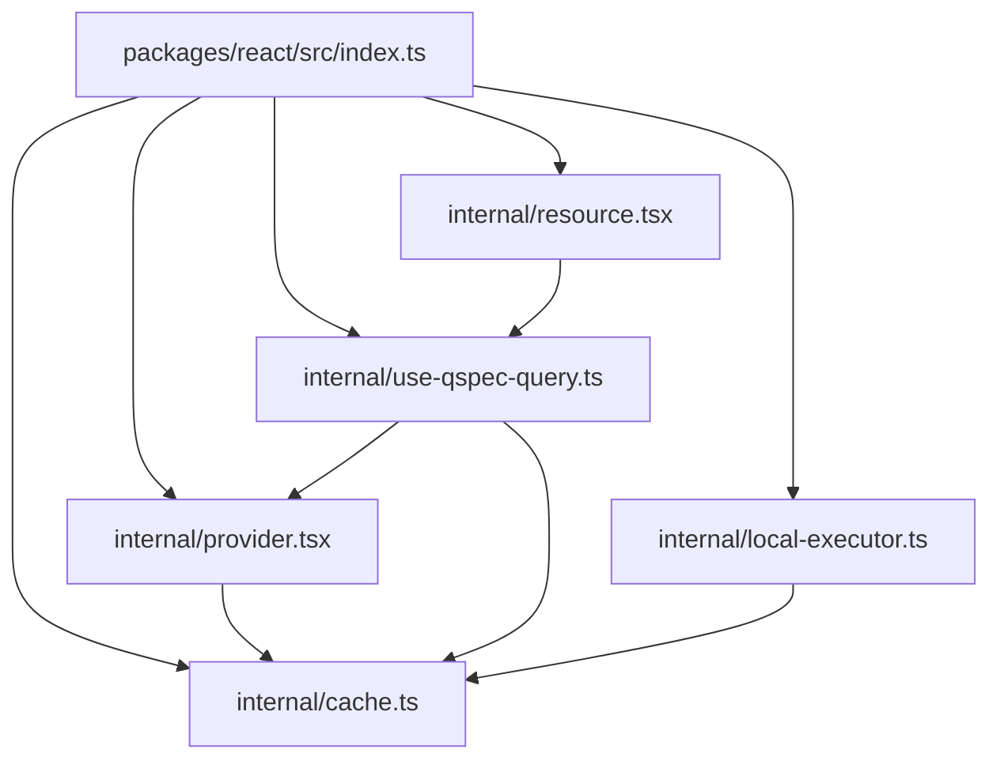
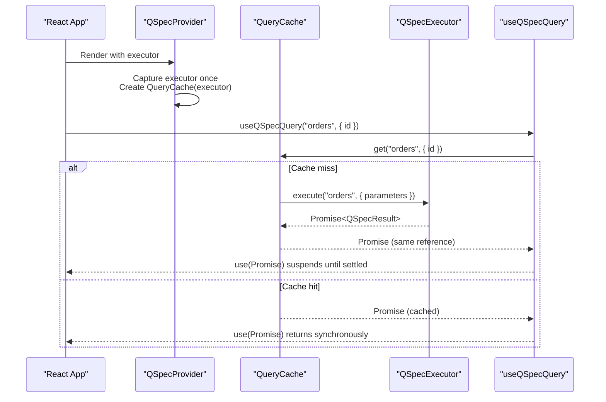
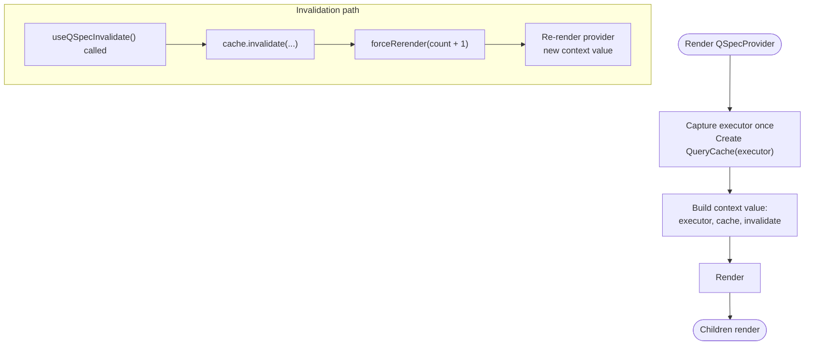
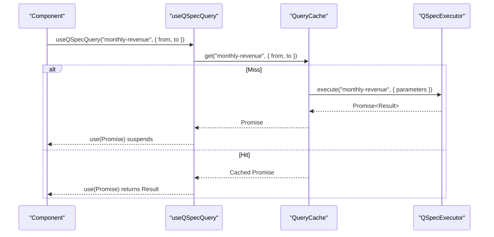
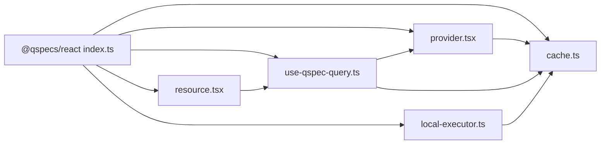

# QSpecProvider Component

<cite>
**Referenced Files in This Document**
- [provider.tsx](file://packages/react/src/internal/provider.tsx)
- [use-qspec-query.ts](file://packages/react/src/internal/use-qspec-query.ts)
- [cache.ts](file://packages/react/src/internal/cache.ts)
- [local-executor.ts](file://packages/react/src/internal/local-executor.ts)
- [resource.tsx](file://packages/react/src/internal/resource.tsx)
- [index.ts](file://packages/react/src/index.ts)
- [react-integration.md](file://docs/react-integration.md)
</cite>

## Table of Contents

1. Introduction
2. Project Structure
3. Core Components
4. Architecture Overview
5. Detailed Component Analysis
6. Dependency Analysis
7. Performance Considerations
8. Troubleshooting Guide
9. Conclusion
10. Appendices

## Introduction

This document explains how to configure and wrap React applications with the QSpecProvider component from @qspecs/react to provide QSpec instances throughout a component tree. It covers all provider props, executor configuration, cache behavior, error handling patterns, TypeScript support, prop validation, and best practices for composing providers in complex applications. It also documents related hooks and the declarative resource wrapper that work together with the provider.

QSpecProvider is a Suspense-first integration: it owns a query cache bound to an executor, exposes hooks to read data via use(), and invalidates entries imperatively when needed. Errors are surfaced by rethrowing through use() so nearest error boundaries handle them; loading states are represented by Suspense fallbacks rather than hook return values.

## Project Structure

The React package exposes a small, focused surface centered around a provider, hooks, a cache, and two execution strategies (local and HTTP). The public entry marks exports as client-only for bundlers that understand React Server Components.

**Diagram sources**

- [index.ts:16-25](file://packages/react/src/index.ts#L16-L25)
- [provider.tsx:1-20](file://packages/react/src/internal/provider.tsx#L1-L20)
- [use-qspec-query.ts:1-10](file://packages/react/src/internal/use-qspec-query.ts#L1-L10)
- [cache.ts:1-15](file://packages/react/src/internal/cache.ts#L1-L15)
- [local-executor.ts:1-10](file://packages/react/src/internal/local-executor.ts#L1-L10)
- [resource.tsx:1-10](file://packages/react/src/internal/resource.tsx#L1-L10)

**Section sources**

- [index.ts:1-26](file://packages/react/src/index.ts#L1-L26)
- [react-integration.md:55-71](file://docs/react-integration.md#L55-L71)

## Core Components

- QSpecProvider: Owns a QueryCache bound to an executor and exposes context for hooks. Captures the executor once per instance and warns in development if the prop identity changes without a key change.
- useQSpecExecutor: Returns the bound executor for one-off executions outside the cache.
- useQSpecQuery: Suspends on a resource/parameters pair and returns the resolved result directly. Parameters are compared by content for caching.
- useQSpecInvalidate: Imperatively clears cached entries and triggers re-renders under the provider.
- createLocalExecutor: Builds an executor that resolves resource names against a fixed manifest registry and executes via a QSpec runtime.
- QSpecResource: Declarative render-prop wrapper over useQSpecQuery that intentionally does not include its own Suspense or error boundary.

Key behaviors:

- Executor capture: The executor is captured on first render and never re-read during the provider’s lifetime. To swap executors, remount the provider with a new key.
- Cache semantics: Stores promises keyed by a canonical serialization of (resource, parameters). Rejections are cached until invalidated.
- Error model: Errors thrown by use() propagate to the nearest error boundary; there is no error field in hook return values.
- Loading model: Components either suspend (showing a Suspense fallback) or commit with data; no loading flag is returned.

**Section sources**

- [provider.tsx:30-56](file://packages/react/src/internal/provider.tsx#L30-L56)
- [provider.tsx:76-149](file://packages/react/src/internal/provider.tsx#L76-L149)
- [use-qspec-query.ts:6-18](file://packages/react/src/internal/use-qspec-query.ts#L6-L18)
- [use-qspec-query.ts:20-47](file://packages/react/src/internal/use-qspec-query.ts#L20-L47)
- [use-qspec-query.ts:49-70](file://packages/react/src/internal/use-qspec-query.ts#L49-L70)
- [cache.ts:109-174](file://packages/react/src/internal/cache.ts#L109-L174)
- [local-executor.ts:41-75](file://packages/react/src/internal/local-executor.ts#L41-L75)
- [resource.tsx:6-27](file://packages/react/src/internal/resource.tsx#L6-L27)
- [resource.tsx:29-58](file://packages/react/src/internal/resource.tsx#L29-L58)

## Architecture Overview

The provider composes a cache and an executor seam. Hooks read from context and use React’s use() to suspend on promises returned by the cache. Invalidations trigger a state bump to re-render descendants, which then re-evaluate their queries against the cache.

**Diagram sources**

- [provider.tsx:103-149](file://packages/react/src/internal/provider.tsx#L103-L149)
- [use-qspec-query.ts:44-47](file://packages/react/src/internal/use-qspec-query.ts#L44-L47)
- [cache.ts:183-208](file://packages/react/src/internal/cache.ts#L183-L208)

## Detailed Component Analysis

### QSpecProvider

Responsibilities:

- Owns a single QueryCache for its lifetime, created from the provided executor.
- Captures the executor once and warns in development if the executor prop identity changes without a key change.
- Exposes invalidate that both clears cache entries and forces a re-render of consumers via a local state bump.

Props:

- executor: Required. The client-side executor implementing execute(resource, context). Captured once per provider instance.
- children: Optional. ReactNode subtree consuming the provider.

Behavioral notes:

- Do not recreate the executor object on every render unless you intend to remount the provider with a new key.
- Invalidate is memoized and delegates to the underlying cache; after invalidation, any consumer calling useQSpecQuery will re-suspend if its entry was cleared.

**Diagram sources**

- [provider.tsx:103-149](file://packages/react/src/internal/provider.tsx#L103-L149)

**Section sources**

- [provider.tsx:30-56](file://packages/react/src/internal/provider.tsx#L30-L56)
- [provider.tsx:76-149](file://packages/react/src/internal/provider.tsx#L76-L149)

### useQSpecQuery

Suspends on a resource/parameters pair and returns the resolved QSpecResult directly. Parameters are compared by content for cache keys. Errors are thrown out of use() to the nearest error boundary.

Usage pattern:

- Wrap calls in <Suspense> for loading states.
- Wrap in an error boundary to handle errors.
- Use useQSpecInvalidate to force refetches.

**Diagram sources**

- [use-qspec-query.ts:20-47](file://packages/react/src/internal/use-qspec-query.ts#L20-L47)
- [cache.ts:183-208](file://packages/react/src/internal/cache.ts#L183-L208)

**Section sources**

- [use-qspec-query.ts:20-47](file://packages/react/src/internal/use-qspec-query.ts#L20-L47)
- [react-integration.md:73-103](file://docs/react-integration.md#L73-L103)

### useQSpecInvalidate

Returns an imperative function identical to QueryCache.invalidate:

- No arguments: clear all entries.
- One argument: clear all entries for a resource.
- Two arguments: clear exactly one entry matching resource and parameters.

Calling it drops matching cache entries and forces re-renders under the provider; consumers whose queries were dropped will re-suspend and refetch.

**Section sources**

- [use-qspec-query.ts:49-70](file://packages/react/src/internal/use-qspec-query.ts#L49-L70)
- [cache.ts:146-174](file://packages/react/src/internal/cache.ts#L146-L174)
- [provider.tsx:138-144](file://packages/react/src/internal/provider.tsx#L138-L144)

### createLocalExecutor

Provides an in-process executor backed by a QSpec runtime and a fixed registry of manifests. Resolves resource names safely using Object.hasOwn and rejects unknown resources with a generic error.

Use cases:

- Electron apps, Node scripts rendering to strings, tests, or any host where UI and runtime share a process.

**Section sources**

- [local-executor.ts:41-75](file://packages/react/src/internal/local-executor.ts#L41-L75)

### QSpecResource

A thin declarative wrapper over useQSpecQuery that takes resource, parameters, and a render-prop child receiving the resolved result. It intentionally does not include its own Suspense fallback or error boundary; callers must wrap it appropriately.

**Section sources**

- [resource.tsx:6-27](file://packages/react/src/internal/resource.tsx#L6-L27)
- [resource.tsx:29-58](file://packages/react/src/internal/resource.tsx#L29-L58)

## Dependency Analysis

The React package depends only on React and @qspecs/core types at compile time. It redeclares the executor interface to avoid importing transport packages, keeping the package browser-safe and testable.

**Diagram sources**

- [index.ts:16-25](file://packages/react/src/index.ts#L16-L25)
- [provider.tsx:1-20](file://packages/react/src/internal/provider.tsx#L1-L20)
- [use-qspec-query.ts:1-10](file://packages/react/src/internal/use-qspec-query.ts#L1-L10)
- [cache.ts:1-15](file://packages/react/src/internal/cache.ts#L1-L15)
- [local-executor.ts:1-10](file://packages/react/src/internal/local-executor.ts#L1-L10)
- [resource.tsx:1-10](file://packages/react/src/internal/resource.tsx#L1-L10)

**Section sources**

- [cache.ts:1-15](file://packages/react/src/internal/cache.ts#L1-L15)
- [react-integration.md:145-177](file://docs/react-integration.md#L145-L177)

## Performance Considerations

- Executor stability: Create the executor once and pass the same reference to QSpecProvider. If you must replace credentials or endpoints, remount the provider with a new key instead of changing the prop identity.
- Parameter objects: Pass fresh parameter objects freely; the cache compares by content, not by reference. Only changes in serialized values cause refetches.
- Promise identity: The cache stores promise references to satisfy React’s use() contract. Avoid wrapping results in new promises; rely on the cache’s get().
- Invalidation granularity: Prefer targeted invalidations (resource or exact parameters) to minimize unnecessary refetches.
- Suspense boundaries: Place Suspense at appropriate scopes to control fallback granularity and perceived performance.

[No sources needed since this section provides general guidance]

## Troubleshooting Guide

Common issues and resolutions:

- Calling hooks outside QSpecProvider: Throws a clear error naming the hook. Ensure your tree is wrapped in QSpecProvider.
- Executor prop changed but nothing updated: The provider captures the executor once per instance. To swap, give the provider element a new key.
- Infinite suspension loop: Caused by returning a new promise each render. The cache ensures the same promise reference is returned for the same key; do not bypass the cache.
- Unhandled rejections: The cache attaches a catch handler to stored promises to avoid unhandledRejection noise; ensure your components consume the promise via use() or attach proper error handling.
- Unknown resource name: createLocalExecutor throws a generic error for unregistered names. Verify your manifest registry includes the requested resource.

**Section sources**

- [provider.tsx:66-74](file://packages/react/src/internal/provider.tsx#L66-L74)
- [provider.tsx:122-136](file://packages/react/src/internal/provider.tsx#L122-L136)
- [cache.ts:183-208](file://packages/react/src/internal/cache.ts#L183-L208)
- [local-executor.ts:61-72](file://packages/react/src/internal/local-executor.ts#L61-L72)

## Conclusion

QSpecProvider enables a clean, Suspense-first integration for QSpec in React applications. By providing a stable executor, leveraging content-based parameter caching, and surfacing errors through error boundaries, it offers predictable performance and developer ergonomics. For complex apps, compose providers carefully, prefer targeted invalidations, and keep executor lifetimes stable or explicitly reset via keys.

[No sources needed since this section summarizes without analyzing specific files]

## Appendices

### Basic Setup

- Wrap your app with QSpecProvider and supply an executor:
  - For HTTP: create an HTTP-backed executor and pass it to QSpecProvider.
  - For local execution: create a local executor with a QSpec runtime and manifest registry.
- Use useQSpecQuery inside components to fetch data; wrap with Suspense and an error boundary.
- Use QSpecResource for a declarative render-prop style.

**Section sources**

- [react-integration.md:55-71](file://docs/react-integration.md#L55-L71)
- [react-integration.md:73-103](file://docs/react-integration.md#L73-L103)
- [react-integration.md:105-129](file://docs/react-integration.md#L105-L129)

### Advanced Configuration Patterns

- Swap executors: Remount QSpecProvider with a new key to fully reset cache and bindings.
- Fine-grained invalidation: Use useQSpecInvalidate with zero, one, or two arguments to clear all, a resource, or a specific entry.
- Composition: Nest multiple providers only if necessary; typically one provider per application root suffices.

**Section sources**

- [provider.tsx:103-149](file://packages/react/src/internal/provider.tsx#L103-L149)
- [use-qspec-query.ts:49-70](file://packages/react/src/internal/use-qspec-query.ts#L49-L70)

### Integration With Different Execution Strategies

- Local strategy: createLocalExecutor binds a QSpec runtime and manifest registry for same-process scenarios.
- HTTP strategy: use an HTTP executor (from @qspecs/http) to call a server running a QSpec handler.
- Test doubles: Implement the same executor interface to stub responses in tests.

**Section sources**

- [local-executor.ts:41-75](file://packages/react/src/internal/local-executor.ts#L41-L75)
- [react-integration.md:145-177](file://docs/react-integration.md#L145-L177)

### TypeScript Support and Prop Validation

- All public APIs are typed: QSpecProviderProps, QSpecResourceProps, QueryParameters, QSpecExecutor, and QSpecResult are exported or available via imports.
- Props are validated by TypeScript at compile time; runtime checks throw explicit errors when hooks are used outside a provider.
- The package is marked "use client" to signal client-only usage to bundlers supporting React Server Components.

**Section sources**

- [index.ts:16-25](file://packages/react/src/index.ts#L16-L25)
- [provider.tsx:30-56](file://packages/react/src/internal/provider.tsx#L30-L56)
- [resource.tsx:6-27](file://packages/react/src/internal/resource.tsx#L6-L27)
- [cache.ts:12-27](file://packages/react/src/internal/cache.ts#L12-L27)

### Best Practices for Provider Composition

- Single source of truth: Prefer one QSpecProvider at the app root to avoid multiple caches and inconsistent executor bindings.
- Stable executor references: Memoize or hoist executor creation; if credentials change, remount the provider with a new key.
- Boundary placement: Place <Suspense> and error boundaries around logical sections of the UI to control loading and error surfaces.
- Targeted invalidation: Invalidate only what changed to reduce unnecessary refetches and re-renders.

**Section sources**

- [provider.tsx:103-149](file://packages/react/src/internal/provider.tsx#L103-L149)
- [react-integration.md:105-129](file://docs/react-integration.md#L105-L129)
