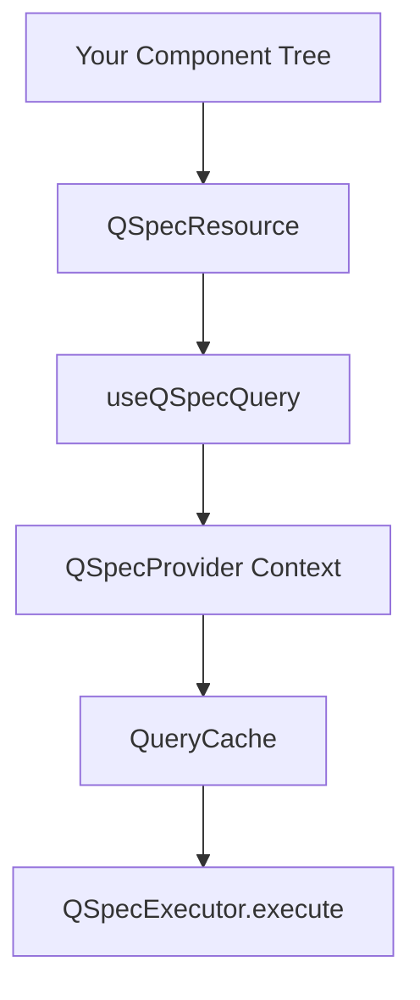
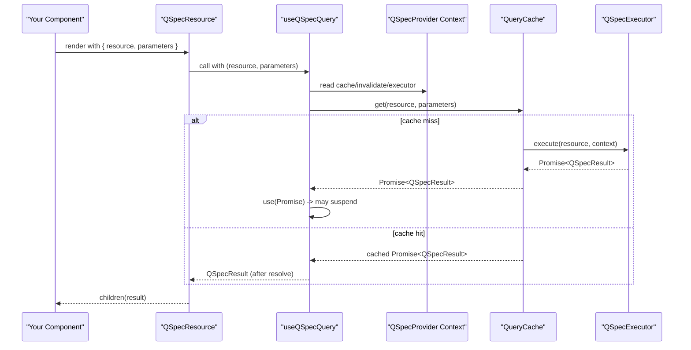
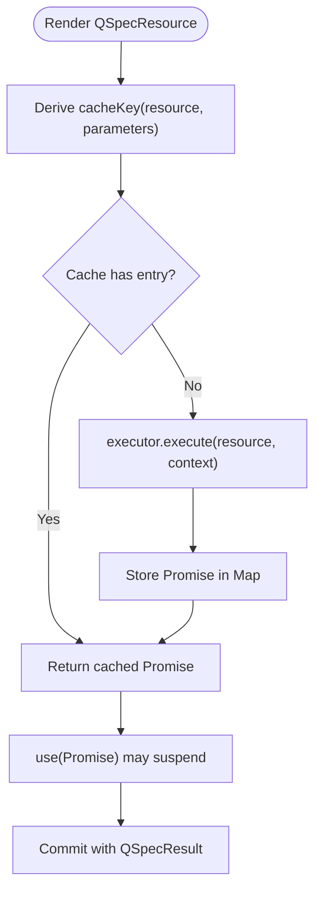
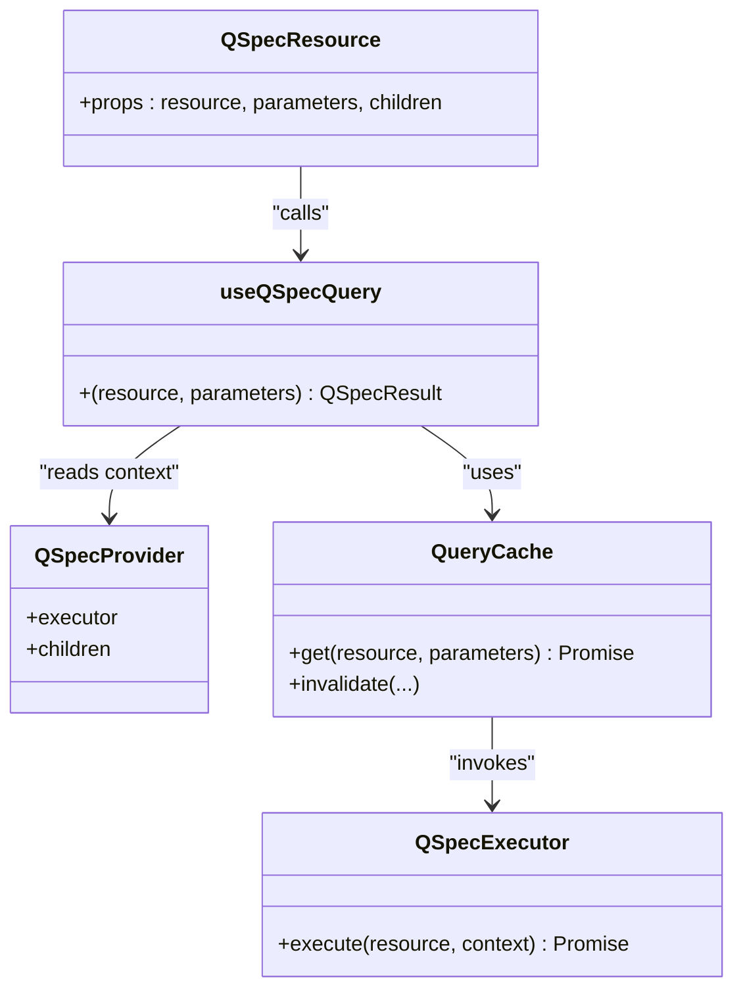

# QSpecResource Component

<cite>
**Referenced Files in This Document**
- [resource.tsx](file://packages/react/src/internal/resource.tsx)
- [use-qspec-query.ts](file://packages/react/src/internal/use-qspec-query.ts)
- [cache.ts](file://packages/react/src/internal/cache.ts)
- [provider.tsx](file://packages/react/src/internal/provider.tsx)
- [index.ts](file://packages/react/src/index.ts)
- [react-integration.md](file://docs/react-integration.md)
- [resource.test.tsx](file://packages/react/src/internal/resource.test.tsx)
</cite>

## Table of Contents

1. [Introduction](#introduction)
2. [Project Structure](#project-structure)
3. [Core Components](#core-components)
4. [Architecture Overview](#architecture-overview)
5. [Detailed Component Analysis](#detailed-component-analysis)
6. [Dependency Analysis](#dependency-analysis)
7. [Performance Considerations](#performance-considerations)
8. [Troubleshooting Guide](#troubleshooting-guide)
9. [Conclusion](#conclusion)
10. [Appendices](#appendices)

## Introduction

QSpecResource is a declarative, render-prop wrapper that displays the result of a QSpec query using React’s Suspense-first model. It takes a resource name and optional parameters, suspends while data is loading, and renders its child function with the resolved QSpecResult once available. Errors are not handled inside the component; they propagate to an enclosing error boundary. Loading and error states are managed by your own Suspense fallback and error boundary, which gives you full control over granularity and presentation.

This component intentionally does not return loading or error flags. Instead:

- While a query is in flight, the component tree suspends and shows whatever Suspense fallback you provide.
- When the query resolves, the render-prop receives the QSpecResult.
- If the query rejects, the error propagates to the nearest error boundary.

The design aligns with React 19’s use() semantics and a promise-based cache that guarantees stable promise identity for the same (resource, parameters) key.

**Section sources**

- [react-integration.md:105-129](file://docs/react-integration.md#L105-L129)
- [resource.tsx:29-58](file://packages/react/src/internal/resource.tsx#L29-L58)

## Project Structure

At a high level, QSpecResource sits on top of a small set of internal modules:

- A provider that owns a QueryCache and executor context.
- A hook that reads from the cache via React’s use().
- A cache that stores promises keyed by a canonical serialization of (resource, parameters).
- The QSpecResource component itself, which delegates to the hook and invokes the render-prop.

**Diagram sources**

- [resource.tsx:55-57](file://packages/react/src/internal/resource.tsx#L55-L57)
- [use-qspec-query.ts:44-47](file://packages/react/src/internal/use-qspec-query.ts#L44-L47)
- [provider.tsx:103-148](file://packages/react/src/internal/provider.tsx#L103-L148)
- [cache.ts:183-208](file://packages/react/src/internal/cache.ts#L183-L208)

**Section sources**

- [index.ts:16-25](file://packages/react/src/index.ts#L16-L25)
- [provider.tsx:103-148](file://packages/react/src/internal/provider.tsx#L103-L148)
- [use-qspec-query.ts:44-47](file://packages/react/src/internal/use-qspec-query.ts#L44-L47)
- [cache.ts:183-208](file://packages/react/src/internal/cache.ts#L183-L208)

## Core Components

- QSpecResource: Declarative render-prop wrapper around useQSpecQuery. Props include resource, parameters, and a children function receiving QSpecResult.
- useQSpecQuery: Hook that returns QSpecResult directly, suspending as needed. Parameters are compared by content for caching.
- QueryCache: Stores promises keyed by a canonical string derived from (resource, parameters), with invalidate support.
- QSpecProvider: Provides executor, cache, and invalidate to descendants; ensures stable executor binding per instance.

Key behaviors:

- No built-in loading or error state: rely on Suspense fallback and error boundaries.
- Content-based parameter comparison avoids refetch loops when passing fresh object literals.
- Promise identity is preserved so React can suspend reliably.

**Section sources**

- [resource.tsx:6-27](file://packages/react/src/internal/resource.tsx#L6-L27)
- [use-qspec-query.ts:20-47](file://packages/react/src/internal/use-qspec-query.ts#L20-L47)
- [cache.ts:28-51](file://packages/react/src/internal/cache.ts#L28-L51)
- [provider.tsx:30-55](file://packages/react/src/internal/provider.tsx#L30-L55)

## Architecture Overview

The runtime flow for rendering a QSpecResource:

**Diagram sources**

- [resource.tsx:55-57](file://packages/react/src/internal/resource.tsx#L55-L57)
- [use-qspec-query.ts:44-47](file://packages/react/src/internal/use-qspec-query.ts#L44-L47)
- [cache.ts:183-208](file://packages/react/src/internal/cache.ts#L183-L208)
- [provider.tsx:103-148](file://packages/react/src/internal/provider.tsx#L103-L148)

## Detailed Component Analysis

### QSpecResource API

Props:

- resource: string — The named resource to fetch. Passed through to the underlying hook and used to build the cache key.
- parameters?: QueryParameters — Optional parameters. Compared by content, not reference, so fresh object literals do not trigger refetches if values are unchanged.
- children: (result: QSpecResult) => ReactNode — Render prop invoked with the resolved QSpecResult after the component commits. Never called with loading or error placeholders.

Behavior:

- Suspends while the query is in flight; show your Suspense fallback.
- Re-throws errors to the nearest error boundary; no built-in error handling.
- Delegates all caching and execution to useQSpecQuery and QueryCache.

Usage pattern:

- Wrap QSpecResource in <Suspense> for loading states.
- Wrap in an error boundary for error states.
- Provide QSpecProvider at a higher level with an executor.

Example references:

- Basic usage with Suspense and ErrorBoundary: see [react-integration.md:107-115](file://docs/react-integration.md#L107-L115)
- Test demonstrating suspension and resolution: see [resource.test.tsx:134-156](file://packages/react/src/internal/resource.test.tsx#L134-L156)

**Section sources**

- [resource.tsx:6-27](file://packages/react/src/internal/resource.tsx#L6-L27)
- [resource.tsx:29-58](file://packages/react/src/internal/resource.tsx#L29-L58)
- [react-integration.md:105-129](file://docs/react-integration.md#L105-L129)
- [resource.test.tsx:134-156](file://packages/react/src/internal/resource.test.tsx#L134-L156)

### Rendering Patterns and Examples

- Simple data display:
  - Use QSpecResource with a render-prop to access QSpecResult and render fields/rows. See test helper for reading values: [resource.test.tsx:82-87](file://packages/react/src/internal/resource.test.tsx#L82-L87)

- Conditional rendering:
  - Branch based on QSpecResult.data.rows length or specific field presence within the render-prop. Since there is no loading/error state here, handle those outside with Suspense and error boundaries.

- Integration with UI libraries:
  - Pass QSpecResult to charting or table components. For example, integrate with recharts or any library that consumes tabular data from QSpecResult. The integration guide explains how @qspecs/recharts consumes QSpecResult; adapt similarly for other libraries. See [react-integration.md:3-10](file://docs/react-integration.md#L3-L10)

- Using invalidate to refresh:
  - Call useQSpecInvalidate to drop cache entries and force refetch across components. See [use-qspec-query.ts:49-69](file://packages/react/src/internal/use-qspec-query.ts#L49-L69)

**Section sources**

- [resource.test.tsx:82-87](file://packages/react/src/internal/resource.test.tsx#L82-L87)
- [react-integration.md:3-10](file://docs/react-integration.md#L3-L10)
- [use-qspec-query.ts:49-69](file://packages/react/src/internal/use-qspec-query.ts#L49-L69)

### Data Flow and Caching Details

- Cache key derivation:
  - Uses a deterministic serialization of (resource, parameters) to ensure identical queries map to the same promise. See [cache.ts:28-51](file://packages/react/src/internal/cache.ts#L28-L51)
- Promise storage:
  - Stores the actual Promise<QSpecResult>, not just results, to satisfy React’s use() requirement for stable promise identity. See [cache.ts:109-120](file://packages/react/src/internal/cache.ts#L109-L120)
- Invalidation:
  - Supports clearing all, by resource, or by exact (resource, parameters). See [cache.ts:146-174](file://packages/react/src/internal/cache.ts#L146-L174)

**Diagram sources**

- [cache.ts:28-51](file://packages/react/src/internal/cache.ts#L28-L51)
- [cache.ts:183-208](file://packages/react/src/internal/cache.ts#L183-L208)
- [use-qspec-query.ts:44-47](file://packages/react/src/internal/use-qspec-query.ts#L44-L47)

**Section sources**

- [cache.ts:28-51](file://packages/react/src/internal/cache.ts#L28-L51)
- [cache.ts:109-120](file://packages/react/src/internal/cache.ts#L109-L120)
- [cache.ts:146-174](file://packages/react/src/internal/cache.ts#L146-L174)
- [use-qspec-query.ts:44-47](file://packages/react/src/internal/use-qspec-query.ts#L44-L47)

## Dependency Analysis

QSpecResource depends on:

- useQSpecQuery for fetching and suspending behavior.
- QSpecProvider context for executor, cache, and invalidate.
- QueryCache for promise identity and invalidation.
- QSpecExecutor interface for transport abstraction (HTTP or local).

**Diagram sources**

- [resource.tsx:55-57](file://packages/react/src/internal/resource.tsx#L55-L57)
- [use-qspec-query.ts:44-47](file://packages/react/src/internal/use-qspec-query.ts#L44-L47)
- [provider.tsx:103-148](file://packages/react/src/internal/provider.tsx#L103-L148)
- [cache.ts:183-208](file://packages/react/src/internal/cache.ts#L183-L208)

**Section sources**

- [index.ts:16-25](file://packages/react/src/index.ts#L16-L25)
- [provider.tsx:103-148](file://packages/react/src/internal/provider.tsx#L103-L148)
- [use-qspec-query.ts:44-47](file://packages/react/src/internal/use-qspec-query.ts#L44-L47)
- [cache.ts:183-208](file://packages/react/src/internal/cache.ts#L183-L208)

## Performance Considerations

- Avoid unnecessary refetches:
  - Parameters are compared by content, so passing fresh object literals is safe and will not cause refetch loops if values are unchanged. See [use-qspec-query.ts:34-40](file://packages/react/src/internal/use-qspec-query.ts#L34-L40)
- Stable executor binding:
  - QSpecProvider binds the executor once per instance; changing the executor prop without a key change is ignored in production but warned in development. See [provider.tsx:30-55](file://packages/react/src/internal/provider.tsx#L30-L55)
- Promise identity:
  - Storing promises (not results) ensures React’s use() sees the same promise each render, preventing infinite suspend loops. See [cache.ts:109-120](file://packages/react/src/internal/cache.ts#L109-L120)
- Memoization patterns:
  - Keep expensive computations inside the render-prop or memoize derived UI from QSpecResult using React.memo where appropriate.
  - Avoid creating new executor objects on every render; pass a stable executor to QSpecProvider or use a key to reset intentionally.
- Invalidate strategically:
  - Use useQSpecInvalidate to clear specific resources or entries when data changes externally, rather than forcing global refetches. See [use-qspec-query.ts:49-69](file://packages/react/src/internal/use-qspec-query.ts#L49-L69)

[No sources needed since this section provides general guidance]

## Troubleshooting Guide

Common issues and resolutions:

- Missing QSpecProvider:
  - Hooks throw a clear error indicating they were called outside QSpecProvider. Ensure your tree is wrapped with QSpecProvider and an executor is provided. See [provider.tsx:58-74](file://packages/react/src/internal/provider.tsx#L58-L74)
- No loading or error props:
  - QSpecResource does not expose loading or error. Wrap with <Suspense> for loading and an error boundary for errors. See [react-integration.md:105-129](file://docs/react-integration.md#L105-L129)
- Unexpected refetches:
  - Verify parameters content stability; even though content is compared, large nested structures can be costly to serialize. Consider simplifying parameters or precomputing stable keys. See [cache.ts:28-51](file://packages/react/src/internal/cache.ts#L28-L51)
- Executor identity changes:
  - Changing the executor prop without a key change is ignored; to swap executors, give QSpecProvider a new key. See [provider.tsx:30-55](file://packages/react/src/internal/provider.tsx#L30-L55)
- Unhandled rejections:
  - The cache attaches a catch handler to avoid unhandledRejection noise for abandoned promises. Errors still propagate to error boundaries. See [cache.ts:196-205](file://packages/react/src/internal/cache.ts#L196-L205)

**Section sources**

- [provider.tsx:58-74](file://packages/react/src/internal/provider.tsx#L58-L74)
- [react-integration.md:105-129](file://docs/react-integration.md#L105-L129)
- [cache.ts:28-51](file://packages/react/src/internal/cache.ts#L28-L51)
- [cache.ts:196-205](file://packages/react/src/internal/cache.ts#L196-L205)

## Conclusion

QSpecResource offers a minimal, declarative way to consume QSpec results in React with a Suspense-first approach. By delegating loading and error handling to your own Suspense fallback and error boundary, it keeps concerns separated and gives you precise control over UX. Its reliance on a promise-backed cache ensures stable behavior under re-renders and supports efficient invalidation strategies. For complex rendering scenarios, combine QSpecResource with memoization, careful parameter design, and targeted invalidation to achieve optimal performance.

[No sources needed since this section summarizes without analyzing specific files]

## Appendices

### Quick Reference: Props and Behavior

- resource: string — Name of the QSpec resource to fetch.
- parameters?: QueryParameters — Optional parameters; compared by content for caching.
- children: (result: QSpecResult) => ReactNode — Render-prop invoked with resolved data.
- Loading: Provided by your <Suspense> fallback.
- Errors: Propagate to your error boundary.

**Section sources**

- [resource.tsx:6-27](file://packages/react/src/internal/resource.tsx#L6-L27)
- [react-integration.md:105-129](file://docs/react-integration.md#L105-L129)
