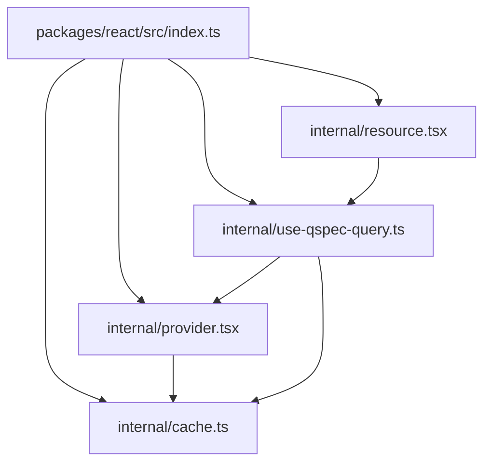
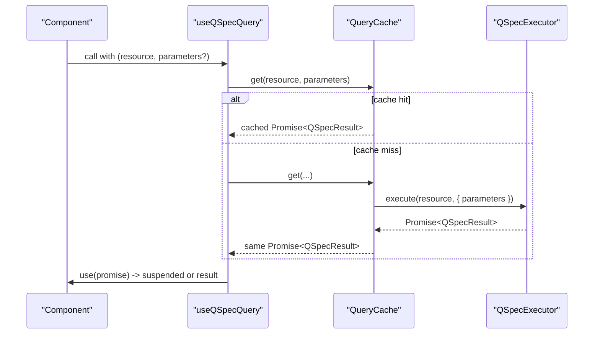
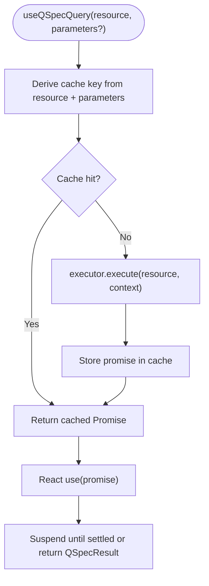
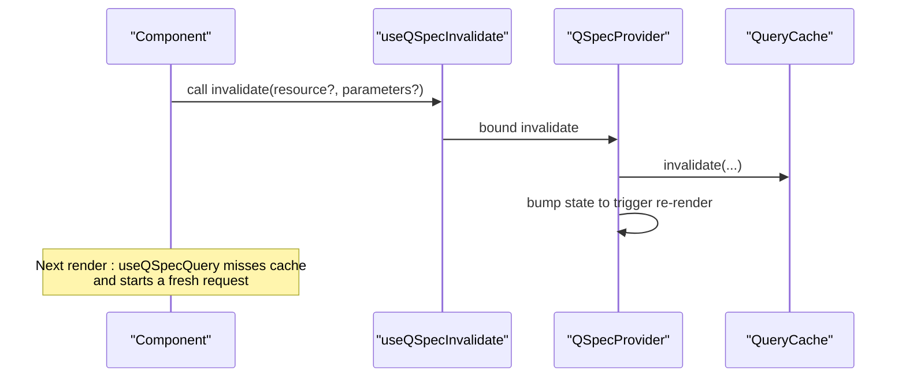
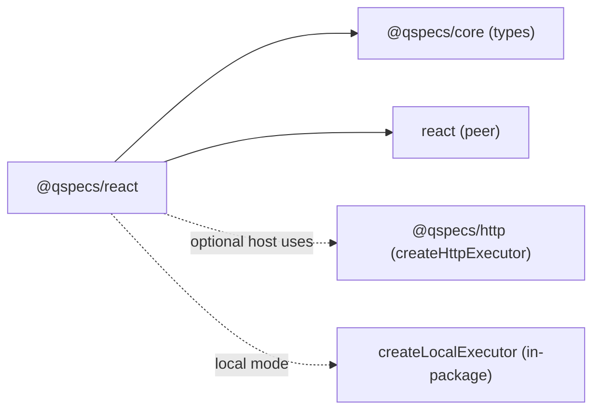

# React Hooks API

<cite>
**Referenced Files in This Document**
- [index.ts](file://packages/react/src/index.ts)
- [provider.tsx](file://packages/react/src/internal/provider.tsx)
- [use-qspec-query.ts](file://packages/react/src/internal/use-qspec-query.ts)
- [cache.ts](file://packages/react/src/internal/cache.ts)
- [resource.tsx](file://packages/react/src/internal/resource.tsx)
- [react-integration.md](file://docs/react-integration.md)
</cite>

## Table of Contents

1. [Introduction](#introduction)
2. [Project Structure](#project-structure)
3. [Core Components](#core-components)
4. [Architecture Overview](#architecture-overview)
5. [Detailed Component Analysis](#detailed-component-analysis)
6. [Dependency Analysis](#dependency-analysis)
7. [Performance Considerations](#performance-considerations)
8. [Troubleshooting Guide](#troubleshooting-guide)
9. [Conclusion](#conclusion)
10. [Appendices](#appendices)

## Introduction

This document explains the React hooks and provider provided by @qspecs/react for executing QSpec queries with automatic caching, Suspense-based loading, and error handling. It focuses on:

- useQSpecQuery: executes a named query with content-based parameter comparison and promise identity guarantees.
- useQSpecExecutor: direct access to the bound executor for one-off executions outside the cache.
- useQSpecInvalidate: imperative cache invalidation that triggers re-fetches across components.
  It also covers the declarative QSpecResource wrapper, TypeScript integration, composition patterns, and testing strategies.

## Project Structure

The package exposes a small, focused public surface built around a shared promise cache and a React context provider. The main exports are defined at the package entry point and implemented in internal modules.

**Diagram sources**

- [index.ts:16-25](file://packages/react/src/index.ts#L16-L25)
- [provider.tsx:1-150](file://packages/react/src/internal/provider.tsx#L1-L150)
- [use-qspec-query.ts:1-71](file://packages/react/src/internal/use-qspec-query.ts#L1-L71)
- [cache.ts:1-230](file://packages/react/src/internal/cache.ts#L1-L230)
- [resource.tsx:1-59](file://packages/react/src/internal/resource.tsx#L1-L59)

**Section sources**

- [index.ts:1-26](file://packages/react/src/index.ts#L1-L26)

## Core Components

- QSpecProvider: owns a single QueryCache for its lifetime and provides executor, cache, and invalidate via React context. It captures the executor once per instance and warns in development if the prop changes identity without a key change.
- useQSpecQuery(resource, parameters?): suspends on (resource, parameters) and returns the resolved QSpecResult directly. Parameters are compared by content; promise identity is preserved for React’s use().
- useQSpecExecutor(): returns the bound executor for one-off executions outside the cache.
- useQSpecInvalidate(): returns an invalidate function bound to the provider’s cache. Calling it drops matching entries and forces consumers to re-render and refetch as needed.
- QSpecResource(resource, parameters?, children): a render-prop wrapper over useQSpecQuery that intentionally does not include Suspense or error boundaries itself.

Key behaviors:

- No loading/error/refetch values from useQSpecQuery; errors propagate via rethrow and Suspense/error boundary semantics.
- Promise identity is critical: the cache stores promises, not results, so React’s use() can suspend reliably.
- Invalidation is imperative and scoped: zero arguments clears all, one argument clears a resource, two arguments clear a specific entry.

**Section sources**

- [provider.tsx:30-150](file://packages/react/src/internal/provider.tsx#L30-L150)
- [use-qspec-query.ts:6-71](file://packages/react/src/internal/use-qspec-query.ts#L6-L71)
- [cache.ts:109-229](file://packages/react/src/internal/cache.ts#L109-L229)
- [resource.tsx:6-59](file://packages/react/src/internal/resource.tsx#L6-L59)
- [react-integration.md:12-103](file://docs/react-integration.md#L12-L103)

## Architecture Overview

The runtime model centers on a provider-scoped cache and a minimal executor interface. Hooks read context and delegate to the cache; the cache coordinates execution and deduplication.

**Diagram sources**

- [use-qspec-query.ts:44-47](file://packages/react/src/internal/use-qspec-query.ts#L44-L47)
- [cache.ts:183-208](file://packages/react/src/internal/cache.ts#L183-L208)

## Detailed Component Analysis

### useQSpecQuery

- Purpose: Execute a named query with automatic caching and Suspense integration.
- Behavior:
  - Derives a stable cache key from resource and parameters using content-based serialization.
  - Returns the resolved QSpecResult directly; no loading/error/refetch fields.
  - Errors are thrown out of use(), handled by the nearest error boundary.
  - Parameters are compared by value, not reference; fresh objects do not restart queries unless their serialized content changes.
- Provider requirement: Must be called within QSpecProvider; otherwise throws a hook-named error.

**Diagram sources**

- [use-qspec-query.ts:44-47](file://packages/react/src/internal/use-qspec-query.ts#L44-L47)
- [cache.ts:183-208](file://packages/react/src/internal/cache.ts#L183-L208)

**Section sources**

- [use-qspec-query.ts:20-47](file://packages/react/src/internal/use-qspec-query.ts#L20-L47)
- [cache.ts:28-51](file://packages/react/src/internal/cache.ts#L28-L51)
- [react-integration.md:20-43](file://docs/react-integration.md#L20-L43)

### useQSpecExecutor

- Purpose: Access the bound executor for one-off executions outside the cache.
- Behavior:
  - Returns the executor captured by the enclosing QSpecProvider.
  - Useful for mutations or reports that should not participate in the query cache.
- Provider requirement: Must be called within QSpecProvider; otherwise throws a hook-named error.

**Section sources**

- [use-qspec-query.ts:6-18](file://packages/react/src/internal/use-qspec-query.ts#L6-L18)
- [provider.tsx:10-20](file://packages/react/src/internal/provider.tsx#L10-L20)

### useQSpecInvalidate

- Purpose: Imperatively drop cached entries and force consumers to refetch.
- Behavior:
  - Arity-identical to QueryCache.invalidate:
    - invalidate(): clear all entries.
    - invalidate(resource): clear all entries for that resource.
    - invalidate(resource, parameters): clear exactly one matching entry.
  - After invalidation, any component reading that query will miss the cache and suspend on a new promise; untouched queries remain unaffected.
  - There is no separate “refetch” step; invalidation implies next render refetches.
- Provider requirement: Must be called within QSpecProvider; otherwise throws a hook-named error.

**Diagram sources**

- [use-qspec-query.ts:49-70](file://packages/react/src/internal/use-qspec-query.ts#L49-L70)
- [provider.tsx:138-148](file://packages/react/src/internal/provider.tsx#L138-L148)
- [cache.ts:210-226](file://packages/react/src/internal/cache.ts#L210-L226)

**Section sources**

- [use-qspec-query.ts:49-70](file://packages/react/src/internal/use-qspec-query.ts#L49-L70)
- [provider.tsx:138-148](file://packages/react/src/internal/provider.tsx#L138-L148)
- [react-integration.md:95-103](file://docs/react-integration.md#L95-L103)

### QSpecProvider

- Purpose: Owns a single QueryCache for its lifetime and provides executor, cache, and invalidate via context.
- Behavior:
  - Captures executor once per instance; changing the executor prop without a key change is ignored (with a development warning).
  - Provides an invalidate wrapper that both invalidates entries and forces a re-render to propagate changes to consumers.
  - Throws a clear, hook-named error when used outside a provider.

**Section sources**

- [provider.tsx:30-150](file://packages/react/src/internal/provider.tsx#L30-L150)

### QSpecResource

- Purpose: Declarative wrapper over useQSpecQuery with a render-prop child.
- Behavior:
  - Does not provide its own Suspense fallback or error boundary; callers must wrap appropriately.
  - Parameters are passed through to useQSpecQuery and compared by content.

**Section sources**

- [resource.tsx:6-59](file://packages/react/src/internal/resource.tsx#L6-L59)
- [react-integration.md:105-129](file://docs/react-integration.md#L105-L129)

## Dependency Analysis

@qspecs/react depends only on React and @qspecs/core types. It redeclares the executor interface locally to avoid importing transport packages and to keep browser-safety boundaries intact.

**Diagram sources**

- [cache.ts:1-14](file://packages/react/src/internal/cache.ts#L1-L14)
- [react-integration.md:145-177](file://docs/react-integration.md#L145-L177)

**Section sources**

- [cache.ts:1-14](file://packages/react/src/internal/cache.ts#L1-L14)
- [react-integration.md:145-177](file://docs/react-integration.md#L145-L177)

## Performance Considerations

- Promise identity: The cache stores promises, not results, ensuring React’s use() receives the same object across renders and avoids infinite suspension loops.
- Content-based parameters: Fresh parameter objects do not restart queries unless their serialized content changes; this enables idiomatic inline parameter objects.
- Single cache per provider: Avoids accidental resets; swapping executors requires a new key on QSpecProvider.
- Minimal re-renders: Invalidations only affect affected queries; untouched queries reuse the same cached promise and commit without visible change.
- No extra allocations: Keys are derived deterministically; cache operations are Map-based for O(1) lookups.

[No sources needed since this section provides general guidance]

## Troubleshooting Guide

Common issues and resolutions:

- Hook called outside QSpecProvider: Each hook throws a clear, hook-named error indicating the missing provider. Wrap your tree in QSpecProvider.
- Infinite suspension: Caused by returning a new promise each render. The cache ensures the same promise is returned for the same key; ensure you are using useQSpecQuery/QSpecResource and not wrapping results in fresh Promises.
- Executor prop changes ignored: QSpecProvider binds the executor once per instance. To swap executors (e.g., after re-authentication), give the provider element a new key.
- Unhandled rejections: The cache attaches a catch handler to stored promises to avoid unhandledRejection noise; errors still propagate via use() to error boundaries.
- SSR/RSC: Exports are marked "use client"; server rendering is not verified. Treat as client-only until explicitly supported.

**Section sources**

- [provider.tsx:66-74](file://packages/react/src/internal/provider.tsx#L66-L74)
- [provider.tsx:115-136](file://packages/react/src/internal/provider.tsx#L115-L136)
- [cache.ts:196-205](file://packages/react/src/internal/cache.ts#L196-L205)
- [react-integration.md:179-187](file://docs/react-integration.md#L179-L187)

## Conclusion

@qspecs/react provides a concise, Suspense-first API for QSpec queries:

- useQSpecQuery delivers data via React’s use() with automatic caching and promise identity guarantees.
- useQSpecExecutor gives direct access to the executor for non-cached operations.
- useQSpecInvalidate offers precise, imperative cache control that propagates to all consumers.
- QSpecProvider centralizes configuration and lifecycle, while QSpecResource offers a lightweight declarative wrapper.
  Adopting these patterns yields predictable loading/error behavior, efficient caching, and clean separation between data fetching and presentation.

[No sources needed since this section summarizes without analyzing specific files]

## Appendices

### TypeScript Integration

- Types exposed: QSpecExecutor, QueryCache, QueryParameters, plus props for QSpecProvider and QSpecResource.
- Parameter typing: QueryParameters allows Record<string, JsonValue | undefined>, enabling optional keys and nested JSON-compatible structures.
- Strict mode safety: The implementation avoids mutating caller-supplied objects during key derivation and uses safe property checks.

**Section sources**

- [index.ts:16-25](file://packages/react/src/index.ts#L16-L25)
- [cache.ts:16-27](file://packages/react/src/internal/cache.ts#L16-L27)
- [cache.ts:49-51](file://packages/react/src/internal/cache.ts#L49-L51)

### Common Usage Patterns

- Basic query with Suspense and error boundary:
  - Wrap QSpecResource (or a component calling useQSpecQuery) in <Suspense> and an error boundary.
  - Pass resource and parameters; rely on Suspense for loading and error boundary for errors.
- Parameter binding:
  - Pass inline parameter objects; they are compared by content, so frequent re-creation is safe.
- Data refresh:
  - Call invalidate(resource, parameters?) after mutations to refresh affected queries across the tree.
- One-off execution:
  - Use useQSpecExecutor to run a query outside the cache when appropriate.

**Section sources**

- [resource.tsx:29-59](file://packages/react/src/internal/resource.tsx#L29-L59)
- [use-qspec-query.ts:20-47](file://packages/react/src/internal/use-qspec-query.ts#L20-L47)
- [use-qspec-query.ts:49-70](file://packages/react/src/internal/use-qspec-query.ts#L49-L70)
- [react-integration.md:105-129](file://docs/react-integration.md#L105-L129)

### Custom Hook Composition

- Compose a typed query hook:
  - Create a custom hook that calls useQSpecQuery with fixed resource and parameters, exposing a simple interface to components.
- Compose an invalidation helper:
  - Wrap useQSpecInvalidate to expose domain-specific invalidation functions (e.g., invalidateOrders).
- Combine with local state:
  - Use standard React state for UI concerns; let QSpec handle data fetching and caching.

[No sources needed since this section provides general guidance]

### Testing Strategies

- Provide a test double executor implementing QSpecExecutor to avoid network calls.
- Use createLocalExecutor in-process for tests that need direct runtime execution against known manifests.
- Assert Suspense and error boundary behavior:
  - Verify components suspend while promises are pending.
  - Verify errors propagate to error boundaries rather than being returned as values.
- Validate invalidation:
  - Trigger invalidate and assert that dependent components re-suspend and receive updated results.

**Section sources**

- [react-integration.md:145-177](file://docs/react-integration.md#L145-L177)
- [cache.ts:183-229](file://packages/react/src/internal/cache.ts#L183-L229)
