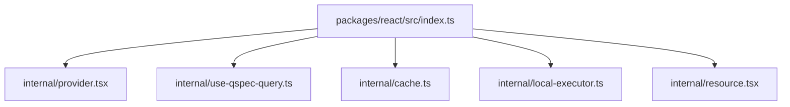
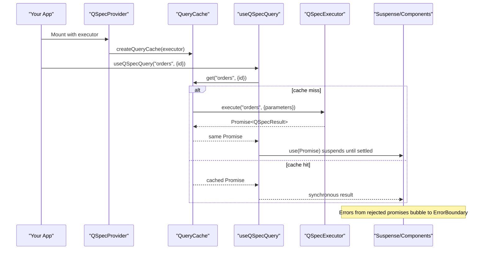
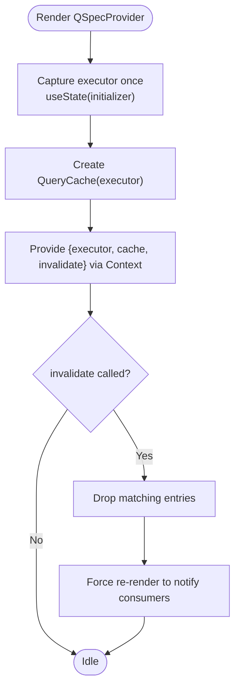
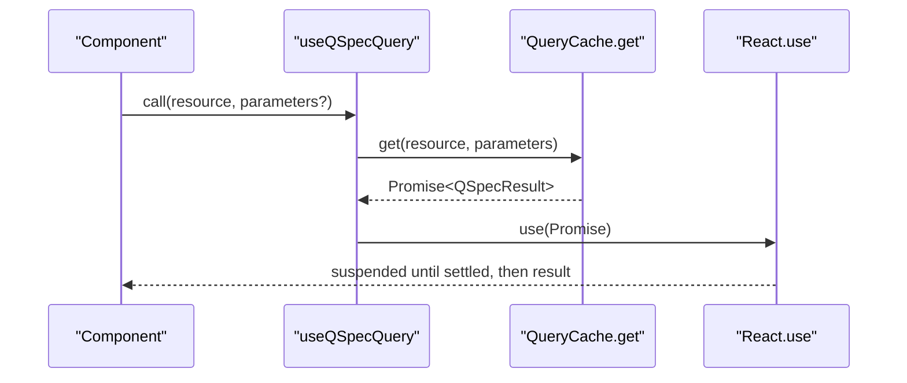
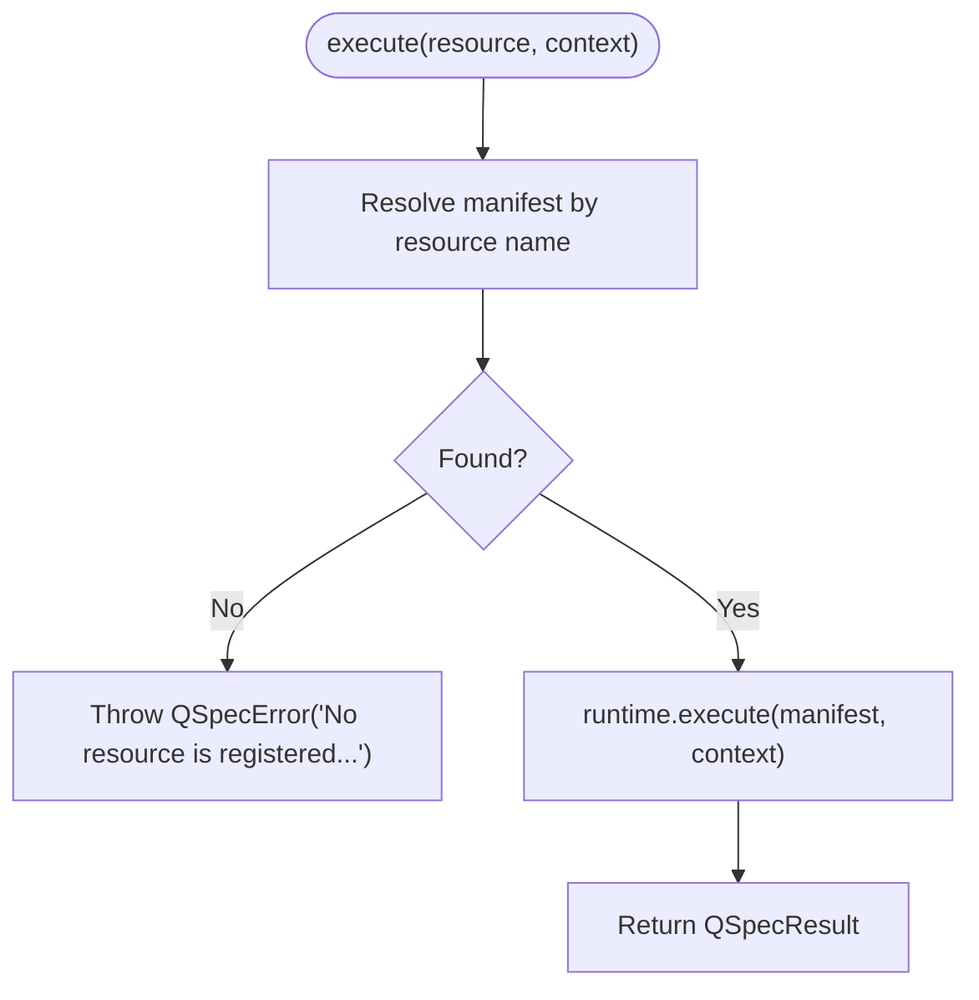
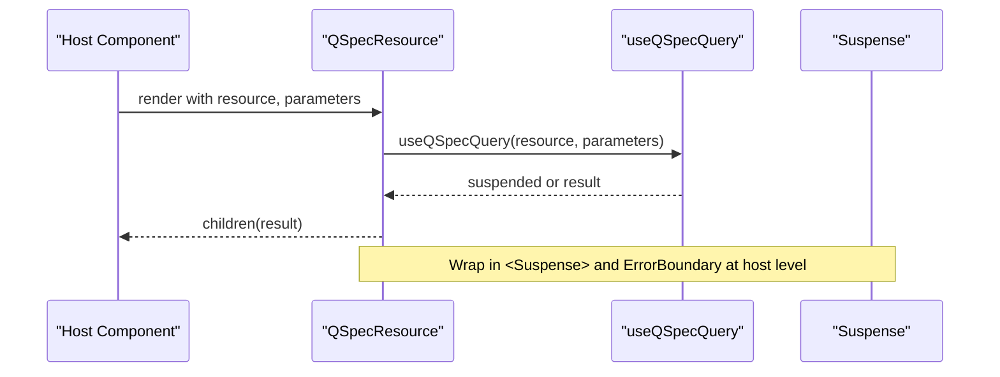
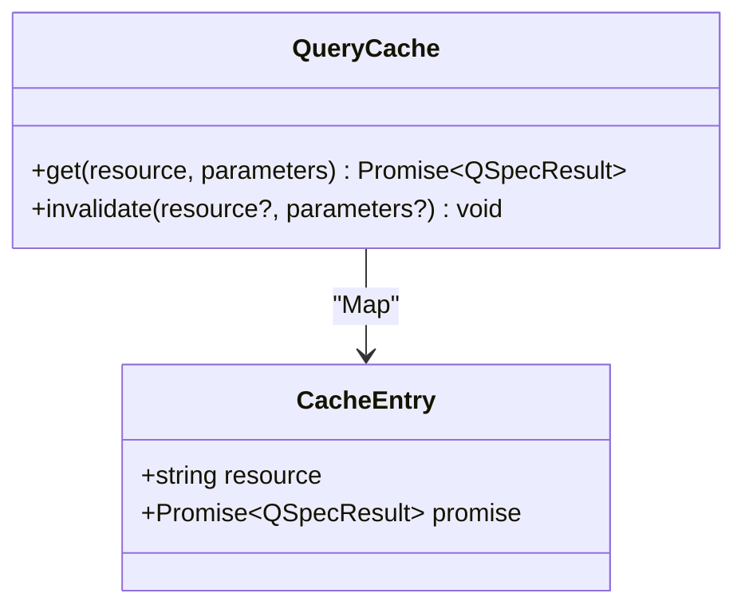
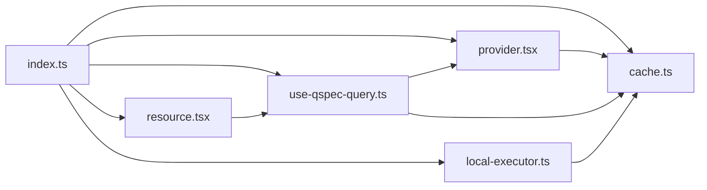

# React Integration (@qspecs/react)

<cite>
**Referenced Files in This Document**
- [index.ts](file://packages/react/src/index.ts)
- [provider.tsx](file://packages/react/src/internal/provider.tsx)
- [use-qspec-query.ts](file://packages/react/src/internal/use-qspec-query.ts)
- [cache.ts](file://packages/react/src/internal/cache.ts)
- [local-executor.ts](file://packages/react/src/internal/local-executor.ts)
- [resource.tsx](file://packages/react/src/internal/resource.tsx)
- [react-integration.md](file://docs/react-integration.md)
- [package.json](file://packages/react/package.json)
- [use-qspec-query.test.tsx](file://packages/react/src/internal/use-qspec-query.test.tsx)
- [resource.test.tsx](file://packages/react/src/internal/resource.test.tsx)
</cite>

## Table of Contents

1. Introduction
2. Project Structure
3. Core Components
4. Architecture Overview
5. Detailed Component Analysis
6. Dependency Analysis
7. Performance Considerations
8. Troubleshooting Guide
9. Conclusion
10. Appendices

## Introduction

This document explains the React integration for QSpec provided by @qspecs/react. It covers application-wide configuration via a provider, hooks for accessing and invalidating queries, a declarative resource component, and the executor seam that lets you plug in HTTP or local execution. It also documents TypeScript support, error boundaries, performance characteristics, testing strategies, and how to integrate with routing solutions.

## Project Structure

The package exposes a small, focused API surface built on a promise-based query cache and a provider context. The public entry marks all exports as client-only for bundlers that understand React Server Components.

**Diagram sources**

- [index.ts:16-25](file://packages/react/src/index.ts#L16-L25)

**Section sources**

- [index.ts:1-25](file://packages/react/src/index.ts#L1-L25)
- [package.json:1-50](file://packages/react/package.json#L1-L50)

## Core Components

- QSpecProvider: Owns one QueryCache bound to an executor for its lifetime and provides it via React context.
- useQSpecExecutor: Returns the bound executor for one-off executions outside the cache.
- useQSpecQuery(resource, parameters?): Suspends on (resource, parameters) and returns the resolved QSpecResult directly; no loading/error/refetch values.
- useQSpecInvalidate(): Returns an invalidate function bound to the provider’s cache.
- createLocalExecutor(runtime, manifests): Builds a QSpecExecutor that resolves resource names against a fixed registry and executes them locally.
- QSpecResource: Declarative wrapper over useQSpecQuery using a render-prop child.

Key behaviors:

- Parameters are compared by content, not reference, so fresh object literals do not trigger refetches.
- Rejections propagate out of use() to the nearest error boundary; there is no per-hook error value.
- Invalidations drop matching entries and force re-renders; components whose queries were dropped will suspend again and refetch.

**Section sources**

- [provider.tsx:30-56](file://packages/react/src/internal/provider.tsx#L30-L56)
- [provider.tsx:103-148](file://packages/react/src/internal/provider.tsx#L103-L148)
- [use-qspec-query.ts:6-18](file://packages/react/src/internal/use-qspec-query.ts#L6-L18)
- [use-qspec-query.ts:20-47](file://packages/react/src/internal/use-qspec-query.ts#L20-L47)
- [use-qspec-query.ts:49-70](file://packages/react/src/internal/use-qspec-query.ts#L49-L70)
- [local-executor.ts:11-21](file://packages/react/src/internal/local-executor.ts#L11-L21)
- [local-executor.ts:41-75](file://packages/react/src/internal/local-executor.ts#L41-L75)
- [resource.tsx:6-58](file://packages/react/src/internal/resource.tsx#L6-L58)
- [react-integration.md:55-103](file://docs/react-integration.md#L55-L103)

## Architecture Overview

@qspecs/react is a Suspense-first binding over a QSpecExecutor. It does not talk to servers or render charts itself; instead, it coordinates caching, suspension, and invalidation while delegating execution to an executor implementation.

**Diagram sources**

- [provider.tsx:103-148](file://packages/react/src/internal/provider.tsx#L103-L148)
- [use-qspec-query.ts:20-47](file://packages/react/src/internal/use-qspec-query.ts#L20-L47)
- [cache.ts:109-228](file://packages/react/src/internal/cache.ts#L109-L228)
- [react-integration.md:145-177](file://docs/react-integration.md#L145-L177)

## Detailed Component Analysis

### QSpecProvider

Responsibilities:

- Captures the executor once on first render and never re-reads it during the provider’s lifetime.
- Creates a single QueryCache bound to that executor.
- Exposes an invalidate function that both drops cache entries and forces a re-render of consumers.

Important details:

- Changing the executor prop without changing the provider key is ignored after the first render; a development warning is logged once per instance.
- To swap executors (e.g., new auth token), provide a new key to unmount/remount the provider.

**Diagram sources**

- [provider.tsx:30-56](file://packages/react/src/internal/provider.tsx#L30-L56)
- [provider.tsx:76-148](file://packages/react/src/internal/provider.tsx#L76-L148)

**Section sources**

- [provider.tsx:30-56](file://packages/react/src/internal/provider.tsx#L30-L56)
- [provider.tsx:76-148](file://packages/react/src/internal/provider.tsx#L76-L148)
- [react-integration.md:55-71](file://docs/react-integration.md#L55-L71)

### useQSpecQuery

Behavior:

- Suspends on (resource, parameters) and returns the resolved QSpecResult directly.
- No loading, error, or refetch values; errors propagate to the nearest error boundary.
- Parameters are compared by content via a canonical serialization used as the cache key.

**Diagram sources**

- [use-qspec-query.ts:20-47](file://packages/react/src/internal/use-qspec-query.ts#L20-L47)
- [cache.ts:109-173](file://packages/react/src/internal/cache.ts#L109-L173)

**Section sources**

- [use-qspec-query.ts:20-47](file://packages/react/src/internal/use-qspec-query.ts#L20-L47)
- [react-integration.md:73-103](file://docs/react-integration.md#L73-L103)

### useQSpecInvalidate

Behavior:

- Returns an invalidate function bound to the provider’s cache.
- Arity:
  - invalidate(): clears everything.
  - invalidate(resource): clears all entries for that resource.
  - invalidate(resource, parameters): clears exactly the matching entry.
- Calling invalidate both drops entries and triggers a re-render so consumers can refetch if needed.

**Section sources**

- [use-qspec-query.ts:49-70](file://packages/react/src/internal/use-qspec-query.ts#L49-L70)
- [provider.tsx:138-148](file://packages/react/src/internal/provider.tsx#L138-L148)
- [react-integration.md:95-103](file://docs/react-integration.md#L95-L103)

### createLocalExecutor

Purpose:

- Provides a QSpecExecutor that resolves resource names against a fixed registry and executes them directly via a QSpec runtime.
- Uses safe name resolution (Object.hasOwn) to avoid prototype pollution issues and rejects unknown resources with a generic message.

**Diagram sources**

- [local-executor.ts:23-39](file://packages/react/src/internal/local-executor.ts#L23-L39)
- [local-executor.ts:41-75](file://packages/react/src/internal/local-executor.ts#L41-L75)

**Section sources**

- [local-executor.ts:11-21](file://packages/react/src/internal/local-executor.ts#L11-L21)
- [local-executor.ts:41-75](file://packages/react/src/internal/local-executor.ts#L41-L75)
- [react-integration.md:145-177](file://docs/react-integration.md#L145-L177)

### QSpecResource

Declarative wrapper:

- Accepts resource and optional parameters, and a render-prop child receiving the resolved QSpecResult.
- Does not provide its own <Suspense> fallback or error boundary; host code must wrap appropriately.

**Diagram sources**

- [resource.tsx:6-58](file://packages/react/src/internal/resource.tsx#L6-L58)
- [react-integration.md:105-129](file://docs/react-integration.md#L105-L129)

**Section sources**

- [resource.tsx:6-58](file://packages/react/src/internal/resource.tsx#L6-L58)
- [react-integration.md:105-129](file://docs/react-integration.md#L105-L129)

### Query Cache and Promise Identity

Design:

- Stores in-flight and settled promises keyed by a canonical string derived from (resource, parameters).
- React’s use() requires the same promise object across renders; otherwise, components may suspend indefinitely.
- Rejections are cached and only retried after explicit invalidation.

**Diagram sources**

- [cache.ts:104-173](file://packages/react/src/internal/cache.ts#L104-L173)
- [cache.ts:176-228](file://packages/react/src/internal/cache.ts#L176-L228)

**Section sources**

- [cache.ts:28-51](file://packages/react/src/internal/cache.ts#L28-L51)
- [cache.ts:109-228](file://packages/react/src/internal/cache.ts#L109-L228)
- [react-integration.md:131-143](file://docs/react-integration.md#L131-L143)

## Dependency Analysis

Public exports and internal relationships:

**Diagram sources**

- [index.ts:16-25](file://packages/react/src/index.ts#L16-L25)
- [provider.tsx:1-7](file://packages/react/src/internal/provider.tsx#L1-L7)
- [use-qspec-query.ts:1-4](file://packages/react/src/internal/use-qspec-query.ts#L1-L4)
- [resource.tsx:1-4](file://packages/react/src/internal/resource.tsx#L1-L4)
- [local-executor.ts:1-9](file://packages/react/src/internal/local-executor.ts#L1-L9)

**Section sources**

- [index.ts:16-25](file://packages/react/src/index.ts#L16-L25)

## Performance Considerations

- Promise identity: The cache stores the actual Promise objects so React’s use() can deduplicate renders and avoid infinite suspension loops.
- Content-keyed parameters: Fresh parameter objects do not cause refetches because keys are serialized deterministically.
- Executor capture: The provider captures the executor once; changing the prop without a key change is ignored after the first render. Use a new key to fully reset.
- Minimal re-renders: Invalidations drop entries and trigger a single context update; untouched queries remain stable.
- Client-only: All exports are marked "use client"; server rendering is not verified.

[No sources needed since this section provides general guidance]

## Troubleshooting Guide

Common issues and resolutions:

- Hooks called outside QSpecProvider: Each hook throws a clear error naming the hook and instructing to wrap the tree in QSpecProvider.
- Missing Suspense/ErrorBoundary: Without <Suspense>, components reading queries will crash the nearest ancestor Suspense boundary; without an error boundary, rejected queries propagate like any render-time throw.
- Executor prop changes: If the executor prop changes identity without a key change, a development warning is logged once per provider instance; the original executor remains in effect.
- Unknown resource names: Local executor rejects with a generic “not found” message to avoid enumerating private registries.

**Section sources**

- [use-qspec-query.ts:6-18](file://packages/react/src/internal/use-qspec-query.ts#L6-L18)
- [provider.tsx:58-74](file://packages/react/src/internal/provider.tsx#L58-L74)
- [provider.tsx:115-136](file://packages/react/src/internal/provider.tsx#L115-L136)
- [local-executor.ts:61-72](file://packages/react/src/internal/local-executor.ts#L61-L72)
- [react-integration.md:105-129](file://docs/react-integration.md#L105-L129)

## Conclusion

@qspecs/react provides a minimal, Suspense-first integration for QSpec with a strong emphasis on predictable caching, clear error propagation, and a flexible executor seam. By wrapping your app in QSpecProvider and using useQSpecQuery or QSpecResource within Suspense and error boundaries, you can declaratively fetch and display QSpec results with robust performance and testability.

[No sources needed since this section summarizes without analyzing specific files]

## Appendices

### TypeScript Support

- Types are exported for the executor interface, query parameters, and provider/resource props.
- The package depends on @qspecs/core for shared types such as QSpecResult and ExecutionContext.

**Section sources**

- [index.ts:16-25](file://packages/react/src/index.ts#L16-L25)
- [cache.ts:1-26](file://packages/react/src/internal/cache.ts#L1-L26)
- [package.json:33-36](file://packages/react/package.json#L33-L36)

### Testing Strategies

- Use a controlled executor double that exposes resolvers/rejecters to settle promises under act().
- Wrap trees in Suspense and a custom error boundary to assert loading and error states.
- Assert that identical parameters do not trigger additional executor calls and that invalidations selectively refetch.

**Section sources**

- [use-qspec-query.test.tsx:18-98](file://packages/react/src/internal/use-qspec-query.test.tsx#L18-L98)
- [use-qspec-query.test.tsx:188-443](file://packages/react/src/internal/use-qspec-query.test.tsx#L188-L443)
- [resource.test.tsx:15-80](file://packages/react/src/internal/resource.test.tsx#L15-L80)
- [resource.test.tsx:133-255](file://packages/react/src/internal/resource.test.tsx#L133-L255)

### Integrating with Routing Solutions

- For route-driven data, pass route parameters into the parameters prop of useQSpecQuery or QSpecResource. Because parameters are compared by content, navigating to the same route with the same parameters will reuse cached results.
- On navigation events or programmatic actions, call useQSpecInvalidate() to drop relevant entries and trigger refetches.
- Keep Suspense and error boundaries around routes or route segments to handle loading and errors consistently.

[No sources needed since this section provides general guidance]
