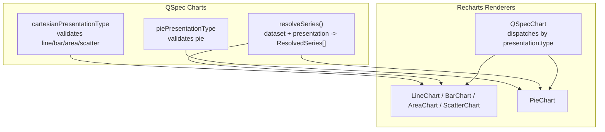
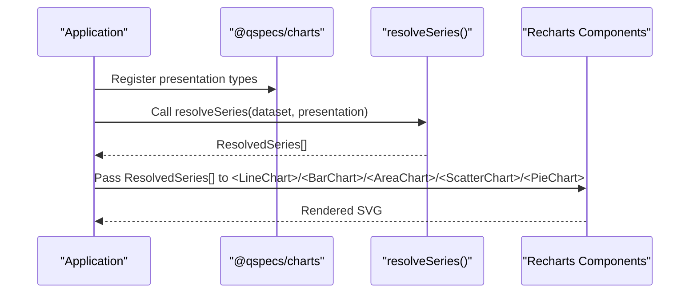
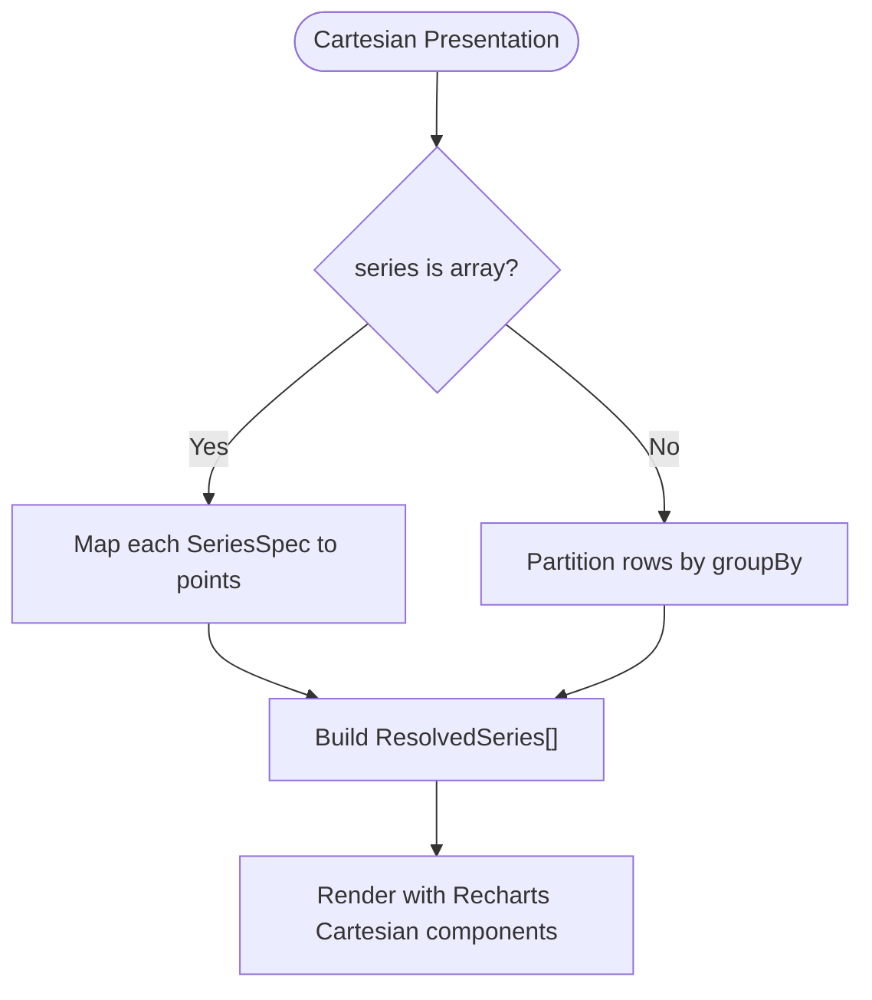
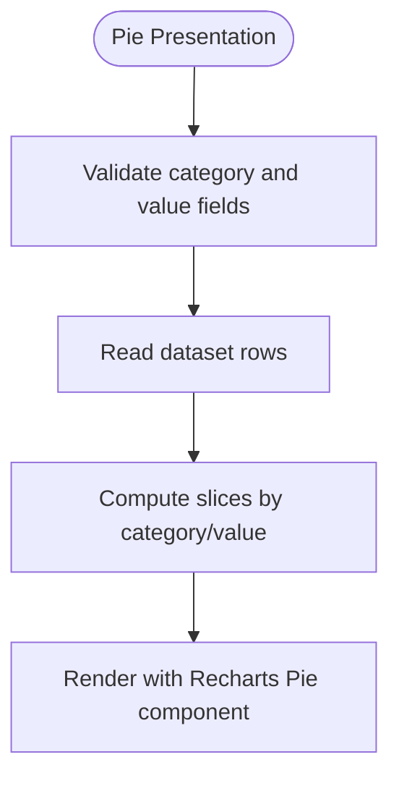
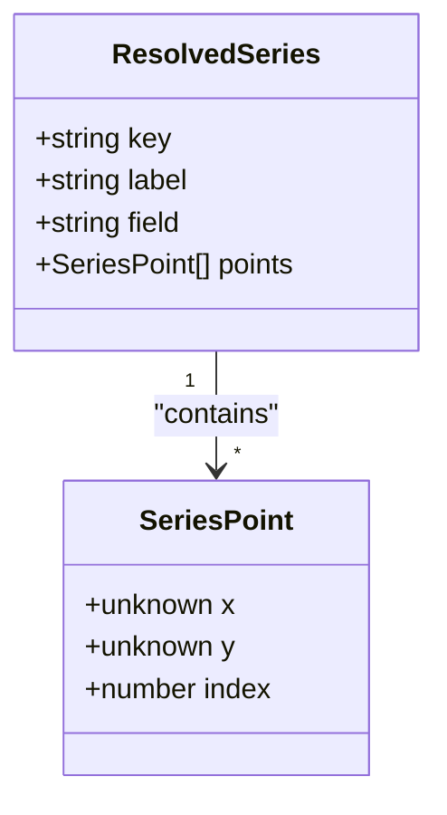
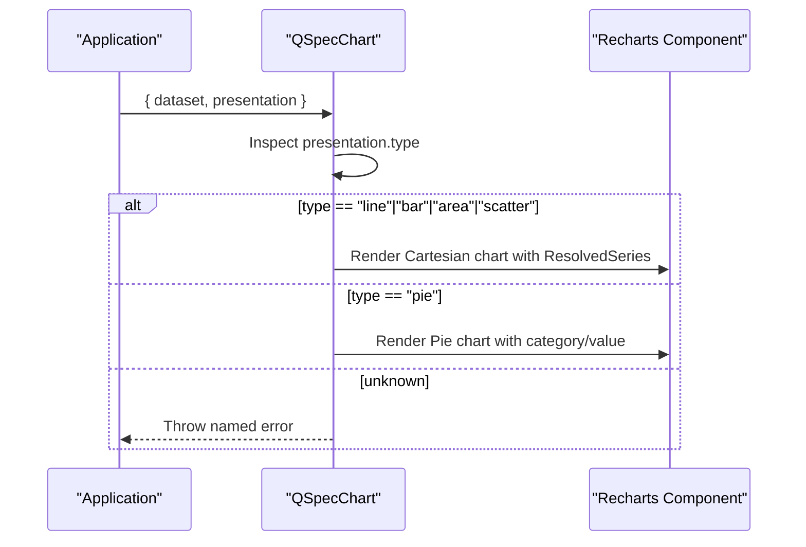
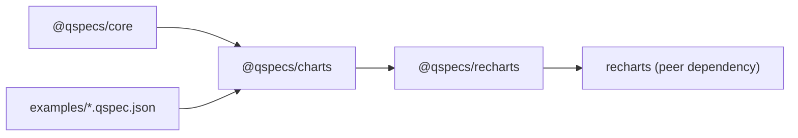

# Chart Components

<cite>
**Referenced Files in This Document**
- [README.md](file://README.md)
- [packages/charts/src/index.ts](file://packages/charts/src/index.ts)
- [packages/charts/src/types.ts](file://packages/charts/src/types.ts)
- [packages/charts/src/internal/cartesian.ts](file://packages/charts/src/internal/cartesian.ts)
- [packages/charts/src/internal/pie.ts](file://packages/charts/src/internal/pie.ts)
- [packages/charts/src/internal/resolve-series.ts](file://packages/charts/src/internal/resolve-series.ts)
- [packages/recharts/src/index.ts](file://packages/recharts/src/index.ts)
- [examples/10-chart-grouped-series.qspec.json](file://examples/10-chart-grouped-series.qspec.json)
- [examples/11-chart-pie.qspec.json](file://examples/11-chart-pie.qspec.json)
</cite>

## Table of Contents

1. Introduction
2. Project Structure
3. Core Components
4. Architecture Overview
5. Detailed Component Analysis
6. Dependency Analysis
7. Performance Considerations
8. Troubleshooting Guide
9. Conclusion

## Introduction

This document explains how QSpec chart definitions map to Recharts-based components and how series are resolved for rendering. It covers the LineChart, BarChart, AreaChart, ScatterChart, and PieChart components exposed by the Recharts package, the shared CartesianChartProps interface used across cartesian charts, and the data-binding model that turns a dataset plus a presentation definition into plottable series. It also includes guidance on responsive behavior, accessibility considerations, and performance for large datasets.

## Project Structure

The charting capability is split between two packages:

- @qspecs/charts: Defines presentation types (line, bar, area, scatter, pie), validates them, and resolves datasets into renderer-agnostic series.
- @qspecs/recharts: Provides React components that render those series using Recharts.

**Diagram sources**

- [packages/charts/src/internal/cartesian.ts:141-151](file://packages/charts/src/internal/cartesian.ts#L141-L151)
- [packages/charts/src/internal/pie.ts:76-86](file://packages/charts/src/internal/pie.ts#L76-L86)
- [packages/charts/src/internal/resolve-series.ts:28-85](file://packages/charts/src/internal/resolve-series.ts#L28-L85)
- [packages/recharts/src/index.ts:23-31](file://packages/recharts/src/index.ts#L23-L31)

**Section sources**

- [packages/charts/src/index.ts:19-54](file://packages/charts/src/index.ts#L19-L54)
- [packages/recharts/src/index.ts:1-31](file://packages/recharts/src/index.ts#L1-L31)

## Core Components

- LineChart, BarChart, AreaChart, ScatterChart: Cartesian chart components that consume a CartesianChartProps interface and render one or more series over an x-axis. They share validation and resolution logic from @qspecs/charts.
- PieChart: Renders slices by category and value without an x-axis or dynamic series list.
- QSpecChart: A dispatcher component that takes a dataset and a presentation definition and renders the appropriate chart based on presentation.type.

Key responsibilities:

- @qspecs/charts validates presentation shapes and extracts field references for static checks.
- @qspecs/charts resolveSeries transforms a dataset and a Cartesian presentation into ResolvedSeries arrays suitable for any renderer.
- @qspecs/recharts components accept these resolved series and render them with Recharts primitives.

Examples of QSpec presentations:

- Grouped line chart: see examples/10-chart-grouped-series.qspec.json
- Pie chart: see examples/11-chart-pie.qspec.json

**Section sources**

- [packages/recharts/src/index.ts:23-31](file://packages/recharts/src/index.ts#L23-L31)
- [packages/charts/src/internal/resolve-series.ts:28-85](file://packages/charts/src/internal/resolve-series.ts#L28-L85)
- [examples/10-chart-grouped-series.qspec.json:31-41](file://examples/10-chart-grouped-series.qspec.json#L31-L41)
- [examples/11-chart-pie.qspec.json:22-28](file://examples/11-chart-pie.qspec.json#L22-L28)

## Architecture Overview

The flow from a QSpec manifest to a rendered chart:

1. The charts plugin registers presentation types (line, bar, area, scatter, pie).
2. A dataset is produced by queries and transforms.
3. For cartesian charts, resolveSeries converts the dataset and presentation into ResolvedSeries.
4. Recharts components receive the resolved series and render SVG via Recharts.

**Diagram sources**

- [packages/charts/src/index.ts:31-54](file://packages/charts/src/index.ts#L31-L54)
- [packages/charts/src/internal/resolve-series.ts:28-85](file://packages/charts/src/internal/resolve-series.ts#L28-L85)
- [packages/recharts/src/index.ts:23-31](file://packages/recharts/src/index.ts#L23-L31)

## Detailed Component Analysis

### CartesianChartProps and Cartesian Charts

Cartesian charts (LineChart, BarChart, AreaChart, ScatterChart) share a common props contract derived from the CartesianPresentation type. The key elements include:

- x: AxisSpec defining the x-axis field and optional label.
- series: Either an array of SeriesSpec entries or a single GroupedSeriesSpec that partitions rows at render time.
- y: Optional label configuration for the y-axis.
- legend and tooltip: Optional display toggles.

Validation rules enforced by the charts plugin:

- x.field must be a non-empty string; duplicate series fields are rejected.
- For grouped series, both series.field and series.groupBy must be non-empty strings.
- legend and tooltip blocks are validated for presence and structure.

Rendering behavior:

- Each series maps dataset rows to points with x, y, and index values.
- Grouped series partition rows by groupBy and produce one series per distinct group. Null or empty group values are merged under a default label.

**Diagram sources**

- [packages/charts/src/internal/cartesian.ts:18-93](file://packages/charts/src/internal/cartesian.ts#L18-L93)
- [packages/charts/src/internal/resolve-series.ts:28-85](file://packages/charts/src/internal/resolve-series.ts#L28-L85)

**Section sources**

- [packages/charts/src/types.ts:3-49](file://packages/charts/src/types.ts#L3-L49)
- [packages/charts/src/internal/cartesian.ts:18-93](file://packages/charts/src/internal/cartesian.ts#L18-L93)
- [packages/charts/src/internal/resolve-series.ts:28-85](file://packages/charts/src/internal/resolve-series.ts#L28-L85)

### PieChart

Pie charts use a different presentation shape:

- category: AxisSpec defining the slice label field and optional label.
- value: SeriesSpec defining the slice size field and optional label.
- legend and tooltip: Optional display toggles.

Validation ensures category.field and value.field are present and non-empty. Rendering reads dataset rows directly to compute slices without an x-axis or dynamic series list.

**Diagram sources**

- [packages/charts/src/internal/pie.ts:18-43](file://packages/charts/src/internal/pie.ts#L18-L43)
- [packages/charts/src/types.ts:80-86](file://packages/charts/src/types.ts#L80-L86)

**Section sources**

- [packages/charts/src/internal/pie.ts:18-86](file://packages/charts/src/internal/pie.ts#L18-L86)
- [packages/charts/src/types.ts:80-86](file://packages/charts/src/types.ts#L80-L86)

### Series Resolution Details

resolveSeries produces ResolvedSeries arrays for cartesian charts:

- Explicit series: Each SeriesSpec becomes a ResolvedSeries with points mapped from dataset rows.
- Grouped series: Rows are partitioned by groupBy; each distinct group becomes a ResolvedSeries. Null or empty group values are merged under a default label.
- Points carry x, y, and index to support correct ordering when multiple series share an axis.

**Diagram sources**

- [packages/charts/src/types.ts:51-78](file://packages/charts/src/types.ts#L51-L78)
- [packages/charts/src/internal/resolve-series.ts:28-85](file://packages/charts/src/internal/resolve-series.ts#L28-L85)

**Section sources**

- [packages/charts/src/internal/resolve-series.ts:28-85](file://packages/charts/src/internal/resolve-series.ts#L28-L85)
- [packages/charts/src/types.ts:51-78](file://packages/charts/src/types.ts#L51-L78)

### QSpecChart Dispatcher

QSpecChart accepts a dataset and a presentation definition and dispatches to the appropriate Recharts component based on presentation.type. It throws a named error for unrecognized types to avoid silent failures.

**Diagram sources**

- [packages/recharts/src/index.ts:23-31](file://packages/recharts/src/index.ts#L23-L31)

**Section sources**

- [packages/recharts/src/index.ts:1-31](file://packages/recharts/src/index.ts#L1-L31)

## Dependency Analysis

- @qspecs/charts defines and validates presentation types and resolves series independently of any renderer.
- @qspecs/recharts depends on @qspecs/charts for series resolution and uses Recharts for rendering.
- Examples demonstrate concrete presentation definitions for grouped series and pie charts.

**Diagram sources**

- [packages/charts/src/index.ts:19-54](file://packages/charts/src/index.ts#L19-L54)
- [packages/recharts/src/index.ts:1-31](file://packages/recharts/src/index.ts#L1-L31)
- [examples/10-chart-grouped-series.qspec.json:31-41](file://examples/10-chart-grouped-series.qspec.json#L31-L41)
- [examples/11-chart-pie.qspec.json:22-28](file://examples/11-chart-pie.qspec.json#L22-L28)

**Section sources**

- [packages/charts/src/index.ts:19-54](file://packages/charts/src/index.ts#L19-L54)
- [packages/recharts/src/index.ts:1-31](file://packages/recharts/src/index.ts#L1-L31)

## Performance Considerations

- Series resolution allocates new arrays and objects for series and points; point values reference dataset cells directly to avoid cloning costs. This design minimizes overhead but means mutating composite cell values through points affects the original dataset.
- Grouped series partition rows into groups; ensure groupBy fields have reasonable cardinality to avoid excessive series counts.
- Large datasets benefit from pre-aggregation in queries or transforms before presenting, reducing the number of points passed to renderers.
- Avoid redundant series definitions; duplicate series fields are rejected during validation to prevent unnecessary work.

[No sources needed since this section provides general guidance]

## Troubleshooting Guide

Common issues and their origins:

- Missing or invalid x.field in cartesian presentations: Validation reports a required object with a non-empty string field.
- Duplicate series fields: Rejected to prevent identity collisions that could corrupt rendering.
- Invalid grouped series: Both series.field and series.groupBy must be non-empty strings.
- Unknown presentation.type: QSpecChart throws a named error rather than silently rendering nothing.

Where to look:

- Cartesian validation and field references: packages/charts/src/internal/cartesian.ts
- Pie validation and field references: packages/charts/src/internal/pie.ts
- Series resolution behavior and labels: packages/charts/src/internal/resolve-series.ts
- Dispatcher behavior and errors: packages/recharts/src/index.ts

**Section sources**

- [packages/charts/src/internal/cartesian.ts:18-93](file://packages/charts/src/internal/cartesian.ts#L18-L93)
- [packages/charts/src/internal/pie.ts:18-43](file://packages/charts/src/internal/pie.ts#L18-L43)
- [packages/charts/src/internal/resolve-series.ts:28-85](file://packages/charts/src/internal/resolve-series.ts#L28-L85)
- [packages/recharts/src/index.ts:1-31](file://packages/recharts/src/index.ts#L1-L31)

## Conclusion

QSpec’s charting stack separates concerns cleanly:

- @qspecs/charts defines and validates presentation models and resolves datasets into renderer-agnostic series.
- @qspecs/recharts provides React components that render those series using Recharts.
  This separation enables consistent behavior across renderers, robust validation, and clear mapping from QSpec manifests to visualizations. Use the provided examples as templates for creating line, bar, area, scatter, and pie charts, and rely on the documented props and behaviors to customize appearance and handle data binding effectively.

[No sources needed since this section summarizes without analyzing specific files]
