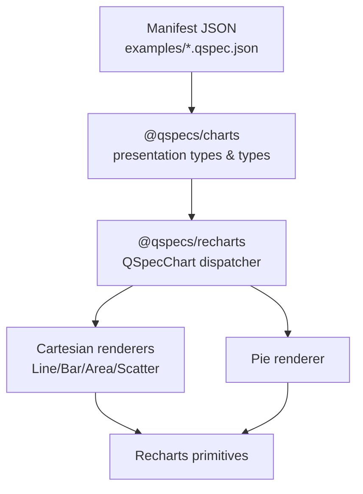
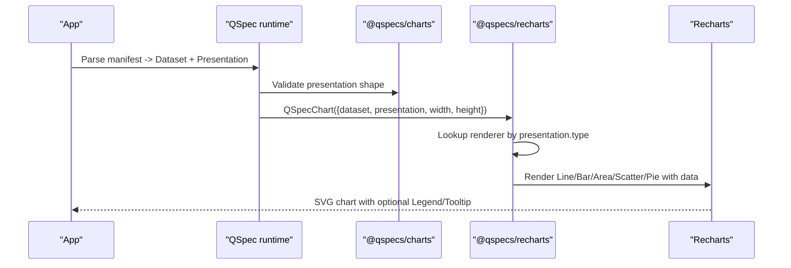
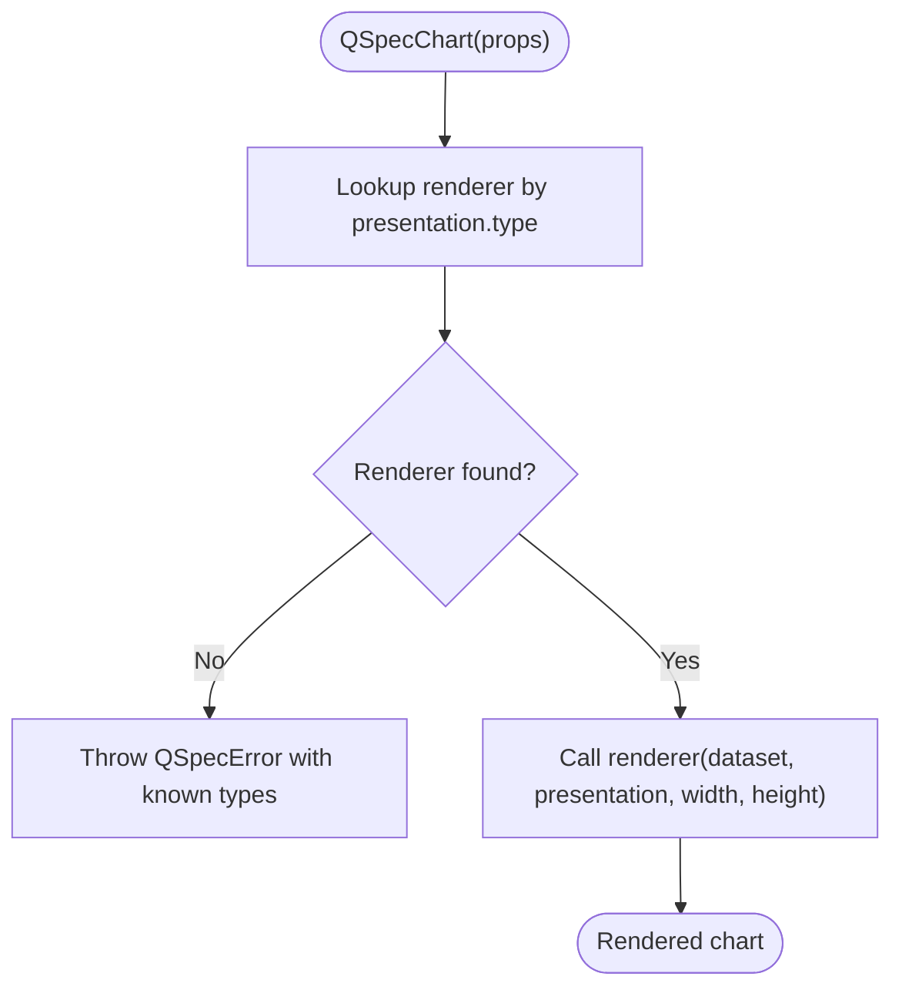
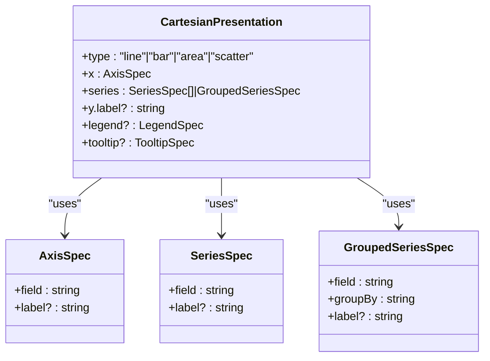
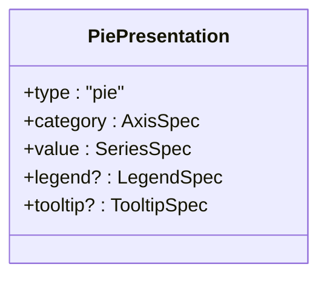
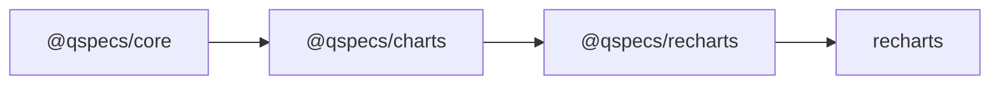

# Configuration and Styling

<cite>
**Referenced Files in This Document**
- [packages/recharts/src/index.ts](file://packages/recharts/src/index.ts)
- [packages/recharts/src/internal/qspec-chart.tsx](file://packages/recharts/src/internal/qspec-chart.tsx)
- [packages/recharts/src/internal/cartesian.tsx](file://packages/recharts/src/internal/cartesian.tsx)
- [packages/recharts/src/internal/pie.tsx](file://packages/recharts/src/internal/pie.tsx)
- [packages/recharts/src/internal/shared.tsx](file://packages/recharts/src/internal/shared.tsx)
- [packages/charts/src/index.ts](file://packages/charts/src/index.ts)
- [packages/charts/src/types.ts](file://packages/charts/src/types.ts)
- [examples/10-chart-grouped-series.qspec.json](file://examples/10-chart-grouped-series.qspec.json)
- [examples/11-chart-pie.qspec.json](file://examples/11-chart-pie.qspec.json)
</cite>

## Table of Contents

1. Introduction
2. Project Structure
3. Core Components
4. Architecture Overview
5. Detailed Component Analysis
6. Dependency Analysis
7. Performance Considerations
8. Troubleshooting Guide
9. Conclusion
10. Appendices

## Introduction

This document explains how to configure and style Recharts-based charts in QSpec. It covers the presentation model, available configuration options (axes, series, legend, tooltip), theme customization via Recharts components, layout sizing, responsive patterns, accessibility considerations, cross-browser compatibility notes, and performance techniques for complex or large datasets. The guidance is grounded in the QSpec chart plugin and Recharts renderer implementations.

## Project Structure

QSpec separates chart semantics from rendering:

- @qspecs/charts defines the presentation types (line, bar, area, scatter, pie) and shared types for axes, series, legend, and tooltips.
- @qspecs/recharts provides React renderers that map those presentations to Recharts components.
- Example manifests show how to declare datasets, queries, and presentations.

**Diagram sources**

- [packages/charts/src/index.ts:1-39](file://packages/charts/src/index.ts#L1-L39)
- [packages/recharts/src/index.ts:1-31](file://packages/recharts/src/index.ts#L1-L31)
- [packages/recharts/src/internal/qspec-chart.tsx:27-96](file://packages/recharts/src/internal/qspec-chart.tsx#L27-L96)

**Section sources**

- [packages/charts/src/index.ts:1-39](file://packages/charts/src/index.ts#L1-L39)
- [packages/recharts/src/index.ts:1-31](file://packages/recharts/src/index.ts#L1-L31)
- [examples/10-chart-grouped-series.qspec.json:1-44](file://examples/10-chart-grouped-series.qspec.json#L1-L44)
- [examples/11-chart-pie.qspec.json:1-31](file://examples/11-chart-pie.qspec.json#L1-L31)

## Core Components

- Presentation types: line, bar, area, scatter, pie are registered by the charts plugin and dispatched by the Recharts package.
- Shared props: dataset, presentation, width, height flow into renderers.
- Legend and tooltip: controlled via presentation.legend.visible and presentation.tooltip.visible; rendered conditionally.

Key responsibilities:

- @qspecs/charts: declares CartesianPresentation and PiePresentation shapes, axis/series specs, and registration of presentation types.
- @qspecs/recharts: maps each presentation type to a Recharts-based component and renders legend/tooltip when enabled.

**Section sources**

- [packages/charts/src/types.ts:3-87](file://packages/charts/src/types.ts#L3-L87)
- [packages/recharts/src/internal/qspec-chart.tsx:10-25](file://packages/recharts/src/internal/qspec-chart.tsx#L10-L25)
- [packages/recharts/src/internal/shared.tsx:7-20](file://packages/recharts/src/internal/shared.tsx#L7-L20)

## Architecture Overview

The rendering pipeline transforms a parsed manifest into a dataset and presentation, then dispatches to a renderer based on presentation.type.

**Diagram sources**

- [packages/recharts/src/internal/qspec-chart.tsx:27-123](file://packages/recharts/src/internal/qspec-chart.tsx#L27-L123)
- [packages/charts/src/index.ts:19-39](file://packages/charts/src/index.ts#L19-L39)

## Detailed Component Analysis

### Presentation Model and Options

- AxisSpec: field and optional label for x-axis or category axis.
- SeriesSpec: field and optional label for y-values per series.
- GroupedSeriesSpec: derive series at render time by partitioning rows on a groupBy field.
- LegendSpec and TooltipSpec: boolean visibility flags.
- CartesianPresentation: x axis, series (array or grouped), optional y label, legend, tooltip.
- PiePresentation: category and value fields, legend, tooltip.

These types define what you can configure in your manifest’s presentation block.

**Section sources**

- [packages/charts/src/types.ts:3-87](file://packages/charts/src/types.ts#L3-L87)

### Rendering Dispatch and Type Safety

- QSpecChart receives dataset, presentation, width, height.
- A Map of known renderers ensures only supported types are rendered; unsupported types throw a named error listing available types.
- Each renderer forwards props to its specific Recharts-based component.

**Diagram sources**

- [packages/recharts/src/internal/qspec-chart.tsx:27-123](file://packages/recharts/src/internal/qspec-chart.tsx#L27-L123)

**Section sources**

- [packages/recharts/src/internal/qspec-chart.tsx:27-123](file://packages/recharts/src/internal/qspec-chart.tsx#L27-L123)

### Cartesian Charts (Line, Bar, Area, Scatter)

- All share the same presentation shape: x axis, one or more series, optional y label, legend, tooltip.
- Series can be explicit (array of SeriesSpec) or grouped (GroupedSeriesSpec).
- Renderers build wide rows and map series to Recharts elements, applying labels and enabling legend/tooltip when configured.

**Diagram sources**

- [packages/charts/src/types.ts:3-43](file://packages/charts/src/types.ts#L3-L43)

**Section sources**

- [packages/recharts/src/internal/cartesian.tsx:267-305](file://packages/recharts/src/internal/cartesian.tsx#L267-L305)
- [packages/charts/src/types.ts:3-43](file://packages/charts/src/types.ts#L3-L43)

### Pie Chart

- Uses category and value fields instead of an x axis and series list.
- Renders slices sized by value with optional legend and tooltip.

**Diagram sources**

- [packages/charts/src/types.ts:80-87](file://packages/charts/src/types.ts#L80-L87)

**Section sources**

- [packages/recharts/src/internal/pie.tsx](file://packages/recharts/src/internal/pie.tsx)
- [packages/charts/src/types.ts:80-87](file://packages/charts/src/types.ts#L80-L87)

### Legend and Tooltip

- Legend and Tooltip are rendered conditionally based on presentation.legend.visible and presentation.tooltip.visible.
- When visible, Recharts’ default Legend and Tooltip components are used.

**Section sources**

- [packages/recharts/src/internal/shared.tsx:7-20](file://packages/recharts/src/internal/shared.tsx#L7-L20)

### Examples

- Grouped series example shows dynamic series derived from a groupBy field.
- Pie example demonstrates category/value mapping with legend and tooltip toggles.

**Section sources**

- [examples/10-chart-grouped-series.qspec.json:1-44](file://examples/10-chart-grouped-series.qspec.json#L1-L44)
- [examples/11-chart-pie.qspec.json:1-31](file://examples/11-chart-pie.qspec.json#L1-L31)

## Dependency Analysis

- @qspecs/recharts depends on @qspecs/core and @qspecs/charts for types and presentation registration.
- Recharts is a peer dependency; the package exports typed components and a dispatcher.
- The charts plugin registers presentation types consumed by the dispatcher.

**Diagram sources**

- [packages/recharts/package.json:33-38](file://packages/recharts/package.json#L33-L38)
- [packages/charts/package.json:33-35](file://packages/charts/package.json#L33-L35)
- [packages/recharts/src/index.ts:1-31](file://packages/recharts/src/index.ts#L1-L31)

**Section sources**

- [packages/recharts/package.json:33-38](file://packages/recharts/package.json#L33-L38)
- [packages/charts/package.json:33-35](file://packages/charts/package.json#L33-L35)
- [packages/recharts/src/index.ts:1-31](file://packages/recharts/src/index.ts#L1-L31)

## Performance Considerations

- Prefer grouped series when many categories exist to avoid manually enumerating series; grouping is resolved at render time and keeps configuration concise.
- Keep width and height stable across re-renders to minimize layout thrashing; compute sizes once and pass them down.
- Limit heavy computations in custom formatters or label functions; prefer precomputed values in the dataset where possible.
- For very large datasets, consider limiting rows via query parameters or server-side pagination before visualization.
- Avoid unnecessary re-renders by memoizing dataset and presentation objects at the caller level.

[No sources needed since this section provides general guidance]

## Troubleshooting Guide

- Unsupported presentation type: If presentation.type is not recognized, QSpecChart throws a named error listing the supported types. Ensure your manifest uses one of the registered types.
- Missing fields: Validation in renderers expects required fields (e.g., x, series/category/value). Ensure your dataset and presentation align.
- Legend/Tooltip not appearing: Verify presentation.legend.visible and presentation.tooltip.visible are set to true when you expect them to render.

**Section sources**

- [packages/recharts/src/internal/qspec-chart.tsx:98-123](file://packages/recharts/src/internal/qspec-chart.tsx#L98-L123)
- [packages/recharts/src/internal/shared.tsx:7-20](file://packages/recharts/src/internal/shared.tsx#L7-L20)

## Conclusion

QSpec’s chart system cleanly separates presentation semantics from rendering. Configure charts through the presentation model (axes, series, legend, tooltip), rely on the dispatcher to route to the correct Recharts-based renderer, and use conditional legend/tooltip toggles. For advanced styling, extend Recharts components within the provided renderers or wrap charts with higher-level components that manage consistent themes and layouts.

[No sources needed since this section summarizes without analyzing specific files]

## Appendices

### Configuration Reference

- Axes and categories
  - x.field / category.field: dataset field to map to the horizontal or categorical axis.
  - x.label / category.label: optional display label for the axis.
- Series and values
  - series[].field: dataset field for y-values per series.
  - series[].label: optional display name for the series.
  - Grouped series: series.field + series.groupBy to derive series dynamically.
- Y-axis label
  - y.label: optional label for the vertical axis in cartesian charts.
- Legend and tooltip
  - legend.visible: show/hide legend.
  - tooltip.visible: show/hide tooltip.

**Section sources**

- [packages/charts/src/types.ts:3-87](file://packages/charts/src/types.ts#L3-L87)

### Theme Customization and Consistency

- Use Recharts’ built-in theming mechanisms (for example, theme overrides or styled wrappers) around the exported chart components to apply consistent colors, fonts, and spacing across your application.
- Centralize color palettes and typography tokens in a single theme object and pass them to your chart wrapper so all charts share the same look and feel.
- For consistent legends and tooltips, enable them via presentation flags and style them consistently at the wrapper level.

[No sources needed since this section provides general guidance]

### Responsive Design Patterns

- Compute width and height based on container size and pass them to the chart component to ensure responsive behavior.
- Debounce resize handlers if recalculating dimensions frequently to avoid excessive re-renders.
- Consider using CSS containers with fixed aspect ratios to maintain visual proportions across breakpoints.

[No sources needed since this section provides general guidance]

### Accessibility Compliance

- Provide meaningful labels via axis and series labels to improve screen reader experiences.
- Ensure tooltips convey essential information for data points.
- Maintain sufficient color contrast in your theme; avoid relying solely on color to encode meaning.

[No sources needed since this section provides general guidance]

### Cross-Browser Compatibility

- Recharts renders SVG via browser APIs; ensure your app runs in environments that support modern SVG features.
- Test charts in target browsers for any differences in text rendering or SVG layout.

[No sources needed since this section provides general guidance]
