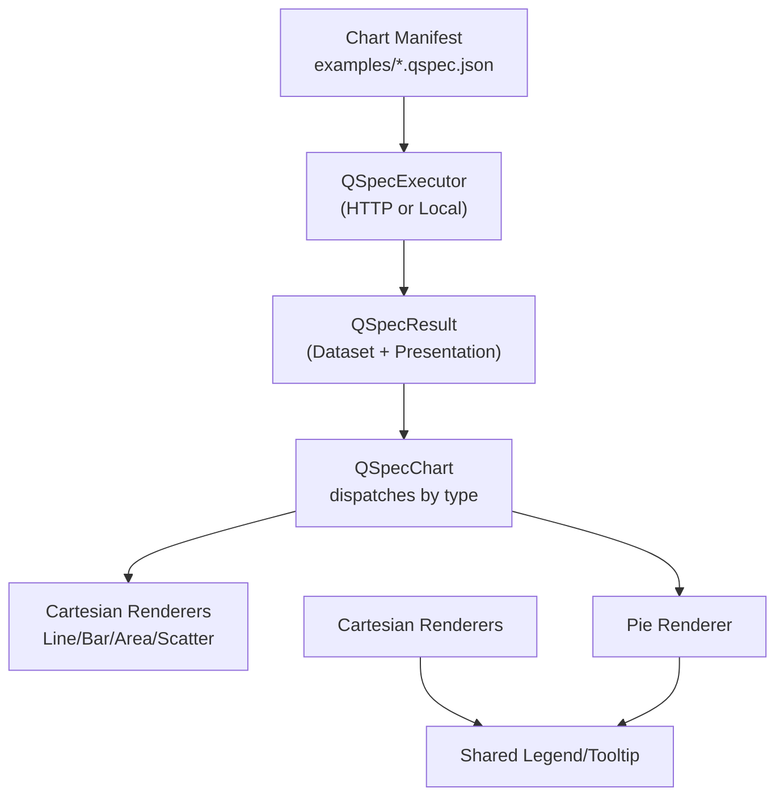
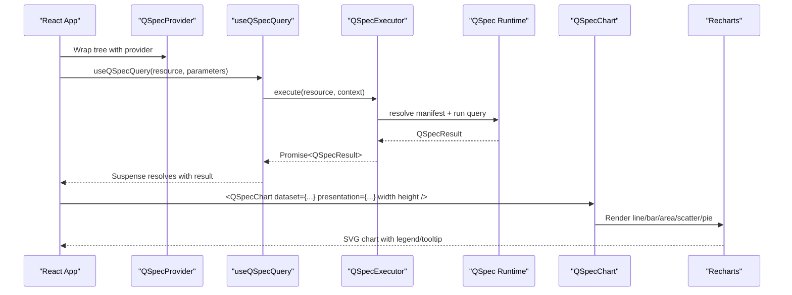
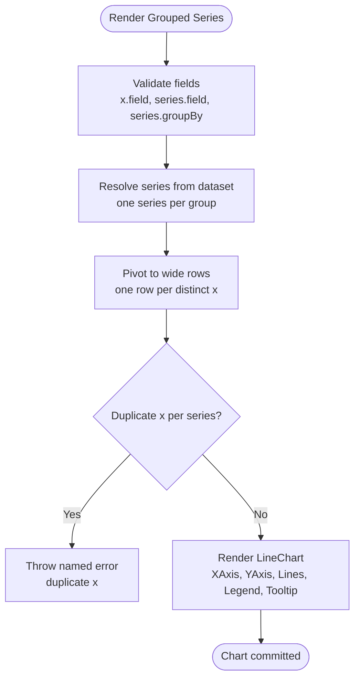
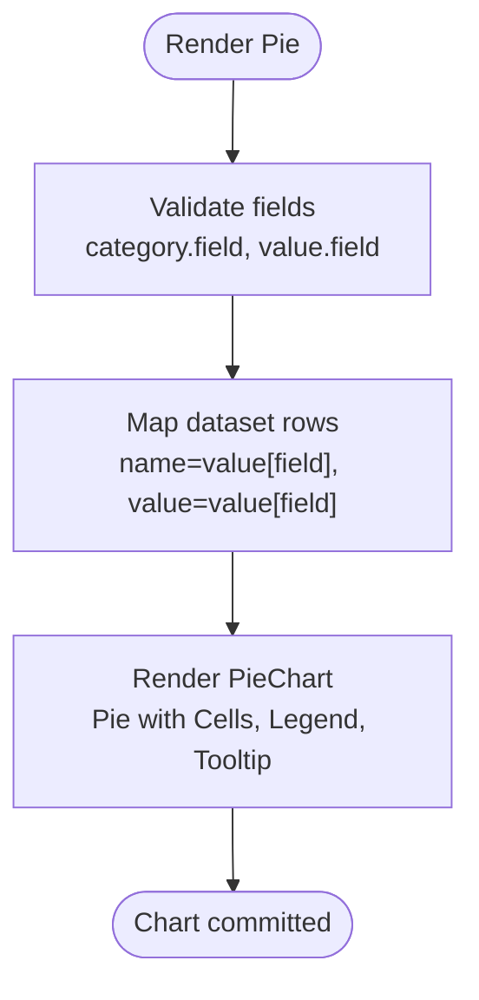
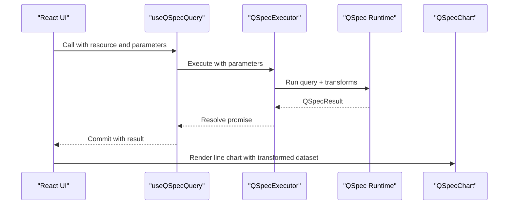
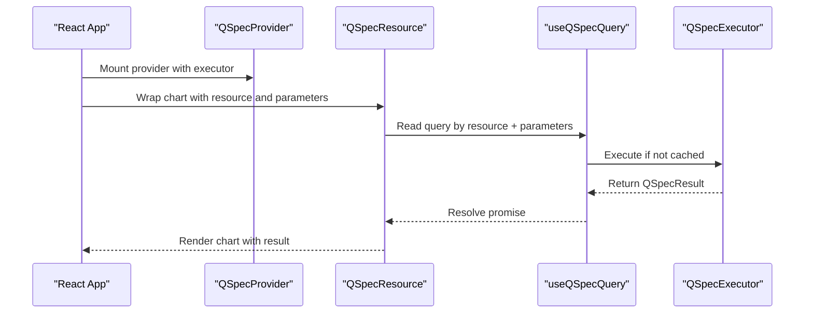

# Integration Examples

<cite>
**Referenced Files in This Document**
- [index.ts](file://packages/recharts/src/index.ts)
- [qspec-chart.tsx](file://packages/recharts/src/internal/qspec-chart.tsx)
- [cartesian.tsx](file://packages/recharts/src/internal/cartesian.tsx)
- [pie.tsx](file://packages/recharts/src/internal/pie.tsx)
- [shared.tsx](file://packages/recharts/src/internal/shared.tsx)
- [react-integration.md](file://docs/react-integration.md)
- [10-chart-grouped-series.qspec.json](file://examples/10-chart-grouped-series.qspec.json)
- [11-chart-pie.qspec.json](file://examples/11-chart-pie.qspec.json)
- [grouped-series-chart.qspec.json](file://fixtures/valid/grouped-series-chart.qspec.json)
- [monthly-revenue-chart.qspec.json](file://fixtures/valid/monthly-revenue-chart.qspec.json)
- [boundaries.test.ts](file://test/boundaries.test.ts)
</cite>

## Table of Contents

1. Introduction
2. Project Structure
3. Core Components
4. Architecture Overview
5. Detailed Component Analysis
6. Dependency Analysis
7. Performance Considerations
8. Troubleshooting Guide
9. Conclusion
10. Appendices

## Introduction

This document provides practical integration examples for using the Recharts renderer within QSpec-based React applications. It demonstrates how to render grouped series charts, pie charts, and more complex visualizations by combining a declarative chart manifest with the Recharts-based components. It also covers React integration patterns, server-side rendering considerations, client-only boundaries, dynamic updates via parameters, user interactions through Recharts’ built-in legend and tooltip, testing strategies, mocking approaches, and debugging techniques grounded in the codebase’s error model.

## Project Structure

The Recharts renderer is implemented as a small set of React components that translate a resolved dataset and presentation definition into Recharts primitives. A central dispatcher selects the correct renderer based on the presentation type, while shared utilities handle legends and tooltips. Chart manifests define queries, datasets, transforms, and presentation metadata; at runtime, these are executed to produce a result consumed by the Recharts components.

**Diagram sources**

- [index.ts:1-32](file://packages/recharts/src/index.ts#L1-L32)
- [qspec-chart.tsx:1-124](file://packages/recharts/src/internal/qspec-chart.tsx#L1-L124)
- [cartesian.tsx:1-336](file://packages/recharts/src/internal/cartesian.tsx#L1-L336)
- [pie.tsx:1-110](file://packages/recharts/src/internal/pie.tsx#L1-L110)
- [shared.tsx:1-21](file://packages/recharts/src/internal/shared.tsx#L1-L21)

**Section sources**

- [index.ts:1-32](file://packages/recharts/src/index.ts#L1-L32)
- [qspec-chart.tsx:1-124](file://packages/recharts/src/internal/qspec-chart.tsx#L1-L124)
- [cartesian.tsx:1-336](file://packages/recharts/src/internal/cartesian.tsx#L1-L336)
- [pie.tsx:1-110](file://packages/recharts/src/internal/pie.tsx#L1-L110)
- [shared.tsx:1-21](file://packages/recharts/src/internal/shared.tsx#L1-L21)

## Core Components

- QSpecChart: Dispatches a dataset and presentation to the appropriate renderer based on presentation.type. It throws a named error when an unsupported type is encountered.
- Cartesian Renderers: LineChart, BarChart, AreaChart, ScatterChart transform resolved series into Recharts-friendly data shapes, validate fields, and render axes, legends, tooltips, and series marks.
- Pie Renderer: Converts dataset rows into category/value pairs and renders slices with optional legend and tooltip.
- Shared Utilities: Provide conditional legend and tooltip elements based on presentation specs.

Key behaviors:

- Field validation: Missing fields throw a named error instead of silently rendering empty charts.
- Grouped vs explicit series: Both render identically after series resolution.
- Client-only boundary: All exports are marked for client usage due to DOM/SVG requirements.

**Section sources**

- [qspec-chart.tsx:10-124](file://packages/recharts/src/internal/qspec-chart.tsx#L10-L124)
- [cartesian.tsx:26-336](file://packages/recharts/src/internal/cartesian.tsx#L26-L336)
- [pie.tsx:10-110](file://packages/recharts/src/internal/pie.tsx#L10-L110)
- [shared.tsx:7-21](file://packages/recharts/src/internal/shared.tsx#L7-L21)
- [index.ts:1-32](file://packages/recharts/src/index.ts#L1-L32)

## Architecture Overview

The integration flow connects a declarative chart manifest to a React UI via an executor and a Recharts-based renderer. The executor can be HTTP-based (browser-to-server) or local (same-process), returning a QSpecResult consumed by QSpecChart.

**Diagram sources**

- [react-integration.md:55-103](file://docs/react-integration.md#L55-L103)
- [react-integration.md:145-177](file://docs/react-integration.md#L145-L177)
- [qspec-chart.tsx:10-124](file://packages/recharts/src/internal/qspec-chart.tsx#L10-L124)
- [cartesian.tsx:231-336](file://packages/recharts/src/internal/cartesian.tsx#L231-L336)
- [pie.tsx:93-110](file://packages/recharts/src/internal/pie.tsx#L93-L110)

## Detailed Component Analysis

### Grouped Series Line Chart Example

A grouped series line chart defines a time axis and a series field grouped by a dimension (e.g., region). At render time, each group becomes a separate line.

- Manifest shape:
  - Parameters: date range inputs bound to the query.
  - Query: SQL grouping by month and region.
  - Dataset: typed fields including currency formatting.
  - Presentation: line chart with x-axis, grouped series, legend, and tooltip.

- Rendering behavior:
  - Series resolution produces one series per group value.
  - Data is pivoted into wide rows for Recharts.
  - Axes and series marks are rendered with labels derived from the presentation.

**Diagram sources**

- [cartesian.tsx:72-105](file://packages/recharts/src/internal/cartesian.tsx#L72-L105)
- [cartesian.tsx:163-196](file://packages/recharts/src/internal/cartesian.tsx#L163-L196)
- [cartesian.tsx:231-259](file://packages/recharts/src/internal/cartesian.tsx#L231-L259)

**Section sources**

- [10-chart-grouped-series.qspec.json:1-44](file://examples/10-chart-grouped-series.qspec.json#L1-L44)
- [grouped-series-chart.qspec.json:1-88](file://fixtures/valid/grouped-series-chart.qspec.json#L1-L88)
- [cartesian.tsx:72-105](file://packages/recharts/src/internal/cartesian.tsx#L72-L105)
- [cartesian.tsx:163-196](file://packages/recharts/src/internal/cartesian.tsx#L163-L196)
- [cartesian.tsx:231-259](file://packages/recharts/src/internal/cartesian.tsx#L231-L259)

### Pie Chart Example

A pie chart maps dataset rows to category/value pairs, producing one slice per row. Aggregation is the caller’s responsibility.

- Manifest shape:
  - Query: groups by category and sums revenue.
  - Dataset: typed category and currency value fields.
  - Presentation: pie chart with category/value mappings, legend, and tooltip.

- Rendering behavior:
  - Rows are mapped to name/value objects.
  - Each row becomes a Cell; animation is disabled to ensure deterministic output in non-browser contexts.

**Diagram sources**

- [pie.tsx:32-53](file://packages/recharts/src/internal/pie.tsx#L32-L53)
- [pie.tsx:64-70](file://packages/recharts/src/internal/pie.tsx#L64-L70)
- [pie.tsx:93-110](file://packages/recharts/src/internal/pie.tsx#L93-L110)

**Section sources**

- [11-chart-pie.qspec.json:1-31](file://examples/11-chart-pie.qspec.json#L1-L31)
- [pie.tsx:32-53](file://packages/recharts/src/internal/pie.tsx#L32-L53)
- [pie.tsx:64-70](file://packages/recharts/src/internal/pie.tsx#L64-L70)
- [pie.tsx:93-110](file://packages/recharts/src/internal/pie.tsx#L93-L110)

### Complex Visualization: Parameterized Monthly Revenue with Transform

This example combines parameters, a SQL query, and a filter transform to produce a single-line chart of monthly revenue.

- Manifest highlights:
  - Parameters: from/to dates and optional country with default.
  - Query: aggregates revenue by month with parameter bindings.
  - Transforms: filters out non-positive revenue values.
  - Presentation: line chart with explicit series array, hidden legend, visible tooltip.

- Rendering behavior:
  - After execution, the transformed dataset is passed to the line renderer.
  - Fields are validated; series are resolved and pivoted; axes and marks are rendered.

**Diagram sources**

- [monthly-revenue-chart.qspec.json:1-111](file://fixtures/valid/monthly-revenue-chart.qspec.json#L1-L111)
- [react-integration.md:73-103](file://docs/react-integration.md#L73-L103)
- [cartesian.tsx:231-259](file://packages/recharts/src/internal/cartesian.tsx#L231-L259)

**Section sources**

- [monthly-revenue-chart.qspec.json:1-111](file://fixtures/valid/monthly-revenue-chart.qspec.json#L1-L111)
- [react-integration.md:73-103](file://docs/react-integration.md#L73-L103)
- [cartesian.tsx:231-259](file://packages/recharts/src/internal/cartesian.tsx#L231-L259)

### React Integration Patterns

- Provider and hooks:
  - Use QSpecProvider to supply an executor.
  - Use useQSpecQuery to fetch and cache results by resource and parameters.
  - Use useQSpecInvalidate to imperatively clear cached entries and trigger refetches.
- Resource wrapper:
  - QSpecResource wraps a component tree with Suspense and error handling responsibilities delegated to the host.
- Client-only boundary:
  - All Recharts-related exports are marked for client usage; avoid server rendering until explicitly supported.

**Diagram sources**

- [react-integration.md:55-103](file://docs/react-integration.md#L55-L103)
- [react-integration.md:105-129](file://docs/react-integration.md#L105-L129)
- [react-integration.md:145-177](file://docs/react-integration.md#L145-L177)

**Section sources**

- [react-integration.md:55-103](file://docs/react-integration.md#L55-L103)
- [react-integration.md:105-129](file://docs/react-integration.md#L105-L129)
- [react-integration.md:145-177](file://docs/react-integration.md#L145-L177)

### Dynamic Updates and User Interactions

- Dynamic updates:
  - Change parameters (e.g., date range or country) to re-suspend and refetch via the same hook; the cache key is content-based.
  - Use invalidate to drop specific or all cached entries and force refetch across components.
- User interactions:
  - Enable legend and tooltip in the presentation to allow users to toggle series visibility and inspect values.
  - Recharts handles interactivity; your component only supplies the configuration.

**Section sources**

- [react-integration.md:73-103](file://docs/react-integration.md#L73-L103)
- [shared.tsx:7-21](file://packages/recharts/src/internal/shared.tsx#L7-L21)

## Dependency Analysis

The Recharts package depends on core types and chart abstractions, and exposes Recharts primitives through a thin layer. Browser safety is enforced by tests that prevent database driver imports in browser-safe packages.

```mermaid
graph LR
Core["@qspecs/core"] --> RechartsPkg["@qspecs/recharts"]
Charts["@qspecs/charts"] --> RechartsPkg
RechartsPkg --> RechartsLib["recharts (external)"]
Tests["boundaries.test.ts"] --> RechartsPkg
```

**Diagram sources**

- [index.ts:1-32](file://packages/recharts/src/index.ts#L1-L32)
- [boundaries.test.ts:100-143](file://test/boundaries.test.ts#L100-L143)

**Section sources**

- [index.ts:1-32](file://packages/recharts/src/index.ts#L1-L32)
- [boundaries.test.ts:100-143](file://test/boundaries.test.ts#L100-L143)

## Performance Considerations

- Explicit sizing: Cartesian and pie renderers require explicit width and height; avoid relying on responsive containers unless you wrap them yourself.
- Deterministic output: Pie disables animations to ensure complete output without requiring requestAnimationFrame ticks.
- Caching: Queries are cached by resource and serialized parameters; changing parameter content triggers refetch, while identical content reuses promises.
- Wide-row pivot: For cartesian charts, data is pivoted once per render; keep datasets reasonably sized to minimize transformation cost.

[No sources needed since this section provides general guidance]

## Troubleshooting Guide

Common errors and their meanings:

- Unsupported presentation type: Thrown when QSpecChart receives a type it does not recognize. Update the manifest or add a renderer.
- Missing fields: Thrown when the presentation references fields not present in the dataset schema. Correct field names or adjust the dataset.
- Duplicate x values: Thrown when a cartesian series has multiple points at the same x. Aggregate the dataset before charting.

Debugging tips:

- Inspect the thrown error codes to identify the exact failure mode.
- Verify dataset fields against the presentation mapping.
- Ensure parameters are correctly bound and transformed where necessary.

**Section sources**

- [qspec-chart.tsx:113-124](file://packages/recharts/src/internal/qspec-chart.tsx#L113-L124)
- [cartesian.tsx:72-105](file://packages/recharts/src/internal/cartesian.tsx#L72-L105)
- [cartesian.tsx:182-186](file://packages/recharts/src/internal/cartesian.tsx#L182-L186)
- [pie.tsx:32-53](file://packages/recharts/src/internal/pie.tsx#L32-L53)

## Conclusion

The Recharts renderer integrates cleanly with QSpec by translating declarative chart manifests into interactive React charts. By leveraging parameters, transforms, and presentation definitions, you can build robust visualizations such as grouped series lines and pies. Follow the React integration patterns for provider setup, caching, and invalidation, respect client-only boundaries, and rely on the renderer’s named errors for fast debugging.

[No sources needed since this section summarizes without analyzing specific files]

## Appendices

### Complete Example References

- Grouped series line chart manifest: [10-chart-grouped-series.qspec.json:1-44](file://examples/10-chart-grouped-series.qspec.json#L1-L44)
- Pie chart manifest: [11-chart-pie.qspec.json:1-31](file://examples/11-chart-pie.qspec.json#L1-L31)
- Parameterized monthly revenue with transform: [monthly-revenue-chart.qspec.json:1-111](file://fixtures/valid/monthly-revenue-chart.qspec.json#L1-L111)

### Testing Strategies

- Boundary enforcement: Tests assert browser-safe packages do not import database drivers and expose only documented paths.
- Mocking executors: Implement the QSpecExecutor interface to return test fixtures for QSpecResult, enabling unit tests without network or database access.
- Component tests: Render QSpecChart with known dataset and presentation; assert presence of axes, series, legend, and tooltip based on presentation flags.

**Section sources**

- [boundaries.test.ts:100-143](file://test/boundaries.test.ts#L100-L143)
- [react-integration.md:145-177](file://docs/react-integration.md#L145-L177)
