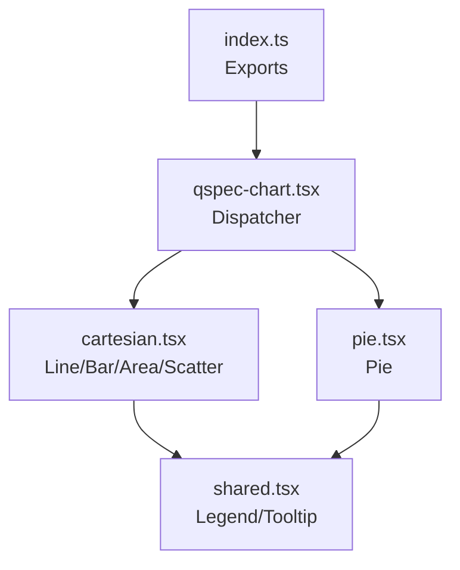
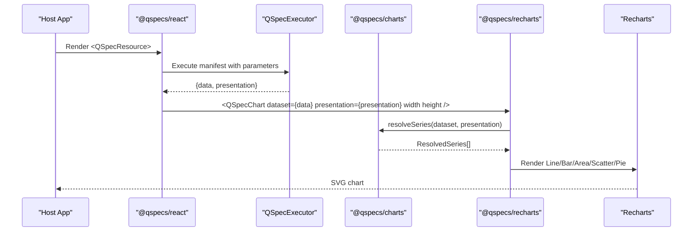
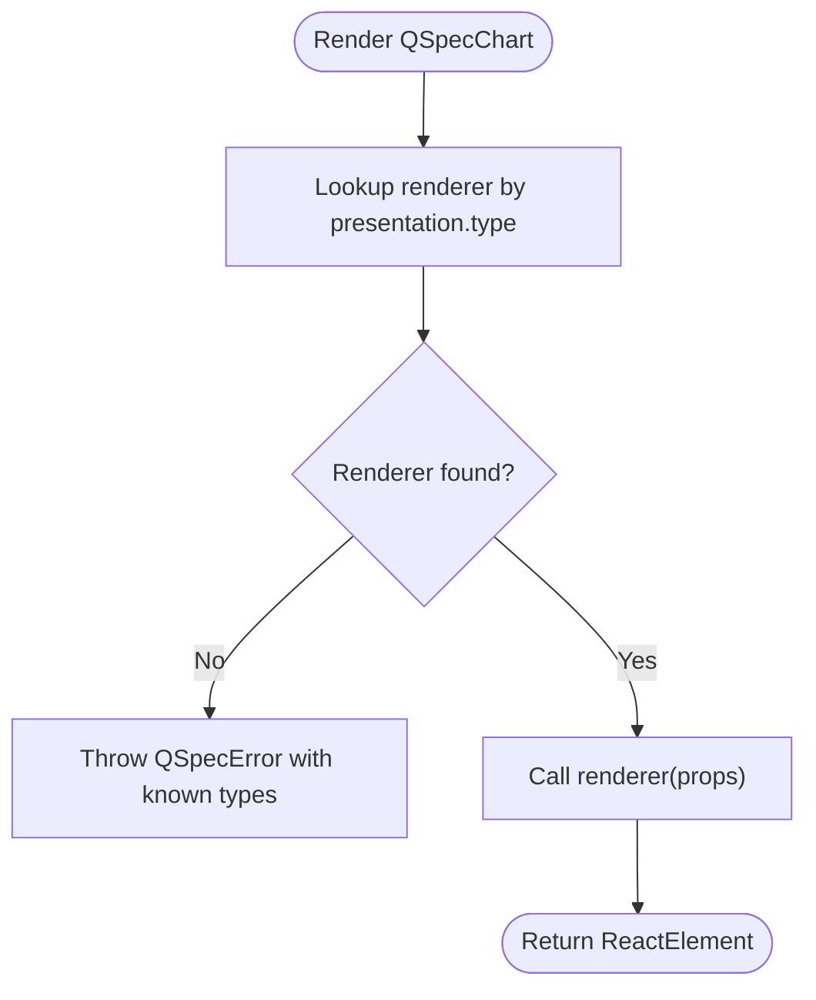
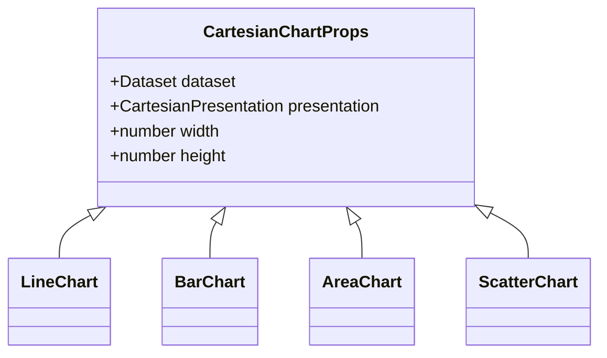
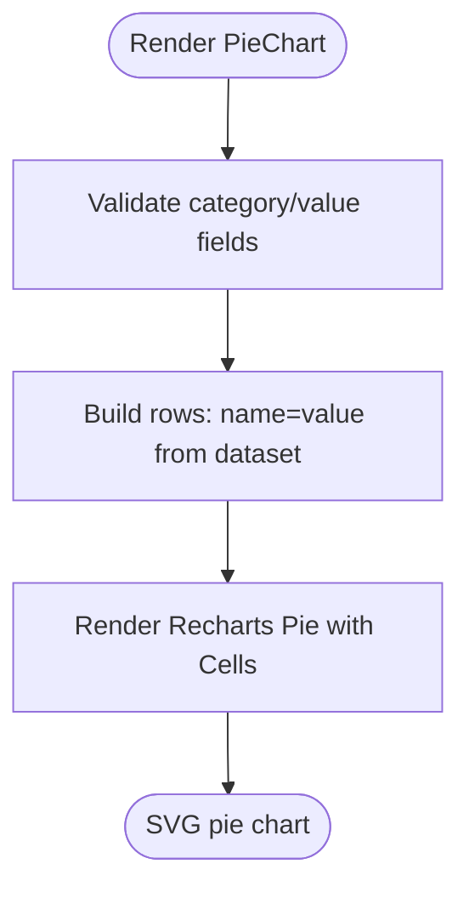
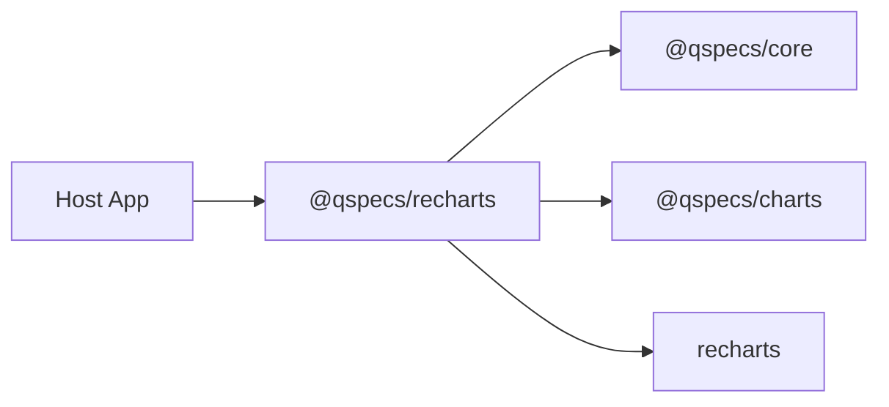

# Recharts Renderer (@qspecs/recharts)

<cite>
**Referenced Files in This Document**
- [README.md](file://README.md)
- [package.json](file://packages/recharts/package.json)
- [index.ts](file://packages/recharts/src/index.ts)
- [qspec-chart.tsx](file://packages/recharts/src/internal/qspec-chart.tsx)
- [cartesian.tsx](file://packages/recharts/src/internal/cartesian.tsx)
- [pie.tsx](file://packages/recharts/src/internal/pie.tsx)
- [shared.tsx](file://packages/recharts/src/internal/shared.tsx)
- [presentations.md](file://docs/presentations.md)
- [architecture.md](file://docs/architecture.md)
- [react-integration.md](file://docs/react-integration.md)
- [10-chart-grouped-series.qspec.json](file://examples/10-chart-grouped-series.qspec.json)
- [11-chart-pie.qspec.json](file://examples/11-chart-pie.qspec.json)
</cite>

## Table of Contents

1. Introduction
2. Project Structure
3. Core Components
4. Architecture Overview
5. Detailed Component Analysis
6. Dependency Analysis
7. Performance Considerations
8. Troubleshooting Guide
9. Conclusion
10. Appendices

## Introduction

This document explains the @qspecs/recharts package, which provides Recharts-based renderers for QSpec chart presentations. It covers how QSpec presentation definitions map to Recharts components, supported chart types (line, bar, area, scatter, pie), configuration mapping, customization options, styling approaches, responsive behavior, interactivity, performance considerations for large datasets, animation defaults, accessibility features, and integration with the Recharts ecosystem. It also outlines migration guidance when moving from other charting libraries into QSpec’s presentation model.

QSpec separates data execution from rendering: a manifest defines query, transforms, dataset schema, and presentation intent; @qspecs/charts resolves semantic series; and @qspecs/recharts renders them using Recharts. The React integration uses Suspense-first patterns and client-only rendering.

**Section sources**

- [README.md:108-181](file://README.md#L108-L181)
- [presentations.md:1-18](file://docs/presentations.md#L1-L18)

## Project Structure

The package exposes a small, focused API surface that dispatches a dataset plus a presentation definition to the appropriate Recharts renderer. Internally it implements:

- A dispatcher component that selects a renderer by presentation.type
- Cartesian chart renderers for line, bar, area, and scatter
- A pie chart renderer
- Shared legend and tooltip helpers

**Diagram sources**

- [index.ts:23-31](file://packages/recharts/src/index.ts#L23-L31)
- [qspec-chart.tsx:40-96](file://packages/recharts/src/internal/qspec-chart.tsx#L40-L96)
- [cartesian.tsx:231-335](file://packages/recharts/src/internal/cartesian.tsx#L231-L335)
- [pie.tsx:93-109](file://packages/recharts/src/internal/pie.tsx#L93-L109)
- [shared.tsx:13-20](file://packages/recharts/src/internal/shared.tsx#L13-L20)

**Section sources**

- [index.ts:1-31](file://packages/recharts/src/index.ts#L1-L31)
- [qspec-chart.tsx:10-25](file://packages/recharts/src/internal/qspec-chart.tsx#L10-L25)
- [package.json:33-38](file://packages/recharts/package.json#L33-L38)

## Core Components

- QSpecChart: Dispatcher that routes a dataset + presentation to the correct renderer based on presentation.type. Throws a named error for unsupported types.
- LineChart, BarChart, AreaChart, ScatterChart: Cartesian renderers that validate fields, resolve series, pivot data where needed, and render Recharts charts with axes, legends, and tooltips.
- PieChart: Renders slices from category/value fields without an x-axis or series list.
- Shared helpers: legendElement and tooltipElement conditionally render Recharts Legend and Tooltip based on presentation flags.

Key behaviors:

- Field validation: Missing fields throw a named QSpecError rather than silently rendering empty charts.
- Series resolution: Cartesian charts use @qspecs/charts’ resolveSeries to obtain a stable, library-agnostic series model.
- Wide-row pivot: Line/Bar/Area convert resolved series into Recharts’ wide-row format for shared x-axis plotting.
- Scatter: Plots each series directly as point clouds without pivoting.
- Animation default: Pie disables JS-interpolated animation to ensure immediate render output.

**Section sources**

- [qspec-chart.tsx:113-123](file://packages/recharts/src/internal/qspec-chart.tsx#L113-L123)
- [cartesian.tsx:72-105](file://packages/recharts/src/internal/cartesian.tsx#L72-L105)
- [cartesian.tsx:163-196](file://packages/recharts/src/internal/cartesian.tsx#L163-L196)
- [cartesian.tsx:231-335](file://packages/recharts/src/internal/cartesian.tsx#L231-L335)
- [pie.tsx:32-70](file://packages/recharts/src/internal/pie.tsx#L32-L70)
- [pie.tsx:93-109](file://packages/recharts/src/internal/pie.tsx#L93-L109)
- [shared.tsx:13-20](file://packages/recharts/src/internal/shared.tsx#L13-L20)

## Architecture Overview

The rendering pipeline integrates three layers:

- QSpec runtime executes manifests and produces a Dataset plus a PresentationDefinition.
- @qspecs/charts resolves semantic series for cartesian presentations.
- @qspecs/recharts maps the resolved model to Recharts components.

**Diagram sources**

- [README.md:138-173](file://README.md#L138-L173)
- [presentations.md:121-171](file://docs/presentations.md#L121-L171)
- [cartesian.tsx:231-335](file://packages/recharts/src/internal/cartesian.tsx#L231-L335)
- [pie.tsx:93-109](file://packages/recharts/src/internal/pie.tsx#L93-L109)

## Detailed Component Analysis

### QSpecChart dispatcher

- Accepts dataset, presentation, width, height.
- Looks up a renderer by presentation.type using a Map keyed by string type.
- Throws a named QSpecError with code indicating unsupported type if no renderer is found.

**Diagram sources**

- [qspec-chart.tsx:40-96](file://packages/recharts/src/internal/qspec-chart.tsx#L40-L96)
- [qspec-chart.tsx:113-123](file://packages/recharts/src/internal/qspec-chart.tsx#L113-L123)

**Section sources**

- [qspec-chart.tsx:10-25](file://packages/recharts/src/internal/qspec-chart.tsx#L10-L25)
- [qspec-chart.tsx:113-123](file://packages/recharts/src/internal/qspec-chart.tsx#L113-L123)

### Cartesian charts (Line, Bar, Area, Scatter)

- Validate referenced fields against dataset schema; missing fields throw a named error.
- Resolve series via @qspecs/charts’ resolveSeries.
- For Line/Bar/Area: pivot resolved series into a wide-row table so Recharts can share one x-axis across multiple series.
- For Scatter: plot each series directly as points without pivoting; axis types are inferred from dataset field types.
- Axes labels come from presentation; optional y label is supported.
- Legends and tooltips are rendered only when enabled in presentation.

**Diagram sources**

- [cartesian.tsx:26-39](file://packages/recharts/src/internal/cartesian.tsx#L26-L39)
- [cartesian.tsx:231-335](file://packages/recharts/src/internal/cartesian.tsx#L231-L335)

**Section sources**

- [cartesian.tsx:72-105](file://packages/recharts/src/internal/cartesian.tsx#L72-L105)
- [cartesian.tsx:163-196](file://packages/recharts/src/internal/cartesian.tsx#L163-L196)
- [cartesian.tsx:231-335](file://packages/recharts/src/internal/cartesian.tsx#L231-L335)

### Pie chart

- Uses category and value fields from presentation to build slice rows.
- Validates fields against dataset schema; missing fields throw a named error.
- Disables JS-interpolated animation by default to ensure immediate render output.
- Renders one Cell per row to preserve a future styling hook.

**Diagram sources**

- [pie.tsx:32-70](file://packages/recharts/src/internal/pie.tsx#L32-L70)
- [pie.tsx:93-109](file://packages/recharts/src/internal/pie.tsx#L93-L109)

**Section sources**

- [pie.tsx:10-16](file://packages/recharts/src/internal/pie.tsx#L10-L16)
- [pie.tsx:32-70](file://packages/recharts/src/internal/pie.tsx#L32-L70)
- [pie.tsx:93-109](file://packages/recharts/src/internal/pie.tsx#L93-L109)

### Shared legend and tooltip

- Conditionally renders Recharts Legend and Tooltip based on presentation flags.
- Used uniformly by both cartesian and pie renderers.

**Section sources**

- [shared.tsx:1-21](file://packages/recharts/src/internal/shared.tsx#L1-L21)

## Dependency Analysis

- Peer dependencies: React and Recharts must be provided by the host application.
- Internal dependencies: @qspecs/core for Dataset and errors; @qspecs/charts for presentation types and series resolution.
- Exports: Per-type chart components and QSpecChart dispatcher.

**Diagram sources**

- [package.json:33-38](file://packages/recharts/package.json#L33-L38)
- [index.ts:23-31](file://packages/recharts/src/index.ts#L23-L31)

**Section sources**

- [package.json:33-38](file://packages/recharts/package.json#L33-L38)
- [index.ts:1-31](file://packages/recharts/src/index.ts#L1-L31)

## Performance Considerations

- Large datasets:
  - Cartesian charts pivot resolved series into a wide-row table. This is efficient for typical dashboard sizes but consider aggregating at the source (SQL groupBy) or via transforms to avoid excessive per-x duplication.
  - Scatter plots do not pivot; they render each series’ point cloud directly.
- Animation:
  - Pie disables JS-interpolated animation by default to ensure immediate render output. If you need animations, wrap the chart in your own container and configure Recharts through props passed down via custom wrappers.
- Rendering size:
  - Components require explicit width and height; they do not auto-resize via ResponsiveContainer. Wrap with your own responsive container if needed.
- Memory and CPU:
  - Series resolution allocates new arrays; values reference original cells to avoid cloning costs. Avoid mutating composite cell values reached through points.

[No sources needed since this section provides general guidance]

## Troubleshooting Guide

Common errors and their meanings:

- Unsupported presentation type: Thrown when presentation.type does not match any registered renderer. The error lists supported types.
- Missing fields: Thrown when a presentation references a field not present in the dataset schema. Includes available fields for diagnosis.
- Duplicate x values in cartesian charts: Thrown when a series has two points at the same x; aggregate the dataset before charting.

Remediation steps:

- Ensure presentation.type matches one of the supported types.
- Verify dataset fields exist and names match exactly; use transforms to rename or derive fields as needed.
- Aggregate data (e.g., SQL GROUP BY or transforms) to eliminate duplicate x values for line/bar/area charts.

**Section sources**

- [qspec-chart.tsx:113-123](file://packages/recharts/src/internal/qspec-chart.tsx#L113-L123)
- [cartesian.tsx:72-105](file://packages/recharts/src/internal/cartesian.tsx#L72-L105)
- [cartesian.tsx:182-186](file://packages/recharts/src/internal/cartesian.tsx#L182-L186)
- [pie.tsx:32-53](file://packages/recharts/src/internal/pie.tsx#L32-L53)

## Conclusion

@qspecs/recharts provides a clean, declarative bridge between QSpec presentation definitions and Recharts. It enforces robust validation, centralizes series resolution via @qspecs/charts, and offers consistent behavior across chart types. Use explicit sizing, rely on presentation-driven configuration, and leverage transforms or SQL aggregation for performance. Integrate via @qspecs/react’s Suspense-first provider and consume results with QSpecChart or per-type components.

[No sources needed since this section summarizes without analyzing specific files]

## Appendices

### Configuration Mapping: QSpec Presentations to Recharts

- Line, Bar, Area:
  - x: AxisSpec mapped to XAxis with dataKey function accessors.
  - series: Array or grouped spec mapped to one mark per series using resolved series.
  - y: Optional label applied to YAxis.
  - legend/tooltip: Rendered when visible is true.
- Scatter:
  - x/y: Axis types inferred from dataset field types.
  - series: Each series plotted as its own point cloud.
- Pie:
  - category/value: Mapped to name/value for slices.
  - legend/tooltip: Rendered when visible is true.

Examples:

- Grouped line chart manifest: see example file.
- Pie chart manifest: see example file.

**Section sources**

- [presentations.md:72-119](file://docs/presentations.md#L72-L119)
- [10-chart-grouped-series.qspec.json:1-44](file://examples/10-chart-grouped-series.qspec.json#L1-L44)
- [11-chart-pie.qspec.json:1-31](file://examples/11-chart-pie.qspec.json#L1-L31)

### Interactivity and Accessibility

- Interactivity:
  - Tooltips and legends are opt-in via presentation flags.
  - Additional interactions (selection, zoom) can be added by wrapping charts with Recharts components or custom logic around the exported chart components.
- Accessibility:
  - Recharts provides accessible SVG elements; ensure host app supplies meaningful titles/descriptions around charts.
  - Legends improve screen reader navigation when enabled.

[No sources needed since this section provides general guidance]

### Integration with Recharts Ecosystem

- Peer dependency on Recharts allows direct usage of Recharts components and utilities in host applications.
- You can extend charts by composing Recharts components around the exported chart components or by creating custom wrappers that pass additional props.

**Section sources**

- [package.json:33-38](file://packages/recharts/package.json#L33-L38)
- [index.ts:23-31](file://packages/recharts/src/index.ts#L23-L31)

### Migration from Other Charting Libraries

- Define QSpec presentations instead of library-specific config.
- Use @qspecs/charts’ resolveSeries to decouple series logic from rendering.
- Replace library-specific markup with QSpecChart or per-type components.
- Keep aggregation in queries or transforms to ensure consistent behavior across renderers.

**Section sources**

- [presentations.md:1-18](file://docs/presentations.md#L1-L18)
- [presentations.md:121-171](file://docs/presentations.md#L121-L171)
- [architecture.md:453-475](file://docs/architecture.md#L453-L475)

### React Integration Notes

- Client-only rendering: Entry files mark components as client-side for bundlers supporting React Server Components.
- Suspense-first: Consume results via @qspecs/react provider and resource components; errors propagate to boundaries.

**Section sources**

- [index.ts:1-22](file://packages/recharts/src/index.ts#L1-L22)
- [react-integration.md:1-25](file://docs/react-integration.md#L1-L25)
