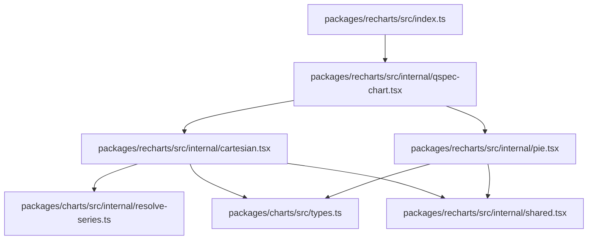
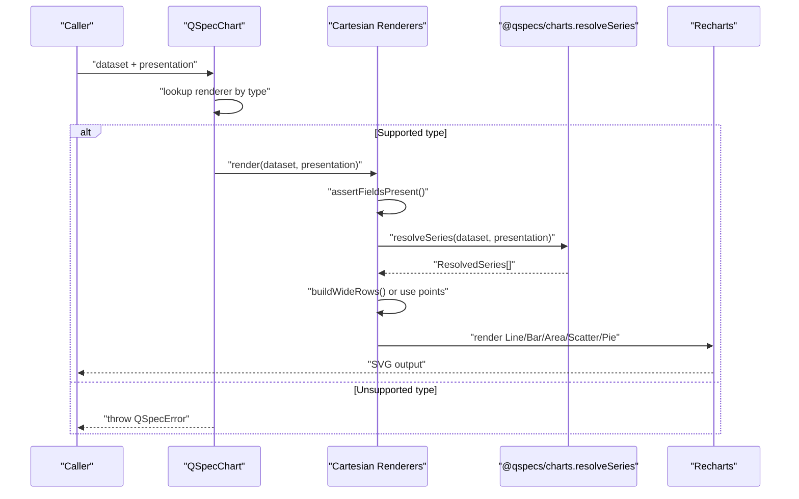
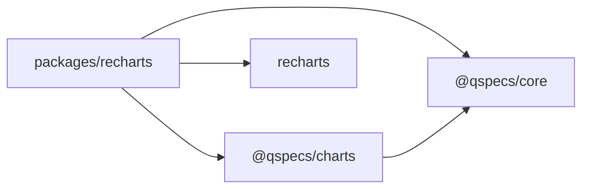
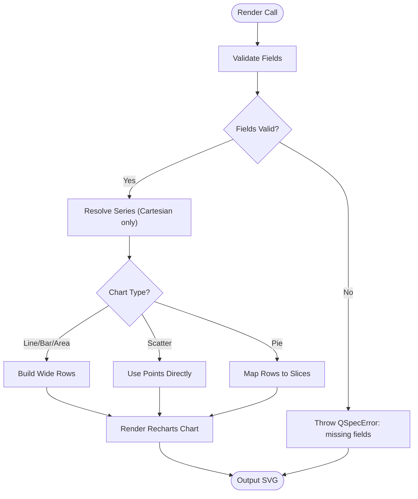
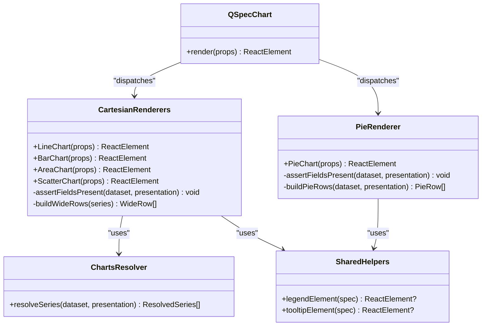

# Renderer Implementation

<cite>
**Referenced Files in This Document**
- [index.ts](file://packages/recharts/src/index.ts)
- [qspec-chart.tsx](file://packages/recharts/src/internal/qspec-chart.tsx)
- [cartesian.tsx](file://packages/recharts/src/internal/cartesian.tsx)
- [pie.tsx](file://packages/recharts/src/internal/pie.tsx)
- [shared.tsx](file://packages/recharts/src/internal/shared.tsx)
- [resolve-series.ts](file://packages/charts/src/internal/resolve-series.ts)
- [types.ts](file://packages/charts/src/types.ts)
- [errors.ts](file://packages/core/src/errors.ts)
</cite>

## Table of Contents

1. [Introduction](#introduction)
2. [Project Structure](#project-structure)
3. [Core Components](#core-components)
4. [Architecture Overview](#architecture-overview)
5. [Detailed Component Analysis](#detailed-component-analysis)
6. [Dependency Analysis](#dependency-analysis)
7. [Performance Considerations](#performance-considerations)
8. [Troubleshooting Guide](#troubleshooting-guide)
9. [Conclusion](#conclusion)
10. [Appendices](#appendices)

## Introduction

This document explains the Recharts renderer implementation architecture for QSpec charts. It focuses on how renderers consume resolved series models produced by `resolveSeries` from `@qspecs/charts`, transform them into Recharts-compatible configurations, and render line, bar, area, scatter, and pie charts. It also covers data transformation steps, error handling strategies, validation processes, debugging approaches, and extension points for custom renderer development.

## Project Structure

The Recharts renderer package exposes a small public surface:

- A dispatcher component that routes a dataset and presentation to the correct renderer based on `presentation.type`.
- Cartesian chart components (line, bar, area, scatter) that validate fields, resolve series, pivot data, and render with Recharts primitives.
- A pie chart component that validates fields, maps rows to slices, and renders with Recharts primitives.
- Shared helpers for legend and tooltip rendering.

**Diagram sources**

- [index.ts:1-32](file://packages/recharts/src/index.ts#L1-L32)
- [qspec-chart.tsx:1-124](file://packages/recharts/src/internal/qspec-chart.tsx#L1-L124)
- [cartesian.tsx:1-336](file://packages/recharts/src/internal/cartesian.tsx#L1-L336)
- [pie.tsx:1-110](file://packages/recharts/src/internal/pie.tsx#L1-L110)
- [resolve-series.ts:1-32](file://packages/charts/src/internal/resolve-series.ts#L1-L32)
- [types.ts:1-87](file://packages/charts/src/types.ts#L1-L87)
- [shared.tsx:1-21](file://packages/recharts/src/internal/shared.tsx#L1-L21)

**Section sources**

- [index.ts:1-32](file://packages/recharts/src/index.ts#L1-L32)
- [qspec-chart.tsx:1-124](file://packages/recharts/src/internal/qspec-chart.tsx#L1-L124)
- [cartesian.tsx:1-336](file://packages/recharts/src/internal/cartesian.tsx#L1-L336)
- [pie.tsx:1-110](file://packages/recharts/src/internal/pie.tsx#L1-L110)
- [shared.tsx:1-21](file://packages/recharts/src/internal/shared.tsx#L1-L21)
- [resolve-series.ts:1-32](file://packages/charts/src/internal/resolve-series.ts#L1-L32)
- [types.ts:1-87](file://packages/charts/src/types.ts#L1-L87)

## Core Components

- Dispatcher: `QSpecChart` selects a renderer by `presentation.type` and throws a named error for unsupported types.
- Cartesian renderers: `LineChart`, `BarChart`, `AreaChart`, `ScatterChart` validate fields, resolve series, pivot data (except scatter), and render using Recharts.
- Pie renderer: `PieChart` validates fields, maps rows to slice entries, and renders using Recharts.
- Shared UI: `legendElement` and `tooltipElement` conditionally render Recharts legend and tooltip when enabled by the presentation.

Key responsibilities:

- Field validation before rendering to avoid silent empty charts.
- Series resolution via `resolveSeries` to ensure consistent behavior across renderers.
- Data pivoting for cartesian charts to match Recharts’ wide-row expectations.
- Axis type inference for scatter plots based on declared field types.

**Section sources**

- [qspec-chart.tsx:10-124](file://packages/recharts/src/internal/qspec-chart.tsx#L10-L124)
- [cartesian.tsx:26-336](file://packages/recharts/src/internal/cartesian.tsx#L26-L336)
- [pie.tsx:10-110](file://packages/recharts/src/internal/pie.tsx#L10-L110)
- [shared.tsx:1-21](file://packages/recharts/src/internal/shared.tsx#L1-L21)

## Architecture Overview

The rendering pipeline is a clear sequence:

1. The dispatcher receives a dataset and a presentation.
2. It selects the appropriate renderer based on `presentation.type`.
3. The selected renderer validates required fields against the dataset schema.
4. For cartesian charts, it calls `resolveSeries` to produce a stable, renderer-independent series model.
5. For cartesian charts (line/bar/area), it pivots resolved series into wide rows; scatter uses point lists directly.
6. It renders Recharts components with axes, legends, tooltips, and series marks.

**Diagram sources**

- [qspec-chart.tsx:40-124](file://packages/recharts/src/internal/qspec-chart.tsx#L40-L124)
- [cartesian.tsx:72-196](file://packages/recharts/src/internal/cartesian.tsx#L72-L196)
- [resolve-series.ts:12-32](file://packages/charts/src/internal/resolve-series.ts#L12-L32)
- [pie.tsx:32-96](file://packages/recharts/src/internal/pie.tsx#L32-L96)

## Detailed Component Analysis

### Dispatcher: QSpecChart

Responsibilities:

- Maintain a registry of supported presentation types and their corresponding React renderers.
- Dispatch to the correct renderer based on runtime `presentation.type`.
- Throw a named `QSpecError` with a code for unsupported types to avoid silent failures.

Design notes:

- Uses a `Map` keyed by string type to avoid prototype chain lookups.
- Error message enumerates known types dynamically from the map keys.

**Section sources**

- [qspec-chart.tsx:27-124](file://packages/recharts/src/internal/qspec-chart.tsx#L27-L124)

### Cartesian Renderers: Line, Bar, Area, Scatter

Shared flow:

- Validate fields present in the dataset (`assertFieldsPresent`).
- Resolve series via `resolveSeries` to obtain a stable list of plottable series.
- For line/bar/area: pivot resolved series into wide rows (`buildWideRows`) so each row represents one x value with an array of y values per series.
- For scatter: render each series’ points directly without pivoting.
- Derive axis types for scatter based on declared field types.
- Render Recharts chart with X/Y axes, optional legend/tooltip, and series marks.

Data transformation details:

- Wide rows are keyed by a normalized x identity to avoid collisions between numeric and string x values.
- Row order is determined by the minimum source dataset index among contributing points to preserve original ordering semantics.
- Duplicate x within a single series triggers a named error to prevent silent data loss.

Axis and labels:

- Labels are applied only when provided by the presentation.
- Scatter axis type is inferred from dataset field types to avoid misconfigured numeric/category axes.

**Section sources**

- [cartesian.tsx:26-105](file://packages/recharts/src/internal/cartesian.tsx#L26-L105)
- [cartesian.tsx:107-196](file://packages/recharts/src/internal/cartesian.tsx#L107-L196)
- [cartesian.tsx:198-336](file://packages/recharts/src/internal/cartesian.tsx#L198-L336)

### Pie Renderer

Flow:

- Validate category and value fields exist in the dataset.
- Map each dataset row to a pie entry with name/value pairs.
- Render Recharts pie with cells per row; disable animation to ensure deterministic initial render.

Behavioral notes:

- Each dataset row becomes a slice; aggregation is the caller’s responsibility if multiple rows share a category.
- Legend and tooltip are rendered only when explicitly enabled by the presentation.

**Section sources**

- [pie.tsx:18-110](file://packages/recharts/src/internal/pie.tsx#L18-L110)

### Shared Helpers: Legend and Tooltip

- Conditionally render Recharts `<Legend>` and `<Tooltip>` based on `visible` flags in the presentation.
- Used uniformly across cartesian and pie renderers.

**Section sources**

- [shared.tsx:1-21](file://packages/recharts/src/internal/shared.tsx#L1-L21)

### Series Resolution: @qspecs/charts

- `resolveSeries` converts a cartesian presentation’s series declaration into concrete, plottable series.
- Handles both explicit arrays of series and grouped series that pivot at call time.
- Produces `ResolvedSeries` with stable keys, labels, and point lists including source row indices for ordering.
- Ownership semantics: returned structures are freshly allocated; point values reference dataset cells to avoid cloning overhead.

**Section sources**

- [resolve-series.ts:12-32](file://packages/charts/src/internal/resolve-series.ts#L12-L32)
- [types.ts:28-87](file://packages/charts/src/types.ts#L28-L87)

## Dependency Analysis

The Recharts renderer depends on:

- `@qspecs/core` for error types and dataset/presentation definitions.
- `@qspecs/charts` for shared series resolution and presentation types.
- `recharts` for chart primitives.

**Diagram sources**

- [index.ts:1-32](file://packages/recharts/src/index.ts#L1-L32)
- [cartesian.tsx:1-24](file://packages/recharts/src/internal/cartesian.tsx#L1-L24)
- [pie.tsx:1-9](file://packages/recharts/src/internal/pie.tsx#L1-L9)
- [resolve-series.ts:1-7](file://packages/charts/src/internal/resolve-series.ts#L1-L7)
- [types.ts:1-87](file://packages/charts/src/types.ts#L1-L87)

**Section sources**

- [index.ts:1-32](file://packages/recharts/src/index.ts#L1-L32)
- [cartesian.tsx:1-24](file://packages/recharts/src/internal/cartesian.tsx#L1-L24)
- [pie.tsx:1-9](file://packages/recharts/src/internal/pie.tsx#L1-L9)
- [resolve-series.ts:1-7](file://packages/charts/src/internal/resolve-series.ts#L1-L7)
- [types.ts:1-87](file://packages/charts/src/types.ts#L1-L87)

## Performance Considerations

- Avoid unnecessary cloning: `resolveSeries` returns references to dataset cell values to reduce memory pressure on large datasets.
- Pivoting cost: cartesian charts build a wide table once per render; this is acceptable since renderers typically call it once per chart.
- Axis type inference for scatter avoids misconfiguration and re-renders due to incorrect axis types.
- Disabling pie animation ensures deterministic first-frame rendering, avoiding extra ticks in non-interactive environments.

[No sources needed since this section provides general guidance]

## Troubleshooting Guide

Common issues and diagnostics:

- Unsupported presentation type: `QSpecChart` throws a named error listing known types. Use the error code to identify configuration mismatches.
- Missing fields: Cartesian and pie renderers throw a named error indicating which fields are missing and what fields are available.
- Duplicate x in cartesian series: Throws a named error instructing to aggregate the dataset before charting.
- Empty or null x values: Skipped during pivoting to avoid ambiguous collisions; check data quality if expected points are missing.

Error types and codes used:

- `QSpecError` base class with stable `code` property for programmatic handling.
- Specific codes include unsupported chart type, missing fields, duplicate x, etc.

Debugging tips:

- Inspect the thrown error’s `code` and message to pinpoint the failure stage.
- Verify dataset schema matches presentation field references.
- Ensure series declarations align with actual data grouping and aggregation needs.

**Section sources**

- [qspec-chart.tsx:113-124](file://packages/recharts/src/internal/qspec-chart.tsx#L113-L124)
- [cartesian.tsx:72-105](file://packages/recharts/src/internal/cartesian.tsx#L72-L105)
- [cartesian.tsx:163-196](file://packages/recharts/src/internal/cartesian.tsx#L163-L196)
- [pie.tsx:32-53](file://packages/recharts/src/internal/pie.tsx#L32-L53)
- [errors.ts:44-86](file://packages/core/src/errors.ts#L44-L86)

## Conclusion

The Recharts renderer implements a clean separation of concerns:

- A dispatcher ensures type-safe routing to the correct renderer.
- Cartesian and pie renderers validate inputs, transform data consistently, and leverage Recharts primitives.
- Series resolution is centralized in `@qspecs/charts` to guarantee portability and consistency across renderers.
- Strong error handling and validation prevent silent failures and provide actionable diagnostics.

This design enables reliable, predictable chart rendering while keeping the renderer focused on visualization concerns and leaving series semantics to a shared resolver.

[No sources needed since this section summarizes without analyzing specific files]

## Appendices

### Rendering Pipeline Flowchart

**Diagram sources**

- [cartesian.tsx:72-196](file://packages/recharts/src/internal/cartesian.tsx#L72-L196)
- [pie.tsx:32-96](file://packages/recharts/src/internal/pie.tsx#L32-L96)

### Class Relationships Diagram

**Diagram sources**

- [qspec-chart.tsx:40-124](file://packages/recharts/src/internal/qspec-chart.tsx#L40-L124)
- [cartesian.tsx:72-336](file://packages/recharts/src/internal/cartesian.tsx#L72-L336)
- [pie.tsx:32-110](file://packages/recharts/src/internal/pie.tsx#L32-L110)
- [resolve-series.ts:12-32](file://packages/charts/src/internal/resolve-series.ts#L12-L32)
- [shared.tsx:1-21](file://packages/recharts/src/internal/shared.tsx#L1-L21)
