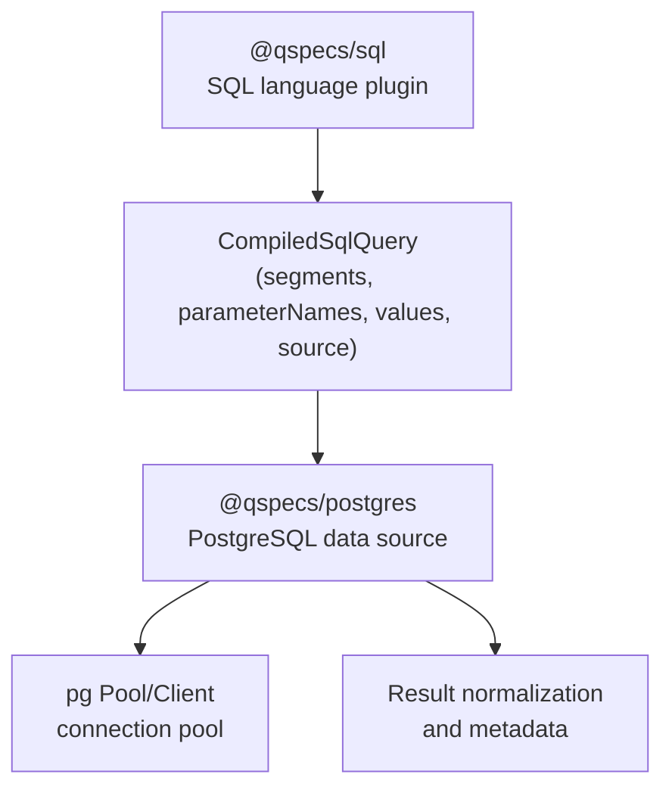
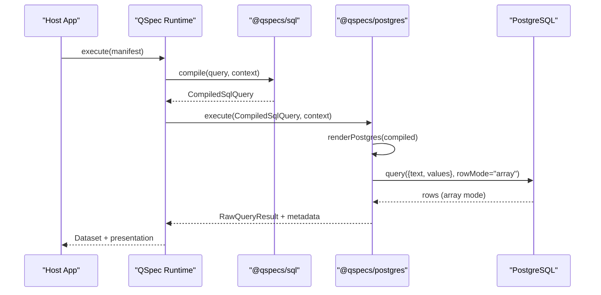
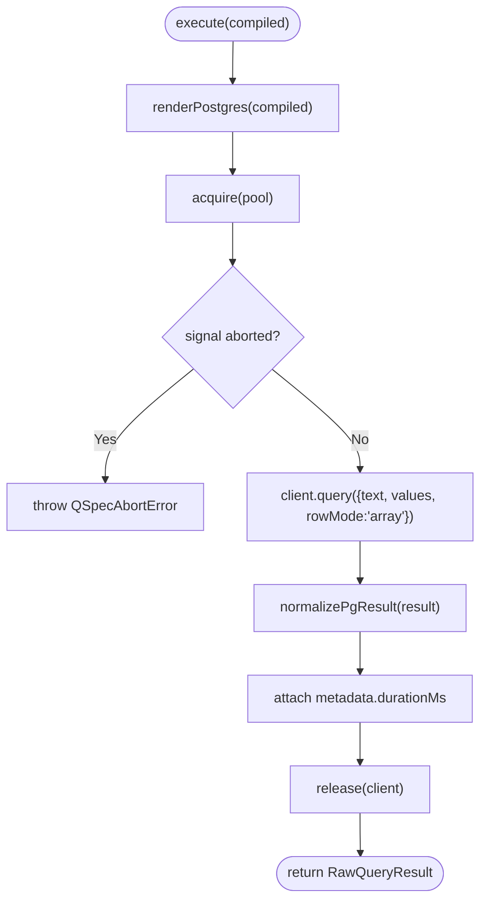
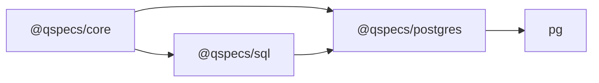

# Database Compatibility and Dialects

<cite>
**Referenced Files in This Document**
- [README.md](file://README.md)
- [architecture.md](file://docs/architecture.md)
- [index.ts](file://packages/sql/src/index.ts)
- [compile.ts](file://packages/sql/src/internal/compile.ts)
- [render.ts](file://packages/postgres/src/internal/render.ts)
- [source.ts](file://packages/postgres/src/internal/source.ts)
- [driver.ts](file://packages/postgres/src/internal/driver.ts)
- [package.json (sql)](file://packages/sql/package.json)
- [package.json (postgres)](file://packages/postgres/package.json)
</cite>

## Table of Contents

1. Introduction
2. Project Structure
3. Core Components
4. Architecture Overview
5. Detailed Component Analysis
6. Dependency Analysis
7. Performance Considerations
8. Troubleshooting Guide
9. Conclusion
10. Appendices

## Introduction

This document explains how QSpec achieves database compatibility through a dialect-neutral SQL compilation model and a PostgreSQL adapter. It focuses on the CompiledSqlQuery format, how it enables cross-database execution, PostgreSQL-specific behaviors, limitations when targeting other databases, migration considerations, and best practices for choosing compatible SQL features. It also covers connection management, transaction handling, error mapping, and testing strategies for multi-database environments.

## Project Structure

QSpec separates SQL language support from database drivers:

- The SQL package defines a dialect-neutral compiled query representation and validates named-parameter statements.
- The PostgreSQL package renders that representation into PostgreSQL-specific text and parameters, manages connections via pooling, normalizes results, and maps errors safely.

**Diagram sources**

- [index.ts:16-29](file://packages/sql/src/index.ts#L16-L29)
- [compile.ts:27-36](file://packages/sql/src/internal/compile.ts#L27-L36)
- [source.ts:233-289](file://packages/postgres/src/internal/source.ts#L233-L289)
- [driver.ts:151-190](file://packages/postgres/src/internal/driver.ts#L151-L190)

**Section sources**

- [index.ts:1-30](file://packages/sql/src/index.ts#L1-L30)
- [compile.ts:1-152](file://packages/sql/src/internal/compile.ts#L1-L152)
- [render.ts:1-23](file://packages/postgres/src/internal/render.ts#L1-L23)
- [source.ts:1-309](file://packages/postgres/src/internal/source.ts#L1-L309)
- [driver.ts:1-192](file://packages/postgres/src/internal/driver.ts#L1-L192)

## Core Components

- Dialect-neutral SQL compilation: The SQL plugin compiles a :name-parameterized statement into a CompiledSqlQuery with no raw SQL text. This prevents accidental interpolation and forces adapters to render placeholders explicitly.
- PostgreSQL adapter: Renders segments into PostgreSQL $n placeholders, executes via pg.Pool, normalizes rows, and wraps driver errors without leaking connection strings.
- Validation: Static checks ensure every referenced binding exists and no unused bindings remain; positional placeholders are rejected to avoid collisions with adapter-generated placeholders.

Key responsibilities:

- @qspecs/sql: compileSql, validateSqlQuery, export CompiledSqlQuery.
- @qspecs/postgres: renderPostgres, createPostgresSource, error wrapping, result normalization, cancellation.

**Section sources**

- [compile.ts:27-36](file://packages/sql/src/internal/compile.ts#L27-L36)
- [compile.ts:65-90](file://packages/sql/src/internal/compile.ts#L65-L90)
- [compile.ts:100-151](file://packages/sql/src/internal/compile.ts#L100-L151)
- [render.ts:4-22](file://packages/postgres/src/internal/render.ts#L4-L22)
- [source.ts:47-54](file://packages/postgres/src/internal/source.ts#L47-L54)

## Architecture Overview

The runtime pipeline is plugin-driven:

- The sql() plugin registers a QueryLanguage that compiles manifests’ SQL into CompiledSqlQuery.
- The postgres() plugin registers one DataSource per configured name. Each DataSource executes CompiledSqlQuery by rendering it to PostgreSQL-specific text and parameters, then returns normalized rows.

**Diagram sources**

- [index.ts:16-29](file://packages/sql/src/index.ts#L16-L29)
- [compile.ts:65-90](file://packages/sql/src/internal/compile.ts#L65-L90)
- [source.ts:233-289](file://packages/postgres/src/internal/source.ts#L233-L289)
- [render.ts:12-22](file://packages/postgres/src/internal/render.ts#L12-L22)
- [driver.ts:151-190](file://packages/postgres/src/internal/driver.ts#L151-L190)

## Detailed Component Analysis

### Dialect-neutral CompiledSqlQuery

- No text field: Enforces that adapters must generate their own placeholders, preventing value interpolation and ensuring safe parameter binding.
- Segments and parameterNames: Represent literal SQL between parameters in order; adapters insert placeholders at each gap.
- Values: Resolved bound values in the same order as gaps; repeated parameters produce repeated values.
- Source: Logical data source name resolved by the host.

Why this matters:

- Cross-database compatibility: Any SQL adapter can consume CompiledSqlQuery and render its native placeholder style.
- Security: By construction, bound values never reach the database as SQL text.

**Section sources**

- [compile.ts:27-36](file://packages/sql/src/internal/compile.ts#L27-L36)
- [architecture.md:287-299](file://docs/architecture.md#L287-L299)

### PostgreSQL Rendering and Execution

- Placeholder strategy: Inserts $1, $2, … after each segment; repeated parameters get distinct placeholders and repeated values to avoid index mapping complexity.
- Row mode: Uses array mode for predictable positional alignment with columns.
- Connection pooling: Lazily creates pg.Pool per source; supports max connections and statement_timeout.
- Cancellation: On abort, opens a separate client to call pg_cancel_backend(pid), avoiding blocking the querying connection.
- Error mapping: Wraps driver errors into QueryExecutionError with cause attached; messages intentionally omit connection details.

**Diagram sources**

- [source.ts:233-289](file://packages/postgres/src/internal/source.ts#L233-L289)
- [render.ts:12-22](file://packages/postgres/src/internal/render.ts#L12-L22)
- [driver.ts:151-190](file://packages/postgres/src/internal/driver.ts#L151-L190)

**Section sources**

- [render.ts:4-22](file://packages/postgres/src/internal/render.ts#L4-L22)
- [source.ts:145-172](file://packages/postgres/src/internal/source.ts#L145-L172)
- [source.ts:174-231](file://packages/postgres/src/internal/source.ts#L174-L231)
- [source.ts:233-289](file://packages/postgres/src/internal/source.ts#L233-L289)
- [driver.ts:123-138](file://packages/postgres/src/internal/driver.ts#L123-L138)

### SQL Validation and Safety

- Rejects positional placeholders to prevent collision with adapter-generated ones.
- Ensures every :name has a matching declared binding and flags unused bindings.
- Safe binding resolution uses Object.hasOwn to avoid prototype pollution risks.

Practical implications:

- Write only :name parameters in statements.
- Keep bindings minimal and exact to catch typos early.

**Section sources**

- [compile.ts:65-90](file://packages/sql/src/internal/compile.ts#L65-L90)
- [compile.ts:100-151](file://packages/sql/src/internal/compile.ts#L100-L151)

### PostgreSQL-Specific Features and Limitations

- Features used:
  - Named parameters compiled to $n placeholders.
  - Server-side cancellation via pg_cancel_backend on a dedicated connection.
  - Statement-level timeout via pool statement_timeout.
  - Array row mode for deterministic column ordering.
- Limitations when targeting other databases:
  - Placeholders differ ($n vs ? or :name).
  - Cancellation APIs vary or may not exist.
  - Type coercion and JSON serialization differ across engines.
  - Some functions or syntax may be vendor-specific.

Migration considerations:

- Replace vendor-specific functions with portable constructs where possible.
- Avoid relying on implicit type casting; use explicit casts if needed.
- Test with representative datasets to validate behavior under different engines.

**Section sources**

- [render.ts:4-22](file://packages/postgres/src/internal/render.ts#L4-L22)
- [source.ts:145-172](file://packages/postgres/src/internal/source.ts#L145-L172)
- [source.ts:56-64](file://packages/postgres/src/internal/source.ts#L56-L64)
- [driver.ts:123-138](file://packages/postgres/src/internal/driver.ts#L123-L138)

### Connection Management and Transactions

- Connections:
  - Pools are created lazily per source and closed on dispose.
  - Each execute acquires a client, runs the query, and releases it promptly.
  - Connection errors outside queries are logged without leaking credentials.
- Transactions:
  - Not provided by the current PostgreSQL source; execute runs single statements.
  - For multi-statement transactions, wrap calls in your application layer using the underlying driver or extend the source.

Best practices:

- Keep statements short and idempotent.
- Use statement_timeout to guard long-running queries.
- Handle abort signals to cancel work promptly.

**Section sources**

- [source.ts:174-231](file://packages/postgres/src/internal/source.ts#L174-L231)
- [source.ts:276-289](file://packages/postgres/src/internal/source.ts#L276-L289)
- [driver.ts:151-190](file://packages/postgres/src/internal/driver.ts#L151-L190)

### Error Mapping Across Systems

- Driver errors are wrapped into QueryExecutionError with cause attached; messages do not repeat sensitive details.
- Connection errors emitted by pools/clients are handled and logged without exposing connection strings.
- Aborts surface as QSpecAbortError, preserving the reason.

Operational guidance:

- Inspect error.cause for diagnostics in logs or monitoring.
- Do not log full error messages directly to users; sanitize as implemented.

**Section sources**

- [source.ts:47-54](file://packages/postgres/src/internal/source.ts#L47-L54)
- [source.ts:102-112](file://packages/postgres/src/internal/source.ts#L102-L112)
- [source.ts:145-172](file://packages/postgres/src/internal/source.ts#L145-L172)

### Choosing Compatible SQL Features

Guidelines for maximum compatibility:

- Prefer standard SQL constructs over vendor extensions.
- Use explicit casts and well-defined date/time formats.
- Avoid complex window functions unless supported by all targets.
- Keep expressions simple and testable against multiple engines.
- Validate bindings statically before execution to catch issues early.

Testing strategies for multi-database environments:

- Use the same CompiledSqlQuery across adapters; only change rendering and driver layers.
- Maintain fixture datasets that exercise edge cases (nulls, large inputs, time zones).
- Add integration tests per target database to verify behavior differences.
- Leverage the existing PostgreSQL end-to-end flow as a template for other adapters.

[No sources needed since this section provides general guidance]

## Dependency Analysis

- @qspecs/sql depends only on @qspecs/core and exposes a dialect-neutral interface.
- @qspecs/postgres depends on @qspecs/core, @qspecs/sql, and pg; it encapsulates all pg usage internally except in the driver seam.
- The separation ensures that adding new SQL adapters does not affect core or the SQL plugin.

**Diagram sources**

- [package.json (sql):33-35](file://packages/sql/package.json#L33-L35)
- [package.json (postgres):33-39](file://packages/postgres/package.json#L33-L39)

**Section sources**

- [package.json (sql):1-44](file://packages/sql/package.json#L1-L44)
- [package.json (postgres):1-52](file://packages/postgres/package.json#L1-L52)

## Performance Considerations

- Use statement_timeout to limit runaway queries.
- Tune pool.max based on workload and database capacity.
- Prefer compact, indexed queries; avoid unnecessary joins and subqueries.
- Reuse CompiledSqlQuery where appropriate to reduce compilation overhead.
- Monitor durationMs in metadata to identify slow endpoints.

[No sources needed since this section provides general guidance]

## Troubleshooting Guide

Common issues and resolutions:

- Missing or extra bindings:
  - Symptom: Compilation fails with missing binding or unused binding.
  - Fix: Ensure every :name in the statement has a corresponding entry in bindings and vice versa.
- Positional placeholders in statements:
  - Symptom: Validation rejects the statement.
  - Fix: Replace with :name parameters; let the adapter generate placeholders.
- Slow or hanging queries:
  - Action: Enable statement_timeout; check indexes; review query plan.
  - Use abort signals to cancel long-running requests.
- Connection errors:
  - Symptom: Errors during acquire or idle socket events.
  - Action: Check network and credentials; inspect logs; verify pool settings.
- Data shape mismatches:
  - Symptom: Rows misaligned with columns.
  - Action: Ensure rowMode is set to array when implementing custom adapters.

**Section sources**

- [compile.ts:100-151](file://packages/sql/src/internal/compile.ts#L100-L151)
- [source.ts:174-231](file://packages/postgres/src/internal/source.ts#L174-L231)
- [driver.ts:123-138](file://packages/postgres/src/internal/driver.ts#L123-L138)

## Conclusion

QSpec’s design isolates SQL semantics from database specifics through CompiledSqlQuery, enabling safe, portable query definitions while allowing adapters like PostgreSQL to add engine-specific optimizations. By enforcing named parameters, validating bindings, and carefully managing connections and errors, the system provides a robust foundation for multi-database deployments. When extending to other databases, focus on placeholder rendering, cancellation strategies, type handling, and thorough testing to maintain compatibility and security.

## Appendices

### Quick Reference: Key Interfaces and Roles

- CompiledSqlQuery: Dialect-neutral query structure with segments, parameterNames, values, and source.
- sql(): Registers the SQL language plugin that compiles and validates statements.
- postgres(): Registers PostgreSQL data sources with pooling, cancellation, and normalized results.
- renderPostgres(): Converts CompiledSqlQuery to PostgreSQL text and values.

**Section sources**

- [compile.ts:27-36](file://packages/sql/src/internal/compile.ts#L27-L36)
- [index.ts:16-29](file://packages/sql/src/index.ts#L16-L29)
- [render.ts:12-22](file://packages/postgres/src/internal/render.ts#L12-L22)
- [source.ts:296-309](file://packages/postgres/src/internal/source.ts#L296-L309)
