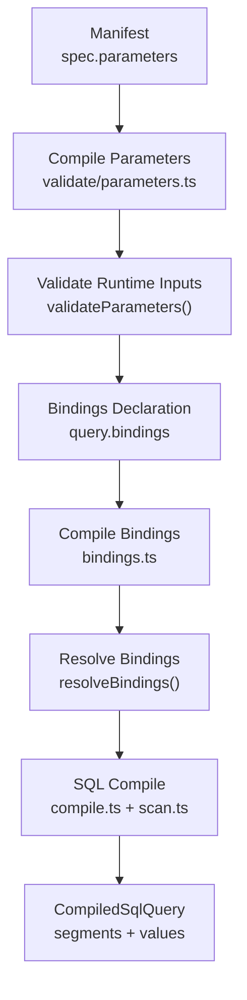
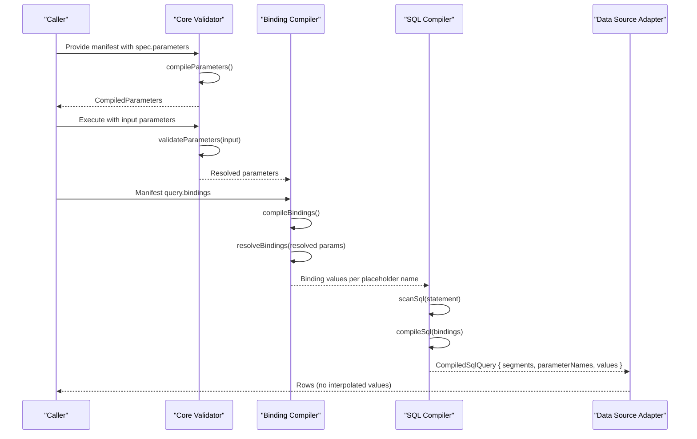
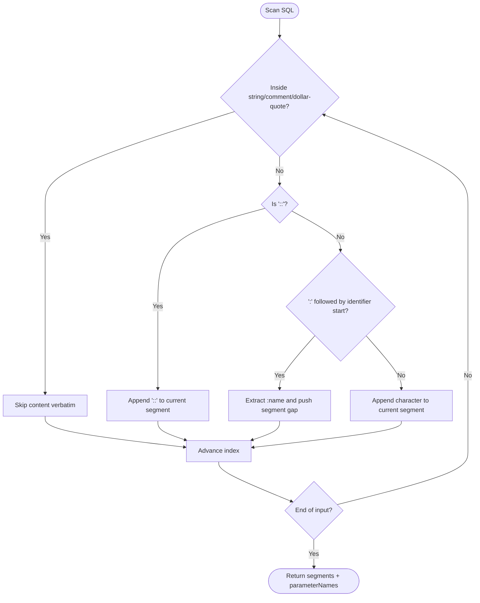
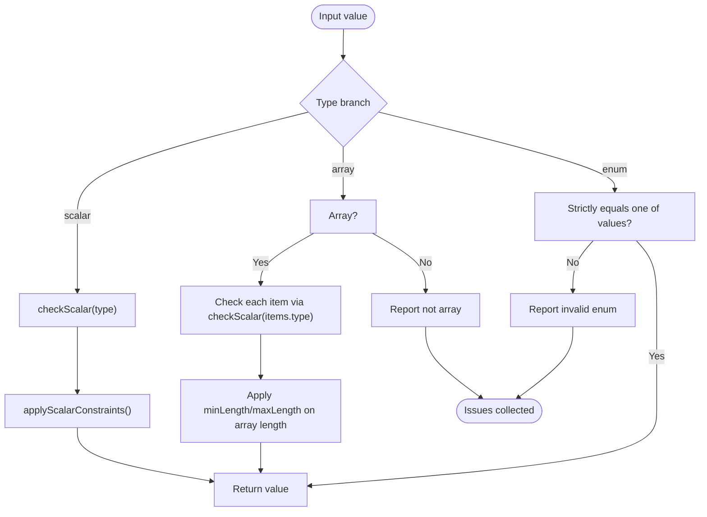
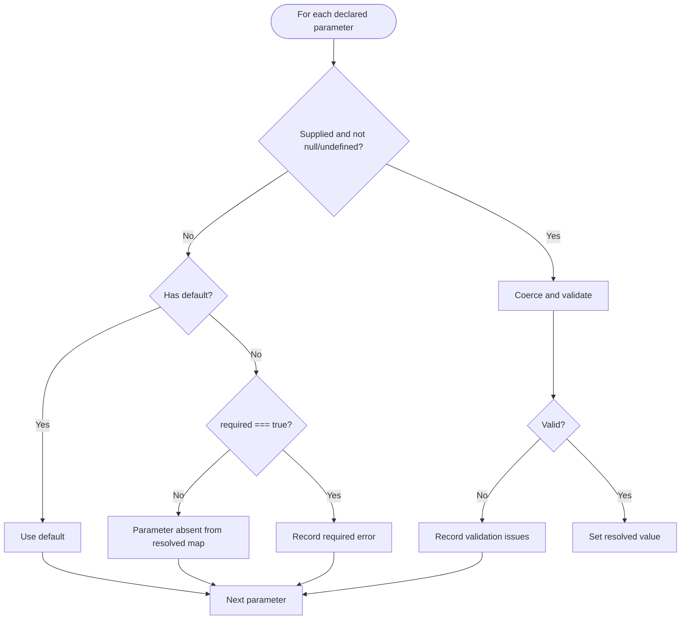
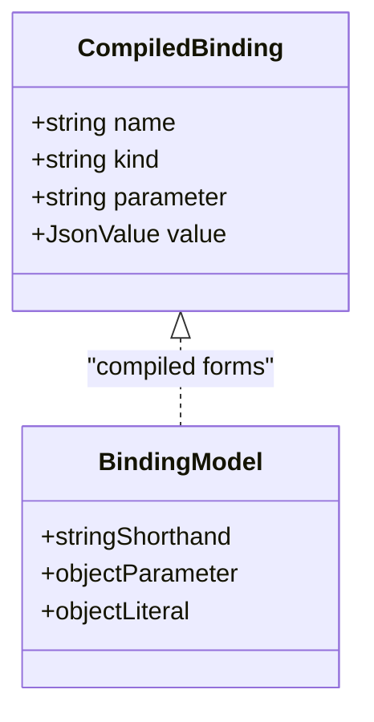
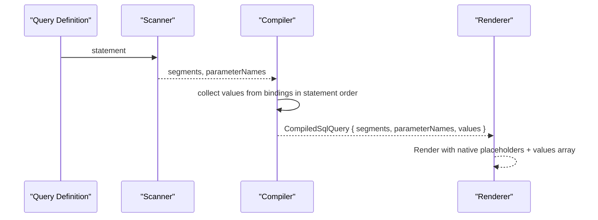
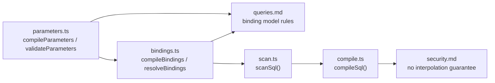

# Parameter Binding and Validation

<cite>
**Referenced Files in This Document**
- [parameters.md](file://docs/parameters.md)
- [queries.md](file://docs/queries.md)
- [security.md](file://docs/security.md)
- [03-parameterized-query.qspec.json](file://examples/03-parameterized-query.qspec.json)
- [parameter-types.qspec.json](file://fixtures/valid/parameter-types.qspec.json)
- [parameters.ts](file://packages/core/src/internal/validate/parameters.ts)
- [bindings.ts](file://packages/core/src/internal/bindings.ts)
- [compile.ts](file://packages/sql/src/internal/compile.ts)
- [scan.ts](file://packages/sql/src/internal/scan.ts)
</cite>

## Table of Contents

1. [Introduction](#introduction)
2. [Project Structure](#project-structure)
3. [Core Components](#core-components)
4. [Architecture Overview](#architecture-overview)
5. [Detailed Component Analysis](#detailed-component-analysis)
6. [Dependency Analysis](#dependency-analysis)
7. [Performance Considerations](#performance-considerations)
8. [Troubleshooting Guide](#troubleshooting-guide)
9. [Conclusion](#conclusion)

## Introduction

This document explains how QSpec binds, validates, and executes SQL parameters safely and predictably. It covers:

- Named parameter syntax (:parameterName)
- Parameter type inference and validation rules
- Default value handling and constraint checking
- Simple, complex object, and array parameters
- Security guarantees against SQL injection
- Performance characteristics and best practices for prepared statements

The system separates manifest authoring (declarations), runtime validation (types and constraints), binding resolution (mapping names to values), and SQL compilation (producing a safe, non-interpolated query structure).

## Project Structure

QSpec’s parameter system spans documentation, examples, fixtures, core validation, and SQL-specific compilation:

- Documentation defines the contract and behavior for parameters and queries.
- Examples and fixtures show real manifests using parameters and bindings.
- Core packages validate parameter declarations and runtime inputs, and compile bindings.
- The SQL package scans SQL text, extracts named parameters, and compiles them into a safe structure that never embeds user data into SQL text.

**Diagram sources**

- [parameters.ts:53-108](file://packages/core/src/internal/validate/parameters.ts#L53-L108)
- [parameters.ts:278-331](file://packages/core/src/internal/validate/parameters.ts#L278-L331)
- [bindings.ts:32-108](file://packages/core/src/internal/bindings.ts#L32-L108)
- [bindings.ts:112-128](file://packages/core/src/internal/bindings.ts#L112-L128)
- [compile.ts:65-90](file://packages/sql/src/internal/compile.ts#L65-L90)
- [scan.ts:56-236](file://packages/sql/src/internal/scan.ts#L56-L236)

**Section sources**

- [parameters.md:1-194](file://docs/parameters.md#L1-L194)
- [queries.md:1-167](file://docs/queries.md#L1-L167)
- [security.md:34-62](file://docs/security.md#L34-L62)

## Core Components

- Parameter declaration and validation:
  - Declared types are enforced at compile time and runtime.
  - Defaults are validated at manifest compile time.
  - Constraints like min/max/minLength/maxLength are applied after coercion.
- Binding model:
  - Bindings map statement placeholders to either a declared parameter or a literal JSON value.
  - String shorthand must match a strict pattern; otherwise it is rejected early.
- SQL compilation:
  - The scanner parses SQL to extract :name parameters while ignoring strings, comments, casts, and dollar-quoted blocks.
  - Compilation produces segments and values without ever embedding values into SQL text.

Key behaviors:

- Required, optional, and default semantics determine whether a resolved parameter is present or absent.
- Unknown caller-supplied parameters are reported as errors.
- Every validation problem is collected before throwing to provide complete feedback.

**Section sources**

- [parameters.ts:10-33](file://packages/core/src/internal/validate/parameters.ts#L10-L33)
- [parameters.ts:53-108](file://packages/core/src/internal/validate/parameters.ts#L53-L108)
- [parameters.ts:120-169](file://packages/core/src/internal/validate/parameters.ts#L120-L169)
- [parameters.ts:171-209](file://packages/core/src/internal/validate/parameters.ts#L171-L209)
- [parameters.ts:211-256](file://packages/core/src/internal/validate/parameters.ts#L211-L256)
- [parameters.ts:278-331](file://packages/core/src/internal/validate/parameters.ts#L278-L331)
- [bindings.ts:7-12](file://packages/core/src/internal/bindings.ts#L7-L12)
- [bindings.ts:32-108](file://packages/core/src/internal/bindings.ts#L32-L108)
- [bindings.ts:112-128](file://packages/core/src/internal/bindings.ts#L112-L128)
- [compile.ts:27-36](file://packages/sql/src/internal/compile.ts#L27-L36)
- [compile.ts:65-90](file://packages/sql/src/internal/compile.ts#L65-L90)
- [scan.ts:56-236](file://packages/sql/src/internal/scan.ts#L56-L236)

## Architecture Overview

End-to-end flow from manifest to execution-safe SQL:

**Diagram sources**

- [parameters.ts:53-108](file://packages/core/src/internal/validate/parameters.ts#L53-L108)
- [parameters.ts:278-331](file://packages/core/src/internal/validate/parameters.ts#L278-L331)
- [bindings.ts:32-108](file://packages/core/src/internal/bindings.ts#L32-L108)
- [bindings.ts:112-128](file://packages/core/src/internal/bindings.ts#L112-L128)
- [compile.ts:65-90](file://packages/sql/src/internal/compile.ts#L65-L90)
- [scan.ts:56-236](file://packages/sql/src/internal/scan.ts#L56-L236)

## Detailed Component Analysis

### Named Parameter Syntax and Scanning

- Placeholders use the :name form inside SQL statements.
- The scanner recognizes identifiers after : and ignores : inside strings, comments, cast operators (::), and dollar-quoted blocks.
- Positional placeholders ($1, $2, …) in raw SQL are detected and warned about because adapters generate their own positional placeholders during rendering.

**Diagram sources**

- [scan.ts:56-236](file://packages/sql/src/internal/scan.ts#L56-L236)

**Section sources**

- [scan.ts:1-34](file://packages/sql/src/internal/scan.ts#L1-L34)
- [scan.ts:56-236](file://packages/sql/src/internal/scan.ts#L56-L236)
- [compile.ts:92-151](file://packages/sql/src/internal/compile.ts#L92-L151)

### Parameter Type Inference and Validation

- Declared types include string, number, integer, boolean, date, datetime, enum, and array.
- Date validation ensures YYYY-MM-DD represents a real calendar day; datetime uses ISO 8601 patterns plus real-date checks.
- Enum requires an explicit non-empty values list and performs strict equality checks.
- Array parameters validate each element against items.type and apply minLength/maxLength to the array itself.
- Constraints (min/max for numbers; minLength/maxLength for strings and arrays) run after coercion.

**Diagram sources**

- [parameters.ts:120-169](file://packages/core/src/internal/validate/parameters.ts#L120-L169)
- [parameters.ts:171-209](file://packages/core/src/internal/validate/parameters.ts#L171-L209)
- [parameters.ts:211-256](file://packages/core/src/internal/validate/parameters.ts#L211-L256)

**Section sources**

- [parameters.ts:10-33](file://packages/core/src/internal/validate/parameters.ts#L10-L33)
- [parameters.ts:120-169](file://packages/core/src/internal/validate/parameters.ts#L120-L169)
- [parameters.ts:171-209](file://packages/core/src/internal/validate/parameters.ts#L171-L209)
- [parameters.ts:211-256](file://packages/core/src/internal/validate/parameters.ts#L211-L256)
- [parameters.md:25-49](file://docs/parameters.md#L25-L49)
- [parameters.md:76-115](file://docs/parameters.md#L76-L115)

### Default Value Handling and Required Semantics

- If a parameter is not supplied and has a default, the default is used.
- If not supplied, no default, and required is true, validation fails.
- If not supplied, no default, and not required, the parameter is absent from the resolved map.
- Passing null or undefined counts as “not supplied.”
- Defaults are validated at manifest compile time using the same coercion logic as runtime values.

**Diagram sources**

- [parameters.ts:278-331](file://packages/core/src/internal/validate/parameters.ts#L278-L331)
- [parameters.ts:258-272](file://packages/core/src/internal/validate/parameters.ts#L258-L272)

**Section sources**

- [parameters.md:50-74](file://docs/parameters.md#L50-L74)
- [parameters.md:116-125](file://docs/parameters.md#L116-L125)
- [parameters.ts:278-331](file://packages/core/src/internal/validate/parameters.ts#L278-L331)

### Binding Model and Resolution

- Bindings map statement placeholders to either:
  - A declared parameter reference (string shorthand "$parameters.<name>" or object form { parameter: "<name>" })
  - A literal JSON value ({ literal: <value> })
- Bare strings that do not match the parameter reference pattern are rejected as manifest errors.
- At runtime, resolveBindings maps each binding to a value; if a referenced parameter is absent, the binding resolves to null.

**Diagram sources**

- [bindings.ts:7-12](file://packages/core/src/internal/bindings.ts#L7-L12)
- [bindings.ts:32-108](file://packages/core/src/internal/bindings.ts#L32-L108)
- [bindings.ts:112-128](file://packages/core/src/internal/bindings.ts#L112-L128)
- [queries.md:43-135](file://docs/queries.md#L43-L135)

**Section sources**

- [queries.md:43-135](file://docs/queries.md#L43-L135)
- [bindings.ts:7-12](file://packages/core/src/internal/bindings.ts#L7-L12)
- [bindings.ts:32-108](file://packages/core/src/internal/bindings.ts#L32-L108)
- [bindings.ts:112-128](file://packages/core/src/internal/bindings.ts#L112-L128)

### SQL Compilation and Safety

- The SQL compiler scans the statement to extract :name placeholders and builds a CompiledSqlQuery with:
  - segments: literal SQL between parameters
  - parameterNames: placeholder names in order
  - values: resolved values in the same order
- There is no text field containing interpolated values; this makes SQL injection structurally impossible at this layer.
- Adapters render final SQL using native parameterization (e.g., $1/$2) with a separate values array.

**Diagram sources**

- [compile.ts:27-36](file://packages/sql/src/internal/compile.ts#L27-L36)
- [compile.ts:65-90](file://packages/sql/src/internal/compile.ts#L65-L90)
- [scan.ts:56-236](file://packages/sql/src/internal/scan.ts#L56-L236)
- [security.md:34-62](file://docs/security.md#L34-L62)

**Section sources**

- [compile.ts:65-90](file://packages/sql/src/internal/compile.ts#L65-L90)
- [compile.ts:92-151](file://packages/sql/src/internal/compile.ts#L92-L151)
- [scan.ts:56-236](file://packages/sql/src/internal/scan.ts#L56-L236)
- [security.md:34-62](file://docs/security.md#L34-L62)

### Examples of Parameter Usage

- Simple scalar parameters: string, number, integer, boolean, date, datetime, enum.
- Complex object parameters: bind literals or parameters through the binding model.
- Array parameters: validate each element and enforce array-level constraints.

References:

- Example manifest demonstrating multiple parameter types and bindings.
- Fixture manifest enumerating all supported parameter types.

**Section sources**

- [03-parameterized-query.qspec.json:9-43](file://examples/03-parameterized-query.qspec.json#L9-L43)
- [parameter-types.qspec.json:5-15](file://fixtures/valid/parameter-types.qspec.json#L5-L15)
- [queries.md:150-155](file://docs/queries.md#L150-L155)

## Dependency Analysis

The parameter pipeline composes several modules with clear responsibilities:

**Diagram sources**

- [parameters.ts:53-108](file://packages/core/src/internal/validate/parameters.ts#L53-L108)
- [parameters.ts:278-331](file://packages/core/src/internal/validate/parameters.ts#L278-L331)
- [bindings.ts:32-108](file://packages/core/src/internal/bindings.ts#L32-L108)
- [bindings.ts:112-128](file://packages/core/src/internal/bindings.ts#L112-L128)
- [scan.ts:56-236](file://packages/sql/src/internal/scan.ts#L56-L236)
- [compile.ts:65-90](file://packages/sql/src/internal/compile.ts#L65-L90)
- [security.md:34-62](file://docs/security.md#L34-L62)

**Section sources**

- [parameters.ts:53-108](file://packages/core/src/internal/validate/parameters.ts#L53-L108)
- [bindings.ts:32-108](file://packages/core/src/internal/bindings.ts#L32-L108)
- [compile.ts:65-90](file://packages/sql/src/internal/compile.ts#L65-L90)
- [scan.ts:56-236](file://packages/sql/src/internal/scan.ts#L56-L236)
- [security.md:34-62](file://docs/security.md#L34-L62)

## Performance Considerations

- Prepared statements and reuse:
  - The compiled representation separates literal SQL segments from values, enabling adapters to reuse prepared statements across executions with different values.
  - Repeated placeholders produce repeated values, preserving correct ordering even when the same parameter appears multiple times.
- Efficiency of scanning:
  - The scanner processes the statement once, skipping quoted strings, comments, and dollar-quoted blocks, minimizing false positives and overhead.
- Best practices:
  - Prefer reusing the same manifest and prepared statement for multiple executions with different parameters.
  - Keep parameter sets stable to maximize plan reuse in the database driver where applicable.
  - Avoid unnecessary large arrays; validate lengths early to reduce payload size.

[No sources needed since this section provides general guidance]

## Troubleshooting Guide

Common issues and how they are surfaced:

- Unknown parameter in caller input:
  - Reported with the list of declared parameters to help fix typos.
- Undeclared parameter reference in bindings:
  - Detected during binding compilation with suggestions based on declared names.
- Missing binding for a :name placeholder:
  - During SQL compilation, a missing binding throws a clear error listing available bindings.
- Unused binding declared but not referenced:
  - Static validation reports bindings that are declared but never referenced by the statement.
- Invalid parameter values:
  - Type mismatches, out-of-range numbers, invalid dates/datetimes, wrong enum values, and array element violations are collected and reported together.

**Section sources**

- [parameters.ts:278-331](file://packages/core/src/internal/validate/parameters.ts#L278-L331)
- [bindings.ts:32-108](file://packages/core/src/internal/bindings.ts#L32-L108)
- [compile.ts:72-90](file://packages/sql/src/internal/compile.ts#L72-L90)
- [compile.ts:100-151](file://packages/sql/src/internal/compile.ts#L100-L151)

## Conclusion

QSpec’s parameter system enforces strong typing, comprehensive validation, and safe SQL execution:

- Named parameters (:name) are parsed precisely and bound only through validated values.
- Defaults and constraints are checked early, providing fast feedback.
- The binding model prevents accidental interpolation and supports both simple and complex inputs.
- SQL compilation produces a structure that cannot be misused to inject values into SQL text, ensuring safety by design.
- Performance benefits come from separating static SQL segments from dynamic values, enabling prepared statement reuse and efficient execution.

[No sources needed since this section summarizes without analyzing specific files]
