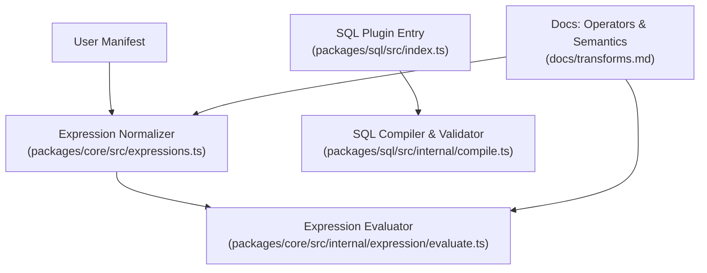
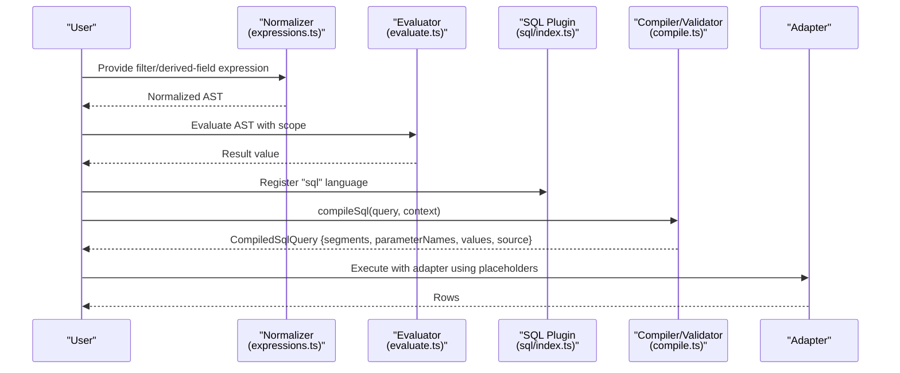
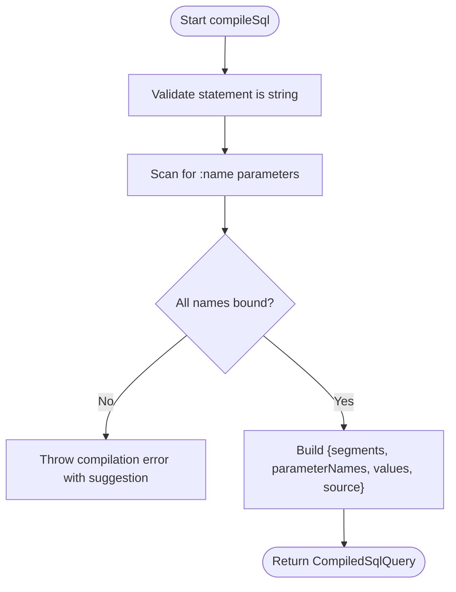
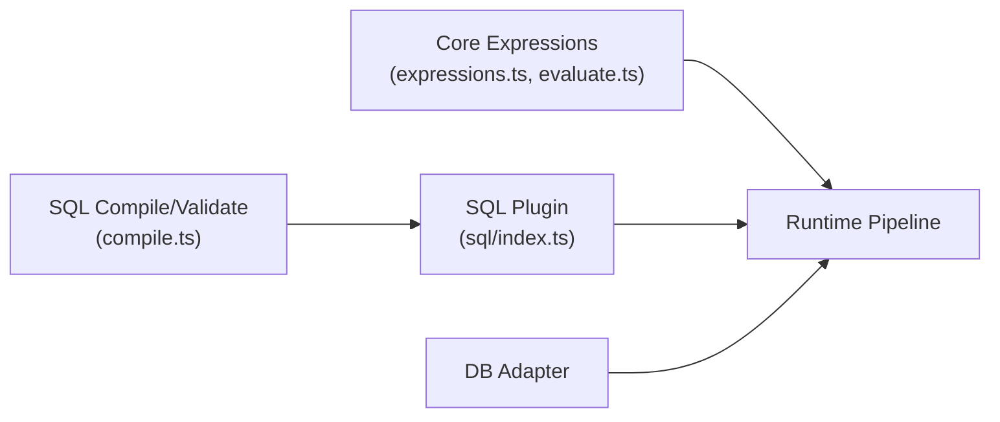

# SQL Expression Parser

<cite>
**Referenced Files in This Document**
- [README.md](file://README.md)
- [expressions.ts](file://packages/core/src/expressions.ts)
- [expression.ts](file://packages/core/src/types/expression.ts)
- [evaluate.ts](file://packages/core/src/internal/expression/evaluate.ts)
- [compile.ts](file://packages/sql/src/internal/compile.ts)
- [index.ts](file://packages/sql/src/index.ts)
- [transforms.md](file://docs/transforms.md)
</cite>

## Table of Contents

1. [Introduction](#introduction)
2. [Project Structure](#project-structure)
3. [Core Components](#core-components)
4. [Architecture Overview](#architecture-overview)
5. [Detailed Component Analysis](#detailed-component-analysis)
6. [Dependency Analysis](#dependency-analysis)
7. [Performance Considerations](#performance-considerations)
8. [Troubleshooting Guide](#troubleshooting-guide)
9. [Conclusion](#conclusion)
10. [Appendices](#appendices)

## Introduction

This document explains the expression and SQL capabilities provided by the project, focusing on:

- The normalized expression AST used for declarative filters and derived fields
- Supported operators (comparison, arithmetic, membership, null checks, coalesce)
- How SQL statements are compiled with named parameters and validated statically
- Operator precedence and evaluation semantics
- Error handling, performance considerations, and compatibility notes across SQL adapters

The goal is to help you write correct expressions and SQL queries safely and efficiently, while understanding how they are parsed, validated, and executed within the pipeline.

## Project Structure

At a high level:

- The core package defines the expression model, normalization, and evaluation
- The SQL plugin compiles SQL statements into a dialect-neutral form and validates bindings
- Documentation describes operator arity, precedence, and null semantics

**Diagram sources**

- [expressions.ts:1-35](file://packages/core/src/expressions.ts#L1-L35)
- [evaluate.ts:33-154](file://packages/core/src/internal/expression/evaluate.ts#L33-L154)
- [compile.ts:1-152](file://packages/sql/src/internal/compile.ts#L1-L152)
- [index.ts:1-30](file://packages/sql/src/index.ts#L1-L30)
- [transforms.md:291-310](file://docs/transforms.md#L291-L310)

**Section sources**

- [README.md:1-107](file://README.md#L1-L107)
- [expressions.ts:1-35](file://packages/core/src/expressions.ts#L1-L35)
- [index.ts:1-30](file://packages/sql/src/index.ts#L1-L30)

## Core Components

- Expression AST: A limited, JSON-safe tree representing literals, fields, parameters, and operator nodes with typed arguments.
- Expression Normalizer: Expands shorthand comparisons, enforces operator arity, rejects unknown operators, and limits nesting depth.
- Expression Evaluator: Interprets the normalized AST at runtime without eval or Function usage; implements comparison, arithmetic, membership, null checks, and coalesce.
- SQL Compiler and Validator: Scans SQL text for named parameters, resolves values from bindings, and performs static checks during prepare() to ensure all referenced and declared bindings match.

Key responsibilities:

- Safety: No eval, no direct SQL interpolation; parameterized execution via adapters.
- Predictability: Fixed operator set, explicit arity, deterministic precedence.
- Diagnostics: Clear issues with suggestions for typos and missing bindings.

**Section sources**

- [expression.ts:1-22](file://packages/core/src/types/expression.ts#L1-L22)
- [expressions.ts:1-35](file://packages/core/src/expressions.ts#L1-L35)
- [evaluate.ts:33-154](file://packages/core/src/internal/expression/evaluate.ts#L33-L154)
- [compile.ts:12-90](file://packages/sql/src/internal/compile.ts#L12-L90)
- [compile.ts:92-152](file://packages/sql/src/internal/compile.ts#L92-L152)

## Architecture Overview

The pipeline separates concerns:

- Expressions are normalized once and evaluated deterministically against a scope (field values, parameters).
- SQL statements are compiled into segments plus ordered parameter names and values, leaving placeholder generation to the adapter.

**Diagram sources**

- [expressions.ts:1-35](file://packages/core/src/expressions.ts#L1-L35)
- [evaluate.ts:33-154](file://packages/core/src/internal/expression/evaluate.ts#L33-L154)
- [index.ts:1-30](file://packages/sql/src/index.ts#L1-L30)
- [compile.ts:12-90](file://packages/sql/src/internal/compile.ts#L12-L90)

## Detailed Component Analysis

### Expression Model and Shorthand

- The AST supports:
  - Literals (JSON-safe values)
  - Field references
  - Parameter references
  - Operator nodes with an operator name and an ordered list of argument expressions
- Comparison shorthand is expanded into the canonical AST during normalization.

Complexity:

- Normalization is linear in the size of the input expression tree.
- Depth limit prevents unbounded recursion.

**Section sources**

- [expression.ts:1-22](file://packages/core/src/types/expression.ts#L1-L22)
- [expressions.ts:1-35](file://packages/core/src/expressions.ts#L1-L35)

### Supported Operators and Precedence

Operators and their arities:

- Binary comparisons: eq, ne, gt, gte, lt, lte
- Membership: in
- Arithmetic: add, subtract, multiply, divide
- Null check: isNull
- Variadic: and, or, coalesce (at least one argument)

Precedence (from highest to lowest):

1. Parentheses (grouping)
2. Arithmetic: multiply, divide
3. Arithmetic: add, subtract
4. Comparisons: gt, gte, lt, lte
5. Equality: eq, ne
6. Membership: in
7. Logical: and
8. Logical: or

Notes:

- Unknown operators fail normalization with a “did you mean” suggestion.
- Wrong arity fails normalization with the expected count.

**Section sources**

- [transforms.md:291-310](file://docs/transforms.md#L291-L310)

### Evaluation Semantics and Type Coercion

- Comparisons:
  - Numbers compare numerically
  - Strings compare lexicographically
  - Booleans coerce to numbers for ordering
  - If either operand is nullish, ordering comparisons yield false
- Equality:
  - Two nullish values are considered equal (eq true, ne false), aligning with SQL-like behavior
- Arithmetic:
  - Operands must be finite numbers; otherwise result is null
  - Division by zero yields null (not Infinity/NaN)
- Membership:
  - in returns true if the left value equals any element in the right array literal
- Null checks:
  - isNull detects nullish values
- Coalesce:
  - Returns the first non-null value among its arguments

Type coercion rules:

- Only numeric operands participate in arithmetic; non-numeric yields null
- Comparisons only succeed for compatible types; incompatible types fall through to false for ordering comparisons

**Section sources**

- [evaluate.ts:33-154](file://packages/core/src/internal/expression/evaluate.ts#L33-L154)

### SQL Compilation and Validation

- Named parameters:
  - Statements use :name placeholders
  - compileSql scans the statement, extracts parameter names, and builds a CompiledSqlQuery with segments, parameterNames, and values
- Static validation during prepare():
  - Ensures every referenced :name has a matching binding
  - Ensures every declared binding is referenced by the statement
  - Rejects positional placeholders that would collide with adapter-generated placeholders
- Security:
  - No eval or string interpolation; adapters generate placeholders and bind values separately

**Diagram sources**

- [compile.ts:47-90](file://packages/sql/src/internal/compile.ts#L47-L90)

**Section sources**

- [compile.ts:12-90](file://packages/sql/src/internal/compile.ts#L12-L90)
- [compile.ts:92-152](file://packages/sql/src/internal/compile.ts#L92-L152)
- [index.ts:1-30](file://packages/sql/src/index.ts#L1-L30)

### Examples of Complex Expressions and Nested Calls

- Filter example: revenue greater than zero and month in a specific set
- Derived field: compute profit margin using arithmetic and conditional logic via coalesce
- Nested functions: combine multiple operators and coalesce to handle missing data

These patterns are built from the supported operators and follow the precedence rules above.

[No sources needed since this section provides conceptual examples]

## Dependency Analysis

- The SQL plugin depends on the core’s query language interface and utilities for suggestions and errors.
- The expression system is independent of SQL; it operates on normalized ASTs.
- Adapters depend on the compiled query shape to produce safe, parameterized SQL.

**Diagram sources**

- [expressions.ts:1-35](file://packages/core/src/expressions.ts#L1-L35)
- [evaluate.ts:33-154](file://packages/core/src/internal/expression/evaluate.ts#L33-L154)
- [index.ts:1-30](file://packages/sql/src/index.ts#L1-L30)
- [compile.ts:12-90](file://packages/sql/src/internal/compile.ts#L12-L90)

**Section sources**

- [index.ts:1-30](file://packages/sql/src/index.ts#L1-L30)
- [compile.ts:12-90](file://packages/sql/src/internal/compile.ts#L12-L90)

## Performance Considerations

- Expression evaluation is O(n) over the AST size with bounded depth; keep expressions reasonably sized and avoid excessive nesting.
- Prefer pushing heavy computations to the database when possible; use transforms for lightweight post-processing.
- Use in with small arrays for membership checks; large sets may be better handled server-side.
- Avoid unnecessary coalesce chains; prefer simpler defaults where possible.
- For complex calculations, consider precomputing derived columns in the database and referencing them as fields.

[No sources needed since this section provides general guidance]

## Troubleshooting Guide

Common parsing and validation issues:

- Unknown operator:
  - Cause: Typo or unsupported operator name
  - Resolution: Use one of the documented operators; rely on “did you mean” suggestions
- Wrong argument count:
  - Cause: Missing or extra arguments for an operator
  - Resolution: Adjust to the required arity (binary for comparisons/arithmetic, unary for isNull, variadic for and/or/coalesce)
- Non-numeric arithmetic:
  - Cause: One or both operands are not finite numbers
  - Resolution: Ensure inputs are numbers or coerce appropriately; expect null results for invalid operands
- Division by zero:
  - Behavior: Yields null rather than Infinity/NaN
  - Resolution: Guard with coalesce or conditional logic if a default is desired
- Null comparisons:
  - Behavior: Ordering comparisons involving null yield false; equality treats two nulls as equal
  - Resolution: Use isNull explicitly when testing for nullness
- SQL binding errors:
  - Cause: Referenced :name has no binding or declared binding unused
  - Resolution: Align bindings with statement references; fix typos using suggestions

Where to look:

- Expression normalization and evaluation errors surface during prepare() or execute()
- SQL validation runs during prepare() to catch binding mismatches before execution

**Section sources**

- [transforms.md:291-310](file://docs/transforms.md#L291-L310)
- [evaluate.ts:33-154](file://packages/core/src/internal/expression/evaluate.ts#L33-L154)
- [compile.ts:92-152](file://packages/sql/src/internal/compile.ts#L92-L152)

## Conclusion

The expression system provides a safe, predictable, and efficient way to express filters and derived fields, while the SQL plugin ensures statements are compiled and validated with named parameters. Together, they enable robust analytics pipelines with clear diagnostics, strong security guarantees, and good performance characteristics when used according to the documented semantics.

[No sources needed since this section summarizes without analyzing specific files]

## Appendices

### Operator Reference Summary

- Comparisons: eq, ne, gt, gte, lt, lte
- Arithmetic: add, subtract, multiply, divide
- Membership: in
- Null check: isNull
- Logical: and, or
- Utility: coalesce

Precedence (high to low): parentheses, multiply/divide, add/subtract, comparisons, equality, in, and, or.

**Section sources**

- [transforms.md:291-310](file://docs/transforms.md#L291-L310)

### SQL Binding Checklist

- Every :name in the statement must have a corresponding entry in bindings
- Every declared binding must be referenced by the statement
- Do not use positional placeholders; let the adapter generate them
- Rely on suggestions for typos in binding names

**Section sources**

- [compile.ts:92-152](file://packages/sql/src/internal/compile.ts#L92-L152)
