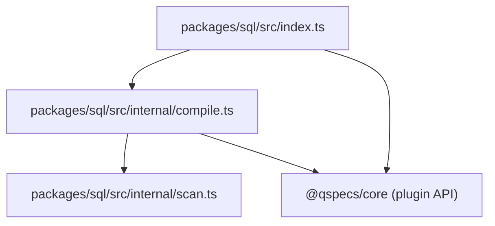
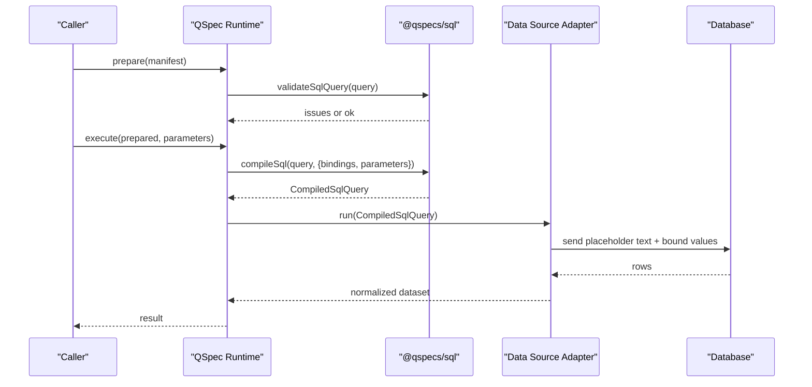
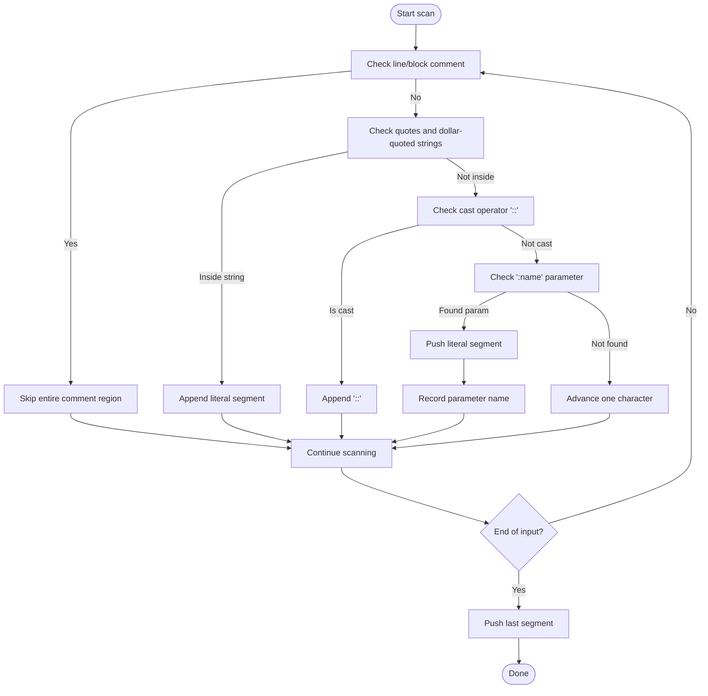
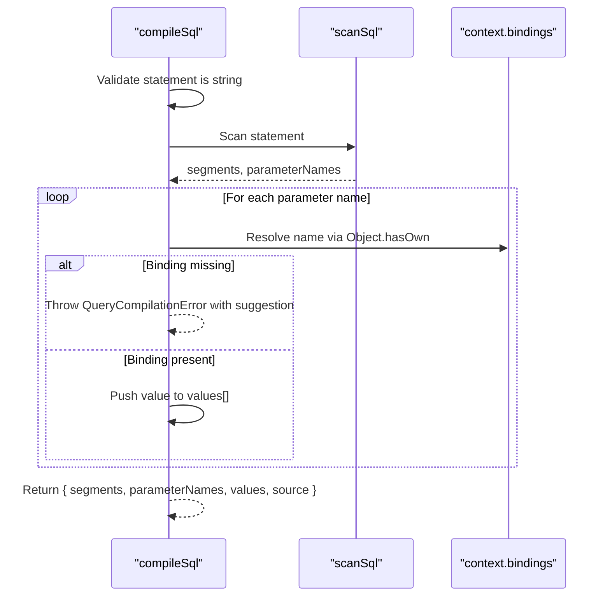
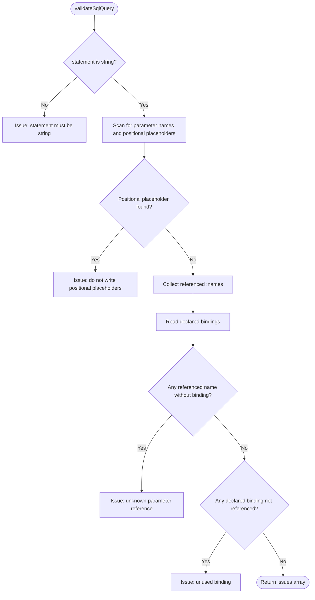
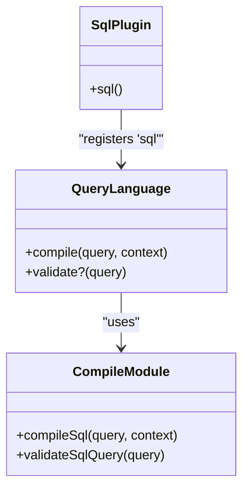
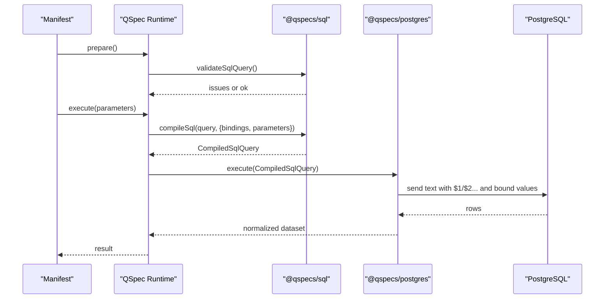

# SQL Query Compilation

<cite>
**Referenced Files in This Document**
- [index.ts](file://packages/sql/src/index.ts)
- [compile.ts](file://packages/sql/src/internal/compile.ts)
- [compile.test.ts](file://packages/sql/src/internal/compile.test.ts)
- [queries.md](file://docs/queries.md)
- [architecture.md](file://docs/architecture.md)
- [security.md](file://docs/security.md)
- [plugin.ts](file://packages/core/src/types/plugin.ts)
- [README.md](file://README.md)
- [integration.test.ts](file://packages/postgres/test/integration.test.ts)
</cite>

## Table of Contents

1. Introduction
2. Project Structure
3. Core Components
4. Architecture Overview
5. Detailed Component Analysis
6. Dependency Analysis
7. Performance Considerations
8. Troubleshooting Guide
9. Conclusion

## Introduction

This document explains how the @qspecs/sql package compiles SQL queries into a dialect-neutral CompiledSqlQuery. It covers parsing, validation, parameter extraction and resolution, and how adapters render the compiled query for specific SQL dialects. It also documents supported features, query structure requirements, error handling, security measures against SQL injection, and integration patterns with data sources such as PostgreSQL.

## Project Structure

The SQL plugin is a small, dependency-free module that registers a query language implementation with the QSpec runtime. Its public surface exposes a plugin factory and types; internal modules implement scanning and compilation.

**Diagram sources**

- [index.ts:1-30](file://packages/sql/src/index.ts#L1-L30)
- [compile.ts:1-152](file://packages/sql/src/internal/compile.ts#L1-L152)

**Section sources**

- [index.ts:1-30](file://packages/sql/src/index.ts#L1-L30)
- [compile.ts:1-152](file://packages/sql/src/internal/compile.ts#L1-L152)

## Core Components

- sql() plugin: Registers the "sql" query language with the QSpec runtime and wires compile and validate hooks.
- compileSql(query, context): Parses named parameters from the statement, resolves them from bindings, and returns a CompiledSqlQuery.
- validateSqlQuery(query): Static checks during prepare() to ensure every referenced :name has a declared binding and no unused bindings exist.
- scanSql(statement): Tokenizes the statement into literal segments and parameter names while ignoring colons inside comments, strings, identifiers, dollar-quoted blocks, and cast operators.

Key outputs:

- CompiledSqlQuery: A dialect-neutral representation containing literal segments, parameter names, resolved values, and source name. There is intentionally no text field to prevent accidental interpolation.

Supported SQL features relevant to compilation:

- Named parameters using :name syntax.
- Safe handling of colons inside:
  - Single-quoted string literals
  - Double-quoted identifiers
  - Line and block comments (including nested block comments)
  - Dollar-quoted strings
  - Cast operator ::
- Repeated parameters are supported; each occurrence produces its own gap and value entry.

Security posture:

- Values never reach the database via string interpolation. The compiled form separates literal SQL from bound values, and only an adapter can produce final SQL text with placeholders.

**Section sources**

- [index.ts:1-30](file://packages/sql/src/index.ts#L1-L30)
- [compile.ts:12-36](file://packages/sql/src/internal/compile.ts#L12-L36)
- [compile.ts:52-90](file://packages/sql/src/internal/compile.ts#L52-L90)
- [compile.ts:92-151](file://packages/sql/src/internal/compile.ts#L92-L151)
- [queries.md:43-148](file://docs/queries.md#L43-L148)
- [architecture.md:287-344](file://docs/architecture.md#L287-L344)
- [security.md:34-62](file://docs/security.md#L34-L62)

## Architecture Overview

The compilation pipeline integrates with the QSpec runtime’s prepare()/execute() phases. During prepare(), static validation runs; during execute(), bindings are resolved and the query is compiled to CompiledSqlQuery before being handed to a data source adapter.

**Diagram sources**

- [plugin.ts:44-56](file://packages/core/src/types/plugin.ts#L44-L56)
- [compile.ts:65-90](file://packages/sql/src/internal/compile.ts#L65-L90)
- [compile.ts:100-151](file://packages/sql/src/internal/compile.ts#L100-L151)
- [architecture.md:65-105](file://docs/architecture.md#L65-L105)

## Detailed Component Analysis

### Scanner: Parsing and Parameter Extraction

The scanner tokenizes SQL safely by recognizing contexts where colons must not be interpreted as parameters. It extracts literal segments and ordered parameter names.

**Diagram sources**

- [architecture.md:315-344](file://docs/architecture.md#L315-L344)

**Section sources**

- [architecture.md:315-344](file://docs/architecture.md#L315-L344)

### Compiler: Building CompiledSqlQuery

The compiler validates that the statement is a string, scans it for parameters, resolves each :name from context.bindings, and constructs a CompiledSqlQuery with parallel arrays for segments, parameterNames, and values.

**Diagram sources**

- [compile.ts:65-90](file://packages/sql/src/internal/compile.ts#L65-L90)

**Section sources**

- [compile.ts:65-90](file://packages/sql/src/internal/compile.ts#L65-L90)

### Validator: Static Checks During Prepare

Static validation ensures:

- statement is a string
- no positional placeholders like $1 appear in the statement (to avoid collisions with adapter-generated placeholders)
- every referenced :name has a matching declared binding
- every declared binding is referenced at least once

**Diagram sources**

- [compile.ts:100-151](file://packages/sql/src/internal/compile.ts#L100-L151)

**Section sources**

- [compile.ts:100-151](file://packages/sql/src/internal/compile.ts#L100-L151)

### Plugin Registration and Integration

The sql() plugin registers a QueryLanguage implementation with the core runtime. The runtime invokes validate during prepare and compile during execute, passing the appropriate context including bindings and parameters.

**Diagram sources**

- [index.ts:1-30](file://packages/sql/src/index.ts#L1-L30)
- [plugin.ts:44-56](file://packages/core/src/types/plugin.ts#L44-L56)
- [compile.ts:1-152](file://packages/sql/src/internal/compile.ts#L1-L152)

**Section sources**

- [index.ts:1-30](file://packages/sql/src/index.ts#L1-L30)
- [plugin.ts:44-56](file://packages/core/src/types/plugin.ts#L44-L56)

### Data Flow: From Manifest to Database

**Diagram sources**

- [compile.ts:65-90](file://packages/sql/src/internal/compile.ts#L65-L90)
- [architecture.md:287-313](file://docs/architecture.md#L287-L313)
- [security.md:34-62](file://docs/security.md#L34-L62)

## Dependency Analysis

- @qspecs/sql depends on @qspecs/core for plugin registration, types, and shared utilities (e.g., suggest).
- It does not depend on any database driver; rendering to SQL text happens in adapters (e.g., @qspecs/postgres).
- The compiled form enforces separation between literal SQL and bound values, preventing accidental interpolation.

**Diagram sources**

- [index.ts:1-30](file://packages/sql/src/index.ts#L1-L30)
- [compile.ts:1-10](file://packages/sql/src/internal/compile.ts#L1-L10)

**Section sources**

- [index.ts:1-30](file://packages/sql/src/index.ts#L1-L30)
- [compile.ts:1-10](file://packages/sql/src/internal/compile.ts#L1-L10)

## Performance Considerations

- Scanning is linear in statement length and avoids regex over the whole statement by walking tokens and skipping safe regions.
- Parameter resolution uses Object.hasOwn to avoid prototype pollution and unnecessary lookups.
- Repeated parameters produce repeated values; deduplication is intentionally avoided to reduce complexity and off-by-one risks.
- Validation runs once during prepare(); compilation runs per execution but remains lightweight.

[No sources needed since this section provides general guidance]

## Troubleshooting Guide

Common errors and how to resolve them:

- Statement is not a string: Ensure spec.query.statement is a SQL text string.
- Unknown parameter reference: Add a matching binding for every :name used in the statement.
- Unused binding: Remove bindings declared but not referenced by the statement.
- Positional placeholder in statement: Do not write $1, ?, etc.; let the adapter generate placeholders when it binds :name parameters.
- Missing binding at compile time: Ensure all :name references have entries in context.bindings; otherwise a QueryCompilationError is thrown with available bindings and a suggestion.

Examples validated by tests:

- Detecting positional placeholders in statements.
- Reporting multiple issues at once (unknown parameter and unused binding).
- Resolving named parameters from bindings and producing correct values.

**Section sources**

- [compile.test.ts:27-42](file://packages/sql/src/internal/compile.test.ts#L27-L42)
- [compile.test.ts:143-158](file://packages/sql/src/internal/compile.test.ts#L143-L158)
- [index.test.ts:61-96](file://packages/sql/src/index.test.ts#L61-L96)
- [index.test.ts:98-136](file://packages/sql/src/index.test.ts#L98-L136)
- [compile.ts:65-90](file://packages/sql/src/internal/compile.ts#L65-L90)
- [compile.ts:100-151](file://packages/sql/src/internal/compile.ts#L100-L151)

## Conclusion

@qspecs/sql provides a secure, dialect-neutral SQL compilation layer. It parses named parameters safely, validates declarations statically, resolves values from bindings, and produces a CompiledSqlQuery that forces adapters to use native parameterization. This design makes SQL injection structurally impossible at the boundary between SQL compilation and execution, while keeping the query language decoupled from any specific database dialect.

[No sources needed since this section summarizes without analyzing specific files]
