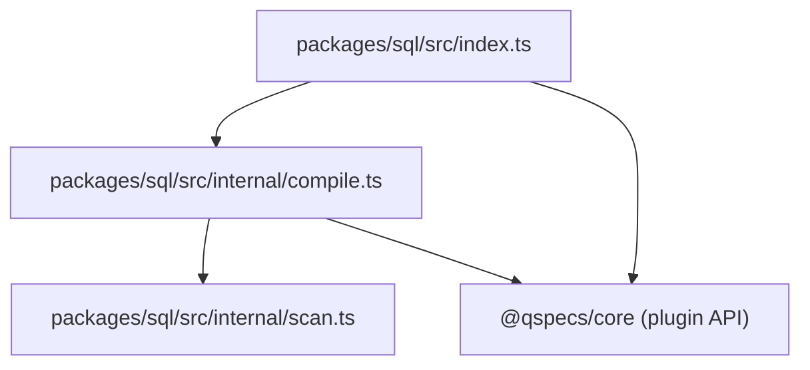
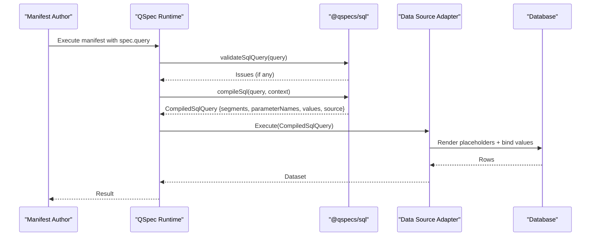
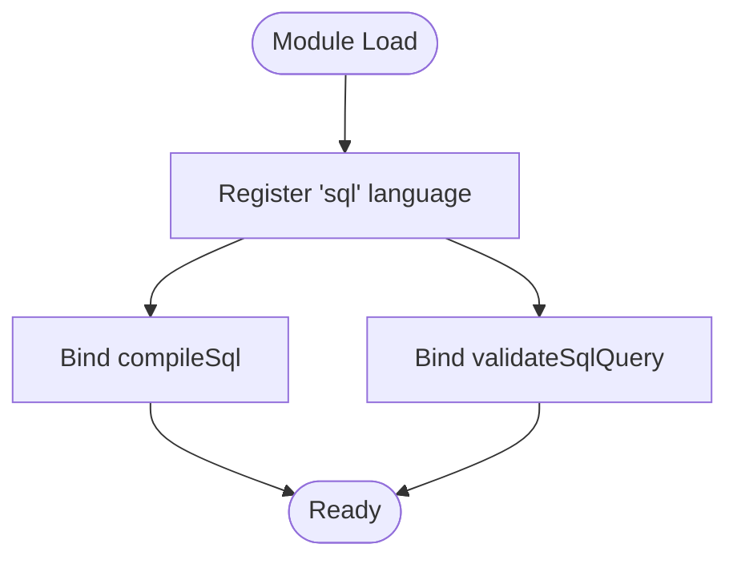
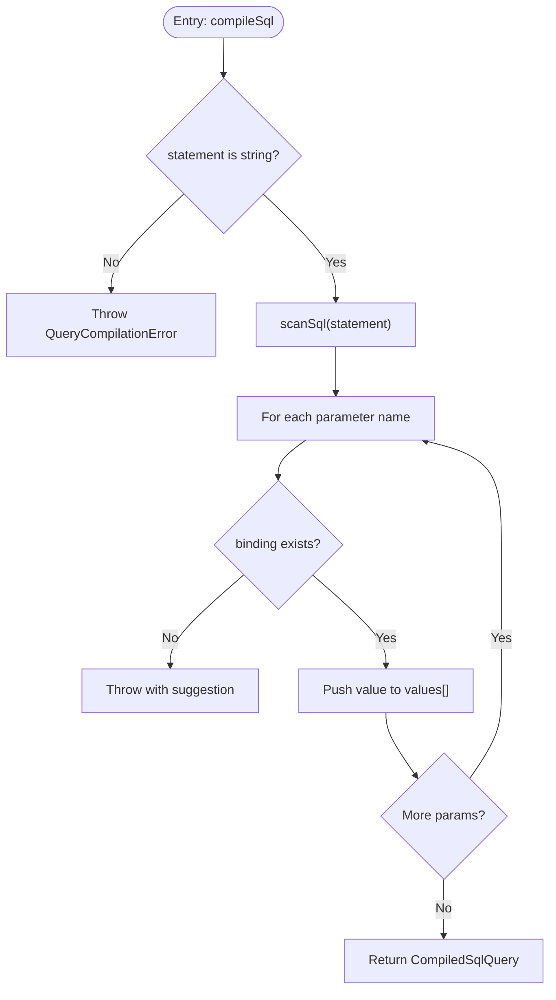
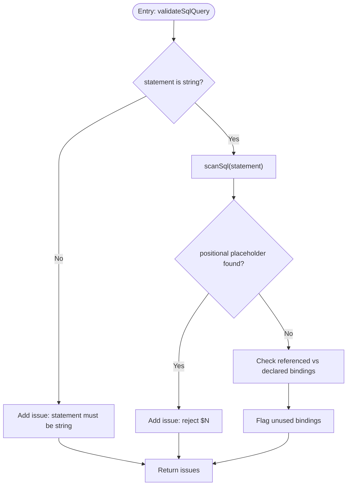
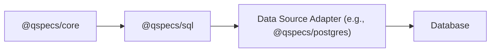
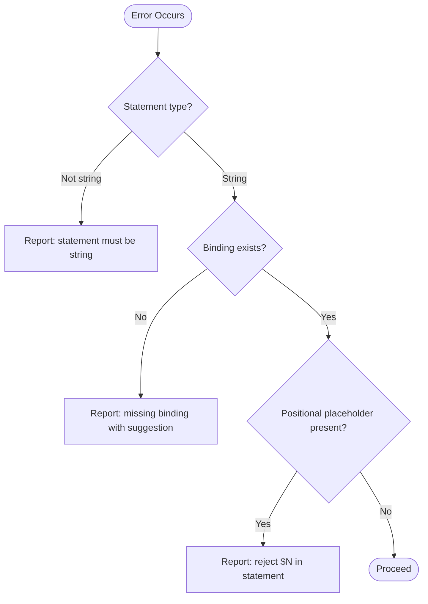
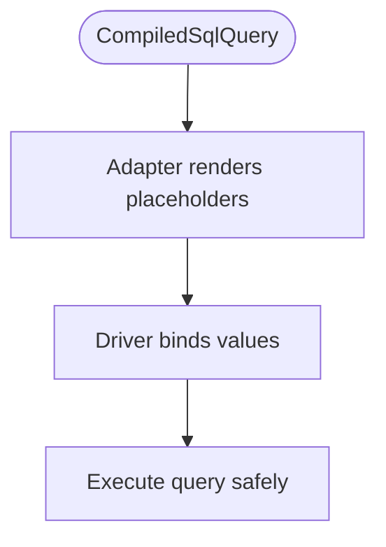

# SQL Query Language (@qspecs/sql)

<cite>
**Referenced Files in This Document**
- [README.md](file://README.md)
- [queries.md](file://docs/queries.md)
- [architecture.md](file://docs/architecture.md)
- [security.md](file://docs/security.md)
- [index.ts](file://packages/sql/src/index.ts)
- [compile.ts](file://packages/sql/src/internal/compile.ts)
- [scan.ts](file://packages/sql/src/internal/scan.ts)
- [compile.test.ts](file://packages/sql/src/internal/compile.test.ts)
- [index.test.ts](file://packages/sql/src/index.test.ts)
- [package.json](file://packages/sql/package.json)
</cite>

## Table of Contents

1. Introduction
2. Project Structure
3. Core Components
4. Architecture Overview
5. Detailed Component Analysis
6. Dependency Analysis
7. Performance Considerations
8. Troubleshooting Guide
9. Conclusion
10. Appendices

## Introduction

This document explains the @qspecs/sql package, which provides a dialect-neutral SQL query language for QSpec. It compiles parameterized SQL statements into a safe, structured form and integrates with data source plugins (such as PostgreSQL) to execute queries using native parameter binding. The package focuses on:

- A named-parameter scanning and compilation model that avoids string interpolation
- Static validation of bindings during prepare()
- Security guarantees against SQL injection by construction
- Integration points for adapters to render dialect-specific placeholders
- Error reporting and diagnostics for common manifest mistakes

The package is intentionally database-agnostic; it does not connect to any database itself.

**Section sources**

- [README.md:17-105](file://README.md#L17-L105)
- [queries.md:1-21](file://docs/queries.md#L1-L21)

## Project Structure

@qspecs/sql is a small, focused plugin that registers a "sql" query language with the QSpec runtime. Its structure separates concerns between plugin registration, compilation, and scanning:

- Plugin entrypoint exports sql() and re-exports types
- Internal compile module implements compileSql and validateSqlQuery
- Internal scan module parses SQL safely, skipping strings, comments, identifiers, and cast operators



**Diagram sources**

- [index.ts:1-29](file://packages/sql/src/index.ts#L1-L29)
- [compile.ts:1-36](file://packages/sql/src/internal/compile.ts#L1-L36)
- [scan.ts:1-34](file://packages/sql/src/internal/scan.ts#L1-L34)

**Section sources**

- [package.json:1-44](file://packages/sql/package.json#L1-L44)
- [index.ts:1-29](file://packages/sql/src/index.ts#L1-L29)

## Core Components

- sql() plugin: Registers the "sql" query language with the QSpec runtime and wires compile and validate hooks.
- CompiledSqlQuery: A dialect-neutral compiled representation containing literal segments, parameter names, resolved values, and the logical source. No text field exists to prevent accidental interpolation.
- compileSql(query, context): Scans the statement, resolves :name parameters from context.bindings, and returns a CompiledSqlQuery.
- validateSqlQuery(query): Performs static checks during prepare(): ensures statement is a string, rejects positional placeholders written into the statement, verifies all referenced parameters have matching bindings, and flags unused bindings.
- scanSql(statement): Tokenizes SQL while respecting strings, comments, dollar-quoted blocks, and the cast operator, extracting parameter names and detecting positional placeholders.

Key behaviors:

- Parameter references are :name only; positional placeholders like $1 must not appear in the statement.
- Repeated parameters repeat their value; placeholders are not deduplicated.
- Missing or unknown parameters produce clear errors with suggestions when possible.
- Binding resolution happens at compile time against validated parameters; literals pass through unchanged.

**Section sources**

- [index.ts:1-29](file://packages/sql/src/index.ts#L1-L29)
- [compile.ts:12-36](file://packages/sql/src/internal/compile.ts#L12-L36)
- [compile.ts:52-90](file://packages/sql/src/internal/compile.ts#L52-L90)
- [compile.ts:92-151](file://packages/sql/src/internal/compile.ts#L92-L151)
- [scan.ts:1-34](file://packages/sql/src/internal/scan.ts#L1-L34)
- [scan.ts:42-55](file://packages/sql/src/internal/scan.ts#L42-L55)

## Architecture Overview

The SQL pipeline separates concerns across three layers:

- Manifest authoring: spec.query contains language, statement, and bindings
- Compilation: @qspecs/sql compiles to a safe, dialect-neutral form
- Execution: A data source adapter (e.g., PostgreSQL) renders the compiled query into driver-specific placeholders and executes with bound parameters



**Diagram sources**

- [queries.md:137-148](file://docs/queries.md#L137-L148)
- [architecture.md:287-313](file://docs/architecture.md#L287-L313)
- [compile.ts:65-90](file://packages/sql/src/internal/compile.ts#L65-L90)

## Detailed Component Analysis

### Plugin Registration (sql())

- Exports sql() which defines a plugin that registers the "sql" query language
- Wires compile and validate functions from internal modules
- Does not depend on runtime configuration; built at module scope



**Diagram sources**

- [index.ts:1-29](file://packages/sql/src/index.ts#L1-L29)

**Section sources**

- [index.ts:1-29](file://packages/sql/src/index.ts#L1-L29)

### Compilation (compileSql)

- Validates that statement is a string
- Scans the statement to extract segments and parameter names
- Resolves each :name from context.bindings using safe property checks
- Produces a CompiledSqlQuery with parallel arrays for segments and values
- Throws a QueryCompilationError if a referenced parameter has no binding, including a suggestion when applicable



**Diagram sources**

- [compile.ts:65-90](file://packages/sql/src/internal/compile.ts#L65-L90)

**Section sources**

- [compile.ts:65-90](file://packages/sql/src/internal/compile.ts#L65-L90)
- [compile.test.ts:27-107](file://packages/sql/src/internal/compile.test.ts#L27-L107)

### Validation (validateSqlQuery)

- Ensures statement is a string
- Detects positional placeholders ($1, $2, …) and reports them as issues
- Verifies every referenced parameter has a matching binding
- Flags declared bindings that are never referenced
- Returns an array of QSpecIssue objects with paths and optional suggestions



**Diagram sources**

- [compile.ts:92-151](file://packages/sql/src/internal/compile.ts#L92-L151)

**Section sources**

- [compile.ts:92-151](file://packages/sql/src/internal/compile.ts#L92-L151)
- [compile.test.ts:109-159](file://packages/sql/src/internal/compile.test.ts#L109-L159)

### SQL Scanner (scanSql)

- Parses SQL while correctly handling:
  - Line comments (-- ...)
  - Block comments (/* ... */), including nesting
  - Escape-string literals (E'...' / e'...')
  - Single-quoted strings, double-quoted identifiers, and Unicode-escape strings
  - Dollar-quoted strings ($$...$$ or $tag$...$tag$)
  - Cast operator (::)
- Extracts parameter names after : followed by identifier characters
- Records the first positional placeholder encountered in live SQL
- Unterminated constructs consume to end of input rather than throwing

```mermaid
flowchart TD
I(["Input: SQL string"]) --> L1["Skip line comments"]
L1 --> L2["Skip block comments (nested)"]
L2 --> L3["Handle E'/e' escape strings"]
L3 --> L4["Handle '...' / \"...\" / U&'...'"]
L4 --> L5["Handle $$...$$ / $tag$...$tag$"]
L5 --> L6["Detect :: cast operator"]
L6 --> L7["Extract :name parameters"]
L7 --> L8["Record $N placeholders"]
L8 --> O(["Output: segments, parameterNames, positionalPlaceholder"])
```

**Diagram sources**

- [scan.ts:42-55](file://packages/sql/src/internal/scan.ts#L42-L55)
- [scan.ts:70-235](file://packages/sql/src/internal/scan.ts#L70-L235)

**Section sources**

- [scan.ts:1-34](file://packages/sql/src/internal/scan.ts#L1-L34)
- [scan.ts:42-55](file://packages/sql/src/internal/scan.ts#L42-L55)
- [scan.ts:70-235](file://packages/sql/src/internal/scan.ts#L70-L235)

### Expression Parser Note

@qspecs/sql does not implement an expression parser for mathematical operations, string functions, date functions, or comparison operators. It treats the entire statement as opaque SQL text and focuses exclusively on parameter scanning and compilation. Any expressions inside the SQL are executed by the underlying database.

[No sources needed since this section clarifies scope without analyzing specific files]

## Dependency Analysis

- @qspecs/sql depends on @qspecs/core for plugin APIs, types, and error utilities
- It has no runtime dependencies beyond Node.js
- It is designed to work with any data source adapter that can render CompiledSqlQuery into driver-specific placeholders and bind values



**Diagram sources**

- [package.json:33-35](file://packages/sql/package.json#L33-L35)
- [index.ts:1-29](file://packages/sql/src/index.ts#L1-L29)

**Section sources**

- [package.json:1-44](file://packages/sql/package.json#L1-L44)
- [index.ts:1-29](file://packages/sql/src/index.ts#L1-L29)

## Performance Considerations

- Scanning is linear in the length of the SQL statement and skips quoted/comment regions efficiently
- Compilation builds parallel arrays for segments and values; repeated parameters duplicate values as expected
- There is no caching layer within @qspecs/sql; performance characteristics are dominated by statement size and number of parameters
- Avoid excessively large inline SQL statements where feasible; prefer modularization at the application level

[No sources needed since this section provides general guidance]

## Troubleshooting Guide

Common issues and how they are handled:

- Non-string statement: compileSql throws a QueryCompilationError; validateSqlQuery returns a clear issue
- Missing binding for a referenced parameter: compileSql throws with a suggested alternative based on available bindings
- Positional placeholders in statement: validateSqlQuery reports an issue to prevent silent miscompilation when adapters generate their own placeholders
- Unused bindings: validateSqlQuery flags them to catch typos early
- Bare string bindings: rejected unless they match the parameter reference pattern; use { "literal": ... } for constants



**Diagram sources**

- [compile.ts:65-90](file://packages/sql/src/internal/compile.ts#L65-L90)
- [compile.ts:92-151](file://packages/sql/src/internal/compile.ts#L92-L151)
- [index.test.ts:61-96](file://packages/sql/src/index.test.ts#L61-L96)

**Section sources**

- [compile.test.ts:27-107](file://packages/sql/src/internal/compile.test.ts#L27-L107)
- [compile.test.ts:109-159](file://packages/sql/src/internal/compile.test.ts#L109-L159)
- [index.test.ts:61-96](file://packages/sql/src/index.test.ts#L61-L96)

## Conclusion

@qspecs/sql provides a secure, dialect-neutral SQL query language for QSpec by:

- Scanning SQL safely and extracting named parameters
- Compiling to a structured form that prevents interpolation
- Validating bindings statically during prepare()
- Enforcing security by construction so bound values never reach the database as SQL text
- Integrating cleanly with adapters that render dialect-specific placeholders and execute queries

It is intentionally minimal and focused, leaving expression parsing and execution to the underlying database and data source adapters.

[No sources needed since this section summarizes without analyzing specific files]

## Appendices

### Security Against SQL Injection

- The compiled form has no text field; adapters must join segments with placeholders and bind values separately
- Positional placeholders written into statements are rejected to avoid collisions with adapter-generated placeholders
- Binding resolution uses safe property checks to avoid prototype pollution risks



**Diagram sources**

- [security.md:34-62](file://docs/security.md#L34-L62)
- [architecture.md:287-313](file://docs/architecture.md#L287-L313)

**Section sources**

- [security.md:34-62](file://docs/security.md#L34-L62)
- [architecture.md:287-313](file://docs/architecture.md#L287-L313)

### Compatibility With Different SQL Databases

- @qspecs/sql is dialect-neutral; it does not emit final SQL text
- Adapters (e.g., PostgreSQL) render placeholders appropriate to their driver ($1/$2 for Postgres, ? for MySQL/SQLite)
- Migration considerations:
  - Replace any existing string interpolation with named parameters (:name) and bindings
  - Remove positional placeholders ($1, $2) from statements; rely on the adapter to generate them
  - Ensure all referenced parameters have corresponding bindings

**Section sources**

- [queries.md:137-148](file://docs/queries.md#L137-L148)
- [architecture.md:287-313](file://docs/architecture.md#L287-L313)

### Examples and Usage Patterns

- Parameterized queries: Use :name placeholders in the statement and map them via bindings to parameters or literals
- Integration with data sources: Register a data source plugin (e.g., PostgreSQL) and execute manifests that reference the source by name
- Browser path: The server holds the manifest and credentials; the browser requests a resource by name and receives results without seeing SQL or connection details

**Section sources**

- [README.md:43-105](file://README.md#L43-L105)
- [queries.md:150-155](file://docs/queries.md#L150-L155)
