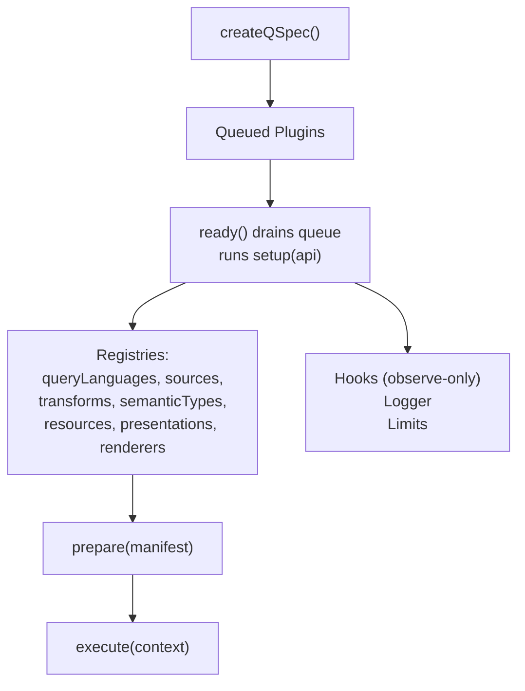
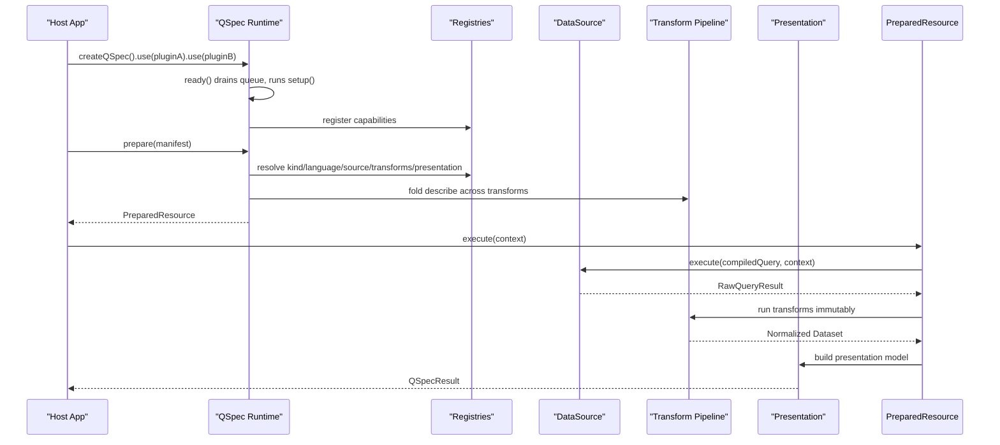
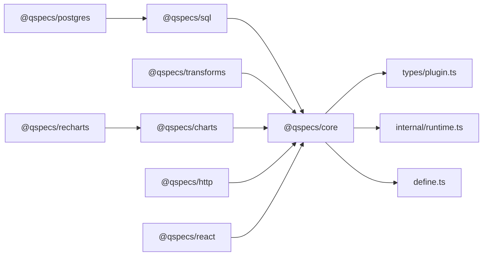

# Advanced Plugin Development

<cite>
**Referenced Files in This Document**
- [README.md](file://README.md)
- [SPEC.md](file://SPEC.md)
- [architecture.md](file://docs/architecture.md)
- [plugins.md](file://docs/plugins.md)
- [plugin-authoring.md](file://docs/plugin-authoring.md)
- [manifest-specification.md](file://docs/manifest-specification.md)
- [specification-versioning.md](file://docs/specification-versioning.md)
- [security.md](file://docs/security.md)
- [transforms.md](file://docs/transforms.md)
- [data-sources.md](file://docs/data-sources.md)
- [cli.md](file://docs/cli.md)
- [plugin.ts](file://packages/core/src/types/plugin.ts)
- [runtime.ts](file://packages/core/src/internal/runtime.ts)
- [define.ts](file://packages/core/src/define.ts)
</cite>

## Table of Contents

1. Introduction
2. Project Structure
3. Core Components
4. Architecture Overview
5. Detailed Component Analysis
6. Dependency Analysis
7. Performance Considerations
8. Troubleshooting Guide
9. Conclusion
10. Appendices

## Introduction

This document provides advanced guidance for building sophisticated QSpec plugins: versioning and compatibility, migration strategies, composition patterns, dependency management, configuration systems, hooks and lifecycle events, cross-plugin communication, performance and memory considerations, packaging and distribution, debugging and monitoring, and complex plugin architectures such as chains and enterprise-grade solutions. It synthesizes the repository’s plugin contract, runtime behavior, validation stages, and security constraints into actionable practices for production environments.

## Project Structure

QSpec is a modular system where core capabilities are minimal and extensible via plugins. The runtime composes query languages, data sources, transforms, semantic types, resource kinds, presentations, and renderers through registries. Plugins register capabilities during setup; the runtime drains queued plugins on first use and enforces ordering to support overrides.

**Diagram sources**

- [runtime.ts:44-167](file://packages/core/src/internal/runtime.ts#L44-L167)
- [plugins.md:62-93](file://docs/plugins.md#L62-L93)

**Section sources**

- [runtime.ts:44-167](file://packages/core/src/internal/runtime.ts#L44-L167)
- [plugins.md:1-198](file://docs/plugins.md#L1-L198)

## Core Components

- Plugin shape and API: definePlugin, QSpecPlugin, QSpecPluginAPI with seven registries, hooks.on, logger, limits.
- Registries: register, replace, get, has, list; replace enables override by later install order.
- Runtime lifecycle: use queues, ready drains once, prepare executes static work, execute runs per-call work.
- Validation stages: six-stage pipeline ensures early failure before network or rendering.

Key responsibilities:

- QueryLanguage.compile/validate: compile portable queries; validate at prepare time.
- DataSource.execute/dispose/supportedLanguages: connectivity and native execution; cancellation propagation; optional language gating.
- Transform.execute/describe/validate: immutable, ordered pipeline; static schema projection via describe; static spec validation via validate.
- ResourceKind/PresentationType/Renderer: extendable resources, presentation models, and output producers.

**Section sources**

- [plugin.ts:11-137](file://packages/core/src/types/plugin.ts#L11-L137)
- [plugins.md:35-131](file://docs/plugins.md#L35-L131)
- [architecture.md:65-105](file://docs/architecture.md#L65-L105)

## Architecture Overview

The runtime pipeline separates static preparation from dynamic execution. Stage 6 (presentation) validates against projected fields computed by transform.describe, preventing unnecessary database calls. Hooks expose lifecycle events for observation only; plugins cannot emit events.

**Diagram sources**

- [runtime.ts:117-167](file://packages/core/src/internal/runtime.ts#L117-L167)
- [architecture.md:65-105](file://docs/architecture.md#L65-L105)
- [data-sources.md:11-44](file://docs/data-sources.md#L11-L44)
- [transforms.md:24-48](file://docs/transforms.md#L24-L48)

## Detailed Component Analysis

### Plugin Versioning, Compatibility Declarations, and Migration Strategies

- apiVersion vs package versions: apiVersion identifies the manifest specification version; npm package versions are independent. Unsupported apiVersion fails structural validation.
- Plugin compatibility: declare compatible @qspecs/core ranges via each plugin’s package peerDependencies; runtime does not read QSpecPlugin.version.
- Backward compatibility: a released spec version must not change breaking; new apiVersion required for breaking changes. Future runtimes can accept multiple versions during migration windows.
- Migration strategy: maintain SUPPORTED_API_VERSIONS array to allow dual-version acceptance; provide tooling to migrate manifests gradually; keep validators in lockstep to avoid drift.

Practical steps:

- Pin peerDependencies conservatively pre-1.0; widen ranges after stable baseline.
- Add new apiVersion when breaking changes occur; implement multi-version handling if needed.
- Use CLI --config to validate manifests against installed plugins without executing queries.

**Section sources**

- [specification-versioning.md:1-105](file://docs/specification-versioning.md#L1-L105)
- [manifest-specification.md:37-66](file://docs/manifest-specification.md#L37-L66)
- [cli.md:53-112](file://docs/cli.md#L53-L112)

### Plugin Composition Patterns and Dependency Management

- Compose plugins via .use() in explicit order; later plugins can override earlier ones using replace(name, implementation).
- Registries enforce unique names on register; replace silently overwrites, enabling layered overrides.
- Dependencies between plugins are resolved at prepare time; ensure all required capabilities are registered before use.
- Keep plugins cohesive: group related capabilities (e.g., SQL + Postgres adapter) in a single plugin factory for clarity.

Best practices:

- Prefer additive registration (register) unless intentional override is desired (replace).
- Encapsulate configuration in plugin factories to avoid global state.
- Validate plugin load order in tests to guarantee override precedence.

**Section sources**

- [plugins.md:94-148](file://docs/plugins.md#L94-L148)
- [runtime.ts:80-115](file://packages/core/src/internal/runtime.ts#L80-L115)

### Configuration Systems and Limits

- Limits: maxRows, queryTimeoutMs, maxTransforms, maxManifestBytes, maxExpressionDepth; enforced in core and captured at setup time for transforms.
- Logger: runtime-provided logger used by plugins; data source contexts include logger for per-execution correlation.
- Manifest size: maxManifestBytes applies to string input only; already-parsed objects bypass byte measurement.

Operational guidance:

- Configure limits at createQSpec({ limits }) to bound resource usage.
- Use logger consistently for tracing and metrics; avoid logging credentials or sensitive values.
- Enforce manifest size limits at ingestion boundaries.

**Section sources**

- [plugin.ts:119-130](file://packages/core/src/types/plugin.ts#L119-L130)
- [architecture.md:107-122](file://docs/architecture.md#L107-L122)
- [define.ts:14-31](file://packages/core/src/define.ts#L14-L31)

### Advanced Hook Usage, Lifecycle Events, and Cross-Plugin Communication

- Hooks: observe-only via hooks.on; plugins cannot emit events. Use for diagnostics, metrics, and auditing.
- Lifecycle events: manifest parsing, validation stages, and execution phases are observable; attach handlers at runtime creation.
- Cross-plugin communication: rely on shared registries and prepared resources; avoid direct coupling between plugins.

Patterns:

- Attach observability hooks globally to capture stage timings and errors.
- Use logger with executionId for correlated logs across plugins.
- Avoid emitting custom events; instead, leverage structured logging and metrics.

**Section sources**

- [plugins.md:62-93](file://docs/plugins.md#L62-L93)
- [runtime.ts:44-78](file://packages/core/src/internal/runtime.ts#L44-L78)

### Data Sources: Execution, Cancellation, and Language Gating

- DataSource interface: execute(query, context), optional dispose, supportedLanguages for strict language gating.
- Cancellation: check AbortSignal early; propagate cancellation properly; do not destroy sockets—request server-side cancellation when possible.
- supportedLanguages: omitting accepts any language; empty array rejects all; explicit arrays enable fail-fast mismatches.

Implementation checklist:

- Validate signal.aborted before acquiring connections.
- Return positional rows with columns; never row objects.
- Implement dispose to release pools or connections.
- Run contract tests to verify immutability, cancellation timing, and idempotent disposal.

**Section sources**

- [data-sources.md:11-67](file://docs/data-sources.md#L11-L67)
- [data-sources.md:68-105](file://docs/data-sources.md#L68-L105)
- [data-sources.md:107-163](file://docs/data-sources.md#L107-L163)

### Transforms: Immutability, Schema Projection, and Expression Safety

- Ordering: strict left-to-right; each transform sees previous output; inputs must survive untouched.
- describe: project field transformations statically; omitting makes downstream static validation opaque.
- validate: check spec structure and references against available schema; return issues for multiple problems.
- Expressions: fixed operator set; no eval/new Function; depth capped by limits.maxExpressionDepth.

Design notes:

- Always implement describe to preserve static guarantees.
- Use Object.create(null) for rows to prevent prototype pollution.
- Compile expressions once per execution; reuse compiled AST.

**Section sources**

- [transforms.md:24-48](file://docs/transforms.md#L24-L48)
- [transforms.md:213-339](file://docs/transforms.md#L213-L339)
- [transforms.md:340-405](file://docs/transforms.md#L340-L405)

### Security and Trust Boundaries

- No credentials in manifests; host supplies configuration to plugins.
- Parameterized queries only; no string interpolation; CompiledSqlQuery omits text to prevent accidental concatenation.
- No eval/new Function; expression evaluation via interpreter.
- Prototype pollution resistance: safe key checks, null-prototype rows, Map-based registries, Object.hasOwn lookups.
- Resource limits: enforce bounds at parse, prepare, and execute stages.
- No credential logging: wrap driver errors; avoid forwarding messages that may contain secrets.

**Section sources**

- [security.md:17-147](file://docs/security.md#L17-L147)
- [architecture.md:158-203](file://docs/architecture.md#L158-L203)

### Packaging, Distribution, and Publishing Workflows

- Package boundaries: internal code under src/internal is not re-exported; exports map limited to "." and "./package.json".
- Browser-safe packages: no database drivers; enforced by boundary tests.
- CLI validation: qspec validate runs both core and JSON Schema validators; --config enables plugin-aware checks without a database.
- Release scripts: repository includes publish and release-check scripts for coordinated publishing.

Guidance:

- Keep plugins as separate npm packages with clear peerDependencies.
- Publish schemas and types alongside implementations.
- Use CI to run boundary and contract tests before publishing.

**Section sources**

- [architecture.md:158-190](file://docs/architecture.md#L158-L190)
- [cli.md:15-112](file://docs/cli.md#L15-L112)
- [README.md:243-258](file://README.md#L243-L258)

### Debugging, Logging, and Monitoring

- Structured logging: use logger from QSpecPluginAPI and DataSourceContext; include executionId for correlation.
- Diagnostics: CLI reports precise paths and “did you mean” suggestions; use inspect to view static content without plugins.
- Contract suites: run transform and data source contract tests to catch subtle violations early.
- Metrics: attach hook handlers to record stage durations, error rates, and resource usage.

Practices:

- Log at appropriate levels; avoid sensitive data.
- Use inspect --json for programmatic analysis of manifests.
- Instrument hooks to capture lifecycle timings and failures.

**Section sources**

- [cli.md:15-112](file://docs/cli.md#L15-L112)
- [cli.md:114-198](file://docs/cli.md#L114-L198)
- [plugin-authoring.md:116-143](file://docs/plugin-authoring.md#L116-L143)
- [plugin-authoring.md:232-247](file://docs/plugin-authoring.md#L232-L247)

### Complex Plugin Architectures: Chains and Enterprise Solutions

- Plugin chains: compose multiple plugins to form pipelines (SQL + Postgres + Transforms + Charts); order matters for overrides and dependencies.
- Enterprise patterns:
  - Centralized plugin registry with feature flags to enable/disable capabilities per environment.
  - Multi-tenant isolation via per-tenant QSpec instances with distinct limits and loggers.
  - Policy enforcement via custom resource kinds and presentation validations.
  - Observability layer via hooks and structured logging integrated with centralized monitoring.

Examples:

- Build a “Data Platform” plugin that registers multiple sources and transforms, exposing a unified API surface.
- Create a “Security” plugin that injects audit hooks and enforces limits across all executions.
- Provide a “Rendering” plugin suite that shares series resolution logic across renderers for consistency.

**Section sources**

- [architecture.md:9-63](file://docs/architecture.md#L9-L63)
- [plugins.md:166-183](file://docs/plugins.md#L166-L183)

## Dependency Analysis

Plugins depend on core interfaces and registries; external dependencies are minimized in core and browser-safe packages. Database drivers are isolated to server-only packages.

**Diagram sources**

- [plugin.ts:11-137](file://packages/core/src/types/plugin.ts#L11-L137)
- [runtime.ts:44-167](file://packages/core/src/internal/runtime.ts#L44-L167)
- [define.ts:116-123](file://packages/core/src/define.ts#L116-L123)
- [README.md:243-258](file://README.md#L243-L258)

**Section sources**

- [README.md:243-258](file://README.md#L243-L258)
- [architecture.md:158-203](file://docs/architecture.md#L158-L203)

## Performance Considerations

- Prepare/Execute split: perform static work once; reuse PreparedResource for multiple parameter sets.
- Immutable transforms: avoid mutation; return fresh datasets to prevent hidden sharing costs.
- Expression depth: cap nesting to prevent deep recursion; configure limits appropriately.
- Cancellation: check signals early; implement proper server-side cancellation to free resources promptly.
- Memory: prefer positional rows and null-prototype objects; avoid large intermediate structures; stream results where possible.

Recommendations:

- Profile transform pipelines for hot paths; consider batching or pagination via limit/offset.
- Tune limits based on workload characteristics; monitor maxRows and queryTimeoutMs.
- Use contract tests to detect regressions in performance-sensitive behaviors.

[No sources needed since this section provides general guidance]

## Troubleshooting Guide

Common issues and resolutions:

- Unknown transform or language: ensure plugin is installed and registered; use CLI --config to validate plugin-aware.
- Unsupported apiVersion: update manifest or runtime to supported versions.
- Prototype pollution errors: verify rows built with Object.create(null); use Object.hasOwn for lookups.
- Cancellation not working: confirm signal checks and server-side cancellation; avoid socket destruction.
- Credential leaks: ensure no credentials in manifests; wrap driver errors; avoid logging messages that may contain secrets.

Diagnostic tools:

- qspec validate and inspect for static checks and manifest introspection.
- Contract suites for transforms and data sources.
- Hook handlers for lifecycle event tracing.

**Section sources**

- [cli.md:53-112](file://docs/cli.md#L53-L112)
- [security.md:17-147](file://docs/security.md#L17-L147)
- [plugin-authoring.md:116-143](file://docs/plugin-authoring.md#L116-L143)
- [plugin-authoring.md:232-247](file://docs/plugin-authoring.md#L232-L247)

## Conclusion

Advanced plugin development in QSpec centers on a robust plugin contract, strict validation stages, secure defaults, and clear separation of concerns. By leveraging registries, hooks, limits, and contract suites, developers can build scalable, maintainable, and secure plugin ecosystems. Adhering to versioning policies, security constraints, and performance best practices ensures reliable operation in enterprise environments.

[No sources needed since this section summarizes without analyzing specific files]

## Appendices

### Quick Reference: Plugin Registration and Overrides

- Register new capabilities with api.transforms.register, api.sources.register, etc.
- Override existing capabilities with api.transforms.replace for later-install precedence.
- Ensure plugin name uniqueness; duplicate names throw during drain.

**Section sources**

- [plugins.md:94-148](file://docs/plugins.md#L94-L148)
- [runtime.ts:80-115](file://packages/core/src/internal/runtime.ts#L80-L115)

### Quick Reference: Data Source Implementation Checklist

- Check AbortSignal before work.
- Return positional rows with columns.
- Implement dispose for cleanup.
- Declare supportedLanguages for strict gating.
- Run contract tests for immutability and cancellation.

**Section sources**

- [data-sources.md:107-163](file://docs/data-sources.md#L107-L163)
- [data-sources.md:68-105](file://docs/data-sources.md#L68-L105)

### Quick Reference: Transform Best Practices

- Implement describe to preserve static validation.
- Return fresh datasets; never mutate inputs.
- Compile expressions once per execution.
- Handle undefined fields gracefully in validate.

**Section sources**

- [transforms.md:24-48](file://docs/transforms.md#L24-L48)
- [transforms.md:340-405](file://docs/transforms.md#L340-L405)
