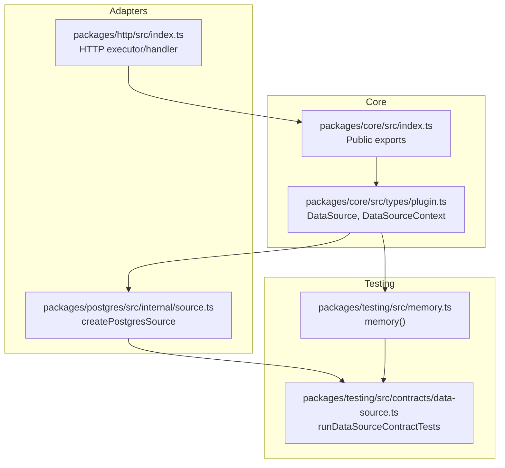
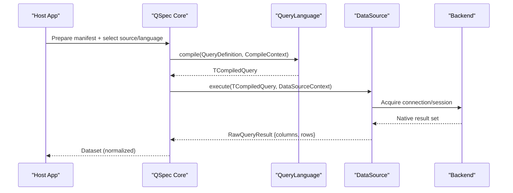
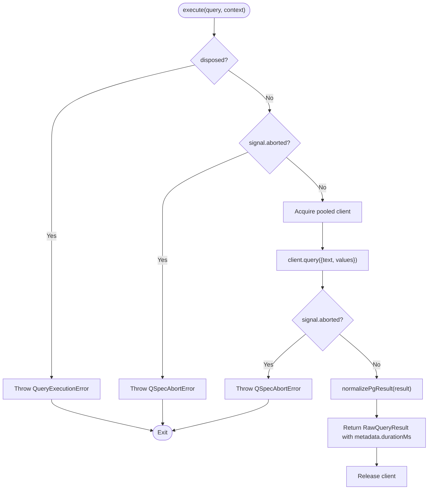
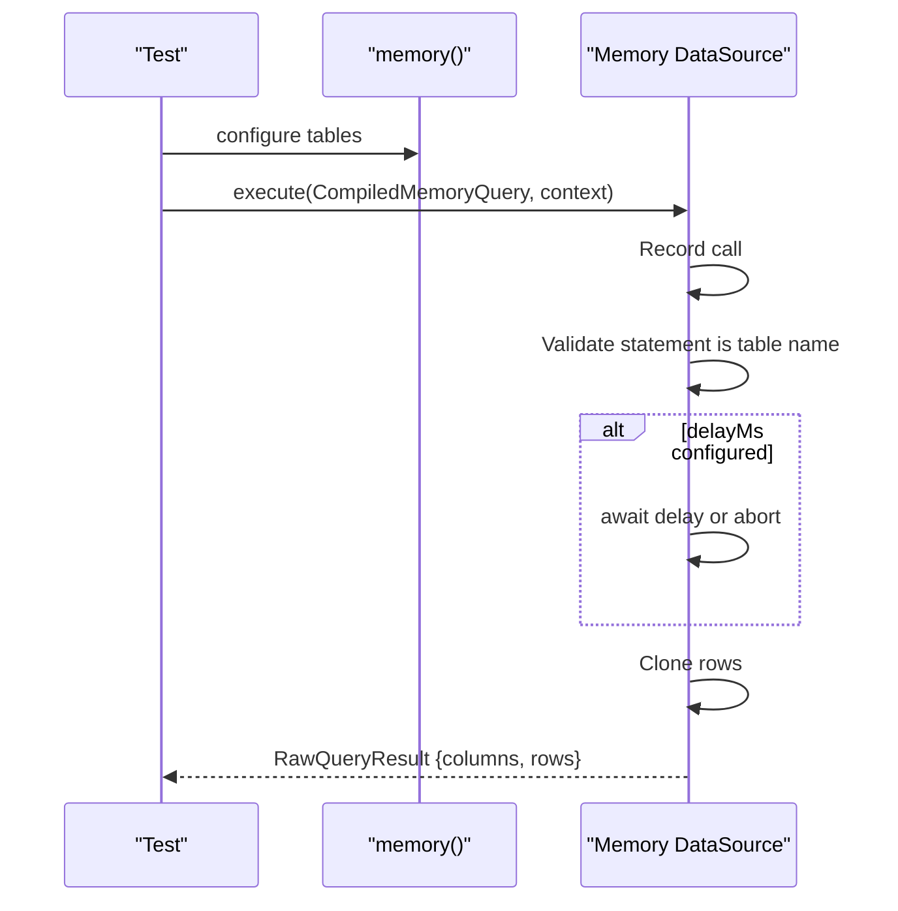
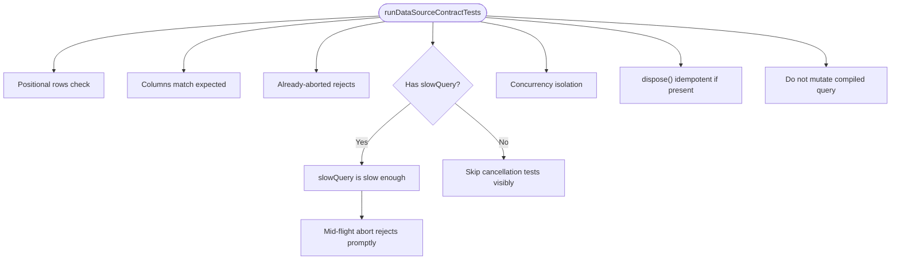
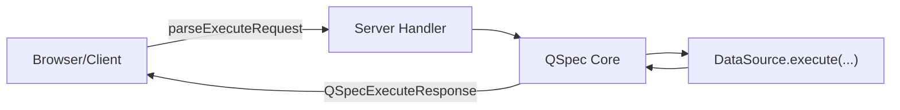
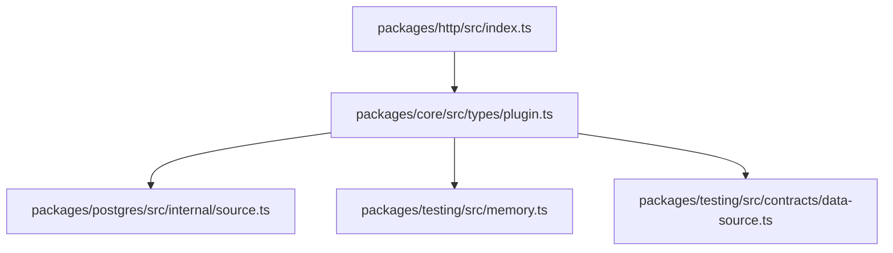

# Data Source Plugins

<cite>
**Referenced Files in This Document**
- [data-sources.md](file://docs/data-sources.md)
- [plugin-authoring.md](file://docs/plugin-authoring.md)
- [index.ts](file://packages/core/src/index.ts)
- [plugin.ts](file://packages/core/src/types/plugin.ts)
- [source.ts](file://packages/postgres/src/internal/source.ts)
- [memory.ts](file://packages/testing/src/memory.ts)
- [data-source.ts](file://packages/testing/src/contracts/data-source.ts)
- [index.ts](file://packages/http/src/index.ts)
</cite>

## Table of Contents

1. [Introduction](#introduction)
2. [Project Structure](#project-structure)
3. [Core Components](#core-components)
4. [Architecture Overview](#architecture-overview)
5. [Detailed Component Analysis](#detailed-component-analysis)
6. [Dependency Analysis](#dependency-analysis)
7. [Performance Considerations](#performance-considerations)
8. [Troubleshooting Guide](#troubleshooting-guide)
9. [Conclusion](#conclusion)
10. [Appendices](#appendices)

## Introduction

This document explains how to develop custom data source plugins for QSpec. It covers the DataSource interface, connection management, query execution patterns, cancellation and disposal, logging integration, and limits enforcement. It also provides concrete examples for database connectors (PostgreSQL pattern), REST API clients, and file-based sources, along with best practices for performance, caching, concurrency, and testing using the memory data source and contract suites.

## Project Structure

QSpec separates core types and runtime from plugin implementations:

- Core types and public exports define the contracts that plugins implement.
- The PostgreSQL adapter demonstrates a production-grade data source with pooling, cancellation, and disposal.
- The testing package provides an in-memory data source and a comprehensive contract suite to validate any DataSource implementation.
- The HTTP package exposes a wire protocol and client/server utilities for executing QSpec over HTTP.

**Diagram sources**

- [plugin.ts:11-35](file://packages/core/src/types/plugin.ts#L11-L35)
- [index.ts:91-105](file://packages/core/src/index.ts#L91-L105)
- [source.ts:78-309](file://packages/postgres/src/internal/source.ts#L78-L309)
- [memory.ts:69-160](file://packages/testing/src/memory.ts#L69-L160)
- [data-source.ts:316-403](file://packages/testing/src/contracts/data-source.ts#L316-L403)
- [index.ts:1-37](file://packages/http/src/index.ts#L1-L37)

**Section sources**

- [data-sources.md:1-10](file://docs/data-sources.md#L1-L10)
- [plugin-authoring.md:145-213](file://docs/plugin-authoring.md#L145-L213)

## Core Components

- DataSource<TCompiledQuery>: Defines execute(query, context) returning RawQueryResult, optional dispose(), and optional supportedLanguages.
- DataSourceContext: Provides executionId, optional AbortSignal, locale/timezone hints, and a logger.
- QueryLanguage: Compiles portable queries into a source-specific compiled form; can provide static validation.
- Plugin registration: Sources are registered via QSpecPluginAPI.sources.register(name, source).

Key responsibilities:

- Connectivity and native execution only; no presentation logic.
- Cancellation propagation and raw result acquisition.
- Optional cleanup via dispose().

**Section sources**

- [plugin.ts:11-35](file://packages/core/src/types/plugin.ts#L11-L35)
- [plugin.ts:44-56](file://packages/core/src/types/plugin.ts#L44-L56)
- [plugin.ts:119-130](file://packages/core/src/types/plugin.ts#L119-L130)
- [data-sources.md:11-44](file://docs/data-sources.md#L11-L44)
- [plugin-authoring.md:145-213](file://docs/plugin-authoring.md#L145-L213)

## Architecture Overview

A typical execution path:

- Host configures one or more data sources by registering them through a plugin’s setup.
- A manifest specifies spec.query.source and spec.query.language.
- Core compiles the query using the paired QueryLanguage and executes it via the selected DataSource.
- The DataSource returns RawQueryResult (positional rows and columns), which core normalizes into a Dataset.

**Diagram sources**

- [plugin.ts:44-56](file://packages/core/src/types/plugin.ts#L44-L56)
- [plugin.ts:11-35](file://packages/core/src/types/plugin.ts#L11-L35)
- [data-sources.md:11-44](file://docs/data-sources.md#L11-L44)

## Detailed Component Analysis

### PostgreSQL DataSource (database connector pattern)

Highlights:

- Connection pooling with lazy initialization per logical source name.
- Statement timeout configuration via pool options.
- Robust cancellation: uses a separate client to call pg_cancel_backend on the running PID; avoids destroying sockets or cancelling on the blocked connection.
- Error wrapping: driver errors are attached as cause without leaking sensitive details in messages.
- Disposal: ends the pool once; idempotent behavior guarded by flags.

**Diagram sources**

- [source.ts:78-289](file://packages/postgres/src/internal/source.ts#L78-L289)

**Section sources**

- [source.ts:23-33](file://packages/postgres/src/internal/source.ts#L23-L33)
- [source.ts:47-64](file://packages/postgres/src/internal/source.ts#L47-L64)
- [source.ts:129-172](file://packages/postgres/src/internal/source.ts#L129-L172)
- [source.ts:174-231](file://packages/postgres/src/internal/source.ts#L174-L231)
- [source.ts:233-289](file://packages/postgres/src/internal/source.ts#L233-L289)
- [data-sources.md:131-163](file://docs/data-sources.md#L131-L163)

### Memory DataSource (testing and mocking)

Highlights:

- In-memory tables with configurable delay to simulate slow queries.
- Records calls for assertions (source, statement, bindings).
- Enforces positional rows and deep-clones results to avoid fixture mutation.
- Implements full abort handling, including pre-abort checks and listener cleanup.

**Diagram sources**

- [memory.ts:69-160](file://packages/testing/src/memory.ts#L69-L160)

**Section sources**

- [memory.ts:14-28](file://packages/testing/src/memory.ts#L14-L28)
- [memory.ts:30-55](file://packages/testing/src/memory.ts#L30-L55)
- [memory.ts:80-142](file://packages/testing/src/memory.ts#L80-L142)
- [memory.ts:144-160](file://packages/testing/src/memory.ts#L144-L160)

### Contract Suite (validation of any DataSource)

The contract suite enforces invariants every DataSource must satisfy:

- Positional rows matching columns length.
- Column names match expected order.
- Already-aborted signals reject immediately without work.
- Mid-flight aborts reject promptly within a bound.
- Concurrency isolation: concurrent executions do not share mutable state.
- Idempotent dispose when implemented.
- No mutation of the compiled query object.

**Diagram sources**

- [data-source.ts:316-403](file://packages/testing/src/contracts/data-source.ts#L316-L403)

**Section sources**

- [data-source.ts:4-37](file://packages/testing/src/contracts/data-source.ts#L4-L37)
- [data-source.ts:118-130](file://packages/testing/src/contracts/data-source.ts#L118-L130)
- [data-source.ts:132-227](file://packages/testing/src/contracts/data-source.ts#L132-L227)
- [data-source.ts:239-308](file://packages/testing/src/contracts/data-source.ts#L239-L308)
- [data-source.ts:316-403](file://packages/testing/src/contracts/data-source.ts#L316-L403)

### HTTP Execution (REST-like boundary)

The HTTP package provides a wire protocol and client/server utilities to execute QSpec across process boundaries. It serializes requests and responses and handles errors according to the protocol.

**Diagram sources**

- [index.ts:1-37](file://packages/http/src/index.ts#L1-L37)

**Section sources**

- [index.ts:1-37](file://packages/http/src/index.ts#L1-L37)

## Dependency Analysis

- Core exports the DataSource, DataSourceContext, and related types used by all adapters.
- PostgreSQL adapter depends on core types and its own driver abstraction for pooling and cancellation.
- Testing memory adapter depends on core types and implements a minimal language and source for pipeline exercises.
- Contract suite depends on core types and asserts against any DataSource implementation.

**Diagram sources**

- [plugin.ts:11-35](file://packages/core/src/types/plugin.ts#L11-L35)
- [source.ts:78-309](file://packages/postgres/src/internal/source.ts#L78-L309)
- [memory.ts:69-160](file://packages/testing/src/memory.ts#L69-L160)
- [data-source.ts:316-403](file://packages/testing/src/contracts/data-source.ts#L316-L403)
- [index.ts:1-37](file://packages/http/src/index.ts#L1-L37)

**Section sources**

- [index.ts:91-105](file://packages/core/src/index.ts#L91-L105)

## Performance Considerations

- Connection pooling: Use a pool with appropriate max size and timeouts; lazily initialize pools to avoid startup cost.
- Cancellation: Check signal before acquiring connections; use backend-native cancellation where possible (e.g., pg_cancel_backend).
- Result shape: Return positional rows to minimize overhead and ensure compatibility with normalization.
- Avoid shared mutable state: Ensure each execute invocation works on independent buffers to support concurrency.
- Logging: Use per-execution logger for request-scoped logs; use runtime logger for lifecycle events outside executions.
- Limits: Respect host-provided limits (e.g., expression depth) passed via plugin API; enforce at compile time where applicable.

[No sources needed since this section provides general guidance]

## Troubleshooting Guide

Common issues and remedies:

- Already-aborted signal still runs work: Ensure early checks of context.signal.aborted before any network or heavy work.
- Mid-flight abort not honored: Attach abort listeners around long-running operations and clear them in finally blocks; re-check signal after awaits.
- Driver error leaks secrets: Wrap driver errors and attach cause instead of embedding connection strings in messages.
- Pool not closed: Implement dispose() to end pools; guard against multiple dispose calls.
- Concurrent queries corrupt results: Never reuse row buffers or cursors across executions; clone or allocate per call.
- Contract failures: Run runDataSourceContractTests to catch violations like non-positional rows, missing column ordering, or mutated compiled queries.

**Section sources**

- [source.ts:47-64](file://packages/postgres/src/internal/source.ts#L47-L64)
- [source.ts:129-172](file://packages/postgres/src/internal/source.ts#L129-L172)
- [source.ts:174-231](file://packages/postgres/src/internal/source.ts#L174-L231)
- [source.ts:233-289](file://packages/postgres/src/internal/source.ts#L233-L289)
- [data-source.ts:118-130](file://packages/testing/src/contracts/data-source.ts#L118-L130)
- [data-source.ts:132-227](file://packages/testing/src/contracts/data-source.ts#L132-L227)
- [data-source.ts:239-308](file://packages/testing/src/contracts/data-source.ts#L239-L308)

## Conclusion

Implementing a data source plugin centers on a clean execute method that respects cancellation, returns positional results, and manages resources safely. Use the PostgreSQL adapter as a reference for robust pooling, cancellation, and disposal. Validate your implementation with the contract suite to ensure compliance with core invariants. For testing, leverage the memory data source to exercise pipelines without external dependencies.

[No sources needed since this section summarizes without analyzing specific files]

## Appendices

### Best Practices Checklist

- Always check context.signal.aborted before doing work.
- Use backend-native cancellation mechanisms when available.
- Wrap driver errors and attach cause; never embed secrets in messages.
- Implement dispose() to close pools or connections; make it idempotent.
- Return positional rows and ensure columns.length matches row cell count.
- Do not mutate the compiled query object.
- Register sources via api.sources.register inside plugin setup.
- Declare supportedLanguages to fail fast on mismatches.
- Run runDataSourceContractTests against your source.

**Section sources**

- [data-sources.md:11-66](file://docs/data-sources.md#L11-L66)
- [plugin-authoring.md:145-213](file://docs/plugin-authoring.md#L145-L213)
- [data-source.ts:316-403](file://packages/testing/src/contracts/data-source.ts#L316-L403)
