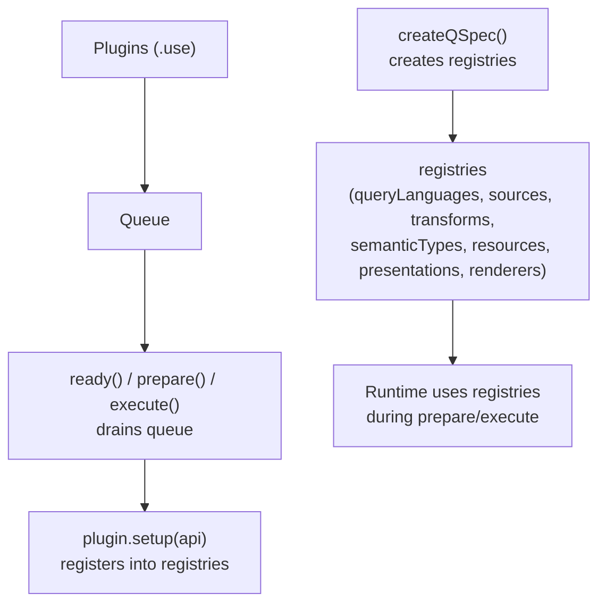
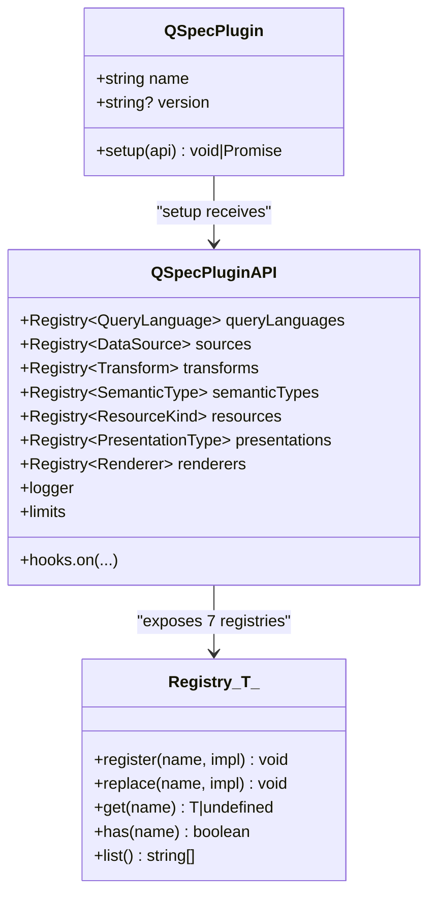
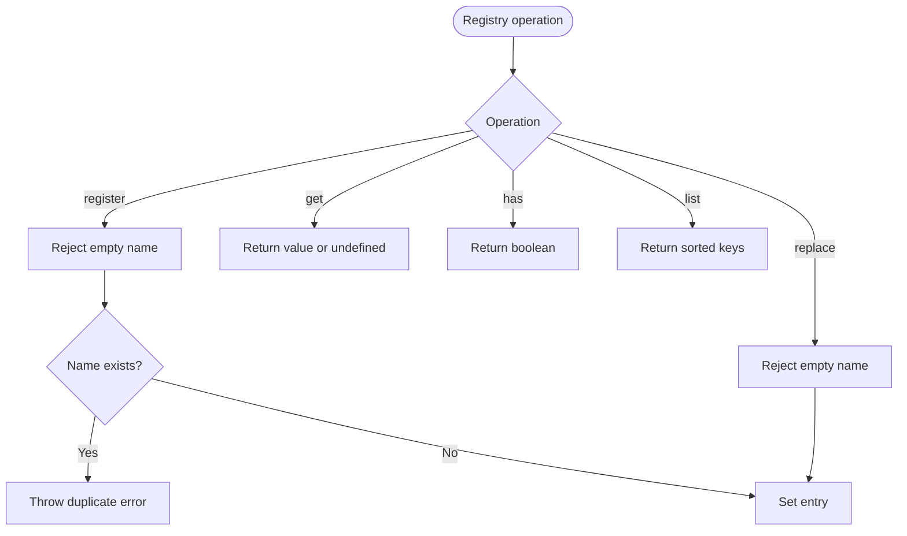
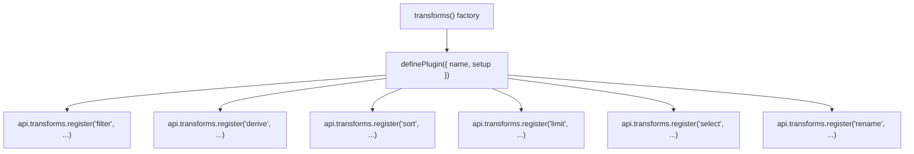
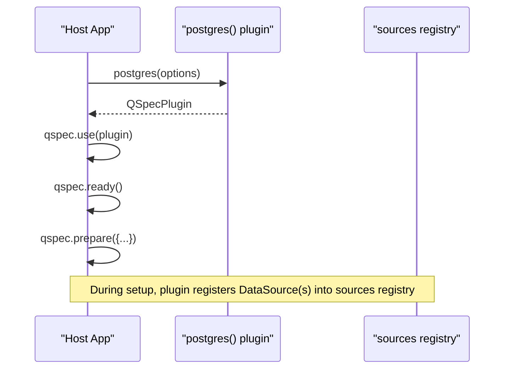
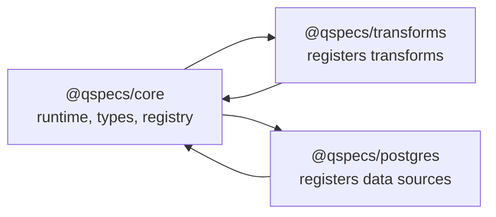

# Plugin Architecture

<cite>
**Referenced Files in This Document**
- [runtime.ts](file://packages/core/src/internal/runtime.ts)
- [registry.ts](file://packages/core/src/internal/registry.ts)
- [plugin.ts](file://packages/core/src/types/plugin.ts)
- [registry.ts (types)](file://packages/core/src/types/registry.ts)
- [define.ts](file://packages/core/src/define.ts)
- [plugins.md](file://docs/plugins.md)
- [plugin-authoring.md](file://docs/plugin-authoring.md)
- [index.ts (transforms)](file://packages/transforms/src/index.ts)
- [index.ts (postgres)](file://packages/postgres/src/index.ts)
</cite>

## Table of Contents

1. [Introduction](#introduction)
2. [Project Structure](#project-structure)
3. [Core Components](#core-components)
4. [Architecture Overview](#architecture-overview)
5. [Detailed Component Analysis](#detailed-component-analysis)
6. [Dependency Analysis](#dependency-analysis)
7. [Performance Considerations](#performance-considerations)
8. [Troubleshooting Guide](#troubleshooting-guide)
9. [Conclusion](#conclusion)

## Introduction

This document explains the QSpec plugin architecture and core concepts: how plugins extend framework capabilities through a set of capability registries, how the runtime orchestrates plugin setup and execution, and how the registry model enables extensibility without modifying core code. It covers the seven registries, the Registry<T> interface, plugin lifecycle from registration to execution, load order and override mechanisms, and common patterns used by built-in plugins.

## Project Structure

At a high level:

- The runtime creates and owns seven typed registries for capabilities.
- Plugins register implementations into these registries during their setup phase.
- The runtime drains queued plugins on first use or explicit ready(), runs setups in registration order, and exposes hooks, logger, and limits to plugins.
- Built-in packages like transforms and postgres are themselves plugins that register capabilities at runtime.



**Diagram sources**

- [runtime.ts:44-78](file://packages/core/src/internal/runtime.ts#L44-L78)
- [runtime.ts:93-115](file://packages/core/src/internal/runtime.ts#L93-L115)
- [runtime.ts:152-160](file://packages/core/src/internal/runtime.ts#L152-L160)

**Section sources**

- [runtime.ts:44-78](file://packages/core/src/internal/runtime.ts#L44-L78)
- [plugins.md:1-8](file://docs/plugins.md#L1-L8)

## Core Components

- QSpecPlugin: a minimal object with name, optional version, and setup(api).
- QSpecPluginAPI: the capability surface handed to every plugin’s setup, including seven registries, hooks.on, logger, and limits.
- Registry<T>: a generic capability registry with register, replace, get, has, list.
- Runtime: createQSpec builds registries, queues plugins, and executes them lazily on first use.

Key behaviors:

- .use(plugin) queues; setup runs only when ready() is awaited or implicitly via prepare()/execute().
- Setup runs once per plugin name, in registration order, sequentially.
- Duplicate plugin names throw; setup failures poison the runtime and are rethrown on subsequent calls.
- dispose() invokes optional cleanup on registered data sources.

**Section sources**

- [plugin.ts:119-136](file://packages/core/src/types/plugin.ts#L119-L136)
- [registry.ts (types):1-11](file://packages/core/src/types/registry.ts#L1-L11)
- [runtime.ts:80-115](file://packages/core/src/internal/runtime.ts#L80-L115)
- [runtime.ts:152-167](file://packages/core/src/internal/runtime.ts#L152-L167)

## Architecture Overview

The plugin system is registry-driven. Core registers one resource kind (Dataset); all other capabilities (query languages, data sources, transforms, semantic types, additional resource kinds, presentation types, renderers) are added by plugins.



**Diagram sources**

- [plugin.ts:119-136](file://packages/core/src/types/plugin.ts#L119-L136)
- [registry.ts (types):1-11](file://packages/core/src/types/registry.ts#L1-L11)

## Detailed Component Analysis

### Seven Capability Registries

Every extension point is a typed registry created by createRegistry(label), exposed via QSpecPluginAPI:

- queryLanguages: compile portable queries into source-specific statements.
- sources: execute compiled queries against backends.
- transforms: transform datasets immutably with optional schema describe and validate.
- semanticTypes: annotate field meaning without changing storage type.
- resources: define new resource kinds beyond Dataset.
- presentations: define visualization or output definitions.
- renderers: render datasets with given presentations outside query execution.

These registries are constructed in the runtime and passed into each plugin’s setup.

**Section sources**

- [runtime.ts:51-63](file://packages/core/src/internal/runtime.ts#L51-L63)
- [plugin.ts:19-111](file://packages/core/src/types/plugin.ts#L19-L111)
- [plugins.md:62-92](file://docs/plugins.md#L62-L92)

### Registry<T> Interface and Implementation

The Registry<T> contract provides:

- register(name, implementation): throws on empty name or duplicate registration.
- replace(name, implementation): silently overwrites if present; still rejects empty names.
- get(name), has(name), list(): read-only access; list returns sorted names for deterministic diagnostics.

Implementation uses a Map to avoid prototype key collisions and ensure safe handling of names like constructor or **proto**.



**Diagram sources**

- [registry.ts:8-45](file://packages/core/src/internal/registry.ts#L8-L45)

**Section sources**

- [registry.ts:8-45](file://packages/core/src/internal/registry.ts#L8-L45)
- [registry.ts (types):1-11](file://packages/core/src/types/registry.ts#L1-L11)
- [plugins.md:94-130](file://docs/plugins.md#L94-L130)

### Plugin Lifecycle: Registration to Execution

- Registration: call qspec.use(plugin) to queue a plugin.
- Installation: ready() drains the queue, running each plugin’s setup exactly once, in registration order, awaiting async setup before proceeding.
- Execution: prepare() ensures ready() has completed, then prepares the manifest using the populated registries; execute() delegates to prepared.execute(context).
- Disposal: dispose() iterates registered data sources and calls optional dispose() on each.

```mermaid
sequenceDiagram
participant Host as "Host App"
participant QSpec as "QSpec Runtime"
participant P1 as "Plugin A"
participant P2 as "Plugin B"
participant Reg as "Registries"
Host->>QSpec : use(P1), use(P2)
Note over QSpec : Queues plugins; no setup yet
Host->>QSpec : prepare(manifest)
QSpec->>QSpec : ready()
QSpec->>P1 : setup(api)
P1->>Reg : register(... capabilities ...)
QSpec->>P2 : setup(api)
P2->>Reg : register(... capabilities ...)
QSpec-->>Host : Prepared resource
Host->>QSpec : execute(manifest, ctx)
QSpec-->>Host : Result
```

**Diagram sources**

- [runtime.ts:93-115](file://packages/core/src/internal/runtime.ts#L93-L115)
- [runtime.ts:152-160](file://packages/core/src/internal/runtime.ts#L152-L160)

**Section sources**

- [runtime.ts:80-115](file://packages/core/src/internal/runtime.ts#L80-L115)
- [runtime.ts:152-167](file://packages/core/src/internal/runtime.ts#L152-L167)
- [plugins.md:132-164](file://docs/plugins.md#L132-L164)

### Load Order, Installation, and Overrides

- Load order: plugins run in the exact order they were queued via .use().
- Override mechanism: later plugins can call api.<registry>.replace("name", impl) to swap earlier registrations; this is intentional and silent.
- Safety: register throws on duplicates; use replace only when overriding is deliberate.
- Concurrency: concurrent ready() calls share one drain; a failed setup poisons the runtime and is rethrown on subsequent calls.

**Section sources**

- [plugins.md:132-164](file://docs/plugins.md#L132-L164)
- [runtime.ts:80-115](file://packages/core/src/internal/runtime.ts#L80-L115)

### API Access Patterns in Plugins

- Hooks: plugins observe lifecycle events via api.hooks.on; they cannot emit events.
- Logger: api.logger is the runtime’s configured logger, also used by data sources per execution.
- Limits: api.limits is captured at setup time; transforms close over values like maxExpressionDepth here.

**Section sources**

- [plugin.ts:119-130](file://packages/core/src/types/plugin.ts#L119-L130)
- [plugins.md:62-92](file://docs/plugins.md#L62-L92)

### Example: Built-in Transform Plugin Pattern

A typical plugin factory returns a QSpecPlugin that registers multiple transforms, often capturing runtime limits at setup time.



**Diagram sources**

- [index.ts (transforms):21-39](file://packages/transforms/src/index.ts#L21-L39)

**Section sources**

- [index.ts (transforms):21-39](file://packages/transforms/src/index.ts#L21-L39)

### Example: Data Source Plugin Pattern

A data source plugin registers one DataSource per logical source name and may declare supportedLanguages to constrain compatible query languages.



**Diagram sources**

- [index.ts (postgres):37-39](file://packages/postgres/src/index.ts#L37-L39)
- [runtime.ts:51-63](file://packages/core/src/internal/runtime.ts#L51-L63)

**Section sources**

- [index.ts (postgres):37-39](file://packages/postgres/src/index.ts#L37-L39)
- [plugin-authoring.md:145-230](file://docs/plugin-authoring.md#L145-L230)

### Conceptual Overview

The plugin system separates concerns cleanly:

- Core owns minimal bootstrapping and the Dataset resource kind.
- All other capabilities are opt-in via plugins.
- Registries provide a uniform extension mechanism with strong typing and deterministic behavior.

[No sources needed since this section doesn't analyze specific files]

## Dependency Analysis

The runtime composes registries and passes them into plugins. Built-in packages depend on @qspecs/core to register capabilities.



**Diagram sources**

- [runtime.ts:51-63](file://packages/core/src/internal/runtime.ts#L51-L63)
- [index.ts (transforms):21-39](file://packages/transforms/src/index.ts#L21-L39)
- [index.ts (postgres):37-39](file://packages/postgres/src/index.ts#L37-L39)

**Section sources**

- [runtime.ts:51-63](file://packages/core/src/internal/runtime.ts#L51-L63)
- [index.ts (transforms):21-39](file://packages/transforms/src/index.ts#L21-L39)
- [index.ts (postgres):37-39](file://packages/postgres/src/index.ts#L37-L39)

## Performance Considerations

- Lazy setup: plugins do not pay setup cost until ready()/prepare()/execute() is invoked.
- Sequential setup: guarantees deterministic ordering and avoids race conditions between plugins.
- Sorted listing: registry.list() returns sorted names for stable diagnostics.
- Avoid heavy work in setup unless necessary; prefer registering lightweight descriptors and deferring expensive initialization to execution time.

[No sources needed since this section provides general guidance]

## Troubleshooting Guide

Common issues and where they originate:

- Duplicate plugin name: throwing during drain indicates the same plugin name was queued twice.
- Duplicate registry key: register throws with a message suggesting replace() for intentional overrides.
- Empty registry name: both register and replace reject empty names.
- Setup failure: wrapped in PluginRegistrationError; runtime becomes poisoned and rethrows on subsequent ready() calls.
- Prototype-safe keys: registry uses Map to safely handle names like constructor or **proto**.

Remediation tips:

- Ensure unique plugin names across your application.
- Use replace() only when you intentionally want to override an existing capability.
- Inspect setup errors carefully; they include the plugin name for context.
- Validate manifests early; parseManifest enforces structural safety and size limits.

**Section sources**

- [runtime.ts:80-115](file://packages/core/src/internal/runtime.ts#L80-L115)
- [registry.ts:8-45](file://packages/core/src/internal/registry.ts#L8-L45)
- [define.ts:74-114](file://packages/core/src/define.ts#L74-L114)
- [plugins.md:150-164](file://docs/plugins.md#L150-L164)

## Conclusion

QSpec’s plugin architecture centers on a small runtime and seven typed registries. Plugins extend capabilities by registering implementations during a lazy, ordered setup phase. The Registry<T> interface provides safe, predictable operations for adding, replacing, and querying capabilities. Built-in packages demonstrate standard patterns for registering transforms and data sources. By following the established interfaces and lifecycle rules, developers can compose powerful, modular data pipelines without modifying core code.
