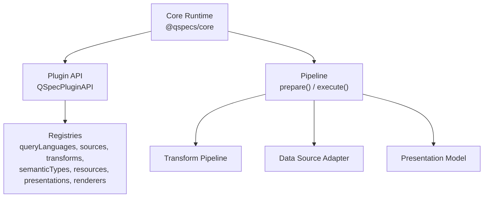
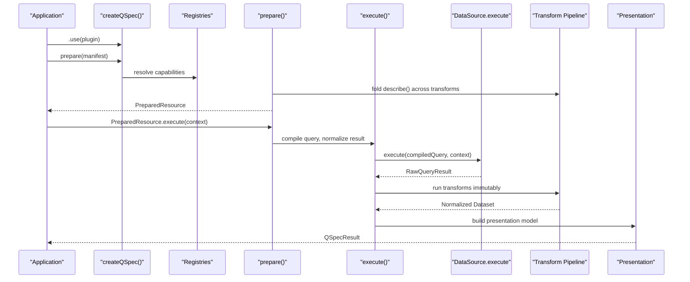
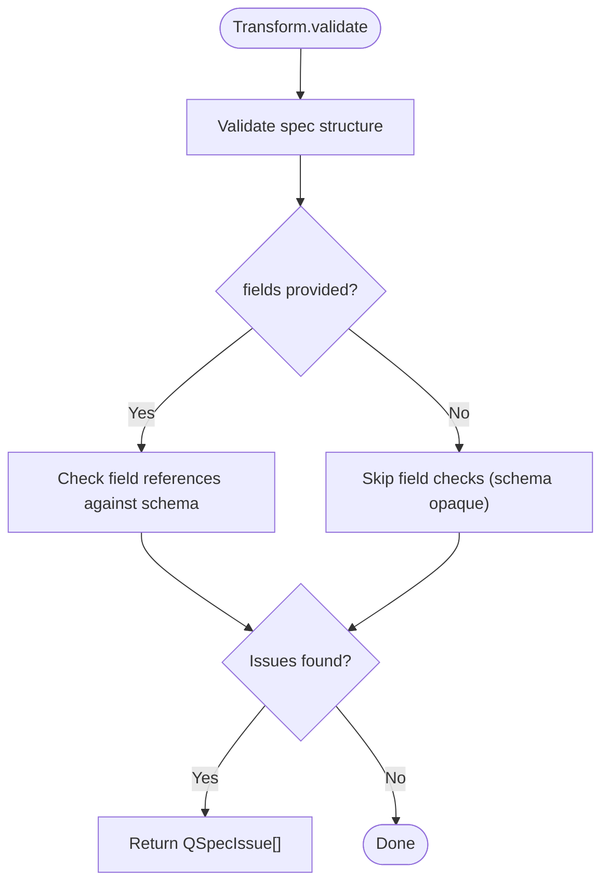
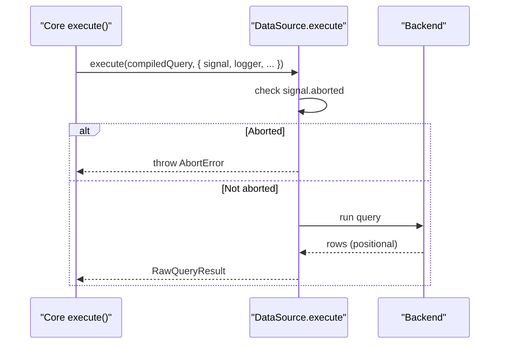
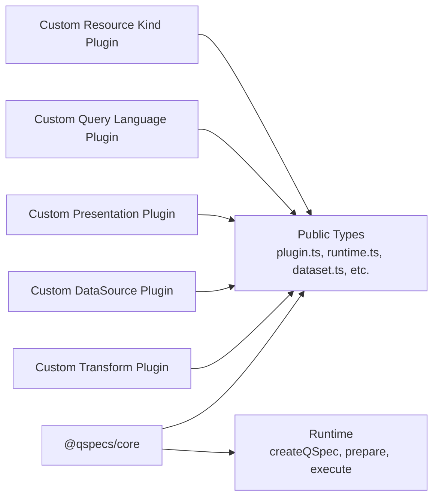

# Plugin Development

<cite>
**Referenced Files in This Document**
- [plugin-authoring.md](file://docs/plugin-authoring.md)
- [plugins.md](file://docs/plugins.md)
- [architecture.md](file://docs/architecture.md)
- [transforms.md](file://docs/transforms.md)
- [data-sources.md](file://docs/data-sources.md)
- [index.ts](file://packages/core/src/index.ts)
- [define.ts](file://packages/core/src/define.ts)
- [runtime.ts](file://packages/core/src/internal/runtime.ts)
- [prepare.ts](file://packages/core/src/internal/prepare.ts)
- [execute.ts](file://packages/core/src/internal/execute.ts)
- [registry.ts](file://packages/core/src/internal/registry.ts)
- [plugin.ts](file://packages/core/src/types/plugin.ts)
- [runtime-types.ts](file://packages/core/src/types/runtime.ts)
- [manifest-types.ts](file://packages/core/src/types/manifest.ts)
- [dataset-types.ts](file://packages/core/src/types/dataset.ts)
- [presentation-types.ts](file://packages/core/src/types/presentation.ts)
- [query-types.ts](file://packages/core/src/types/query.ts)
- [errors.ts](file://packages/core/src/errors.ts)
</cite>

## Table of Contents

1. Introduction
2. Project Structure
3. Core Components
4. Architecture Overview
5. Detailed Component Analysis
6. Dependency Analysis
7. Performance Considerations
8. Troubleshooting Guide
9. Conclusion
10. Appendices

## Introduction

This document explains how to develop custom QSpec plugins that extend the framework’s capabilities beyond the core runtime. It covers the plugin contract, the registries used to register capabilities, and the lifecycle of plugin installation and execution. You will learn the types of plugins available (query language, data source, transform, presentation, resource kind), how to implement them, how they integrate with the main runtime, and how to validate, test, and debug your implementations. Step-by-step walkthroughs for creating custom transforms and data sources are included, along with best practices, performance considerations, and complete examples referenced by file paths.

## Project Structure

QSpec is organized as a set of packages under packages/, with documentation under docs/. The core runtime and public types live in @qspecs/core; other capabilities (SQL, Postgres, transforms, charts, testing) are implemented as separate plugins that register into the core runtime via a common plugin API.

**Diagram sources**

- [runtime.ts:1-200](file://packages/core/src/internal/runtime.ts#L1-L200)
- [prepare.ts:1-200](file://packages/core/src/internal/prepare.ts#L1-L200)
- [execute.ts:1-200](file://packages/core/src/internal/execute.ts#L1-L200)

**Section sources**

- [architecture.md:9-122](file://docs/architecture.md#L9-L122)
- [plugins.md:1-198](file://docs/plugins.md#L1-L198)

## Core Components

The plugin system centers on a small, stable contract:

- QSpecPlugin: a plain object with name, optional version, and setup(api).
- QSpecPluginAPI: exposes seven registries plus hooks, logger, and limits.
- Registries: typed maps for query languages, data sources, transforms, semantic types, resource kinds, presentations, and renderers.

Key responsibilities:

- Registration happens during qspec.ready(), which is awaited before any prepare() or execute().
- Plugins can register new capabilities or replace existing ones using registry.replace(name, impl).
- The runtime enforces load order and provides deterministic resolution.

Public surface relevant to plugin authors includes definePlugin, createQSpec, and all capability-related types exported from @qspecs/core.

**Section sources**

- [plugins.md:35-93](file://docs/plugins.md#L35-L93)
- [index.ts:14-105](file://packages/core/src/index.ts#L14-L105)
- [define.ts:116-123](file://packages/core/src/define.ts#L116-L123)
- [runtime.ts:132-164](file://packages/core/src/internal/runtime.ts#L132-L164)

## Architecture Overview

QSpec’s pipeline separates static preparation from per-call execution. During prepare(), manifests are parsed, validated, capabilities resolved, expressions normalized, and the transform pipeline projected via Transform.describe. During execute(), parameters are validated, queries compiled and run, results normalized, datasets validated, transforms applied immutably, and presentations built.

**Diagram sources**

- [architecture.md:9-122](file://docs/architecture.md#L9-L122)
- [prepare.ts:65-105](file://packages/core/src/internal/prepare.ts#L65-L105)
- [execute.ts:200-350](file://packages/core/src/internal/execute.ts#L200-L350)

**Section sources**

- [architecture.md:65-122](file://docs/architecture.md#L65-L122)

## Detailed Component Analysis

### Plugin Contract and Registries

Every non-core capability registers through one of seven registries exposed by QSpecPluginAPI:

- queryLanguages: QueryLanguage implementations
- sources: DataSource implementations
- transforms: Transform implementations
- semanticTypes: SemanticType implementations
- resources: ResourceKind implementations
- presentations: PresentationType implementations
- renderers: Renderer implementations

Registry behavior:

- register(name, impl): throws if name is empty or already registered
- replace(name, impl): silently overwrites an existing registration
- get(has/list): lookup utilities

Load order and installation:

- Queued plugins via .use() run in exact order during ready()
- Later plugins can override earlier ones via replace()
- A setup failure poisons the runtime; later calls rethrow the same error

**Section sources**

- [plugins.md:62-164](file://docs/plugins.md#L62-L164)
- [registry.ts:94-130](file://packages/core/src/internal/registry.ts#L94-L130)
- [runtime.ts:132-164](file://packages/core/src/internal/runtime.ts#L132-L164)

### Transform Plugins

A Transform has:

- execute(dataset, spec, context): returns a new Dataset (immutable)
- describe(fields, spec): optional static projection of fields
- validate(spec, fields|undefined): optional validation returning issues or throwing

Guidelines:

- Always return a fresh dataset; never mutate input
- Rows must be created with null prototype keys to avoid prototype pollution
- Implement describe to preserve static presentation validation downstream
- Validate gracefully when fields is undefined (schema may be opaque)
- Prefer returning multiple issues rather than throwing early

Acceptance bar:

- Use runTransformContractTests to assert immutability, row shape, describe/execute agreement, determinism, and validation behavior

Example reference:

- See the uppercase transform example path in plugin authoring

**Section sources**

- [plugin-authoring.md:11-143](file://docs/plugin-authoring.md#L11-L143)
- [transforms.md:24-63](file://docs/transforms.md#L24-L63)
- [transforms.md:340-405](file://docs/transforms.md#L340-L405)

#### Transform Implementation Flow

**Diagram sources**

- [plugin-authoring.md:55-77](file://docs/plugin-authoring.md#L55-L77)
- [transforms.md:393-405](file://docs/transforms.md#L393-L405)

### Data Source Plugins

A DataSource has:

- execute(query, context): returns RawQueryResult (positional rows + columns)
- dispose(): optional cleanup
- supportedLanguages?: string[]: opt-in strict language check at prepare()

Guidelines:

- Check context.signal.aborted before doing work
- Acquire connections/session, run query, return positional rows
- Register one DataSource per logical source name inside setup(api)
- Propagate cancellation properly; implement dispose() for pools
- Declare supportedLanguages to fail fast on mismatched query languages

Acceptance bar:

- Use runDataSourceContractTests to assert cancellation, immutability, column ordering, and idempotent dispose

Example reference:

- See memory adapter pattern and postgres source patterns in plugin authoring

**Section sources**

- [plugin-authoring.md:145-247](file://docs/plugin-authoring.md#L145-L247)
- [data-sources.md:11-67](file://docs/data-sources.md#L11-L67)
- [data-sources.md:68-163](file://docs/data-sources.md#L68-L163)

#### Data Source Execution Flow

**Diagram sources**

- [data-sources.md:11-44](file://docs/data-sources.md#L11-L44)
- [plugin-authoring.md:167-190](file://docs/plugin-authoring.md#L167-L190)

### Query Language Plugins

A QueryLanguage compiles a manifest’s query into a backend-specific compiled query shape and optionally validates it. For SQL, this produces a CompiledSqlQuery with segments, parameterNames, values, and source. The data source then executes the compiled query.

Key points:

- Compile once per execution during prepare()/execute()
- Validation occurs at compile time (stage 4)
- Keep compiled query serializable (no functions or handles)

**Section sources**

- [architecture.md:280-313](file://docs/architecture.md#L280-L313)
- [data-sources.md:11-44](file://docs/data-sources.md#L11-L44)

### Presentation Plugins

A PresentationType describes how to visualize a dataset and provides:

- validate(presentation, context): validates presentation config
- fieldReferences(presentation): reports field references for static validation

Use runPresentationContractTests to ensure validate accepts valid fixtures and rejects invalid ones, and fieldReferences never throws and reports exactly referenced fields.

**Section sources**

- [plugin-authoring.md:249-260](file://docs/plugin-authoring.md#L249-L260)
- [architecture.md:259-279](file://docs/architecture.md#L259-L279)

### Resource Kind Plugins

A ResourceKind defines a new resource type that can be declared in manifests. Core ships only the Dataset resource kind; additional kinds are added via plugins registering into the resources registry.

**Section sources**

- [plugins.md:1-33](file://docs/plugins.md#L1-L33)

## Dependency Analysis

Plugins depend on the core runtime and its public types. They do not import internal modules; instead, they use exported APIs and types. Registries enforce isolation and prevent accidental coupling.

**Diagram sources**

- [index.ts:14-105](file://packages/core/src/index.ts#L14-L105)
- [plugin.ts:1-200](file://packages/core/src/types/plugin.ts#L1-L200)
- [runtime-types.ts:1-200](file://packages/core/src/types/runtime.ts#L1-L200)

**Section sources**

- [index.ts:14-105](file://packages/core/src/index.ts#L14-L105)
- [plugin.ts:1-200](file://packages/core/src/types/plugin.ts#L1-L200)

## Performance Considerations

- Transforms must be immutable and efficient; avoid unnecessary allocations
- Implement describe to enable static validation and reduce runtime errors
- Avoid deep cloning large datasets; prefer projections and slices
- For data sources, check AbortSignal early to avoid wasted work
- Use supportedLanguages to fail fast on mismatches
- Respect limits (maxExpressionDepth, maxRows, maxTransforms, maxManifestBytes)
- Reuse connection pools where appropriate and implement dispose()

[No sources needed since this section provides general guidance]

## Troubleshooting Guide

Common issues and patterns:

- PluginRegistrationError: thrown when registering duplicate names or empty names; use replace() to intentionally override
- ManifestValidationError: thrown for structural or capability resolution failures during prepare()
- LimitExceededError: thrown for manifest size, expression depth, or transform count violations
- TransformError: wraps transform execution errors with pipeline context
- QSpecAbortError: thrown when execution is aborted via AbortSignal

Debugging tips:

- Inspect registry.list() to verify registrations
- Use hooks.on to observe lifecycle events (e.g., manifest:parse:start, validation:end)
- Log via api.logger or DataSourceContext.logger
- Run contract tests to catch subtle bugs early

**Section sources**

- [plugins.md:94-164](file://docs/plugins.md#L94-L164)
- [errors.ts:1-200](file://packages/core/src/errors.ts#L1-L200)
- [plugin-authoring.md:116-143](file://docs/plugin-authoring.md#L116-L143)
- [plugin-authoring.md:232-247](file://docs/plugin-authoring.md#L232-L247)

## Conclusion

QSpec’s plugin architecture provides a clean, extensible way to add capabilities without modifying core. By implementing the documented contracts and using the provided registries, you can create custom transforms, data sources, query languages, presentations, and resource kinds. Follow the acceptance bars (contract tests), respect immutability and limits, and leverage static validation via describe and validate to ensure robust, maintainable plugins.

[No sources needed since this section summarizes without analyzing specific files]

## Appendices

### Step-by-Step: Create a Custom Transform

1. Define a spec interface for your transform configuration
2. Implement execute to return a new Dataset immutably
3. Implement describe to project output fields statically
4. Implement validate to check spec and field references
5. Register via definePlugin and api.transforms.register
6. Test with runTransformContractTests

Reference paths:

- Transform interface and example: [plugin-authoring.md:11-143](file://docs/plugin-authoring.md#L11-L143)
- Built-in transforms for patterns: [transforms.md:49-212](file://docs/transforms.md#L49-L212)

**Section sources**

- [plugin-authoring.md:11-143](file://docs/plugin-authoring.md#L11-L143)
- [transforms.md:49-212](file://docs/transforms.md#L49-L212)

### Step-by-Step: Create a Custom Data Source

1. Define a compiled query type matching your query language
2. Implement execute to check AbortSignal, run query, return RawQueryResult
3. Optionally implement dispose for cleanup
4. Declare supportedLanguages to opt into strict checks
5. Register via definePlugin and api.sources.register
6. Test with runDataSourceContractTests

Reference paths:

- DataSource interface and example: [plugin-authoring.md:145-247](file://docs/plugin-authoring.md#L145-L247)
- Data source guidelines and contract suite: [data-sources.md:11-163](file://docs/data-sources.md#L11-L163)

**Section sources**

- [plugin-authoring.md:145-247](file://docs/plugin-authoring.md#L145-L247)
- [data-sources.md:11-163](file://docs/data-sources.md#L11-L163)

### Complete Example References

- Uppercase transform implementation and registration: [plugin-authoring.md:23-85](file://docs/plugin-authoring.md#L23-L85)
- Memory data source pattern: [plugin-authoring.md:167-190](file://docs/plugin-authoring.md#L167-L190)
- Postgres source cancellation design: [architecture.md:346-375](file://docs/architecture.md#L346-L375)

**Section sources**

- [plugin-authoring.md:23-85](file://docs/plugin-authoring.md#L23-L85)
- [plugin-authoring.md:167-190](file://docs/plugin-authoring.md#L167-L190)
- [architecture.md:346-375](file://docs/architecture.md#L346-L375)
