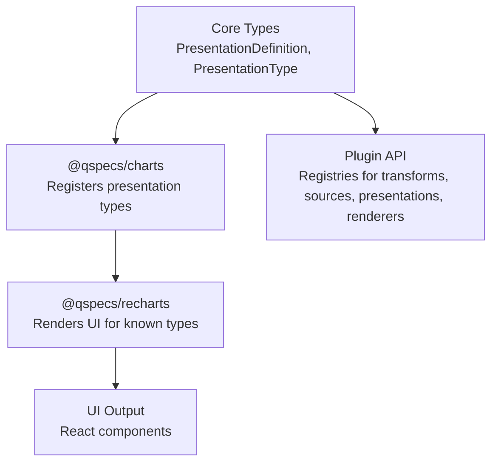
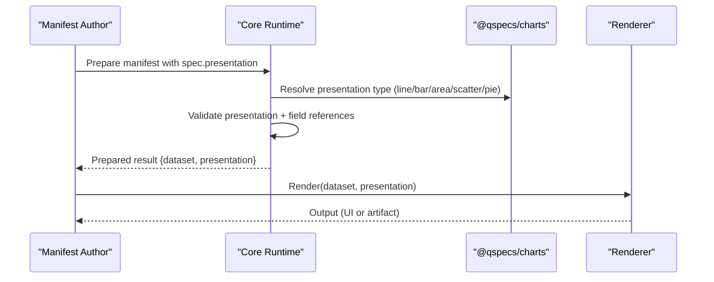
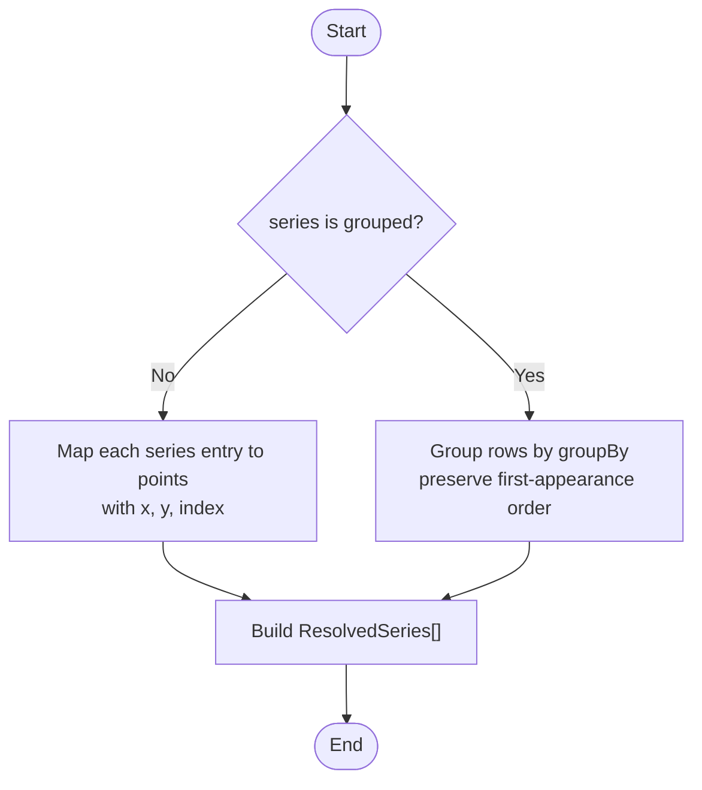
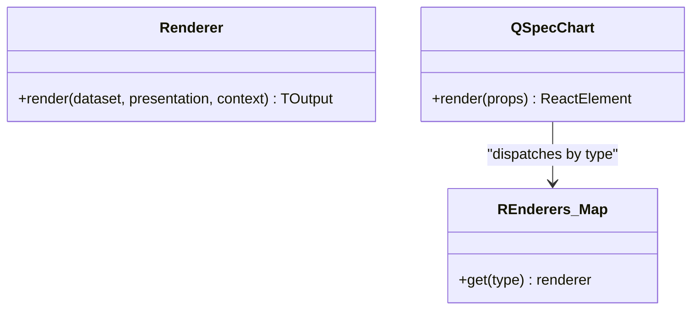
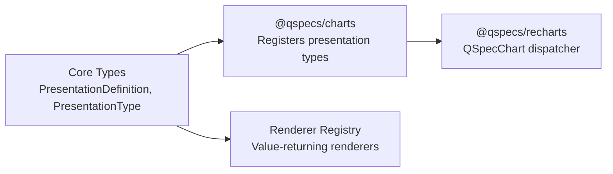

# Presentation Plugins

<cite>
**Referenced Files in This Document**
- [presentations.md](file://docs/presentations.md)
- [plugin-authoring.md](file://docs/plugin-authoring.md)
- [plugins.md](file://docs/plugins.md)
- [presentation.ts](file://packages/core/src/types/presentation.ts)
- [plugin.ts](file://packages/core/src/types/plugin.ts)
- [charts/index.ts](file://packages/charts/src/index.ts)
- [charts/types.ts](file://packages/charts/src/types.ts)
- [charts/internal/cartesian.ts](file://packages/charts/src/internal/cartesian.ts)
- [charts/internal/pie.ts](file://packages/charts/src/internal/pie.ts)
- [charts/internal/resolve-series.ts](file://packages/charts/src/internal/resolve-series.ts)
- [recharts/qspec-chart.tsx](file://packages/recharts/src/internal/qspec-chart.tsx)
- [architecture.md](file://docs/architecture.md)
</cite>

## Table of Contents

1. Introduction
2. Project Structure
3. Core Components
4. Architecture Overview
5. Detailed Component Analysis
6. Dependency Analysis
7. Performance Considerations
8. Troubleshooting Guide
9. Conclusion
10. Appendices

## Introduction

This document explains how to build custom presentation plugins for QSpec. It covers the PresentationType interface, the rendering pipeline from dataset to output, and strategies for generating outputs beyond charts (reports, tables, PDFs, etc.). It also documents integration with visualization libraries, responsive design patterns, accessibility considerations, testing guidance, and performance optimization techniques.

QSpec separates semantic intent (presentations) from concrete rendering. The core defines a generic PresentationDefinition and a registry-driven plugin system; chart semantics are provided by @qspecs/charts; renderers like @qspecs/recharts consume those presentations to produce UI artifacts.

**Section sources**

- [presentations.md:1-17](file://docs/presentations.md#L1-L17)
- [plugins.md:1-9](file://docs/plugins.md#L1-L9)

## Project Structure

At a high level:

- Core types define the plugin surface, registries, and presentation contracts.
- @qspecs/charts registers presentation types and resource kinds without rendering anything.
- Renderers (e.g., @qspecs/recharts) map presentation types to concrete UI components or artifacts.
- CLI and other consumers can inspect or execute manifests that include presentations.

**Diagram sources**

- [presentation.ts:1-50](file://packages/core/src/types/presentation.ts#L1-L50)
- [plugin.ts:103-130](file://packages/core/src/types/plugin.ts#L103-L130)
- [charts/index.ts:19-54](file://packages/charts/src/index.ts#L19-L54)
- [recharts/qspec-chart.tsx:27-67](file://packages/recharts/src/internal/qspec-chart.tsx#L27-L67)

**Section sources**

- [plugins.md:62-93](file://docs/plugins.md#L62-L93)
- [presentations.md:19-37](file://docs/presentations.md#L19-L37)

## Core Components

- PresentationDefinition: minimal shape with a type discriminator and vendor extension keys.
- PresentationType<TDefinition>: optional validate() and fieldReferences() used by core to statically validate presentations against the transformed dataset schema.
- Registry<PresentationType>: capability registry where plugins register new presentation types.
- Renderer<TPresentation, TOutput>: value-returning renderer contract for non-UI outputs (e.g., SVG strings, PDF bytes). React-based renderers typically bypass this registry and expose components directly.

Key responsibilities:

- Presentations describe semantic intent, not pixel-perfect rendering.
- Chart semantics live in @qspecs/charts; it does not render anything.
- Renderers interpret presentations into concrete outputs.

**Section sources**

- [presentation.ts:9-50](file://packages/core/src/types/presentation.ts#L9-L50)
- [plugin.ts:108-130](file://packages/core/src/types/plugin.ts#L108-L130)
- [presentations.md:19-37](file://docs/presentations.md#L19-L37)

## Architecture Overview

The presentation pipeline:

1. Manifest includes spec.presentation describing intent (e.g., line, bar, pie).
2. During prepare(), core validates presentations using each registered PresentationType.validate() and collects field references via fieldReferences().
3. Transform pipelines produce a Dataset; core checks presentation field references against projected fields.
4. A renderer consumes the resolved dataset and presentation to produce an output. For React, @qspecs/recharts maps presentation.type to a component; for value-returning renderers, use the Renderer registry.

**Diagram sources**

- [presentations.md:19-37](file://docs/presentations.md#L19-L37)
- [charts/index.ts:19-54](file://packages/charts/src/index.ts#L19-L54)
- [recharts/qspec-chart.tsx:98-123](file://packages/recharts/src/internal/qspec-chart.tsx#L98-L123)

**Section sources**

- [presentations.md:19-37](file://docs/presentations.md#L19-L37)
- [architecture.md:453-475](file://docs/architecture.md#L453-L475)

## Detailed Component Analysis

### PresentationType and Validation

- validate(): perform structural checks specific to your presentation type. Return issues to report multiple problems at once or throw to reject with one error.
- fieldReferences(): return every dataset field referenced by the definition, with paths relative to spec.presentation. Core uses these to validate against the transformed dataset schema and provide “did you mean” suggestions.

Best practices:

- Always implement fieldReferences() to enable static validation.
- Make validate() defensive: it may run on already-rejected definitions; only check what is safe to read.
- Use shared helpers for common validations (e.g., display blocks, labels).

**Section sources**

- [presentation.ts:27-50](file://packages/core/src/types/presentation.ts#L27-L50)
- [plugin-authoring.md:249-260](file://docs/plugin-authoring.md#L249-L260)

### Chart Presentations: Cartesian vs Pie

- Cartesian (line, bar, area, scatter): share a single PresentationType implementation with x axis and series (explicit array or grouped).
- Pie: distinct shape with category and value; no x axis or dynamic series.

Validation and field references are implemented per shape, ensuring required fields exist and are well-formed.

**Section sources**

- [charts/internal/cartesian.ts:12-151](file://packages/charts/src/internal/cartesian.ts#L12-L151)
- [charts/internal/pie.ts:12-86](file://packages/charts/src/internal/pie.ts#L12-L86)
- [presentations.md:72-119](file://docs/presentations.md#L72-L119)

### Series Resolution and Grouped Series

- resolveSeries(dataset, presentation): converts a Cartesian presentation into ResolvedSeries[], handling both explicit series arrays and grouped series.
- Group order follows first-appearance order in the dataset; null/undefined group values merge with empty-string groups under a sentinel label.
- SeriesPoint.index preserves original row index to help downstream renderers interleave series correctly when pivoting to wide-row formats.

**Diagram sources**

- [charts/internal/resolve-series.ts:34-68](file://packages/charts/src/internal/resolve-series.ts#L34-L68)
- [presentations.md:121-171](file://docs/presentations.md#L121-L171)

**Section sources**

- [presentations.md:121-171](file://docs/presentations.md#L121-L171)
- [charts/types.ts:45-78](file://packages/charts/src/types.ts#L45-L78)

### Rendering Pipeline and Output Formats

- Value-returning renderers: implement Renderer.render(dataset, presentation, context) to produce self-contained artifacts (e.g., SVG string, PNG buffer, text table, PDF bytes). Register via api.renderers.
- React-based renderers: do not use the Renderer registry; instead, expose components (e.g., QSpecChart) that host applications compose into their own trees. @qspecs/recharts maps presentation.type to chart components and throws a clear error for unsupported types.

**Diagram sources**

- [plugin.ts:108-111](file://packages/core/src/types/plugin.ts#L108-L111)
- [recharts/qspec-chart.tsx:27-67](file://packages/recharts/src/internal/qspec-chart.tsx#L27-L67)
- [recharts/qspec-chart.tsx:98-123](file://packages/recharts/src/internal/qspec-chart.tsx#L98-L123)

**Section sources**

- [architecture.md:453-475](file://docs/architecture.md#L453-L475)
- [recharts/qspec-chart.tsx:98-123](file://packages/recharts/src/internal/qspec-chart.tsx#L98-L123)

### Creating Custom Presentations

To add a new presentation type:

1. Implement PresentationType<TDefinition> with validate() and fieldReferences().
2. Register it via api.presentations.register("your-type", yourPresentationType) inside a plugin’s setup().
3. Optionally, provide a renderer:
   - For value outputs, implement Renderer and register via api.renderers.
   - For React, create a component that reads presentation.type and renders accordingly.

Guidance:

- Keep validate() defensive and comprehensive; ensure fieldReferences() reports all fields to enable static validation.
- Follow existing patterns in cartesian.ts and pie.ts for structure and error reporting.

**Section sources**

- [plugin-authoring.md:249-260](file://docs/plugin-authoring.md#L249-L260)
- [charts/internal/cartesian.ts:134-151](file://packages/charts/src/internal/cartesian.ts#L134-L151)
- [charts/internal/pie.ts:69-86](file://packages/charts/src/internal/pie.ts#L69-L86)

### Data Mapping Strategies

- Explicit series: map each series entry to points using x.field and series[].field.
- Grouped series: partition rows by groupBy, preserving dataset order; assign UNGROUPED_LABEL for null/undefined groups.
- Preserve SeriesPoint.index to allow downstream interleaving and sorting by original row order.

**Section sources**

- [presentations.md:121-171](file://docs/presentations.md#L121-L171)
- [charts/internal/resolve-series.ts:34-68](file://packages/charts/src/internal/resolve-series.ts#L34-L68)

### Styling Customization Options

- Presentations currently support minimal display toggles (legend.visible, tooltip.visible).
- Advanced formatting is intentionally outside the standard specification; extend via vendor extension keys on PresentationDefinition or through renderer-specific options.

**Section sources**

- [presentations.md:110-119](file://docs/presentations.md#L110-L119)
- [presentation.ts:9-12](file://packages/core/src/types/presentation.ts#L9-L12)

### Integration with Visualization Libraries

- React ecosystem: use @qspecs/recharts to render known chart types; it dispatches by presentation.type and provides clear errors for unsupported types.
- Non-React ecosystems: implement Renderer.render() to generate artifacts (SVG, PNG, text, PDF) and register via api.renderers.

**Section sources**

- [recharts/qspec-chart.tsx:27-67](file://packages/recharts/src/internal/qspec-chart.tsx#L27-L67)
- [recharts/qspec-chart.tsx:98-123](file://packages/recharts/src/internal/qspec-chart.tsx#L98-L123)
- [plugin.ts:108-111](file://packages/core/src/types/plugin.ts#L108-L111)

### Responsive Design Patterns

- Pass width/height or container constraints into renderers/components so they can adapt layouts.
- In React, rely on host layout mechanisms (flexbox, CSS grid) and avoid fixed sizes unless necessary.
- For value-returning renderers, accept size hints in context and adjust output dimensions accordingly.

[No sources needed since this section provides general guidance]

### Accessibility Considerations

- Ensure legends and tooltips are accessible (visible flags controlled by presentation).
- Provide meaningful labels for series and categories; avoid relying solely on color.
- For React renderers, ensure proper ARIA attributes and keyboard navigation within charts.
- For non-visual outputs (text, CSV), ensure structured headings and summaries.

[No sources needed since this section provides general guidance]

### Examples

#### Chart Extensions

- Extend existing chart semantics by adding vendor extension keys to PresentationDefinition and handling them in your renderer.
- Maintain compatibility by keeping validate() focused on required fields and fieldReferences() accurate.

**Section sources**

- [presentation.ts:9-12](file://packages/core/src/types/presentation.ts#L9-L12)
- [presentations.md:19-37](file://docs/presentations.md#L19-L37)

#### Custom Report Generators

- Implement a new PresentationType for reports (e.g., type: "report") with validate() and fieldReferences().
- Provide a Renderer.render() that produces a text table, CSV, or PDF based on dataset and presentation configuration.

**Section sources**

- [plugin.ts:108-111](file://packages/core/src/types/plugin.ts#L108-L111)
- [plugin-authoring.md:249-260](file://docs/plugin-authoring.md#L249-L260)

#### Multi-Format Output Creators

- Create a single PresentationType and multiple renderers:
  - One renderer returns HTML/SVG for web.
  - Another returns PDF bytes for print.
  - Another returns plain text for CLI.
- Each renderer interprets the same presentation consistently.

**Section sources**

- [plugin.ts:108-111](file://packages/core/src/types/plugin.ts#L108-L111)
- [architecture.md:453-475](file://docs/architecture.md#L453-L475)

## Dependency Analysis

Presentations depend on core types and registries; chart semantics are encapsulated in @qspecs/charts; renderers depend on either the Renderer registry or direct component APIs.

**Diagram sources**

- [presentation.ts:9-50](file://packages/core/src/types/presentation.ts#L9-L50)
- [charts/index.ts:19-54](file://packages/charts/src/index.ts#L19-L54)
- [recharts/qspec-chart.tsx:27-67](file://packages/recharts/src/internal/qspec-chart.tsx#L27-L67)
- [plugin.ts:108-130](file://packages/core/src/types/plugin.ts#L108-L130)

**Section sources**

- [plugins.md:62-93](file://docs/plugins.md#L62-L93)
- [presentations.md:19-37](file://docs/presentations.md#L19-L37)

## Performance Considerations

- Avoid cloning entire datasets in resolveSeries; point values reference original cells intentionally for performance.
- Prefer stable ordering (first-appearance) to minimize extra sorting passes.
- For large datasets, consider pagination or sampling in renderers; keep presentation definitions lightweight.
- Use value-returning renderers for batch processing (e.g., generating many PDFs) to avoid UI overhead.

[No sources needed since this section provides general guidance]

## Troubleshooting Guide

Common issues and resolutions:

- Unsupported presentation.type: ensure your renderer knows about the type or register it properly.
- Missing field references: implement fieldReferences() accurately to enable static validation and avoid runtime surprises.
- Duplicate series fields: validators reject duplicate series entries to prevent silent render corruption.
- Unrecognized presentation.type in React: @qspecs/recharts throws a named error listing supported types.

**Section sources**

- [charts/internal/cartesian.ts:30-63](file://packages/charts/src/internal/cartesian.ts#L30-L63)
- [recharts/qspec-chart.tsx:98-123](file://packages/recharts/src/internal/qspec-chart.tsx#L98-L123)

## Conclusion

Custom presentation plugins let you extend QSpec with new semantic intents and renderers. By implementing PresentationType and optionally Renderer, you can create charts, reports, and multi-format outputs while maintaining portability across renderers. Follow the established patterns for validation, field references, and registration to ensure robust, testable, and performant plugins.

[No sources needed since this section summarizes without analyzing specific files]

## Appendices

### Testing Presentations

- Use the presentation contract suite to assert validate() behavior and fieldReferences() completeness.
- Provide fixtures that cover valid and invalid definitions; verify that unknown fields are detected and suggested.

**Section sources**

- [plugin-authoring.md:249-260](file://docs/plugin-authoring.md#L249-L260)

### Example Paths for Reference

- Presentation types registration: [charts/index.ts:19-54](file://packages/charts/src/index.ts#L19-L54)
- Cartesian validation and field references: [charts/internal/cartesian.ts:12-151](file://packages/charts/src/internal/cartesian.ts#L12-L151)
- Pie validation and field references: [charts/internal/pie.ts:12-86](file://packages/charts/src/internal/pie.ts#L12-L86)
- Series resolution logic: [charts/internal/resolve-series.ts:34-68](file://packages/charts/src/internal/resolve-series.ts#L34-L68)
- React renderer dispatch: [recharts/qspec-chart.tsx:27-67](file://packages/recharts/src/internal/qspec-chart.tsx#L27-L67), [recharts/qspec-chart.tsx:98-123](file://packages/recharts/src/internal/qspec-chart.tsx#L98-L123)
