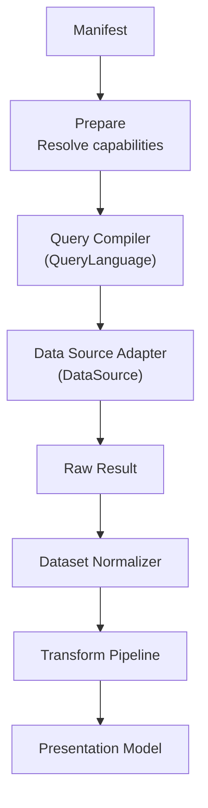
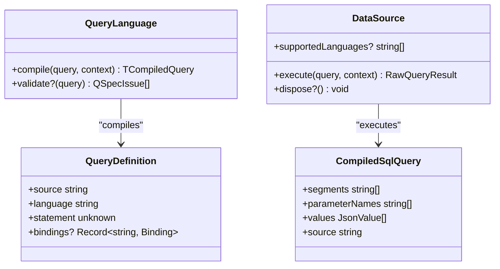
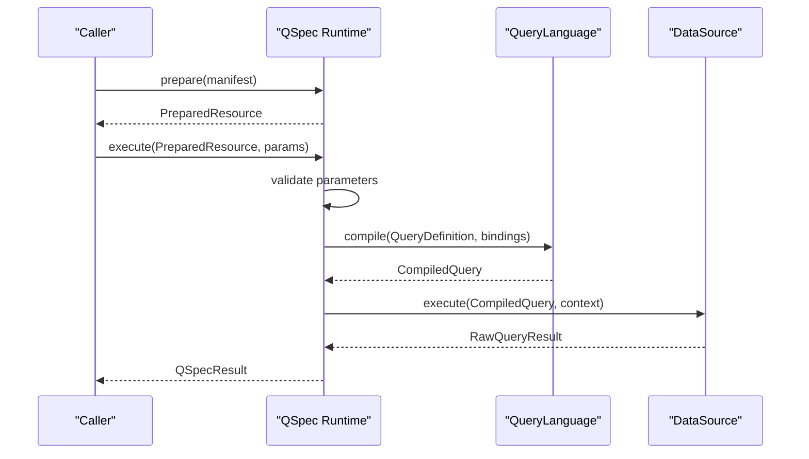
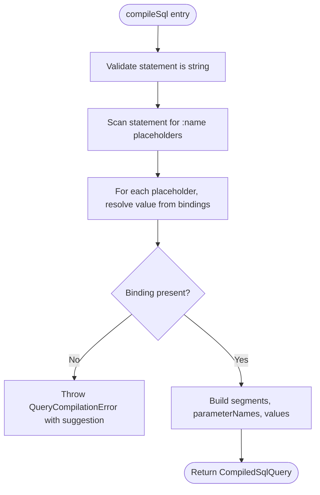
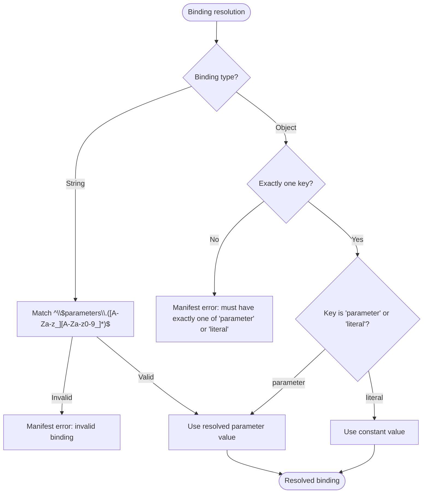
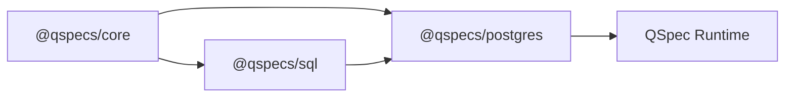

# Query Language Plugins

<cite>
**Referenced Files in This Document**
- [README.md](file://README.md)
- [SPEC.md](file://SPEC.md)
- [architecture.md](file://docs/architecture.md)
- [plugins.md](file://docs/plugins.md)
- [plugin-authoring.md](file://docs/plugin-authoring.md)
- [queries.md](file://docs/queries.md)
- [data-sources.md](file://docs/data-sources.md)
- [index.ts](file://packages/core/src/index.ts)
- [plugin.ts](file://packages/core/src/types/plugin.ts)
- [query.ts](file://packages/core/src/types/query.ts)
- [sql-index.ts](file://packages/sql/src/index.ts)
- [sql-compile.ts](file://packages/sql/src/internal/compile.ts)
</cite>

## Table of Contents

1. [Introduction](#introduction)
2. [Project Structure](#project-structure)
3. [Core Components](#core-components)
4. [Architecture Overview](#architecture-overview)
5. [Detailed Component Analysis](#detailed-component-analysis)
6. [Dependency Analysis](#dependency-analysis)
7. [Performance Considerations](#performance-considerations)
8. [Troubleshooting Guide](#troubleshooting-guide)
9. [Conclusion](#conclusion)
10. [Appendices](#appendices)

## Introduction

This document explains how to create custom query language plugins for QSpec. It covers the QueryLanguage interface, the compilation and validation phases, parameter binding mechanisms, and how to implement parsers, compilers, and executors for new query languages. It also documents SQL-like syntax implementation via the built-in SQL plugin, parameter interpolation safety, result set normalization, extending SQL dialects, building domain-specific query languages, integrating with different data sources, error handling, query validation, performance optimization techniques, and guidance for testing and debugging compilation issues.

QSpec’s runtime is plugin-driven: core provides the pipeline and contracts; query languages, data sources, transforms, presentations, and renderers are registered by plugins. The SQL plugin demonstrates a complete query language implementation that compiles named-parameter statements into a dialect-neutral compiled form, which adapters then execute against real backends.

**Section sources**

- [README.md:1-106](file://README.md#L1-L106)
- [SPEC.md:14-106](file://SPEC.md#L14-L106)

## Project Structure

At a high level:

- Core defines the plugin contract, registries, and execution pipeline.
- The SQL package implements a query language plugin that compiles SQL statements into a safe, structured form.
- Data source plugins (e.g., PostgreSQL) execute compiled queries and return normalized results.
- Transforms and presentations operate on normalized datasets after execution.

**Diagram sources**

- [architecture.md:9-63](file://docs/architecture.md#L9-L63)
- [plugin.ts:19-56](file://packages/core/src/types/plugin.ts#L19-L56)
- [data-sources.md:11-44](file://docs/data-sources.md#L11-L44)

**Section sources**

- [architecture.md:9-105](file://docs/architecture.md#L9-L105)
- [plugins.md:1-33](file://docs/plugins.md#L1-L33)

## Core Components

The key components for query language plugins are:

- QueryLanguage: compiles a portable query declaration into a compiled query suitable for a data source.
- DataSource: executes compiled queries and returns positional rows plus columns.
- Binding model: maps statement placeholders to validated parameters or literals safely.
- Validation stages: static checks during prepare() and runtime checks during execute().

**Diagram sources**

- [plugin.ts:37-56](file://packages/core/src/types/plugin.ts#L37-L56)
- [plugin.ts:19-35](file://packages/core/src/types/plugin.ts#L19-L35)
- [query.ts:3-16](file://packages/core/src/types/query.ts#L3-L16)
- [sql-compile.ts:19-36](file://packages/sql/src/internal/compile.ts#L19-L36)

**Section sources**

- [plugin.ts:19-56](file://packages/core/src/types/plugin.ts#L19-L56)
- [query.ts:3-16](file://packages/core/src/types/query.ts#L3-L16)

## Architecture Overview

The runtime pipeline separates static preparation from per-call execution:

- prepare(): parse manifest, validate structure, resolve capabilities, compile parameter model, fold transform describe(), validate presentation references.
- execute(): validate runtime parameters, resolve bindings, compile query, run data source, normalize result, validate dataset schema, run transforms, build presentation model.

**Diagram sources**

- [architecture.md:65-86](file://docs/architecture.md#L65-L86)
- [plugin.ts:37-56](file://packages/core/src/types/plugin.ts#L37-L56)
- [data-sources.md:11-44](file://docs/data-sources.md#L11-L44)

**Section sources**

- [architecture.md:65-105](file://docs/architecture.md#L65-L105)

## Detailed Component Analysis

### QueryLanguage Interface and Compilation

A query language plugin registers a QueryLanguage under a name. The SQL plugin registers "sql" and exposes compile and validate functions. The compiler turns a statement and bindings into a CompiledSqlQuery without exposing raw text to prevent injection.

Key points:

- compile(query, context): converts a portable query definition into a compiled query tailored for a data source.
- validate?(query): optional static validation during prepare() to catch issues before any connection is made.
- For SQL, compileSql scans the statement for named parameters, resolves them against bindings, and produces segments, parameter names, and values.

**Diagram sources**

- [sql-compile.ts:65-90](file://packages/sql/src/internal/compile.ts#L65-L90)

**Section sources**

- [sql-index.ts:1-30](file://packages/sql/src/index.ts#L1-L30)
- [sql-compile.ts:19-90](file://packages/sql/src/internal/compile.ts#L19-L90)

### Parameter Binding Mechanisms

Bindings map statement placeholders to either parameters or literals. The binding model enforces strict patterns:

- String shorthand must match $parameters.<name>.
- Object forms must have exactly one key: parameter or literal.
- Literal strings require explicit { literal: ... } to avoid accidental interpolation.
- Undeclared parameter references fail at prepare() with suggestions.

**Diagram sources**

- [queries.md:43-148](file://docs/queries.md#L43-L148)

**Section sources**

- [queries.md:43-148](file://docs/queries.md#L43-L148)
- [query.ts:3-16](file://packages/core/src/types/query.ts#L3-L16)

### Implementing a New Query Language Plugin

To add a new query language:

- Define a QueryLanguage implementation with compile and optional validate.
- Register it via a plugin using api.queryLanguages.register(name, language).
- Ensure your data source adapter can execute the compiled query shape you produce.
- Provide static validation to catch misuses early during prepare().

Example pattern:

- Create a plugin factory returning a QSpecPlugin.
- In setup(api), register the language under a stable name.
- Keep compile deterministic and free of side effects.
- Return a compiled query that cannot be trivially turned back into interpolated SQL.

**Section sources**

- [plugins.md:10-33](file://docs/plugins.md#L10-L33)
- [plugin-authoring.md:145-230](file://docs/plugin-authoring.md#L145-L230)

### SQL-like Syntax Implementation

The SQL plugin supports named parameters (:name) and compiles them into a dialect-neutral structure. Adapters generate their own positional placeholders when rendering to text. This design prevents SQL injection by construction because no raw text field is exposed to concatenation.

Key behaviors:

- Named parameters are scanned and resolved against bindings.
- Positional placeholders in user statements are rejected to avoid collisions with adapter-generated placeholders.
- Name coverage checks ensure every referenced parameter has a binding and every declared binding is used.

**Section sources**

- [sql-compile.ts:92-151](file://packages/sql/src/internal/compile.ts#L92-L151)
- [sql-index.ts:6-29](file://packages/sql/src/index.ts#L6-L29)

### Extending SQL Dialects

Differences between SQL dialects (placeholder style, quoting rules, function sets) belong in data source adapters, not in the SQL query language plugin. The SQL plugin remains dialect-neutral; adapters translate segments and values into driver-specific text and parameters.

Guidance:

- Keep statement parsing and compilation generic.
- Let adapters handle dialect-specific rendering and execution details.
- Use supportedLanguages on data sources to enforce compatibility.

**Section sources**

- [data-sources.md:46-66](file://docs/data-sources.md#L46-L66)
- [sql-compile.ts:19-36](file://packages/sql/src/internal/compile.ts#L19-L36)

### Creating Domain-Specific Query Languages

For non-SQL domains (e.g., search DSLs, time-series queries), define a structured statement type and compile it into a compiled query appropriate for your data source. Follow the same registration and validation patterns.

Recommendations:

- Use a strongly-typed statement shape to capture domain semantics.
- Provide validate() to enforce domain constraints statically.
- Ensure compiled queries are serializable and safe to pass across boundaries.

**Section sources**

- [queries.md:23-42](file://docs/queries.md#L23-L42)
- [plugin-authoring.md:145-230](file://docs/plugin-authoring.md#L145-L230)

### Integrating with Different Data Sources

Data sources implement DataSource.execute to run compiled queries and return RawQueryResult with positional rows and columns. They may declare supportedLanguages to restrict compatible query languages.

Integration steps:

- Define a compiled query type aligned with your query language plugin.
- Implement execute(query, context) to acquire connections, run queries, and return normalized results.
- Handle cancellation via context.signal and implement dispose() if needed.
- Optionally declare supportedLanguages to fail fast on mismatches.

**Section sources**

- [data-sources.md:11-44](file://docs/data-sources.md#L11-L44)
- [data-sources.md:46-66](file://docs/data-sources.md#L46-L66)
- [plugin-authoring.md:145-230](file://docs/plugin-authoring.md#L145-L230)

### Result Set Normalization

Data sources must return positional rows and a columns array. Core normalizes these into a Dataset with fields and rows. This avoids prototype pollution and supports duplicate column names.

Normalization highlights:

- Rows are arrays keyed by position, not objects keyed by column names.
- Columns include metadata such as nativeType where applicable.
- Normalization ensures consistent downstream processing and validation.

**Section sources**

- [data-sources.md:11-44](file://docs/data-sources.md#L11-L44)
- [architecture.md:9-63](file://docs/architecture.md#L9-L63)

### Error Handling and Query Validation

Errors occur at multiple stages:

- Manifest structure validation (stage 1).
- Capability resolution (stage 2).
- Parameter validation (stage 3).
- Query validation (stage 4) via QueryLanguage.validate.
- Dataset validation (stage 5).
- Presentation validation (stage 6).

Best practices:

- Return QSpecIssue arrays from validate() to report multiple problems.
- Throw specific errors for unrecoverable conditions (e.g., wrong statement type).
- Provide suggestions for typos in parameter names and bindings.

**Section sources**

- [architecture.md:92-105](file://docs/architecture.md#L92-L105)
- [sql-compile.ts:38-45](file://packages/sql/src/internal/compile.ts#L38-L45)
- [sql-compile.ts:100-151](file://packages/sql/src/internal/compile.ts#L100-L151)

### Performance Optimization Techniques

- Prefer static validation during prepare() to fail fast and avoid unnecessary work.
- Avoid heavy computation in compile(); keep it deterministic and lightweight.
- Use supportedLanguages to reject incompatible combinations early.
- Respect resource limits configured in the runtime (maxExpressionDepth, maxRows, etc.).
- Minimize allocations in transforms; return new datasets immutably.

**Section sources**

- [architecture.md:65-86](file://docs/architecture.md#L65-L86)
- [plugins.md:82-93](file://docs/plugins.md#L82-L93)

### Testing Query Languages and Debugging Compilation Issues

Use contract tests and fixtures to validate behavior:

- For transforms and data sources, use @qspecs/testing contract suites to assert invariants.
- For query languages, write unit tests around compile() and validate() covering edge cases (missing bindings, positional placeholders, unsupported statement types).
- Leverage CLI validation with --config to run plugin-aware checks without executing queries.

Debugging tips:

- Inspect prepared resources to see resolved capabilities and projected schemas.
- Use logger provided in contexts to trace execution paths.
- Confirm that validate() runs during prepare() and catches issues before database access.

**Section sources**

- [plugin-authoring.md:116-143](file://docs/plugin-authoring.md#L116-L143)
- [plugin-authoring.md:232-247](file://docs/plugin-authoring.md#L232-L247)
- [README.md:290-325](file://README.md#L290-L325)

## Dependency Analysis

The SQL plugin depends on core types and utilities, while adapters depend on both core and the compiled query shape produced by the query language. Registries decouple capabilities, enabling independent evolution.

**Diagram sources**

- [sql-index.ts:1-30](file://packages/sql/src/index.ts#L1-L30)
- [plugin.ts:19-56](file://packages/core/src/types/plugin.ts#L19-L56)
- [data-sources.md:11-44](file://docs/data-sources.md#L11-L44)

**Section sources**

- [plugins.md:166-183](file://docs/plugins.md#L166-L183)
- [index.ts:14-105](file://packages/core/src/index.ts#L14-L105)

## Performance Considerations

- Keep compile() pure and fast; defer expensive work to transforms or adapters where appropriate.
- Use supportedLanguages to avoid compiling incompatible queries.
- Respect runtime limits to prevent runaway expressions or large datasets.
- Prefer immutable transformations to enable caching and predictable behavior.
- Avoid unnecessary logging in hot paths; use structured logs with executionId for correlation.

[No sources needed since this section provides general guidance]

## Troubleshooting Guide

Common issues and resolutions:

- Invalid binding format: ensure string bindings match $parameters.<name>; use { literal: ... } for constants.
- Missing binding reference: add a binding for every :name in the statement; remove unused bindings.
- Positional placeholders in SQL: replace with named parameters to avoid adapter conflicts.
- Wrong query language for source: configure supportedLanguages on the data source and align manifest language.
- Dataset schema mismatch: adjust spec.dataset fields or ensure data source returns expected columns.

Diagnostic aids:

- Use qspec validate --config to run plugin-aware checks without a database.
- Inspect error messages and suggestions for parameter names and bindings.
- Add logging via DataSourceContext.logger to trace execution flows.

**Section sources**

- [queries.md:68-148](file://docs/queries.md#L68-L148)
- [sql-compile.ts:100-151](file://packages/sql/src/internal/compile.ts#L100-L151)
- [README.md:290-325](file://README.md#L290-L325)

## Conclusion

Custom query language plugins extend QSpec by implementing QueryLanguage and registering them through plugins. The SQL plugin demonstrates a safe, structured approach to compiling named-parameter statements, leaving dialect-specific rendering to data source adapters. By following the binding model, validation stages, and normalization contracts, you can build robust, secure, and performant query pipelines for diverse data sources and domains.

[No sources needed since this section summarizes without analyzing specific files]

## Appendices

### Quick Reference: Key Interfaces and Types

- QueryLanguage.compile and validate
- DataSource.execute and supportedLanguages
- Binding forms and resolution rules
- CompiledSqlQuery structure

**Section sources**

- [plugin.ts:37-56](file://packages/core/src/types/plugin.ts#L37-L56)
- [plugin.ts:19-35](file://packages/core/src/types/plugin.ts#L19-L35)
- [query.ts:3-16](file://packages/core/src/types/query.ts#L3-L16)
- [sql-compile.ts:19-36](file://packages/sql/src/internal/compile.ts#L19-L36)
