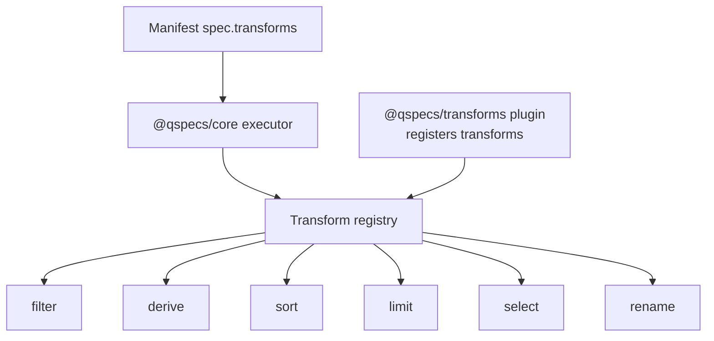
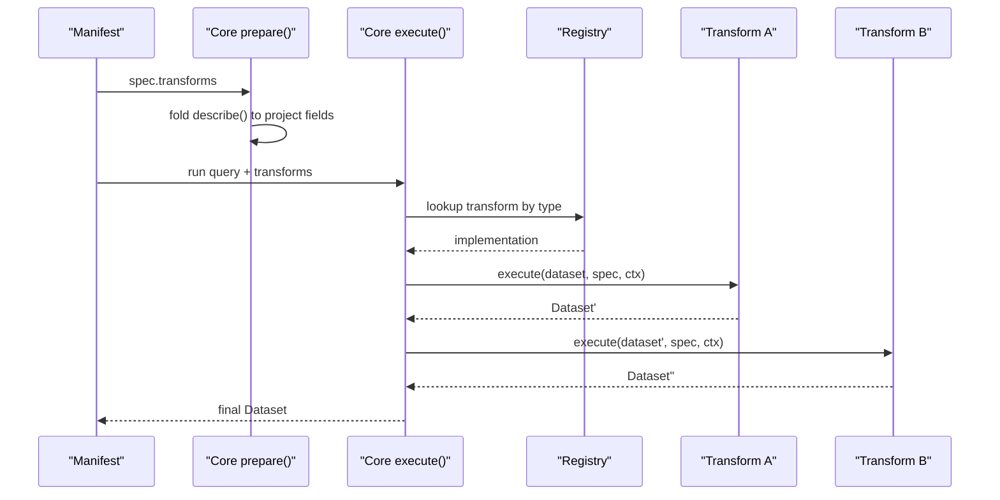
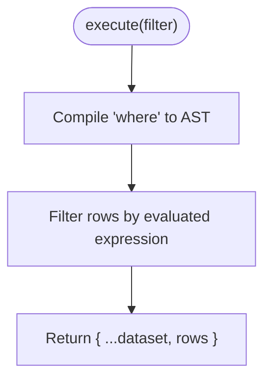
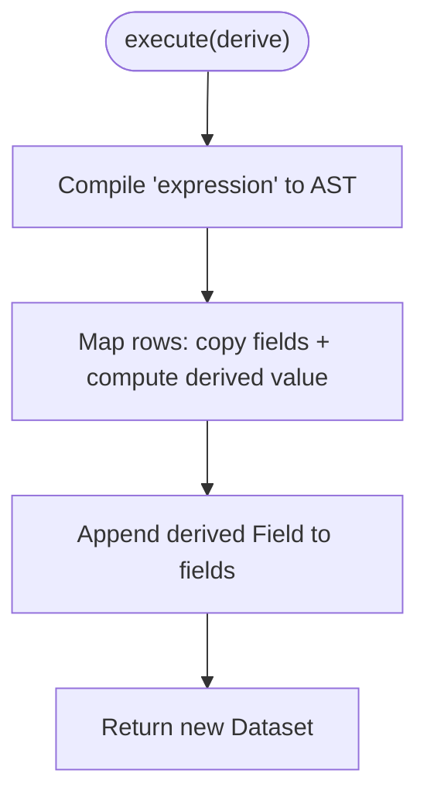
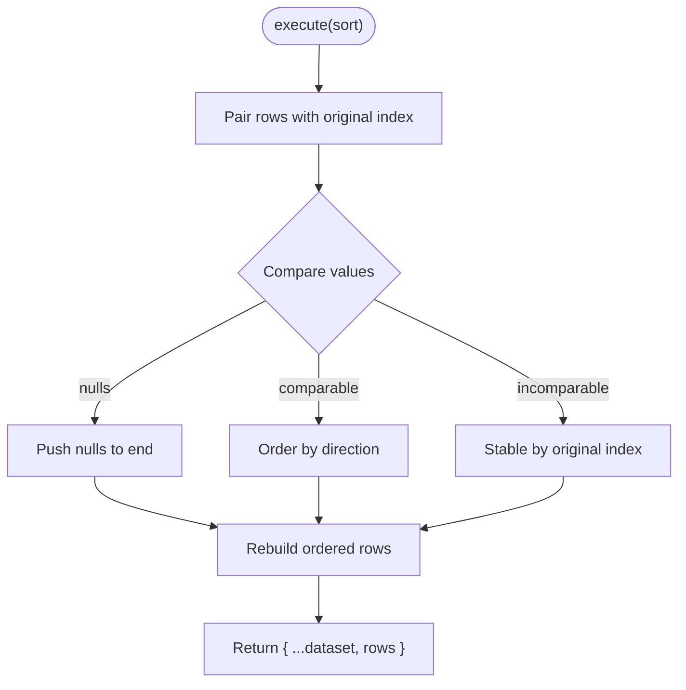
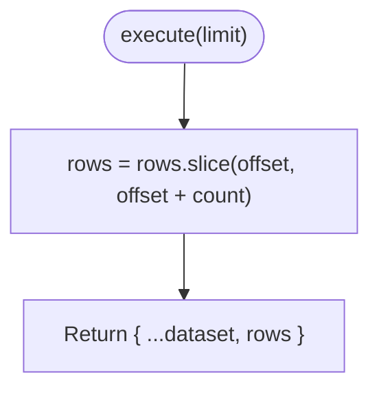
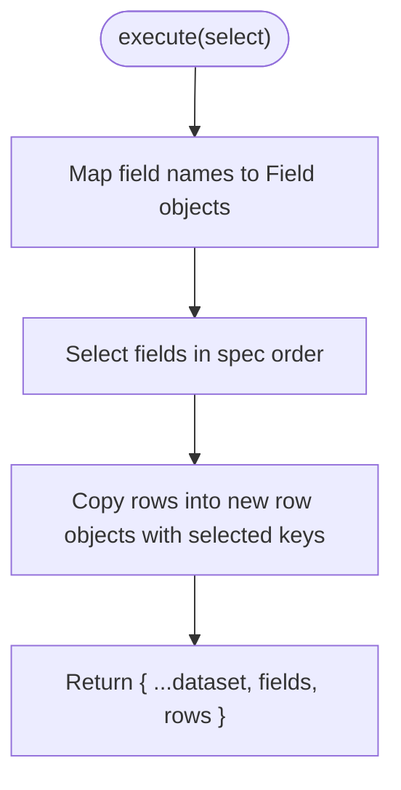
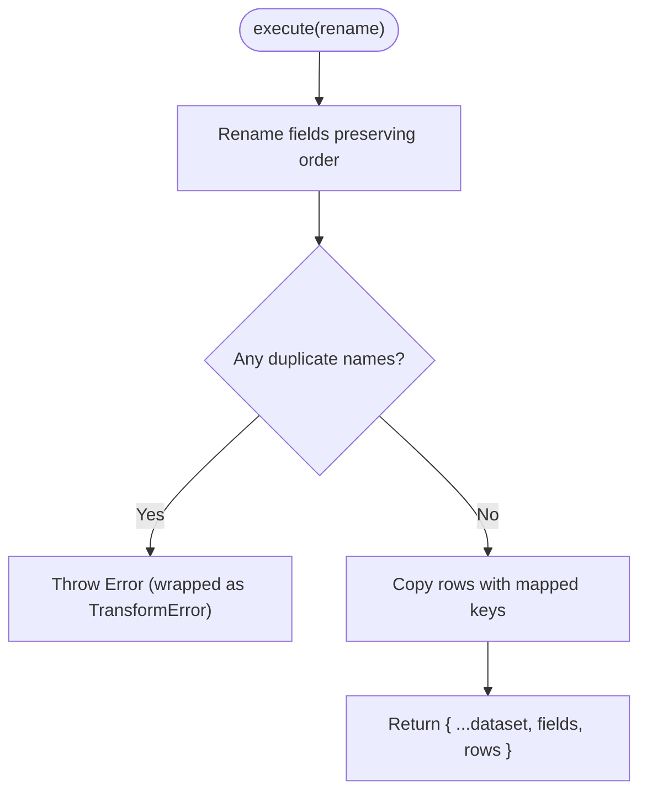
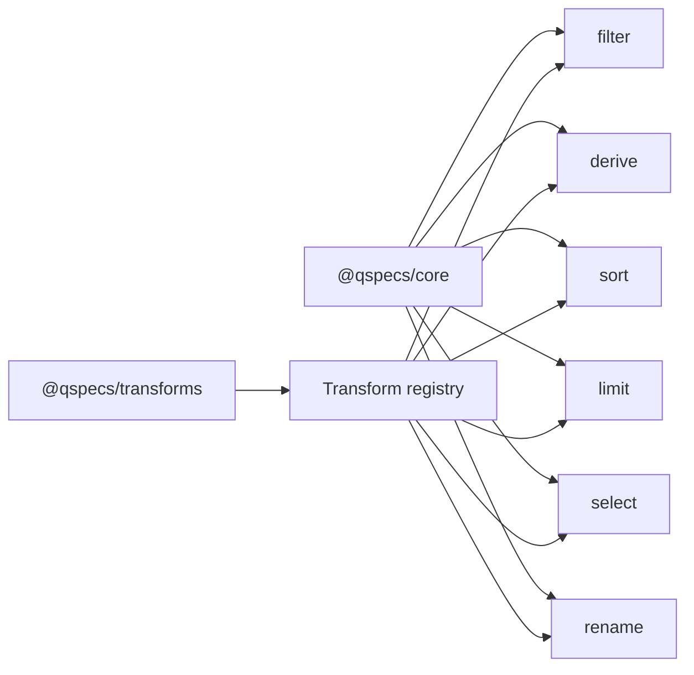

# Transform Plugins

<cite>
**Referenced Files in This Document**
- [transforms.md](file://docs/transforms.md)
- [index.ts](file://packages/transforms/src/index.ts)
- [filter.ts](file://packages/transforms/src/internal/filter.ts)
- [derive.ts](file://packages/transforms/src/internal/derive.ts)
- [sort.ts](file://packages/transforms/src/internal/sort.ts)
- [limit.ts](file://packages/transforms/src/internal/limit.ts)
- [select.ts](file://packages/transforms/src/internal/select.ts)
- [rename.ts](file://packages/transforms/src/internal/rename.ts)
- [04-transform-filter.qspec.json](file://examples/04-transform-filter.qspec.json)
- [05-transform-select.qspec.json](file://examples/05-transform-select.qspec.json)
- [06-transform-rename.qspec.json](file://examples/06-transform-rename.qspec.json)
- [07-transform-derive.qspec.json](file://examples/07-transform-derive.qspec.json)
- [08-transform-sort.qspec.json](file://examples/08-transform-sort.qspec.json)
</cite>

## Table of Contents

1. [Introduction](#introduction)
2. [Project Structure](#project-structure)
3. [Core Components](#core-components)
4. [Architecture Overview](#architecture-overview)
5. [Detailed Component Analysis](#detailed-component-analysis)
6. [Dependency Analysis](#dependency-analysis)
7. [Performance Considerations](#performance-considerations)
8. [Troubleshooting Guide](#troubleshooting-guide)
9. [Conclusion](#conclusion)
10. [Appendices](#appendices)

## Introduction

This document explains how to create custom transform plugins for QSpec. It covers the Transform interface, the execute() method signature and behavior, dataset transformation patterns, and the built-in transforms (filter, derive, sort, limit, select, rename) as reference implementations. It also provides step-by-step guidance for implementing custom transforms with validation, error handling, and performance considerations; examples of complex and parameterized transformations; integration with existing pipelines; testing strategies; and debugging techniques.

## Project Structure

Transforms are implemented under packages/transforms and registered via a plugin that exposes them to the core pipeline. Each transform is a small, focused module implementing the Transform contract: execute(), optional describe(), and optional validate(). The plugin wires these into the runtime registry so manifests can declare transforms by type.

**Diagram sources**

- [index.ts:21-38](file://packages/transforms/src/index.ts#L21-L38)
- [transforms.md:24-48](file://docs/transforms.md#L24-L48)

**Section sources**

- [index.ts:1-40](file://packages/transforms/src/index.ts#L1-L40)
- [transforms.md:24-48](file://docs/transforms.md#L24-L48)

## Core Components

- Transform interface:
  - execute(dataset, spec, context): returns a new Dataset (immutable semantics).
  - describe(fields, spec): optional static projection of fields through the transform.
  - validate(spec, fields): optional static validation returning issues or void.
- Pipeline execution:
  - Transforms run sequentially in declared order; each sees only the previous output.
  - Each transform must return a fresh Dataset without mutating inputs.
- Expression-based transforms:
  - filter and derive compile expressions once per execution using normalizeExpression and evaluateExpression.
  - maxExpressionDepth is enforced at both prepare-time (via validate) and execute-time.

Key references:

- Transform interface and pipeline ordering: [transforms.md:24-48](file://docs/transforms.md#L24-L48), [transforms.md:340-362](file://docs/transforms.md#L340-L362)
- Expression compilation and limits: [transforms.md:213-339](file://docs/transforms.md#L213-L339)

**Section sources**

- [transforms.md:24-48](file://docs/transforms.md#L24-L48)
- [transforms.md:340-362](file://docs/transforms.md#L340-L362)
- [transforms.md:213-339](file://docs/transforms.md#L213-L339)

## Architecture Overview

The transform pipeline is a strict sequence:

- Manifest declares transforms in spec.transforms.
- Core prepares and validates the manifest, folding describe() across transforms to project schema statically.
- At runtime, core executes each transform in order, passing the transformed Dataset forward.

**Diagram sources**

- [transforms.md:24-48](file://docs/transforms.md#L24-L48)
- [transforms.md:340-362](file://docs/transforms.md#L340-L362)

## Detailed Component Analysis

### Built-in Transform Reference Implementations

Each built-in transform demonstrates a pattern you can follow when authoring custom transforms.

#### Filter

- Purpose: Keep rows where an expression evaluates truthy.
- Spec: { where }
- Behavior: Compiles where once per execution; filters rows; describe() returns input fields unchanged.
- Validation: Ensures where exists; compiles expression; checks referenced fields against known fields if available.

**Diagram sources**

- [filter.ts:26-38](file://packages/transforms/src/internal/filter.ts#L26-L38)

**Section sources**

- [filter.ts:15-83](file://packages/transforms/src/internal/filter.ts#L15-L83)
- [transforms.md:65-79](file://docs/transforms.md#L65-L79)
- [04-transform-filter.qspec.json:23-28](file://examples/04-transform-filter.qspec.json#L23-L28)

#### Derive

- Purpose: Add a new computed field to every row.
- Spec: { field, fieldType, expression }
- Behavior: Compiles expression once; maps rows to append derived cell; adds Field to dataset.fields; describe() appends same Field.
- Validation: Enforces required fields and valid fieldType; compiles expression; checks referenced fields; prevents name collision.

**Diagram sources**

- [derive.ts:46-66](file://packages/transforms/src/internal/derive.ts#L46-L66)

**Section sources**

- [derive.ts:19-146](file://packages/transforms/src/internal/derive.ts#L19-L146)
- [transforms.md:80-113](file://docs/transforms.md#L80-L113)
- [07-transform-derive.qspec.json:22-32](file://examples/07-transform-derive.qspec.json#L22-L32)

#### Sort

- Purpose: Order rows by a field with stable, null-last behavior.
- Spec: { field, direction? }
- Behavior: Decorate-sort-undecorate with original index tiebreak; nulls last regardless of direction; describe() returns input fields unchanged.
- Validation: Checks field presence and direction values; validates field existence if schema available.

**Diagram sources**

- [sort.ts:25-49](file://packages/transforms/src/internal/sort.ts#L25-L49)

**Section sources**

- [sort.ts:4-72](file://packages/transforms/src/internal/sort.ts#L4-L72)
- [transforms.md:114-140](file://docs/transforms.md#L114-L140)
- [08-transform-sort.qspec.json:21-27](file://examples/08-transform-sort.qspec.json#L21-L27)

#### Limit

- Purpose: Slice rows by count and optional offset.
- Spec: { count, offset? }
- Behavior: Returns rows.slice(offset, offset + count); describe() returns input fields unchanged.
- Validation: Ensures non-negative integers for count and offset.

**Diagram sources**

- [limit.ts:14-18](file://packages/transforms/src/internal/limit.ts#L14-L18)

**Section sources**

- [limit.ts:4-35](file://packages/transforms/src/internal/limit.ts#L4-L35)
- [transforms.md:141-156](file://docs/transforms.md#L141-L156)

#### Select

- Purpose: Project dataset to a named subset of fields in specified order.
- Spec: { fields }
- Behavior: Builds new rows with only selected fields; preserves spec order; drops unknown names silently at runtime but validate() reports them when schema is available; describe() mirrors selection.
- Validation: Non-empty array of unique strings; checks field existence against known fields.

**Diagram sources**

- [select.ts:9-25](file://packages/transforms/src/internal/select.ts#L9-L25)

**Section sources**

- [select.ts:5-67](file://packages/transforms/src/internal/select.ts#L5-L67)
- [transforms.md:157-176](file://docs/transforms.md#L157-L176)
- [05-transform-select.qspec.json:23-28](file://examples/05-transform-select.qspec.json#L23-L28)

#### Rename

- Purpose: Rename fields while preserving original order; safe against prototype key hazards.
- Spec: { fields: Record<oldName, newName> }
- Behavior: Renames listed fields; leaves others untouched; uses Object.hasOwn to avoid prototype pollution; asserts distinctness at runtime; describe() mirrors renaming.
- Validation: Validates mapping shape; detects target collisions; checks source fields exist when schema available.

**Diagram sources**

- [rename.ts:58-73](file://packages/transforms/src/internal/rename.ts#L58-L73)

**Section sources**

- [rename.ts:5-130](file://packages/transforms/src/internal/rename.ts#L5-L130)
- [transforms.md:177-212](file://docs/transforms.md#L177-L212)
- [06-transform-rename.qspec.json:22-31](file://examples/06-transform-rename.qspec.json#L22-L31)

### Custom Transform Implementation Guide

Follow this pattern to implement a custom transform plugin:

1. Define your spec type and Transform object:
   - Implement execute(dataset, spec, context) to return a new Dataset.
   - Implement describe(fields, spec) to project fields statically.
   - Implement validate(spec, fields) to return issues or void.

2. Register your transform:
   - Use the plugin setup to register your transform under a chosen type name.

3. Integrate with expressions (optional):
   - If your transform uses expressions, compile once per execution and evaluate per row.
   - Respect maxExpressionDepth from api.limits.maxExpressionDepth.

4. Handle errors and validation:
   - Validate spec structure early.
   - When schema is available, validate field references.
   - For runtime-only checks (e.g., collisions), throw plain Errors so core wraps them appropriately.

5. Maintain immutability:
   - Never mutate the input dataset; always return a new Dataset.

6. Test thoroughly:
   - Unit-test validate() and describe() with edge cases.
   - Integration-test execute() with representative datasets.
   - Verify pipeline ordering and immutability guarantees.

References for patterns and contracts:

- Transform interface and pipeline rules: [transforms.md:24-48](file://docs/transforms.md#L24-L48), [transforms.md:340-362](file://docs/transforms.md#L340-L362)
- Expression depth enforcement: [transforms.md:312-339](file://docs/transforms.md#L312-L339)
- Registration example: [index.ts:21-38](file://packages/transforms/src/index.ts#L21-L38)

**Section sources**

- [transforms.md:24-48](file://docs/transforms.md#L24-L48)
- [transforms.md:312-339](file://docs/transforms.md#L312-L339)
- [index.ts:21-38](file://packages/transforms/src/index.ts#L21-L38)

### Complex Transform Patterns

- Parameterized transforms:
  - Read parameters from context.parameters during expression evaluation.
  - Example usage pattern appears in filter and derive where evaluateExpression receives parameters.

- Multi-step composition:
  - Chain multiple transforms in spec.transforms to build complex pipelines (e.g., filter → derive → sort → limit).
  - Each step consumes the previous output; ensure describe() reflects changes to maintain static validation downstream.

- Safe field operations:
  - Use helper utilities for row construction and assignment to avoid prototype hazards and preserve order.

References:

- Expression evaluation with parameters: [filter.ts:31-37](file://packages/transforms/src/internal/filter.ts#L31-L37), [derive.ts:51-66](file://packages/transforms/src/internal/derive.ts#L51-L66)
- Row helpers and safety: [select.ts:18-22](file://packages/transforms/src/internal/select.ts#L18-L22), [rename.ts:62-71](file://packages/transforms/src/internal/rename.ts#L62-L71)

**Section sources**

- [filter.ts:31-37](file://packages/transforms/src/internal/filter.ts#L31-L37)
- [derive.ts:51-66](file://packages/transforms/src/internal/derive.ts#L51-L66)
- [select.ts:18-22](file://packages/transforms/src/internal/select.ts#L18-L22)
- [rename.ts:62-71](file://packages/transforms/src/internal/rename.ts#L62-L71)

### Testing Strategies

- Static tests:
  - validate(): assert correct issues for invalid specs and empty/unknown fields.
  - describe(): assert projected fields match expected transformations.

- Runtime tests:
  - execute(): feed sample datasets and verify returned Dataset fields and rows.
  - Edge cases: nulls, booleans vs numbers, missing fields, prototype-safe keys.

- Pipeline tests:
  - Compose multiple transforms and assert end-to-end behavior.
  - Ensure immutability: confirm input datasets remain unchanged after execution.

- Expression tests:
  - For expression-based transforms, test operator arity, depth limits, and parameter resolution.

References:

- Validation and describe contracts: [transforms.md:340-362](file://docs/transforms.md#L340-L362)
- Expression depth and limits: [transforms.md:312-339](file://docs/transforms.md#L312-L339)

**Section sources**

- [transforms.md:340-362](file://docs/transforms.md#L340-L362)
- [transforms.md:312-339](file://docs/transforms.md#L312-L339)

### Debugging Techniques

- Inspect projected fields:
  - Confirm describe() outputs align with execute() outputs to avoid silent mismatches.

- Narrow down failures:
  - Run validate() before execute() to catch spec and expression issues early.
  - For runtime-only issues (e.g., rename collisions), expect Errors wrapped by core’s transform boundary.

- Expression diagnostics:
  - Check normalizeExpression errors for precise paths and operator arity issues.
  - Ensure maxExpressionDepth is respected in both validate() and execute().

References:

- Error wrapping and boundaries: [rename.ts:30-56](file://packages/transforms/src/internal/rename.ts#L30-L56)
- Expression normalization and errors: [filter.ts:45-80](file://packages/transforms/src/internal/filter.ts#L45-L80), [derive.ts:72-143](file://packages/transforms/src/internal/derive.ts#L72-L143)

**Section sources**

- [rename.ts:30-56](file://packages/transforms/src/internal/rename.ts#L30-L56)
- [filter.ts:45-80](file://packages/transforms/src/internal/filter.ts#L45-L80)
- [derive.ts:72-143](file://packages/transforms/src/internal/derive.ts#L72-L143)

## Dependency Analysis

Transforms depend on core types and utilities:

- Dataset, Field, Transform, QSpecIssue, evaluateExpression, normalizeExpression.
- Internal helpers for row manipulation and issue reporting.

**Diagram sources**

- [index.ts:21-38](file://packages/transforms/src/index.ts#L21-L38)
- [filter.ts:1-13](file://packages/transforms/src/internal/filter.ts#L1-L13)
- [derive.ts:1-17](file://packages/transforms/src/internal/derive.ts#L1-L17)
- [sort.ts:1-3](file://packages/transforms/src/internal/sort.ts#L1-L3)
- [limit.ts:1-3](file://packages/transforms/src/internal/limit.ts#L1-L3)
- [select.ts:1-4](file://packages/transforms/src/internal/select.ts#L1-L4)
- [rename.ts:1-4](file://packages/transforms/src/internal/rename.ts#L1-L4)

**Section sources**

- [index.ts:21-38](file://packages/transforms/src/index.ts#L21-L38)
- [filter.ts:1-13](file://packages/transforms/src/internal/filter.ts#L1-L13)
- [derive.ts:1-17](file://packages/transforms/src/internal/derive.ts#L1-L17)
- [sort.ts:1-3](file://packages/transforms/src/internal/sort.ts#L1-L3)
- [limit.ts:1-3](file://packages/transforms/src/internal/limit.ts#L1-L3)
- [select.ts:1-4](file://packages/transforms/src/internal/select.ts#L1-L4)
- [rename.ts:1-4](file://packages/transforms/src/internal/rename.ts#L1-L4)

## Performance Considerations

- Compile expressions once per execution:
  - Both filter and derive compile their expressions outside the row loop to avoid repeated work.

- Prefer immutable updates:
  - Returning new Dataset objects avoids accidental shared-mutation bugs and keeps earlier stages intact.

- Stable sorts with minimal overhead:
  - Sort uses decorate-sort-undecorate with original indices to guarantee stability and consistent tiebreaking.

- Avoid unnecessary allocations:
  - Use efficient row copying and field mapping; reuse maps where appropriate.

References:

- Expression compilation strategy: [filter.ts:31-37](file://packages/transforms/src/internal/filter.ts#L31-L37), [derive.ts:51-66](file://packages/transforms/src/internal/derive.ts#L51-L66)
- Stable sort approach: [sort.ts:25-49](file://packages/transforms/src/internal/sort.ts#L25-L49)

**Section sources**

- [filter.ts:31-37](file://packages/transforms/src/internal/filter.ts#L31-L37)
- [derive.ts:51-66](file://packages/transforms/src/internal/derive.ts#L51-L66)
- [sort.ts:25-49](file://packages/transforms/src/internal/sort.ts#L25-L49)

## Troubleshooting Guide

Common issues and resolutions:

- Unknown field references:
  - Ensure describe() is implemented so static validation catches unknown fields early.
  - In validate(), check referenced fields against known fields when available.

- Expression errors:
  - NormalizeExpression enforces operator arity and depth; fix operator names and nesting depth.
  - Depth exceeded errors are downgraded to issues during validate(); at execute time they propagate as raw errors.

- Rename collisions:
  - validate() detects collisions when schema is available; execute() asserts distinctness and throws Errors wrapped as TransformError.

- Sorting surprises:
  - Nulls always sort last; compare rules mirror expression evaluator to keep consistency with filter conditions.

References:

- Schema opacity and static validation: [transforms.md:340-392](file://docs/transforms.md#L340-L392)
- Expression depth and errors: [transforms.md:312-339](file://docs/transforms.md#L312-L339)
- Rename collision handling: [rename.ts:30-56](file://packages/transforms/src/internal/rename.ts#L30-L56)
- Sort semantics: [sort.ts:9-23](file://packages/transforms/src/internal/sort.ts#L9-L23), [sort.ts:25-49](file://packages/transforms/src/internal/sort.ts#L25-L49)

**Section sources**

- [transforms.md:340-392](file://docs/transforms.md#L340-L392)
- [transforms.md:312-339](file://docs/transforms.md#L312-L339)
- [rename.ts:30-56](file://packages/transforms/src/internal/rename.ts#L30-L56)
- [sort.ts:9-23](file://packages/transforms/src/internal/sort.ts#L9-L23)
- [sort.ts:25-49](file://packages/transforms/src/internal/sort.ts#L25-L49)

## Conclusion

Custom transforms in QSpec should adhere to the Transform interface, maintain immutability, and provide robust validate() and describe() implementations to preserve static validation throughout the pipeline. Use the built-in transforms as reference patterns for expression handling, field projection, sorting, and safe field operations. Follow the testing and debugging guidance to ensure correctness and performance.

## Appendices

### Quick Reference: Built-in Transform Specs

- filter: { where }
- derive: { field, fieldType, expression }
- sort: { field, direction? }
- limit: { count, offset? }
- select: { fields }
- rename: { fields: Record<string, string> }

Examples:

- filter: [04-transform-filter.qspec.json:23-28](file://examples/04-transform-filter.qspec.json#L23-L28)
- select: [05-transform-select.qspec.json:23-28](file://examples/05-transform-select.qspec.json#L23-L28)
- rename: [06-transform-rename.qspec.json:22-31](file://examples/06-transform-rename.qspec.json#L22-L31)
- derive: [07-transform-derive.qspec.json:22-32](file://examples/07-transform-derive.qspec.json#L22-L32)
- sort: [08-transform-sort.qspec.json:21-27](file://examples/08-transform-sort.qspec.json#L21-L27)

**Section sources**

- [04-transform-filter.qspec.json:23-28](file://examples/04-transform-filter.qspec.json#L23-L28)
- [05-transform-select.qspec.json:23-28](file://examples/05-transform-select.qspec.json#L23-L28)
- [06-transform-rename.qspec.json:22-31](file://examples/06-transform-rename.qspec.json#L22-L31)
- [07-transform-derive.qspec.json:22-32](file://examples/07-transform-derive.qspec.json#L22-L32)
- [08-transform-sort.qspec.json:21-27](file://examples/08-transform-sort.qspec.json#L21-L27)
